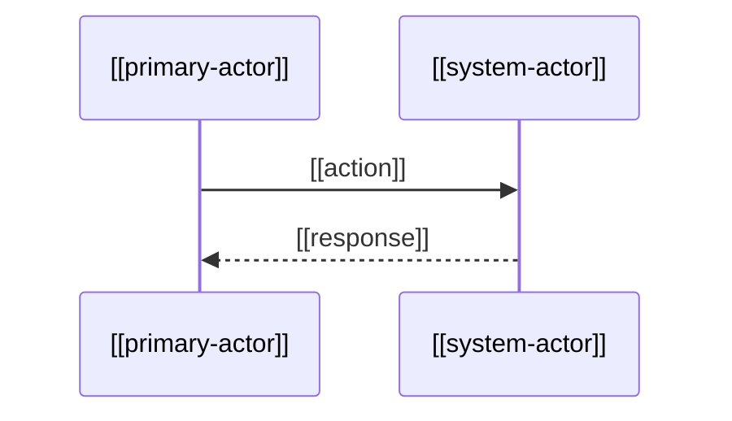

# Block Command

When this command is used, use the following block. Acknowledge your understanding and then await the user's request.

---

``````````
## 🎬 Scenario: [Scenario Name]
> 💡 *What steps do which actors take? Sequence of actions that [[actors]] perform to achieve a specific outcome.*

### 🎯 Goal

[What is the end goal or outcome this scenario achieves]

```
<example>
Enable @.claude/commands/plx/create/actor.md to [[primary-action]] so they can [[desired-outcome]]
</example>
```

### 👥 Actors Involved

[List the actors who participate in this scenario]

```
<example>
- [[primary-actor]] - Main actor driving the scenario
- [[secondary-actor]] - Supporting actor in the process
- [[system-actor]] - Automated system or component involved
</example>
```

### 📋 Gherkin Steps

```
<example>
**Happy Flow:**
- **GIVEN** @.claude/commands/plx/create/actor.md is in [[initial-state]] 
- **AND** [[precondition]] exists
- **WHEN** @.claude/commands/plx/create/actor.md performs [[action]]
- **AND** @.claude/commands/plx/create/actor.md interacts with [[component-wl-example]]
- **THEN** [[expected-outcome]] occurs
- **AND** [[system-actor]] responds with [[system-response]]

**Alternative Flow ([Alternative Name]):**
- **GIVEN** @.claude/commands/plx/create/actor.md is in [[alternative-state]]
- **WHEN** @.claude/commands/plx/create/actor.md chooses [[alternative-action]]
- **THEN** [[alternative-outcome]] occurs

**Error Flow ([Error Type]):**
- **GIVEN** @.claude/commands/plx/create/actor.md encounters [[error-condition]]
- **WHEN** @.claude/commands/plx/create/actor.md attempts [[failed-action]]
- **THEN** [[error-message]] is displayed
- **AND** @.claude/commands/plx/create/actor.md can [[recovery-action]]
</example>
```

### 📊 Mermaid Diagram

``````
<example>

</example>
``````
``````````
