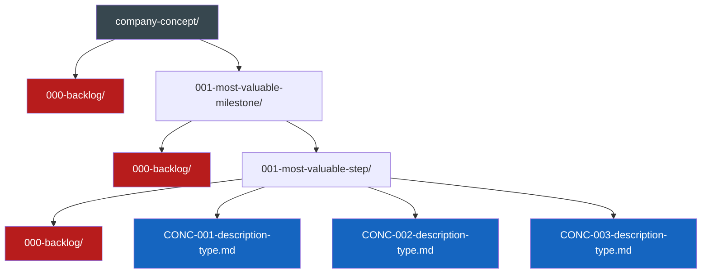
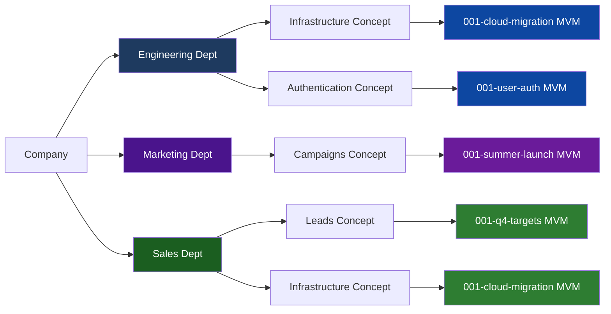
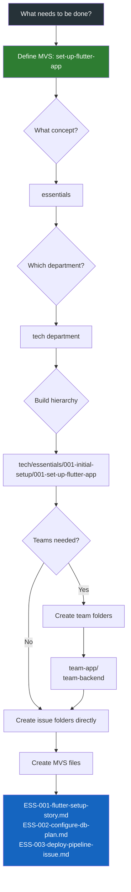
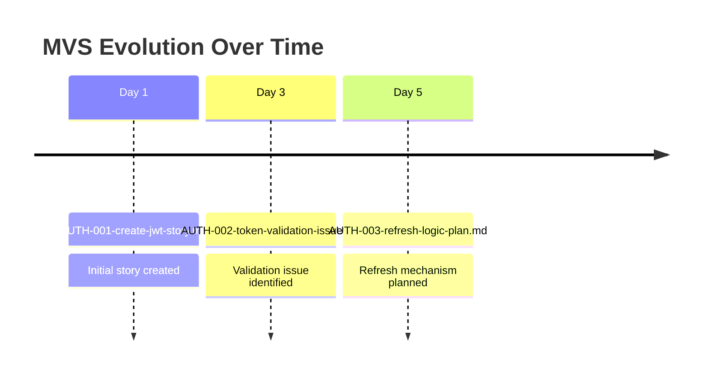

# Instruction Command

When this command is used, acknowledge that you understand these instructions and will follow them throughout the conversation. Then await the user's request.

---

# 🎯 Most Valuable Project Management Conventions

> 💡 *Organize work by priority and enable parallel execution through flexible, scalable structure*

## What is MVPM?

**Most Valuable Project Management (MVPM)** is a flexible organizational system that:
- **Prioritizes work** by what delivers the most value first (MVM → MVS)
- **Enables parallel execution** through company concepts that can be worked on simultaneously
- **Scales naturally** from solo developers to enterprise teams
- **Integrates seamlessly** with existing tools (GitHub, Jira, Linear)
- **Provides context** for both humans and AI during development

The core principle: **Start with what's most valuable, structure only what enables parallel work.**

## 📁 Core Organization Structure

Flexible structure based on parallel work:
```
{company-concept}/{most-valuable-milestone}/{most-valuable-step}.md
```
Company concepts can be inserted anywhere to enable parallel work.

### Structure Flow Diagram



## 📝 Naming Components

- `{company-concept}` - Any concept that can be worked on in parallel (can be inserted anywhere in hierarchy)
- `{most-valuable-milestone}` - MVM - Format: `{3-digit-number}-{description}` (e.g., 001-user-auth, 002-payment-system)
    - Chronologically ordered (earlier numbers must be considered first)
    - Zero-padded to 3 digits total
    - Each MVM folder may contain a `000-backlog` folder
- `{most-valuable-step}` - MVS - Format: `{CONCEPT}-{number}-{description}-{type}.md`
    - `{CONCEPT}` - Max 4 character identifier (e.g., ESS for essentials, AUTH for authentication)
    - `{number}` - **Flexible numbering options:**
        - **Local chronological:** 001, 002, 003 (per MVS folder)
        - **Milestone-wide:** Continue numbering across entire milestone
        - **External system ID:** Use GitHub (#123), Jira (PROJ-456), or Linear (ENG-789) issue numbers
        - **Your choice:** Create a system that works for your workflow
    - `{description}` - Kebab-case descriptive name  
    - `{type}` - Document type (issue, story, plan, etc.)
    - Each MVS folder may contain a `000-backlog` folder

### 📌 Important: Same Issue, Multiple Documents

**The same issue can and should have multiple document types with the SAME number:**

```
001-authentication/
├── AUTH-042-oauth-integration-story.md      # User story document
├── AUTH-042-oauth-integration-plan.md       # Technical plan document
├── AUTH-042-oauth-integration-bug.md        # Bug found during implementation
└── AUTH-042-oauth-integration-pr.md         # Pull request documentation
```

This approach:
- **Maintains traceability** - All documents for issue #042 are clearly linked
- **Shows evolution** - See how an issue progresses from story → plan → bug → PR
- **Enables parallel work** - Different team members can work on different document types
- **Preserves context** - All related work stays together with the same identifier

## 🎯 Important: This Is Your Local Workspace

> ⚠️ **This system does NOT replace your GitHub Projects, Jira boards, Linear workspace, or other project management tools!**

This is your **local project management workspace** where you:
- **Prepare** issues with full context before creating them in external systems
- **Record** progress and implementation details during development
- **Provide** both humans and AI with the context needed for local development
- **Document** decisions, changes, and outcomes for future reference

Think of it as your **staging area** for project management - where ideas become well-defined issues ready for your actual tracking system.

## 📊 Typical Workflow: Local → External → Local

1. **Create locally** → `AUTH-draft-oauth-setup-story.md` (use "draft" for unnumbered)
2. **Refine locally** → Add requirements, acceptance criteria, technical details
3. **Push to external** → Create in GitHub/Jira/Linear, get issue number (e.g., #156)
4. **Rename locally** → `AUTH-156-oauth-setup-story.md` (with external ID)
5. **Add related docs** → `AUTH-156-oauth-setup-plan.md`, `AUTH-156-oauth-setup-bug.md` (same number!)
6. **Track progress** → Update files with implementation notes, decisions
7. **Complete cycle** → All `AUTH-156-*` files become documentation of what was built

**Remember:** One issue number can have many document types - they all work together to tell the complete story!

## 🏗️ Philosophy & Principles

We determine directories by their ability to be worked on in parallel - this enables both humans and AI agents to work simultaneously on different parts of the project without conflicts. Each directory represents an independent work stream that can progress without blocking others.

### Directory Structure Philosophy
App essentials - usually a department should be at top level. Given departments usually work in parallel as a given. Team folders are optional and should only be created when multiple teams need to work on clearly separated tickets within the same MVS. If tickets can be worked on by any team member or don't require strict team separation, avoid team folders to reduce overhead.

### Parallel Work Visualization



Note: Departments can work on the same milestone (e.g., Engineering and Sales both working on cloud-migration) or completely different milestones based on their priorities.

### When Overwhelmed: Start with MVS
If it feels overwhelming to define the whole structure, start with the next MVS (Most Valuable Step) to reduce cognitive overload.

### Example Workflow:
1. **What needs to be done?** → set-up-flutter-app
2. **What subject/concept?** → Parent folder → essentials/set-up-flutter-app
3. **Which department?** → Add above or below → tech/essentials/set-up-flutter-app OR essentials/tech/set-up-flutter-app
4. **Build the hierarchy** → Work backwards to establish MVM and company concept
5. **Any teams needed?** → Inside the closest categorizer combo (essentials & tech) → team-app/team-backend
6. **What should they do?** → Create MVS files
7. **Create MVS files** → Add MVS documents like ESS-001-flutter-setup-story.md

### Workflow Decision Tree



### Hierarchy Pattern:
```
{company-concept} / {most-valuable-milestone} / {most-valuable-step}
```
Note: Company concepts can be nested or arranged in any order that enables parallel work.

**Tree representation:**
```
{company-concept}/
├── 000-backlog/                    # Backlog for future milestones
└── {001-most-valuable-milestone}/
    ├── 000-backlog/                # Backlog for future steps in this milestone
    └── {001-most-valuable-step}/
        ├── 000-backlog/            # Backlog for future MVS files
        ├── CONC-001-description-type.md
        ├── CONC-002-description-type.md
        └── CONC-003-description-type.md
```

## 🎓 Gradual Complexity Examples

> 💡 **Key Principle:** Start simple, add structure only when parallel work demands it. Keep cognitive overhead minimal.

### Quick Decision Guide
- **1-3 developers?** → Level 1 (simple concept/MVM/MVS)
- **Multiple features?** → Level 2 (add feature separation)
- **Cross-functional?** → Level 3 (add departments)
- **10+ developers?** → Level 4 (consider team folders)
- **Enterprise scale?** → Level 5 (full hierarchy)

**Remember:** You can always restructure later. Start simple!

### Level 1: Simplest Structure (Solo Developer / Small Team)
```
authentication/                    # Company concept only
├── 000-backlog/
└── 001-user-login/                # MVM
    ├── AUTH-001-setup-jwt-story.md           # Local numbering
    ├── AUTH-002-validate-tokens-issue.md     # Local numbering
    └── AUTH-003-refresh-logic-plan.md        # Local numbering
```
✅ **Use when:** Single developer or small team working sequentially

**Alternative with external IDs:**
```
authentication/
└── 001-user-login/
    ├── AUTH-42-setup-jwt-story.md            # GitHub issue #42 - Story
    ├── AUTH-42-setup-jwt-plan.md             # GitHub issue #42 - Technical plan
    ├── AUTH-42-setup-jwt-pr.md               # GitHub issue #42 - PR documentation
    ├── AUTH-43-validate-tokens-issue.md      # GitHub issue #43
    └── AUTH-PROJ-156-refresh-logic-plan.md   # Jira PROJ-156
```

💡 **Note:** Issue #42 has three documents (story, plan, PR) - all sharing the same number to maintain traceability!

### Level 2: Adding Feature Separation (Multiple Features)
```
001-mvp-release/                   # MVM at root
├── 001-authentication/             # MVS (feature 1)
│   ├── AUTH-001-jwt-setup-story.md
│   └── AUTH-002-oauth-integration-plan.md
└── 002-payments/                   # MVS (feature 2)
    ├── PAY-001-stripe-setup-story.md
    └── PAY-002-webhook-handler-issue.md
```
✅ **Use when:** Multiple features being developed in parallel

### Level 3: Department Organization (Cross-functional Teams)
```
engineering/                        # Department (optional)
└── 001-mvp-release/               # MVM
    ├── 001-backend-api/           # MVS
    │   ├── API-001-rest-setup-story.md
    │   └── API-002-graphql-migration-plan.md
    └── 002-frontend-app/          # MVS
        ├── APP-001-react-setup-story.md
        └── APP-002-state-management-issue.md
```
✅ **Use when:** Different departments need clear separation

### Level 4: Team Folders (Large Teams, Complex Features)
```
engineering/
└── payments/                      # Company concept
    └── 001-checkout-flow/         # MVM
        └── 001-cart-implementation/ # MVS
            ├── frontend/          # Team folder (optional)
            │   ├── CART-001-ui-components-story.md
            │   └── CART-002-state-logic-issue.md
            └── backend/           # Team folder (optional)
                ├── CART-003-api-endpoints-story.md
                └── CART-004-database-schema-plan.md
```
✅ **Use when:** Multiple teams work on same MVS with clear boundaries

### Level 5: Full Hierarchy (Enterprise Scale)
```
issues/
├── engineering/
│   └── infrastructure/
│       └── 001-cloud-migration/
│           └── 001-aws-setup/
│               ├── devops/
│               │   └── INF-001-terraform-config-story.md
│               └── security/
│                   └── INF-002-iam-policies-plan.md
├── marketing/
│   └── campaigns/
│       └── 001-product-launch/
│           └── 001-content-creation/
│               └── MKT-001-blog-series-plan.md
└── finance/
    └── budgeting/
        └── 001-q1-planning/
            └── 001-cost-analysis/
                └── FIN-001-aws-costs-story.md
```
✅ **Use when:** Large organization with many parallel work streams

### 🚨 Complexity Warning Signs

**Too Simple** (add structure when you see):
- Developers stepping on each other's work
- Difficulty finding relevant issues
- No clear ownership boundaries

**Too Complex** (simplify when you see):
- Empty folders everywhere
- Confusion about where to create issues
- Deep nesting making navigation painful
- Teams spending time discussing structure instead of working

### 📌 Best Practices

1. **Start with Level 1-2** for most projects
2. **Add one layer at a time** as complexity grows
3. **Review quarterly** - can you simplify?
4. **Document your choice** in README
5. **Prioritize findability** over perfect categorization

Examples:

### Issue Evolution Timeline



**Full hierarchy tree:**
```
issues/
└── engineering/
    └── authentication/                   # Company concept
        ├── 000-backlog/                  # Future milestones
        └── 001-user-auth/                # MVM (highest priority)
            ├── 000-backlog/              # Future steps
            └── 001-jwt-implementation/   # MVS (highest priority)
                ├── 000-backlog/          # Future issues
                ├── AUTH-001-create-jwt-service-story.md
                ├── AUTH-002-token-validation-issue.md
                └── AUTH-003-refresh-logic-plan.md
```

**Department-level parallelization tree:**
```
issues/
├── engineering/
│   └── infrastructure/                   # Company concept
│       └── 001-cloud-migration/          # MVM
│           ├── 000-backlog/
│           └── 001-aws-setup/            # MVS (engineering working on AWS)
│               ├── INF-001-vpc-configuration-story.md
│               └── INF-002-security-groups-plan.md
├── finance/
│   └── infrastructure/                   # Company concept
│       └── 001-cloud-migration/          # MVM
│           ├── 000-backlog/
│           └── 001-cost-analysis/        # MVS (finance working on costs)
│               └── FIN-001-budget-forecast-story.md
└── security/
    └── infrastructure/                   # Company concept
        └── 001-cloud-migration/          # MVM
            ├── 000-backlog/
            └── 001-compliance-check/     # MVS (security working on compliance)
                └── SEC-001-gdpr-audit-plan.md
```

**Team-level parallelization tree:**
```
issues/
└── engineering/
    └── payments/                         # Company concept
        ├── 000-backlog/
        └── 001-checkout-flow/            # MVM
            ├── 000-backlog/
            └── 001-payment-processing/   # MVS
                ├── 000-backlog/
                ├── PAY-001-cart-component-story.md
                ├── PAY-002-payment-form-issue.md
                ├── PAY-003-stripe-integration-story.md
                ├── PAY-004-webhook-handler-bug.md
                ├── PAY-005-e2e-tests-chore.md
                └── PAY-006-load-testing-enhancement.md
```
