# 💡 Concept Command

When this command is used, apply this conceptual understanding to your approach.

---

# 💡 Concept: A Good Prompt
> 💡 *A clear and concise description of what makes a good prompt in this framework.*

## 📝 A Good Prompt

The foundation of this framework is understanding what makes an effective prompt. Every prompt consists of modular components, each included only when it contributes to achieving the end goal.

**Claude Commands:** `/plx:create` (new), `/plx:update` (enhance), `/plx:make` (transform)

```mermaid
graph TD
    EG[🎯 End Goal<br/>Achievement Objective]
    
    P[👤 Persona<br/>Optional Expertise]
    R[📋 Request<br/>Verb-First Activity]
    W[🔄 Workflow<br/>Optional Steps]
    I[📏 Instructions<br/>Optional Rules]
    O[📊 Output Format<br/>Optional Structure]
    
    EG --> P
    EG --> R
    EG --> W
    EG --> I
    EG --> O
    
    P -.->|Contributes to| EG
    R -.->|Required for| EG
    W -.->|Enhances| EG
    I -.->|Guides toward| EG
    O -.->|Structures| EG
    
    style EG fill:#663399,stroke:#fff,stroke-width:4px,color:#fff
    style R fill:#2e5090,stroke:#fff,stroke-width:2px,color:#fff
    style P fill:#4a5568,stroke:#fff,stroke-width:2px,color:#fff
    style W fill:#4a5568,stroke:#fff,stroke-width:2px,color:#fff
    style I fill:#4a5568,stroke:#fff,stroke-width:2px,color:#fff
    style O fill:#4a5568,stroke:#fff,stroke-width:2px,color:#fff
```

### Core Components

#### 🎯 **End Goal** (Prompts) / **Main Goal** (Agents & Workflows)
The measurable objective that determines whether any following section provides value. This is your north star - every component should improve your chances of achieving this goal exactly as intended.

- **Prompts** define **End Goal**: Achievement-focused objective
- **Agents** define **Main Goal**: Behavioral-focused objective
- **Workflows** define **Main Goal**: Process-focused objective

**Required subsections:**
- **Deliverables**: What must be produced or accomplished
- **Acceptance Criteria**: How to verify the goal has been achieved

Every section and component must align with and contribute to these goals to ensure clear, measurable success.

#### 👤 **Persona** (Optional)
Specialized expertise attributes included when they enhance outcomes:
- Role, Expertise, Domain, Knowledge
- Experience, Skills, Abilities, Responsibilities
- Interests, Background, Preferences, Perspective
- Communication Style

**Claude Command:** `/act:<persona-name>` - Activate this persona directly
**In Files:** `[[persona-name-wl-example]]` to reference, `![[persona-name-wl-example]]` to embed content

#### 📋 **Request**
Verb-first activity specification with optional deliverables and acceptance criteria. Always starts with an action: Create, Update, Analyze, Transform, etc.

#### 🔄 **Workflow** (Optional)
Multi-phase processes with clear deliverables and acceptance criteria. Each workflow must define its main goal, and every phase must specify what it delivers and how to verify success.

**Key Elements:**
- Main Goal with success criteria
- Phases with deliverables and acceptance criteria
- Steps with purpose and instructions
- Quality gates and decision points

**Claude Command:** `/start:<workflow-name>` - Launch this workflow
**In Files:** `[[workflow-name-wl-example]]` to reference, `![[workflow-name-wl-example]]` to embed content

#### 📏 **Instructions** (Optional)
Event‑driven guidance following the pattern: "When {scenario} occurs, then {apply these instructions}".

Instruction categories and naming rules:
- Type → suffix → folder
    - Conventions → `-conventions.md` → @instructions/conventions/`
    - Best practices → `-best-practices.md` → @instructions/best-practices/`
    - Rules (always/never) → `-rules.md` → @instructions/rules/`
    - Tool-specific instructions (e.g., Maestro) → `-instructions.md` → @instructions/<tool>/` (e.g., @instructions/maestro/`)

4‑step rule for any new instruction:
1) Read existing docs to avoid duplication
2) Determine the type (convention | best‑practice | rule | tool‑instructions)
3) Rename file to match suffix exactly
4) Place in the correct folder under @instructions/`

**Claude Command:** `/apply:<instruction-name>` - Apply these instructions
**In Files:** `[[instruction-name-wl-example]]` to reference, `![[instruction-name-wl-example]]` to embed content

#### 📊 **Output Format** (Optional)
Specifications for how deliverables should be structured - templates, format types (JSON, YAML, Markdown), or specific structural requirements.

**Claude Command:** `/output:<format-name>` - Apply this output format
**In Files:** `[[format-name-wl-example]]` to reference, `![[format-name-wl-example]]` to embed content

### The Modular Approach

Each component can and should be extracted and referenced via wikilinks when it can be reused. During sync:
- `[[wikilinks-wl-example]]` are transformed to `@path/to/file.md` for dynamic loading by Claude
- `![[embedded-wikilinks-wl-example]]` are replaced with the actual file content inline

⚠️ **Important:** The `@path/to/file.md` references inside command files auto-load when you use slash commands (e.g., `/use:template-file` will automatically read all `@` references inside that template). However, if you just type `@template-file` directly in chat, Claude only sees the path - no automatic reading occurs.

### 🎩 A Good Agent

When certain prompt components naturally align around a common purpose and main goal, they can be composed into agents. Benefits:
- Use as **sub-agents** for specific tasks within larger workflows
- Activate directly via **`/act:<agent-name>`** commands
- **Reusable expertise** across all your prompts and projects

```mermaid
graph TD
    subgraph "Agent Core"
        MG[🎯 Main Goal]
        PR[🎯 Purpose & Role]
    end
    
    subgraph "Prompt Components"
        P1[👤 Persona]
        W1[🔄 Workflow]
        I1[📏 Instructions]
        O1[📊 Output Format]
    end
    
    subgraph "Agent Composition"
        A[🤖 Agent<br/>flutter-developer.md]
    end
    
    subgraph "Reusable Everywhere"
        PR1[📝 Prompt 1]
        PR2[📝 Prompt 2]
        PR3[📝 Prompt 3]
    end
    
    MG --> A
    PR --> A
    P1 --> A
    W1 --> A
    I1 --> A
    O1 --> A
    
    A -->|"Embed: ![[flutter-developer-wl-example]]"| PR1
    A -->|"Embed: ![[flutter-developer-wl-example]]"| PR2
    A -->|"Embed: ![[flutter-developer-wl-example]]"| PR3
    
    style MG fill:#663399,stroke:#fff,stroke-width:3px,color:#fff
    style PR fill:#663399,stroke:#fff,stroke-width:3px,color:#fff
    style A fill:#663399,stroke:#fff,stroke-width:3px,color:#fff
    style P1 fill:#4a5568,stroke:#fff,color:#fff
    style W1 fill:#4a5568,stroke:#fff,color:#fff
    style I1 fill:#4a5568,stroke:#fff,color:#fff
    style O1 fill:#4a5568,stroke:#fff,color:#fff
    style PR1 fill:#2e7d32,stroke:#fff,color:#fff
    style PR2 fill:#2e7d32,stroke:#fff,color:#fff
    style PR3 fill:#2e7d32,stroke:#fff,color:#fff
```

### Agent Composition
Agents reuse the same modular components as prompts, but with behavioral focus:
- **Main Goal** - The behavioral objective with deliverables and acceptance criteria (replaces End Goal)
- **Persona** - Specialized expertise attributes (optional, only if enhances goal)
- **Request** - What the agent does, verb-first specification
- **Workflow** - Multi-step process (optional, only if needed)
- **Instructions** - All guidance including best practices, rules, conventions, references (optional subsections, only what contributes to goal)
- **Output Format** - How the agent delivers results (optional, only if specific format needed)
