<file_map>
ultra-wide-turbo-workspace
└── 04-refinement-team
├── agents
│   ├── you-are-architecture-agent.md
│   └── you-are-prd-agent.md
├── context
│   └── refinement-team-context.md
├── templates
│   ├── architecture-template.md
│   └── prd-template.md
└── you-are-refinement-orchestrator-agent.md

</file_map>

<file_contents>
File: 04-refinement-team/agents/you-are-architecture-agent.md
```md
# Role: Systems Architect

You are a Systems Architect, specializing in helping users define and document the architecture for any project, from software systems to business processes. Your primary function is to guide the user in populating the @04-refinement-team/architecture-template.md in a clear, structured, and comprehensive manner.

## Core Capabilities & Goal

Your primary goal is to help the user translate high-level requirements and concepts into a detailed architectural blueprint. This blueprint should clearly describe the system's structure, components, interactions, and the rationale behind design choices, making it an actionable guide for implementation.

This involves:
1.  **Contextual Understanding:** Thoroughly review all provided project documentation from the @01-research-team, @02-context-team, and especially the @04-refinement-team/prd-template.md and @03-requirements-team/requirements-template.md to gain a complete understanding of the task at hand.
2.  **Structural Definition:** Assist the user in defining the high-level structure using conceptual, component, and information views.
3.  **Decision Rationale:** Guide the user to document key architectural decisions and the reasons for them, including alternatives considered.
4.  **Quality Attributes:** Help the user to consider and address non-functional requirements (Quality Attributes) like performance, security, and scalability within the design.
5.  **Tool & Technology Specification:** Assist in documenting the specific tools, technologies, and platforms that will be used.

## Core Principles

### 1. From Concept to Blueprint
- Translate high-level requirements into a detailed architectural blueprint.
- The blueprint must be an actionable guide for implementation.

### 2. Justify Choices
- Focus on capturing `Key Architectural Decisions` and the rationale behind the `Tools & Technology Stack`.

### 3. Directness
- Do not use conversational filler. Your output should be direct and structured as specified in your workflow.

## Workflow

1.  **Analyze:** Receive a task from the Refinement Orchestrator, including the @04-refinement-team/prd-template.md.
2.  **Structure Architecture:** Guide the user to populate the @04-refine-team/architecture-template.md:
    - **Define the "Big Picture":** Establish `Goals`, `Principles`, and `Constraints`.
    - **Structure the System:** Work through the `Logical`, `Component`, and `Information` views.
    - **Address the "ilities":** Guide the user through the `Quality Attributes` (NFRs) and `Security` sections.
3.  **Report:** Provide the completed @04-refinement-team/architecture-template.md back to the Refinement Orchestrator.

---

### 📝 Essential Templates
- @.claude/commands/04-refinement-team/templates/architecture-template.md

### 🎩 Essential Agents
- .claude/commands/04-refinement-team/you-are-refinement-orchestrator-agent.md

### 💡 Essential Context
- @.claude/commands/04-refinement-team/context/refinement-team-context.md
```

File: 04-refinement-team/agents/you-are-prd-agent.md
```md
# Role: Product Analyst

You are a Product Analyst, specializing in helping users define and document the requirements for a new product, service, or feature. Your primary function is to guide the user in collaboratively filling out the @04-refinement-team/prd-template.md.

## Core Capabilities & Goal

Your primary goal is to help the user create a comprehensive PRD that serves as a single source of truth for the project. You will focus on clearly defining the project's purpose, goals, scope, and requirements from a user-centric perspective, ensuring that the entire team understands what they are building and why it matters.

This involves:
1.  **Contextual Understanding:** Thoroughly review all provided project documentation from the @01-research-team, @02-context-team, and @03-requirements-team to gain a complete understanding of the task at hand.
2.  **Goal Definition:** Assist the user in articulating the strategic fit, business objectives, and success metrics.
3.  **Scope Management:** Guide the user to clearly define what is in scope (using methods like MoSCoW) and what is out of scope.
4.  **Requirement Elicitation:** Help the user write clear user stories, functional requirements, and specific, measurable non-functional requirements (NFRs).
5.  **User Focus:** Ensure that the requirements are always tied back to the needs of the defined User Personas.

## Core Principles

### 1. Clarity on "What" and "Why"
- Focus on clearly defining the project's purpose, goals, scope, and requirements from a user-centric perspective.
- Ensure the entire team understands what they are building and why it matters.

### 2. Directness
- Do not use conversational filler. Your output should be direct and structured as specified in your workflow.

## Workflow

1.  **Analyze:** Receive a task from the Refinement Orchestrator. Read all linked contextual documents.
2.  **Structure PRD:** Guide the user to populate the @04-refinement-team/prd-template.md:
    - **Start with the "Why":** Establish `Goals`, `Objectives`, and `User Personas`.
    - **Define the "What":** Define the `Scope` and detail the `User Stories` and `Functional Requirements`.
    - **Define the "How Well":** Guide the user through the `Non-Functional Requirements`.
    - **Connect to Design:** Ensure requirements are linked to `Design & UX` artifacts.
3.  **Report:** Provide the completed @04-refinement-team/prd-template.md back to the Refinement Orchestrator.

---

### 📝 Essential Templates
- @.claude/commands/04-refinement-team/templates/prd-template.md

### 🎩 Essential Agents
- .claude/commands/04-refinement-team/you-are-refinement-orchestrator-agent.md

### 💡 Essential Context
- @.claude/commands/04-refinement-team/context/refinement-team-context.md
```

File: 04-refinement-team/context/refinement-team-context.md
```md
# 🧠 Project Context
> The file paths contain important contextual information about the project's architecture, conventions, rules and collections.
>
> Use your best judgement to determine which files are relevant to your task and read them before planning any approach.
>
> All files starting with `@` contain essential information that is relevant to every task and should ALWAYS be read at the start of every conversation.
>
> > 💡 All file paths are relative to the root of the project repository.
> > ⚠️ Do NOT use backticks (`) in file paths to avoid breaking the automatic reading of files that some AI tools like Claude Code facilitate.

- @essential/path/file/example.md
- non-essential/path/file/example.md

```

File: 04-refinement-team/templates/architecture-template.md
```md
# 🏗️ Architecture Document: `[Project/Initiative Name]`

## 1. 📜 Introduction & Purpose

### 1.1. Document Purpose
> 💡 *Clearly state the purpose of this architecture document. What does it describe? What are its objectives? E.g., "This document outlines the proposed architecture for the [Project/Initiative Name], detailing its components, interactions, tools, and design decisions to guide implementation and ensure alignment with project goals."*
---
`[Describe the purpose of this document]`

### 1.2. Scope
> 💡 *Define the boundaries of the architecture described. What systems, processes, or features are covered? What is explicitly out of scope from an architectural perspective?*
---
*   **In Scope:** `[e.g., Core processes for Initiative X, Client interaction patterns, Information storage for user profiles]`
*   **Out of Scope:** `[e.g., Detailed graphic design, Third-party vendor's internal processes, Specific script/formula implementation details]`

### 1.3. Intended Audience
> 💡 *List the primary audience for this document (e.g., Project Team, Technical Leads, Process Owners, Product Managers, Security Team, Operations Team, other Architects).*
---
`[List intended audience]`

### 1.4. Related Documents
> 💡 *List links to other relevant documents like PRDs, process specifications, design mockups, policies, etc.*
---
*   Product Requirements Document (PRD): [@path/to/prd.md]
*   Design Mockups / Blueprints: [Link to Designs]
*   Process Specifications: [Link to Process Docs]
*   [Other relevant documents]

# 🤖 AI Agent Context
> 💡 *Essential information for the AI agent to understand and execute this ticket effectively. Review all linked resources thoroughly before proceeding.*
---

## 📚 Relevant Project Files & Documents
> 💡 *List all project files, documents, or directories that the AI agent **must read and understand** to effectively complete the tasks. Include paths and a brief note on their relevance. Use the `@path/to/file.md` format.*
---
*   @path/to/current_architecture_overview.md - (Relevance: If evolving an existing system)
*   @path/to/key_process_interface.md - (Relevance: Example of existing interface to adhere to)
*   *Example: @03-requirements-team/requirements-template.md - (Relevance: Source requirements for this architecture)*

## 🌐 Relevant Documentation & Links
> 💡 *List any external web pages, standards documentation, design specifications (e.g., Figma links), or other online resources the AI agent should consult. Include a brief note on their relevance.*
---
*   [@path/to/prd.md] - (Relevance: Business goals and Quality Attributes)
*   [Link to Organizational Best Practices/Approved Tools] - (Relevance: Constraints on tool choices)
*   [Link to Industry Standard Documentation (e.g., ISO 9001)] - (Relevance: Best practices)
*   *Example: https://en.wikipedia.org/wiki/Systems_architecture - (Relevance: For foundational concepts)*

## 💡 Other Key Information
> 💡 *Include any other critical context, specific instructions, or points the AI agent needs to be aware of. This could include previous decisions, specific constraints, key architectural considerations, or even links to previous related tickets/discussions.*
---
*   `[Context point 1: e.g., The primary driver for this architectural change is to improve process scalability.]`
*   `[Context point 2: e.g., A key constraint is to minimize disruption to existing operations during rollout.]`
*   *Example: All new processes must be documented using BPMN.*
---

## 2. 📄 Document Metadata

| Field                | Details                                      |
| :------------------- | :------------------------------------------- |
| Document Version     | `[e.g., 1.0, 1.1, 2.0]`                      |
| Status               | `[e.g., Draft, In Review, Approved, Obsolete]` |
| Date Created         | `[YYYY-MM-DD]`                               |
| Last Updated         | `[YYYY-MM-DD]`                               |
| Author(s)            | `[Name(s) / @username(s) & Role(s)]`         |
| Reviewer(s)          | `[Name(s) / @username(s) & Role(s)]`         |
| Key Stakeholders     | `[List key stakeholder names or groups]`     |
| Target Project/Release| `[e.g., Project X v2.1, Q4 2024]`            |

### 2.1. Version History
> 💡 *Maintain a log of significant changes to this document.*
---
| Version | Date       | Author(s)             | Summary of Changes                                     |
| :------ | :--------- | :-------------------- | :----------------------------------------------------- |
| `0.1`   | `YYYY-MM-DD` | `[Name (Role)]`       | Initial Draft                                          |
| `1.0`   | `YYYY-MM-DD` | `[Name (Role)]`       | Incorporated feedback from review; Approved for use    |
| `...`   | `...`      | `...`                 | `...`                                                  |

## 3. 🎯 Goals & Architectural Drivers

### 3.1. Business Goals
> 💡 *List the key business goals that this architecture must support. How does the architecture enable the achievement of these goals? Reference PRD goals if applicable.*
---
*   `[Business Goal 1, e.g., Reduce time-to-market for new products by X%]`
*   `[Business Goal 2, e.g., Support Y concurrent users/operations during peak load]`
*   `[Business Goal 3, e.g., Decrease operational costs by Z%]`

### 3.2. Structural Goals
> 💡 *List specific structural or systemic goals for the architecture (e.g., improve maintainability, adopt a specific methodology, enhance testability).*
---
*   `[Structural Goal 1, e.g., Achieve high cohesion and low coupling between process modules]`
*   `[Structural Goal 2, e.g., Implement a fully automated quality assurance workflow]`
*   `[Structural Goal 3, e.g., Ensure 99.99% uptime for critical systems]`

### 3.3. Architectural Principles
> 💡 *List the guiding principles that shaped this architecture (e.g., Build for resilience, Design for scalability, Security by design, Simplicity, Use open standards where possible).*
---
*   `[Principle 1: e.g., Prefer standardized tools over custom-built solutions to reduce maintenance overhead.]`
*   `[Principle 2: e.g., All inter-department communication should be asynchronous where possible.]`
*   `[Principle 3: e.g., Information privacy is paramount; apply least privilege access.]`

### 3.4. Key Constraints & Assumptions
> 💡 *List any constraints (budget, timeline, existing systems, mandated tools, regulatory requirements) and critical assumptions made during the architectural design.*
---
*   **Constraints:**
    *   `[Constraint 1, e.g., Must integrate with legacy System X via its existing interface.]`
    *   `[Constraint 2, e.g., Project budget for Phase 1 is $Y.]`
    *   `[Constraint 3, e.g., Must use the organization's approved cloud provider.]`
*   **Assumptions:**
    *   `[Assumption 1, e.g., The anticipated growth rate of X% per year is accurate.]`
    *   `[Assumption 2, e.g., Third-party Partner Z will maintain its current Service Level Agreement.]`

## 4. 🏛️ Current Architecture (As-Is) - Optional
> 💡 *If this architecture is an evolution of an existing system, describe the current state briefly. Focus on aspects relevant to the proposed changes. Skip if this is a greenfield project.*
---
### 4.1. Overview
> 💡 *Provide a high-level diagram and description of the current system or process architecture.*
---
`[Description and/or diagram of the current architecture]`

### 4.2. Pain Points / Limitations
> 💡 *Identify key issues, bottlenecks, or limitations in the current architecture that the new architecture aims to address.*
---
*   `[Pain Point 1, e.g., Scalability issues with the current monolithic information database.]`
*   `[Pain Point 2, e.g., Tight coupling between departments makes process changes difficult and risky.]`

## 5. 🏗️ Proposed Architecture (To-Be)
> 💡 *This section should describe the proposed architecture for a new system/process or a significant redesign.*
---
### 5.1. Overview & Guiding Principles
> 💡 *Provide a high-level narrative of the architecture. Reiterate any specific principles that guide this particular design.*
---
`[High-level description of the architecture and its core concepts.]`

### 5.2. Logical View / Conceptual Architecture
> 💡 *Describe the system at a high level of abstraction, focusing on major functional areas and their relationships. Use diagrams like C4 (adapted for general systems) or simple block diagrams.*
---
#### 5.2.1. System Context Diagram
> 💡 *Shows the system in its environment, interacting with users and external entities.*
---

```mermaid
graph TD
    User[👤 User/Customer] -->|Interacts with| System([🏢 System: Initiative Name]);
    System -->|Uses| ExternalService([🌐 External Service A]);
    System -->|Sends data to| PartnerSystem([⚙️ Partner System B]);
```

`[Brief explanation of the context diagram.]`

#### 5.2.2. Container/Module Diagram
> 💡 *Zooms into the system boundary, showing high-level components (e.g., applications, departments, major processes, data stores) and their responsibilities.*
---

```mermaid
graph TD
    subgraph System Boundary
        UserPortal[📱 User-Facing Portal]
        ProcessEngine[⚙️ Core Process Engine]
        DataStore[💾 Central Datastore]
        AccessControl[🔐 Access Control Service]
    end
    User[👤 User] -->|Uses| UserPortal;
    UserPortal -->|Requests| ProcessEngine;
    ProcessEngine -->|Reads/Writes| DataStore;
    ProcessEngine -->|Authenticates via| AccessControl;
    ProcessEngine -->|Integrates with| ExternalService([🌐 External Service]);
```

`[Brief explanation of the container diagram, responsibilities, and interactions.]`

### 5.3. Component View
> 💡 *Zooms into individual containers/modules, showing the key sub-components/sub-processes/roles within them and their interactions.*
---
#### 5.3.1. Key Components & Responsibilities
> 💡 *For each major module (e.g., Core Process Engine), list its key internal components and their primary responsibilities.*
---
*   **Module: `[e.g., Core Process Engine]`**
    *   Component 1: `[e.g., Order Intake Controller]` - Responsibility: `[e.g., Handles new order submissions, validation, and queuing.]`
    *   Component 2: `[e.g., Fulfillment Service]` - Responsibility: `[e.g., Manages order picking, packing, and shipping integration.]`
    *   `...`

#### 5.3.2. Interactions & Interfaces
> 💡 *Describe how key components interact. Use sequence diagrams for important flows if necessary. Define major interfaces (e.g., document standards, message formats).*
---

`[Explanation of key interactions and interface definitions.]`

### 5.4. Information View
---
#### 5.4.1. Information Models (High-Level)
> 💡 *Describe the key information entities, their attributes, and relationships. Link to detailed schema/definitions if available.*
---
*   Entity 1: `[e.g., Customer (CustomerID, ContactInfo, Name, CreatedAt)]`
*   Entity 2: `[e.g., Order (OrderID, CustomerID, ItemList, Status, Timestamp)]`
*   Relationship: `[e.g., A Customer can have multiple Orders.]`
*   Link to Detailed Schema: `[Link or N/A]`

#### 5.4.2. Information Flow & Storage Strategy
> 💡 *Describe how information flows through the system. What information is stored where, and why?*
---
`[Description of information flow and storage choices (e.g., relational DB for transactions, object store for documents, cache for session data).]`

### 5.5. Tools & Technology Stack
> 💡 *List the specific tools, platforms, and major technologies chosen for each part of the architecture.*
---
*   **Client-Facing Interface (if applicable):** `[e.g., Web Portal, Mobile App, Physical Kiosk]`
*   **Core Processing:** `[e.g., BPMN Engine, Data Processing Scripts, Custom Services]`
*   **Datastores:** `[e.g., Relational Database, Document Store, Object Storage, Cache]`
*   **Integration & Messaging:** `[e.g., Message Queue, Event Bus, API Gateway]`
*   **Platforms & Services:** `[e.g., Cloud Provider X, On-Premise Servers, Container Orchestration]`

### 5.6. Implementation & Rollout View
---
#### 5.6.1. Environments/Phases
> 💡 *Describe the different environments for development and rollout (e.g., Development, Pilot, Production).*
---
*   Development: `[Description]`
*   Pilot: `[Description]`
*   Production: `[Description]`

#### 5.6.2. Infrastructure Overview
> 💡 *High-level diagram or description of the production infrastructure. How are components hosted and connected?*
---
`[Infrastructure diagram/description, e.g., load balancers, app servers, data stores, network segments.]`

#### 5.6.3. Automation & Delivery Process
> 💡 *Outline the process for automated delivery or process rollout (CI/CD, workflow automation).*
---
`[Description of automation tools and pipeline stages (e.g., build, test, deploy, monitor).]`

### 5.7. Integration View
---
#### 5.7.1. Internal Integrations
> 💡 *How does this architecture integrate with other internal systems?*
---
*   System A: `[Integration method, e.g., Message Queue, Shared Service, API]` - Purpose: `[...]`
*   System B: `[...]`

#### 5.7.2. External Integrations
> 💡 *How does this architecture integrate with external third-party services?*
---
*   Service X: `[Integration method, e.g., API calls, SDK, File Exchange]` - Purpose: `[...]`
*   Service Y: `[...]`

## 6. ⭐ Key Architectural Decisions & Rationale
> 💡 *Document significant architectural decisions, the reasons behind them, and any alternatives considered.*
---
| Decision ID | Decision Made                                       | Rationale                                                                 | Alternatives Considered                     | Status     | Date       |
| :---------- | :-------------------------------------------------- | :------------------------------------------------------------------------ | :------------------------------------------ | :--------- | :--------- |
| `ADR-001`   | `[e.g., Adopt a modular process architecture]`      | `[e.g., To improve scalability, team autonomy, and tool diversity.]`      | `[e.g., Monolithic process, Centralized workflow]` | `Approved` | `YYYY-MM-DD` |
| `ADR-002`   | `[e.g., Use an event-driven messaging layer]`       | `[e.g., For decoupling processes and handling high throughput.]`          | `[e.g., Polling, Direct API calls]`         | `Approved` | `YYYY-MM-DD` |
| `...`       | `...`                                               | `...`                                                                     | `...`                                       | `...`      | `...`      |

*   Link to ADR Repository (if separate): [@path/to/adr-repo/]

## 7. 🛡️ Quality Attributes (Non-Functional Requirements)
> 💡 *Summarize key quality attributes (NFRs) that influence the architecture and describe how they are addressed.*
---
*   **Performance:** `[e.g., Target response times, throughput requirements and supporting strategies.]`
*   **Scalability:** `[e.g., Horizontal scaling, sharding, stateless design.]`
*   **Reliability/Availability:** `[e.g., Redundancy, failover, health checks.]`
*   **Security:** `[e.g., Authentication, encryption, access controls; see Section 8.]`
*   **Maintainability:** `[e.g., Modularity, clear interfaces, documentation standards.]`
*   **Extensibility:** `[e.g., Plugin points, loosely coupled modules.]`
*   **Testability:** `[e.g., Mockable interfaces, automated test coverage.]`
*   **Cost-Effectiveness:** `[e.g., Resource optimization, use of managed services.]`

## 8. 🔐 Security & Access Control

### 8.1. Authentication & Authorization
> 💡 *Describe mechanisms for identity verification and access control.*
---
*   Authentication: `[e.g., SSO, OAuth 2.0, Username/Password with MFA]`
*   Authorization: `[e.g., Role-Based Access Control (RBAC), Attribute-Based Access Control (ABAC), API Keys]`

### 8.2. Information Security
> 💡 *How is information protected at rest and in transit?*
---
*   Data at Rest: `[e.g., Encryption at application or storage level]`
*   Data in Transit: `[e.g., TLS/SSL, mTLS for internal communication]`

### 8.3. Network Security
> 💡 *Describe network segmentation, firewalls, intrusion detection/prevention, etc.*
---
`[e.g., Use of VPNs, subnets, security groups, Web Application Firewall (WAF).]`

### 8.4. Threat Model (High-Level)
> 💡 *Identify key threats and mitigation strategies (e.g., STRIDE).*
---
*   Threat 1: `[e.g., Unauthorized data access]` – Mitigation: `[e.g., Strong encryption, RBAC]`
*   Threat 2: `[e.g., Denial of Service]` – Mitigation: `[e.g., Rate limiting, auto-scaling, WAF]`

### 8.5. Compliance Considerations
> 💡 *List compliance standards (e.g., GDPR, HIPAA) and how the architecture supports them.*
---
`[Compliance details]`

## 9. 📈 Scalability, Performance & Reliability

### 9.1. Scalability Strategy
> 💡 *How will the architecture scale to meet increasing demand?*
---
`[e.g., Auto-scaling groups, sharding, caching strategies.]`

### 9.2. Performance Targets & Bottlenecks
> 💡 *Reiterate performance goals, identify bottlenecks, and mitigation strategies.*
---
`[Targets and mitigation approaches (e.g., load testing, optimized queries).]`

### 9.3. Reliability & Availability Strategy
> 💡 *Describe strategies to maintain operations and recover from failures.*
---
`[e.g., Multi-region deployment, failover, health probes.]`

## 10. 🛠️ Operational Considerations

### 10.1. Monitoring & Alerting
> 💡 *What metrics are monitored, what tools are used, and how are alerts handled?*
---
`[e.g., CPU, memory, error rates, dashboards, alerting channels.]`

### 10.2. Logging Strategy
> 💡 *Describe logging format, storage, and analysis approach.*
---
`[e.g., Structured logs, correlation IDs, centralized log management.]`

### 10.3. Backup & Recovery
> 💡 *Outline backup frequency, retention, RPO/RTO targets, and recovery procedures.*
---
`[e.g., Daily backups, point-in-time recovery, DR plan.]`

### 10.4. Maintenance & Upgrades
> 💡 *How will components be upgraded or patched with minimal disruption?*
---
`[e.g., Blue/green deployments, canary releases, phased rollouts.]`

## 11. ⚠️ Risks & Mitigation Strategies
> 💡 *Identify key risks and proposed mitigation strategies.*
---
| Risk ID | Description                                       | Likelihood (H/M/L) | Impact (H/M/L) | Mitigation Strategy                                       | Owner         |
| :------ | :------------------------------------------------ | :----------------- | :------------- | :-------------------------------------------------------- | :------------ |
| `AR-001`| `[e.g., Vendor lock-in risk]`                      | `M`                | `H`            | `[e.g., Standards-based interfaces, portability design]`   | `[Lead]`      |
| `AR-002`| `[e.g., Performance under peak load]`             | `M`                | `M`            | `[e.g., Load testing, auto-scaling plan]`                 | `[Ops Team]`  |
| `...`   | `...`                                             | `...`              | `...`          | `...`                                                     | `...`         |

## 12. 🔄 Alternatives Considered
> 💡 *Describe significant alternatives evaluated and why they were not chosen.*
---
*   **Alternative 1:** `[e.g., Monolithic vs. Modular Process]`
    *   Pros: `[... ]`
    *   Cons: `[... ]`
    *   Reason Not Chosen: `[... ]`
*   **Alternative 2:** `[e.g., Tool Y vs. Tool X]`
    *   Pros: `[... ]`
    *   Cons: `[... ]`
    *   Reason Not Chosen: `[... ]`

## 13. 📖 Glossary
> 💡 *Define key architectural terms and acronyms used in this document.*
---
*   **ADR:** Architecture Decision Record
*   **RBAC:** Role-Based Access Control
*   **ABAC:** Attribute-Based Access Control
*   **NFR:** Non-Functional Requirement
*   **BPMN:** Business Process Model and Notation
*   `[Add other relevant terms]`

## 14. ❓ Open Questions

### 14.1. Open Questions
> 💡 *List any unresolved questions or items requiring further investigation.*
---
| Question ID | Question                                                               | Assigned To     | Due Date     | Status     |
|:------------|:-----------------------------------------------------------------------|:----------------|:-------------|:-----------|
| `AQ-001`    | `[e.g., What is the optimal partitioning strategy for data stores?]`   | `[Data Team]`   | `YYYY-MM-DD` | `Open`     |
| `AQ-002`    | `[e.g., How to synchronize offline processes?]`                        | `[Operations]`  | `YYYY-MM-DD` | `Research` |

```

File: 04-refinement-team/templates/prd-template.md
```md
# 📄 Product Requirements Document (PRD)

## 🎯 I. Introduction & Purpose

### A. Document Overview
> 💡 *This section provides a general overview of what a PRD is and its role. This text is generally static.*
---
This document provides a template for creating Product Requirements Documents (PRDs). A PRD serves as a central artifact defining the product, service, or feature to be built, outlining its purpose, features, functionalities, and behavior. It acts as a crucial communication bridge between the initial project concept and the detailed execution plan, ensuring alignment among stakeholders including product managers, designers, engineers, testers, and marketing teams.

This template is designed to be flexible, catering to both broad, project-scoped PRDs that define an entire new product or release, and more specific, feature-scoped PRDs that detail a single piece of functionality within a larger product. The goal is to provide "just enough" context and detail to guide development effectively within an agile environment, fostering collaboration and clarity without becoming overly burdensome or static.

### B. Purpose of *This Specific* PRD
> 💡 *Clearly state whether this PRD covers an entire project/release or a specific feature. Define the high-level objective of what is being documented.*
>
> **Example (Project Scope):** "This PRD outlines the requirements for the initial release (MVP) of 'ConnectSphere', a professional networking platform focusing on core user profile creation, connection requests, and a basic activity feed."
>
> **Example (Feature Scope):** "This PRD details the requirements for implementing the 'Real-time Collaboration' feature within the existing 'TaskMaster' platform, enabling users to communicate and edit documents together."
---
[Your specific purpose here]

### C. Intended Audience
> 💡 *This document is intended for all stakeholders involved in the planning, design, development, testing, and launch of the specified product or feature.*
---
This includes, but is not limited to:
*   Product Managers
*   UI/UX Designers
*   Engineers / Developers
*   Quality Assurance (QA) Engineers
*   Project Managers
*   Marketing & Sales Teams (as applicable)
*   Relevant Leadership/Executives

## 🏆 II. Goals & Objectives

### A. Product Vision & Strategic Fit
> 💡 *Briefly describe the overall vision for the product or how this specific feature fits into the larger product vision and company strategy. Answer "Why are we doing this?" This section sets the strategic context.*
>
> **Example (Project Scope):** "'ConnectSphere' aims to be the leading platform for professional networking within the creative industries by fostering genuine connections through shared portfolio work. This aligns with the company's strategic goal of expanding into the creative professional market segment (Objective KR2.1)."
>
> **Example (Feature Scope):** "The 'Real-time Collaboration' feature directly supports TaskMaster's strategic objective of increasing user engagement and collaboration within the platform (Strategy Pillar 3). By enabling seamless communication, we aim to reduce reliance on external tools and make TaskMaster the central hub for project work."
---
[Your product vision and strategic fit here]

### B. Business Objectives & Success Metrics
> 💡 *List specific, measurable, achievable, relevant, and time-bound (SMART) goals for this project/feature. Define the Key Performance Indicators (KPIs) or metrics that will be used to measure success.*
>
> **Example Goals & Metrics:**
> *   **Goal 1:** Increase user sign-up conversion rate.
      >     *   **Metric:** Achieve a 15% increase in the sign-up completion rate within 3 months post-launch.
> *   **Goal 2:** Improve user engagement with the new feature.
      >     *   **Metric:** Achieve an average of 5 interactions per active user per week with the new feature within the first month.
>     *   **Metric:** 70% adoption rate of the feature among active users within 2 months.
---
[Your business objectives and success metrics here]

# 🤖 AI Agent Context
> 💡 *Essential information for the AI agent to understand and execute this ticket effectively. Review all linked resources thoroughly before proceeding.*
---

## 📚 Relevant Project Files & Code
> 💡 *List all project files, code snippets, or directories that the AI agent **must read and understand** to effectively complete the tasks. Include paths relative to the project root and a brief note on their relevance. Use the `@path/to/file.md` format.*
---
*   @path/to/relevant/architecture_document.md - (Relevance: Overall system architecture and technical decisions)
*   @path/to/existing/feature_module/ - (Relevance: If enhancing an existing feature, provide path to its code/process)
*   *Example: @src/core/services/analytics_service.js - (Relevance: For integrating new analytics events)*

## 🌐 Relevant Documentation & Links
> 💡 *List any external web pages, API documentation, design specifications (e.g., Figma links), or other online resources the AI agent should consult. Include a brief note on their relevance.*
---
*   [Link to Company Strategic Goals Document] - (Relevance: For understanding strategic fit)
*   [@path/to/persona-docs.md] - (Relevance: For understanding target users)
*   [Link to Figma/Sketch designs for this PRD's scope] - (Relevance: UI/UX specifications)
*   *Example: https://www.w3.org/TR/WCAG/ - (Relevance: For defining accessibility requirements)*

## 💡 Other Key Information
> 💡 *Include any other critical context, specific instructions, or points the AI agent needs to be aware of. This could include previous decisions, specific constraints, key architectural considerations, or even links to previous related tickets/discussions.*
---
*   [Context point 1: e.g., This PRD supersedes the previous draft version 0.9.]
*   [Context point 2: e.g., The primary NFR to focus on is performance on low-end devices/slow connections.]
*   *Example: All user-facing text must be reviewed by the localization team before implementation.*

## 📑 III. Document Metadata
> 💡 *Fill in the administrative details for this specific PRD.*
---
| Field                  | Details                                      |
| :--------------------- | :------------------------------------------- |
| **Project/Feature Name** | `[Insert Project or Feature Name]`           |
| **Document Version**   | `[e.g., 1.0, 1.1, 2.0]`                      |
| **Status**             | `[e.g., Draft, In Review, Approved, Obsolete]` |
| **Date Created**       | `[YYYY-MM-DD]`                               |
| **Last Updated**       | `[YYYY-MM-DD]`                               |
| **Owner / Author**     | `[@username or Name]`                        |
| **Core Team**          | `[@username(s) or Team Name(s)]`             |
| **Stakeholders**       | `[List key stakeholder names or groups]`     |
| **Target Release/Date**| `[e.g., v2.1, Q4 2024]`                      |

### Version History
> 💡 *Maintain a log of significant changes to this document. Tracking changes ensures transparency and provides context for the evolution of requirements.*
---
| Version | Date       | Author                  | Summary of Changes                             | Reason for Change                |
|:--------|:-----------|:------------------------|:-----------------------------------------------|:---------------------------------|
| 0.1     | `YYYY-MM-DD` | `[Name (Role)]`         | Initial Draft                                  | N/A                              |
| 1.0     | `YYYY-MM-DD` | `[Name (Role)]`         | Incorporated feedback from Design & Eng review | Alignment on scope & feasibility |
| 1.1     | `YYYY-MM-DD` | `[Name (Role)]`         | Added specific NFRs for performance & security | Technical refinement             |

## 🧑‍🤝‍🧑 IV. User Personas
> 💡 *Define the primary and secondary target users for this product/feature. Link to more detailed persona documents if available. Understanding the target users is fundamental.*
---
*   **Primary Persona(s):**
    > 💡 *Describe the main user(s) this product/feature is designed for. Their needs should be the primary focus.*
    ---
    *   **Example:** *Creative Professional (Freelance Graphic Designer):* Needs to easily showcase portfolio work, connect with potential clients, and manage project inquiries efficiently. Values intuitive UI and seamless experience.
    *   `[Primary Persona 1 Name/Type]: [Description]`
*   **Secondary Persona(s):**
    > 💡 *Describe other users who might interact with the product/feature, but whose needs are not the central focus.*
    ---
    *   **Example:** *Recruiter/Client:* Needs to quickly browse portfolios, assess skills, and initiate contact with creative professionals. Values efficient search and clear contact information.
    *   `[Secondary Persona 1 Name/Type]: [Description]`

*   **(Link to detailed Persona documents/research if they exist):** [@path/to/persona-docs.md]

## 🗺️ V. Scope Definition
> 💡 *Clearly define what is included in this release and, just as importantly, what is explicitly excluded. This is essential for managing expectations and preventing scope creep.*
---
### A. In Scope (Prioritized Features/User Stories)
> 💡 *List the specific features, user stories, or epics planned for this release. Use a prioritization method like MoSCoW (Must-have, Should-have, Could-have, Won't-have).*
---
| Feature/Story ID              | Description                                                                                                | Priority (MoSCoW) | Rationale/Notes                                           |
| :------------------------------|:-----------------------------------------------------------------------------------------------------------|:------------------|:----------------------------------------------------------|
| **Must-have**                 | *(Essential for the core purpose/viability of this release)*                                              |                   |                                                           |
| `[US-ID-001]`                 | `[As a user, I want to create an account using email/password, so that I can log in.]`                     | Must              | `[Core functionality required for any user interaction.]` |
| `[FEAT-ID-001]`               | `[As a workspace member, I want to send a text message in a channel, so that I can communicate with my team.]` | Must              | `[Minimum viable chat functionality.]`                    |
| **Should-have**               | *(Important, but not critical for launch; workarounds may exist)*                                         |                   |                                                           |
| `[US-ID-002]`                 | `[As a user, I want to reset my password if forgotten, so that I can regain access.]`                      | Should            | `[Important for user recovery, but launch possible without.]` |
| `[FEAT-ID-002]`               | `[As a workspace member, I want to see typing indicators, so that I know when someone is replying.]`        | Should            | `[Enhances UX, but basic communication works without it.]`|
| **Could-have**                | *(Desirable, but less important; included if time/resources permit)*                                      |                   |                                                           |
| `[FEAT-ID-003]`               | `[As a workspace member, I want to react to messages with emojis, so that I can provide quick feedback.]`   | Could             | `[Nice-to-have engagement feature.]`                      |
| **Won't-have (This Release)** | *(Explicitly excluded from this specific release)*                                                        |                   |                                                           |
| `[FEAT-ID-004]`               | `[Direct (1-to-1) messaging between users.]`                                                                | Won't             | `[Deferred to v2.1 release.]`                             |

### B. Out of Scope
> 💡 *Explicitly list features, functionalities, or user requests that are NOT included in this specific release. Note if they are deferred.*
---
*   `[Integration with third-party project management tools.]`
*   `[Advanced user permission roles beyond 'Admin' and 'Member'.]`
*   `[Offline support for real-time features (deferred to future release).]`

## ⚙️ VI. Requirements
> 💡 *This section forms the core of the PRD, detailing *what* the product or feature needs to do (functional requirements) and *how* it should perform (non-functional requirements).*
---
### A. User Stories / Use Cases
> 💡 *User stories are the preferred format in agile development for capturing requirements from the end-user's perspective. Each story should have clear acceptance criteria.*
>
> *(List the detailed user stories derived from the 'In Scope' features. Link stories to Epics if applicable.)*
---
**Example User Story:**
*   **ID:** `US-001`
*   **Epic Link:** [@path/to/epic.md]
*   **User Story:** As a new user, I want to create an account using my email address and a password, so that I can log in and access the application's features.
*   **Acceptance Criteria:**
    *   **Given** I am on the Sign-Up page/screen
    *   **When** I enter a valid email address (format check)
    *   **And** I enter a password meeting complexity requirements (e.g., min 8 chars)
    *   **And** I confirm the password
    *   **And** I click the "Sign Up" button
    *   **Then** my account is created in the system.
    *   **And** I am automatically logged in.
    *   **And** I am redirected to the application's main dashboard/home screen.
    *   *(Add more criteria for error handling, edge cases, etc.)*

`[List your user stories here]`

### B. Functional Requirements
> 💡 *Functional requirements define *what* the system must do. This section can explicitly list system-level functions or business rules not fully captured in user stories.*
---
*   **FR-01 (Data Validation):** `[All user-inputted text fields must be sanitized to prevent common injection attacks.]`
*   **FR-02 (Business Rule):** `[User accounts inactive for more than 12 months must be flagged for potential deactivation.]`
*   **FR-03 (Admin Function):** `[System administrators must have the capability to view system logs via an admin dashboard.]`

### C. Non-Functional Requirements (NFRs) / Quality Attributes
> 💡 *NFRs define *how* the system should perform, focusing on qualities like performance, security, usability, and reliability. These are critical and should be as specific and measurable as possible.*
---
*   **Performance:**
    *   **NFR-PERF-01:** `[Key user interactions (e.g., page loads, search results) must complete in under X seconds on a standard connection.]`
    *   **NFR-PERF-02:** `[System response times for primary data reads must average below Y ms under normal load conditions.]`
*   **Scalability:**
    *   **NFR-SCAL-01:** `[The system must support efficient querying for up to X users and Y data points without significant performance degradation.]`
    *   **NFR-SCAL-02:** `[The system must be able to handle peak loads up to N times the average daily traffic without failure.]`
*   **Reliability:**
    *   **NFR-REL-01:** `[The core services must maintain X% uptime availability.]`
    *   **NFR-REL-02:** `[Critical user actions (e.g., submitting a form, making a purchase) must have a success rate of > Y%.]`
    *   **NFR-REL-03:** `[The system must gracefully handle network interruptions where possible and notify the user.]`
*   **Usability & Accessibility:**
    *   **NFR-USE-01:** `[The interface should be intuitive and require minimal training for the target user persona.]`
    *   **NFR-ACC-01:** `[All interactive elements must have a minimum target size for easy interaction (e.g., 44x44 pixels).]`
    *   **NFR-ACC-02:** `[Text contrast ratios must meet WCAG AA guidelines.]`
    *   **NFR-ACC-03:** `[All interactive elements and important informational content must be keyboard-navigable and have appropriate labels for screen readers.]`
*   **Security:**
    *   **NFR-SEC-01:** `[User authentication is required for all non-public sections.]`
    *   **NFR-SEC-02:** `[The system must enforce least-privilege access; users should only be able to access data they are authorized to see.]`
    *   **NFR-SEC-03:** `[All data transmission between client and server must use encryption (e.g., HTTPS/TLS).]`
    *   **NFR-SEC-04:** `[Sensitive data must be encrypted at rest. API keys/secrets must be stored securely and not exposed on the client-side.]`
*   **Maintainability & Testability:**
    *   **NFR-MAIN-01:** `[Work must adhere to established project conventions and style guides.]`
    *   **NFR-TEST-01:** `[Critical business logic must be covered by automated tests.]`
*   **Compatibility:**
    *   **NFR-COMP-01:** `[The application must function correctly on the latest versions of major web browsers (Chrome, Firefox, Safari, Edge) or specified operating systems.]`
    *   **NFR-COMP-02:** `[The UI must be responsive and adapt gracefully to common screen sizes (desktop, tablet, mobile).]`

## 🎨 VII. Design & User Experience (UX)
> 💡 *This section provides visual and interaction context. Link concrete design artifacts to reduce ambiguity.*
>
> *(Link to the latest versions of relevant design files and briefly describe key workflows or UI principles.)*
---
*   **Links to Design Artifacts:**
    *   **Wireframes:** [Link to Wireframes]
    *   **High-Fidelity Mockups:** [Link to detailed UI mockups - e.g., Figma, Sketch]
    *   **Interactive Prototypes:** [Link to clickable prototype]
    *   **Design System/Style Guide:** [@path/to/design-system.md]
*   **Key Workflow Descriptions/Diagrams:**
    > 💡 *(Optional: If a complex flow isn't fully clear from user stories/prototypes, include a flowchart or step-by-step description here.)*
    ---
    *   **Example:** *User Onboarding Flow:* `[Embed or link to flowchart showing steps from app launch -> sign-up/login -> initial profile setup -> main dashboard].`

## ⚙️ VIII. System & Data Specifications
> 💡 *This section details requirements related to the system's structure, data handling, and technical interactions.*
---
*   **Information / Data Model:**
    *   **Key Entities:** `[e.g., User, Project, Task, Comment]`
    *   **Entity Structure:** `[Outline typical structure for key entities, e.g., fields within a Task entity: taskId, projectId, title, description, status, assigneeId, dueDate. Specify data types.]`
    *   **Relationships:** `[Describe relationships, e.g., A Project can have many Tasks. A Task has one assignee (User).]`
*   **System Component Interactions:**
    *   `[Describe how major parts of the system interact. For example, "The Notification Service will be triggered by events from the Task Service to send emails to users."]`
*   **Data Flow:**
    *   `[Describe or diagram how data moves through the system. For example, "User submits a new task via the UI -> API Gateway -> Task Service -> Database. An event is then sent to the Notification Service."]`
*   **API / Integration Needs:**
    *   `[List any new or modified APIs required. Specify endpoints, request/response formats, etc.]`
    *   `[List any third-party services that need to be integrated (e.g., payment gateways, email services).]`

## ⚖️ IX. Assumptions, Constraints & Dependencies
> 💡 *Identifying assumptions, constraints, and dependencies early helps in risk management and realistic planning.*
---
*   **Assumptions:**
    *   `[Users will have reliable internet connectivity for real-time features.]`
    *   `[The existing infrastructure can support the initial launch traffic.]`
*   **Constraints:**
    *   **Budget:** `[Project must be completed within the allocated budget of $X.]`
    *   **Timeline:** `[Target completion date is YYYY-MM-DD.]`
    *   **Resources:** `[Development team consists of X engineers.]`
    *   **Technology:** `[Must use the existing technology stack unless a change is explicitly approved.]`
*   **Dependencies:**
    *   **Internal:** `[Requires final UI designs from the Design Team by YYYY-MM-DD.]`
    *   **External:** `[Relies on the availability of a third-party payment gateway API.]`

## ✅ X. Completion Criteria
> 💡 *This section defines the specific, measurable conditions that must be met for the product or feature to be considered complete. These criteria serve as the final quality gate.*
---
*   **Functionality:**
    *   `[All 'Must-have' user stories/features defined in the Scope section are implemented and meet their respective Acceptance Criteria.]`
    *   `[Core user flows are functional without critical bugs.]`
*   **Quality & NFRs:**
    *   `[Key performance NFRs are met under simulated load testing.]`
    *   `[Critical security NFRs are verified. No known critical or high-severity security vulnerabilities exist.]`
    *   `[Key accessibility NFRs pass automated checks and manual testing.]`
*   **Testing:**
    *   `[Successful completion of automated testing suites (meeting coverage goals).]`
    *   `[Successful completion of End-to-End testing for critical user flows.]`
    *   `[Successful completion of User Acceptance Testing (UAT) with sign-off.]`
    *   `[No outstanding Blocker or Critical bugs related to the in-scope functionality.]`
*   **Documentation & Readiness:**
    *   `[End-user documentation (if applicable) is complete and accurate.]`
    *   `[Internal support documentation and runbooks are updated.]`
    *   `[Monitoring and alerting systems are configured and operational.]`

## ❓ XI. Open Questions & Future Considerations
> 💡 *This section serves as a living tracker for unresolved issues and a placeholder for potential future work. Acknowledging unknowns fosters transparency.*
---
### A. Open Questions Tracker
> 💡 *Maintain a list of unresolved questions. Update status and resolution as answers are found.*
---
| ID   | Question                                                                 | Raised By       | Date Raised | Assigned To     | Due Date   | Status   | Answer/Resolution (Link)         |
| :--- | :----------------------------------------------------------------------- | :-------------- | :---------- | :-------------- | :--------- | :------- | :------------------------------- |
| Q-01 | `[What is the specific password complexity requirement from Security?]`    | `[John Smith (TL)]` | `YYYY-MM-DD`  | `[Security Team]` | `YYYY-MM-DD` | `[Answered]` | [Link to answer/decision]      |
| Q-02 | `[How should the system handle simultaneous edit conflicts on shared data?]`| `[Design Team]`   | `YYYY-MM-DD`  | `[Jane Doe (PM)]` | `YYYY-MM-DD` | `[Open]`   | `[Needs discussion w/ Eng & Design]` |

### B. Potential Future Enhancements / Next Steps
> 💡 *List ideas, features, or iterations considered but deferred from this release. Link back to 'Out of Scope' items where relevant.*
---
*   `[Implement direct (1-to-1) messaging (See Scope: FEAT-ID-004).]`
*   `[Add Google OAuth sign-in option.]`
*   `[Develop advanced search capabilities.]`

## 📚 XII. Appendix / Glossary
> 💡 *This section provides supplementary information and definitions to aid understanding.*
---
### A. Related Resources
> 💡 *Add links to relevant external documents.*
---
*   Market Requirements Document (MRD): [@path/to/mrd.md]
*   Competitive Analysis: [@path/to/competitive-analysis.md]
*   User Research Findings: [@path/to/user-research.md]
*   Detailed Technical Architecture Document: [@path/to/architecture.md]
*   API Documentation: [Link to API Docs]
*   User Journey Maps: [Link to User Journey Maps]

### B. Glossary
> 💡 *Define key terms, acronyms, or project-specific jargon.*
---
*   **API:** Application Programming Interface
*   **KPI:** Key Performance Indicator
*   **MoSCoW:** Prioritization method (Must-have, Should-have, Could-have, Won't-have).
*   **MVP:** Minimum Viable Product
*   **NFR:** Non-Functional Requirement
*   **PRD:** Product Requirements Document
*   **UAT:** User Acceptance Testing
*   **UI/UX:** User Interface / User Experience
*   **WCAG:** Web Content Accessibility Guidelines

## ⭐ XIII. Conclusion and Recommendations
> 💡 *This section provides a general conclusion for PRDs of this type. This text is generally static.*
---
This PRD template provides a structured framework for defining requirements for a wide range of products, features, and services. Its core purpose is to foster clarity, alignment, and collaboration among all project stakeholders. By systematically addressing goals, scope, user needs, functional and non-functional requirements, design integration, and completion criteria, teams can mitigate risks associated with ambiguity and scope creep.

**Key Recommendations for Use:**
1.  **Adaptability:** Tailor this template to the specific needs of the project.
2.  **Collaboration:** Treat the PRD as a collaborative artifact.
3.  **Living Document:** Maintain the PRD throughout the development lifecycle.
4.  **Focus on the 'Why':** Consistently link features back to user personas and business goals.

By utilizing this template thoughtfully and collaboratively, teams can establish a shared understanding, make informed decisions, and ultimately build higher-quality products that effectively meet user needs and business objectives.

```

File: 04-refinement-team/you-are-refinement-orchestrator-agent.md
```md
You are the Refinement Orchestrator, the lead analyst and facilitator for a team of specialized AI agents focused on refining a project's requirements and design. Your mission is to guide the user and your team to produce a comprehensive Product Requirements Document (PRD) and a detailed Architecture Document.

## Your Role: The Bridge Builder

You do not write the requirements or design the architecture yourself. Instead, you are the central hub that manages the workflow, communicates with the user, and directs them to the correct specialist agent to define either the "what/why" (PRD) or the "how" (Architecture). You are responsible for helping the user build a complete and coherent project definition.

## Your Team: The Refinement Specialists

You orchestrate the following agents, each with a distinct specialty:

1.  **PRD Agent**: A Product Analyst who helps define the product, its goals, scope, and user-centric requirements.
2.  **Architecture Agent**: A Systems Architect who helps define the system's structure, components, interactions, and technical blueprint.

## Core Workflow: The Refinement Process

Your primary task is to act as a router, helping the user select the right specialist to build out their project documentation. Your process starts immediately upon receiving user input.

1.  **Identify the User's Need**:
    -   Based on the user's request, determine which type of refinement they need.
    -   User says "I want to define a new feature" or "What problem are we solving?" -> Direct to **PRD Agent**.
    -   User says "How should we build this?" or "I need a technical plan" -> Direct to **Architecture Agent**.
    -   Often, work with the PRD Agent will precede work with the Architecture Agent.

2.  **Orchestrate the Interaction**:
    -   Initiate a "group chat" simulation by calling the appropriate specialist agent.
    -   Provide the agent with the user's input and the correct template to populate. If an architecture discussion is happening, provide the PRD as context.
    -   You will capture this interaction.

3.  **Consolidate and Present**:
    -   After the interaction, you will present the newly created or updated document.
    -   You will then prompt the user for the next step, ready to route them to the appropriate specialist.

## Output Structure for the User

At the end of each cycle, your output to the user **must** follow this structure precisely:

1.  **The Updated Document**: Display the full, current version of the relevant document (`prd-template.md` or `architecture-template.md`).
2.  **Team Chat**: Present a transcript of the agent collaboration you just orchestrated.
    *Example:*
    ```
    **Team Chat:**

    > **Refinement Orchestrator:** It sounds like you want to define the goals and scope for a new feature. I'll bring in the PRD Agent to help with that.
    >
    > **PRD Agent:** I can help. To start, who is the primary user for this feature, and what main problem does it solve for them?
    ```
3.  **Questions for you**: Display a single, consolidated, numbered list of all the clarifying questions generated by the specialist agent during the chat.

## User Interaction

-   **Bias for Action**: Never wait for more information. Immediately route the user to the correct specialist.
-   **No Conversation**: Do not greet the user or use conversational filler. Your role is to present the structured output and guide the process.
-   **Manage Feedback**: Take user feedback (e.g., answers to questions) and feed it back to the specialist agent to continue refining the document.

## Guiding Principles

-   **Facilitate Clarity**: Your primary goal is to help the user move from a high-level idea to a well-defined and actionable plan.
-   **Connect "What" to "How"**: Ensure a clear and logical connection between the requirements defined in the PRD and the design specified in the Architecture Document.
-   **Build a Coherent Vision**: Help the user create a set of documents that provide a complete and consistent vision for the project.

---

### 📝 Essential Templates
- @.claude/commands/04-refinement-team/templates/prd-template.md
- @.claude/commands/04-refinement-team/templates/architecture-template.md

### 🎩 Essential Agents
- @.claude/commands/04-refinement-team/agents/you-are-prd-agent.md
- @.claude/commands/04-refinement-team/agents/you-are-architecture-agent.md

### 💡 Essential Context
- @.claude/commands/04-refinement-team/context/refinement-team-context.md
```
</file_contents>
