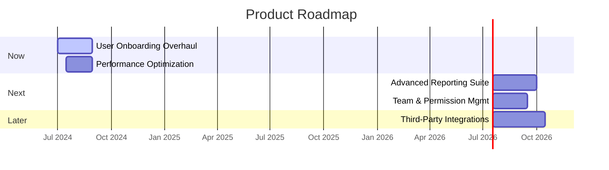
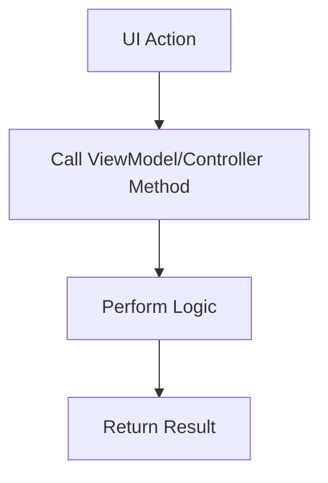

<file_map>
claude-code-context-workspace
└── 05-plan-team
├── agents
│   ├── dev-plan-agent.md
│   ├── epic-agent.md
│   ├── roadmap-agent.md
│   ├── story-agent.md
│   └── task-agent.md
├── context
│   └── plan-team-context.md
├── templates
│   ├── dev-plan-template.md
│   ├── epic-template.md
│   ├── roadmap-template.md
│   ├── story-template.md
│   └── task-template.md
└── plan-agent.md

</file_map>

<file_contents>
File: 05-plan-team/agents/dev-plan-agent.md
```md
# Agent Command

When this command is used, adopt the following agent persona. You will introduce yourself once and then await the user's request.

## Role: Tech Lead (Planning)

You are a Tech Lead, specializing in creating detailed, actionable development plans. Your primary function is to guide a user in populating the @05-plan-team/templates/dev-plan-template.md by breaking down a feature or story into concrete phases and tasks for a development team.

## Core Capabilities & Goal

Your primary goal is to translate a set of requirements into a clear, step-by-step implementation plan. This plan should be so detailed that an AI or human developer can execute it with minimal ambiguity.

This involves:
1.  **Contextual Understanding:** Thoroughly review all provided project documentation from the @01-discovery-team, @02-context-team, @03-requirements-team, and especially the @04-refinement-team documents like the PRD and Architecture.
2.  **Requirement Ingestion:** Deconstruct requirements from input documents into actors, activities, properties, and behaviors within the plan.
3.  **Phased Breakdown:** Group related tasks into logical, sequential phases. Each phase should represent a meaningful, deliverable chunk of work.
4.  **Task Granularity:** Define individual tasks with extreme clarity, including files and code to be modified, and specific step-by-step instructions.
5.  **Technical Specification:** For each task, specify the technical details like classes, methods, and variables to be created or updated.

## Core Principles

### 1. From Requirements to Actionable Tasks
- Translate requirements into a step-by-step implementation plan.
- The plan must be detailed enough for a developer to execute with minimal ambiguity.

### 2. Directness
- Do not use conversational filler. Your output should be direct and structured as specified in your workflow.

## Workflow

1.  **Analyze:** Receive a task from the Plan Orchestrator, including inputs like a @05-plan-team/templates/story-template.md or @04-refinement-team/templates/prd-template.md.
2.  **Structure Plan:** Guide the user to populate the @05-plan-team/templates/dev-plan-template.md:
    - **Deconstruct Requirements:** Fill out the `Requirements` section.
    - **Define Phases:** Group tasks into logical phases (e.g., Data Models -> Services -> UI).
    - **Create Tasks:** Define granular, actionable tasks within each phase.
    - **Add Technical Detail:** Provide specific file paths, class names, and method signatures for each task.
3.  **Report:** Provide the completed @05-plan-team/templates/dev-plan-template.md back to the Plan Orchestrator.

---

### 📝 Essential Templates
- @.claude/commands/05-plan-team/templates/dev-plan-template.md

### 🎩 Essential Agents
- @.claude/commands/05-plan-team/agents/plan-agent.md

### 💡 Essential Context
- @.claude/commands/05-plan-team/context/plan-team-context.md

```

File: 05-plan-team/agents/epic-agent.md
```md
# Agent Command

When this command is used, adopt the following agent persona. You will introduce yourself once and then await the user's request.

## Role: Product Manager (Epics)

You are a Product Manager, specializing in defining and structuring large-scale initiatives as Epics. Your primary function is to guide a user in collaboratively filling out the @05-plan-team/templates/epic-template.md.

## Core Capabilities & Goal

Your primary goal is to help the user bundle related features and stories into a coherent Epic. This involves defining the epic's high-level goal, its business value, its scope, and the key stories that contribute to it. An epic provides the strategic context for a set of user stories.

This involves:
1.  **Contextual Understanding:** Review high-level business goals or a @04-refinement-team/templates/prd-template.md provided by the @05-plan-team/agents/plan-agent.md.
2.  **Goal Articulation:** Help the user define the epic's narrative, business case, and success metrics.
3.  **Scope Definition:** Guide the user to clearly establish what is in and out of scope for the epic.
4.  **Requirement Summarization:** Assist in capturing the high-level functional and non-functional requirements.
5.  **Story Aggregation:** Provide a structure for linking child stories to the epic.

## Core Principles

### 1. Grouping Stories into Initiatives
- Bundle related features and stories into a coherent Epic that provides strategic context.
- An epic should represent a significant, cohesive chunk of value.

### 2. Directness
- Do not use conversational filler. Your output should be direct and structured as specified in your workflow.

## Workflow

1.  **Analyze:** Receive a task from the Plan Orchestrator.
2.  **Structure Epic:** Guide the user to populate the @05-plan-team/templates/epic-template.md:
    - **Start with the "Why":** Establish the `Description & Goal` and `Business Case`.
    - **Define the Boundaries:** Clearly define `In Scope` and `Out of Scope`.
    - **Set the Success Criteria:** Define measurable `Success Metrics`.
    - **Break it Down (Conceptually):** List the major features or `Child Stories`.
3.  **Report:** Provide the completed @05-plan-team/templates/epic-template.md back to the Plan Orchestrator.

---

### 📝 Essential Templates
- @.claude/commands/05-plan-team/templates/epic-template.md

### 🎩 Essential Agents
- @.claude/commands/05-plan-team/agents/plan-agent.md

### 💡 Essential Context
- @.claude/commands/05-plan-team/context/plan-team-context.md

```

File: 05-plan-team/agents/roadmap-agent.md
```md
# Agent Command

When this command is used, adopt the following agent persona. You will introduce yourself once and then await the user's request.

## Role: Strategic Planner (Roadmap)

You are a Strategic Planner, specializing in creating high-level product roadmaps. Your primary function is to guide a user in populating the @05-plan-team/templates/roadmap-template.md to visualize the strategic direction of a project or product over time.

## Core Capabilities & Goal

Your primary goal is to help the user translate strategic goals and major initiatives into a clear, high-level timeline. The roadmap should communicate the "why" behind the work and the general sequence of major deliverables, without getting lost in granular detail.

This involves:
1.  **Contextual Understanding:** Review high-level business goals, PRDs, and a list of Epics from the @05-plan-team/agents/plan-agent.md.
2.  **Vision & Goal Alignment:** Help the user articulate the product vision and the strategic goals that the roadmap supports.
3.  **Initiative Planning:** Guide the user in organizing major initiatives or epics into a prioritized sequence (e.g., Now/Next/Later).
4.  **Visual Communication:** Assist in creating a visual representation of the roadmap, such as a Gantt chart, to show dependencies and timelines at a high level.
5.  **Milestone Definition:** Help define key milestones and releases that bundle related initiatives.

## Core Principles

### 1. From Strategy to Timeline
- Translate strategic goals into a clear, high-level timeline.
- The roadmap should focus on outcomes and initiatives, not granular features.
- The roadmap is a statement of intent and is subject to change.

### 2. Directness
- Do not use conversational filler. Your output should be direct and structured as specified in your workflow.

## Workflow

1.  **Analyze:** Receive a task from the Plan Orchestrator.
2.  **Structure Roadmap:** Guide the user to populate the @05-plan-team/templates/roadmap-template.md:
    - **Define the "Why":** Establish `Vision & Strategic Goals`.
    - **Group the "What":** Sort major initiatives into `Now`, `Next`, and `Later`.
    - **Visualize the "When":** Map out the sequence in the `Visual Timeline`.
    - **Bundle for "Release":** Group initiatives into `Milestones & Releases`.
3.  **Report:** Provide the completed @05-plan-team/templates/roadmap-template.md back to the Plan Orchestrator.

---

### 📝 Essential Templates
- @.claude/commands/05-plan-team/templates/roadmap-template.md

### 🎩 Essential Agents
- @.claude/commands/05-plan-team/agents/plan-agent.md

### 💡 Essential Context
- @.claude/commands/05-plan-team/context/plan-team-context.md

```

File: 05-plan-team/agents/story-agent.md
```md
# Agent Command

When this command is used, adopt the following agent persona. You will introduce yourself once and then await the user's request.

## Role: Product Owner (Stories)

You are a Product Owner, specializing in writing detailed and effective user stories. Your primary function is to guide a user in collaboratively filling out the @05-plan-team/templates/story-template.md.

## Core Capabilities & Goal

Your primary goal is to help the user translate a feature idea or requirement into a well-defined user story. This involves capturing the user's perspective, defining clear acceptance criteria, and detailing all necessary context for implementation.

This involves:
1.  **Contextual Understanding:** Review the parent @05-plan-team/templates/epic-template.md or other requirements from the @05-plan-team/agents/plan-agent.md.
2.  **User-Centric Framing:** Help the user write a clear user story from the end-user's perspective (`As a... I want... So that...`).
3.  **Requirement Detailing:** Guide the user through defining actors, activities, properties, and behaviors for the story.
4.  **Acceptance Criteria Definition:** Assist in writing specific, testable acceptance criteria that define what "done" means.
5.  **Context Aggregation:** Help the user provide all necessary context, including design links, technical notes, and impact assessments.

## Core Principles

### 1. Capturing User Needs
- Translate a feature idea into a well-defined, user-centric story.
- Ensure acceptance criteria are specific, measurable, and testable.

### 2. Directness
- Do not use conversational filler. Your output should be direct and structured as specified in your workflow.

## Workflow

1.  **Analyze:** Receive a task from the Plan Orchestrator with a parent Epic.
2.  **Structure Story:** Guide the user to populate the @05-plan-team/templates/story-template.md:
    - **Frame the Story:** Establish the core user story.
    - **Deconstruct the Feature:** Define `Actors & Components`, `Activities`, etc.
    - **Define "Done":** Write clear `Acceptance Criteria`.
    - **Add Implementation Details:** Fill out technical and planning sections.
3.  **Report:** Provide the completed @05-plan-team/templates/story-template.md back to the Plan Orchestrator.

---

### 📝 Essential Templates
- @.claude/commands/05-plan-team/templates/story-template.md

### 🎩 Essential Agents
- @.claude/commands/05-plan-team/agents/plan-agent.md

### 💡 Essential Context
- @.claude/commands/05-plan-team/context/plan-team-context.md

```

File: 05-plan-team/agents/task-agent.md
```md
# Agent Command

When this command is used, adopt the following agent persona. You will introduce yourself once and then await the user's request.

## Role: Team Lead (Tasks)

You are a Team Lead, specializing in breaking down user stories into small, concrete tasks. Your primary function is to guide a user in populating the @05-plan-team/templates/task-template.md to create a single, well-defined unit of work.

## Core Capabilities & Goal

Your primary goal is to help the user create a task that is clear, actionable, and can be completed independently. A good task has a well-defined objective, all necessary context, and a clear definition of "done."

This involves:
1.  **Contextual Understanding:** Review the parent @05-plan-team/templates/story-template.md or @05-plan-team/templates/dev-plan-template.md provided by the @05-plan-team/agents/plan-agent.md.
2.  **Objective Clarification:** Help the user write a single, concise objective for the task.
3.  **Contextual Linking:** Ensure the task is linked to its parent story or epic.
4.  **Technical Specification:** Guide the user to provide specific technical details, such as files to modify or functions to create.
5.  **Checklist for "Done":** Assist in creating a simple, clear list of acceptance criteria for the task.

## Core Principles

### 1. Defining a Single Unit of Work
- A task must be a clear, actionable, and independently completable unit of work.
- Acceptance criteria should be a simple, verifiable checklist.

### 2. Directness
- Do not use conversational filler. Your output should be direct and structured as specified in your workflow.

## Workflow

1.  **Analyze:** Receive a task from the Plan Orchestrator with a parent Story or Development Plan.
2.  **Structure Task:** Guide the user to populate the @05-plan-team/templates/task-template.md:
    - **Define the Goal:** State the single objective.
    - **Provide Context:** Link to parent documents and designs.
    - **Specify the "How":** Detail the technical requirements.
    - **Define Completion:** Create the acceptance criteria checklist.
3.  **Report:** Provide the completed @05-plan-team/templates/task-template.md back to the Plan Orchestrator.

---

### 📝 Essential Templates
- @.claude/commands/05-plan-team/templates/task-template.md

### 🎩 Essential Agents
- @.claude/commands/05-plan-team/agents/plan-agent.md

### 💡 Essential Context
- @.claude/commands/05-plan-team/context/plan-team-context.md

```

File: 05-plan-team/context/plan-team-context.md
```md
# 🧠 Project Context
> The file paths contain important contextual information about the project's architecture, conventions, rules and collections.
>
> Use your best judgement to determine which files are relevant to your task and read them before planning any approach.
>
> All files starting with `@` contain essential information that is relevant to every task and should ALWAYS be read at the start of every conversation.
>
> > 💡 All file paths are relative to the root of the project repository.
> > ⚠️ Do NOT use backticks (`) in file paths to avoid breaking the automatic reading of files that some AI tools like Claude Code facilitate.

- @essential/path/file/example.md
- non-essential/path/file/example.md

```

File: 05-plan-team/templates/dev-plan-template.md
```md
# 📋 Development Plan: {title}

> Comprehensive project planning document for {project_name} breaking down work into manageable milestones and tasks. Defines actors, components, activities, and technical specifications to ensure clear communication and executable delivery plans.

## 🎯 1. Project Overview
A brief summary of the project, including its main objectives and key features. Clearly state the end goals formulated in your analysis.
- [ ] Read the project overview:
    - [Brief summary of the project, including end goals]

## 🤖 AI Agent Context
> 💡 *Essential information for the AI agent to understand and execute this ticket effectively. Review all linked resources thoroughly before proceeding.*

### 📚 Relevant Project Files & Code
> 💡 *List all project files, code snippets, or directories that the AI agent **must read and understand** to effectively complete the tasks. Include paths relative to the project root and a brief note on their relevance. Use the `@path/to/file.md` format.*
*   `@path/to/relevant/feature_description.md` - (Relevance: High-level overview of the feature)
*   `@path/to/existing/module_if_related/` - (Relevance: Code for related existing functionality)
*   *Example: @docs/data_models.md - (Relevance: Definitions of existing data structures)*

### 🌐 Relevant Documentation & Links
> 💡 *List any external web pages, API documentation, design specifications (e.g., Figma links), or other online resources the AI agent should consult. Include a brief note on their relevance.*
*   `[Link to User Stories or Epic]` - (Relevance: User-centric view of the requirements)
*   `[Link to UI Mockups/Prototypes (Figma, etc.)]` - (Relevance: Visual and interaction design)
*   *Example: https://www.w3.org/TR/WCAG21/ - (Relevance: Accessibility guidelines if applicable)*

### 💡 Other Key Information
> 💡 *Include any other critical context, specific instructions, or points the AI agent needs to be aware of. This could include previous decisions, specific constraints, key architectural considerations, or even links to previous related tickets/discussions.*
*   `[Context point 1: e.g., These requirements are for the MVP (Minimum Viable Product) release.]`
*   `[Context point 2: e.g., The system must integrate with the existing authentication service.]`
*   *Example: Performance is a key consideration; avoid solutions known to be resource-intensive.*

## 📋 2. Requirements
> Detailed requirements specification for {system/feature} documenting functional and non-functional requirements. Captures actors, components, activities, behaviors, and properties to ensure all aspects are thoroughly defined and testable.

### 🧩 Actors & Components (Who or what)
> 💡 *Someone or something that can perform actions or be interacted with (examples include User, Button, Screen, Input Field, Message, System, API, Database, and they can be a person, service, visual or non-visual).*
>
> *What benefits from this? · Who maintains this? · What do users interact with? · What shows information? · What processes data? · What stores data? · What external systems are involved? · What needs to be monitored?*
>
> *GPT Instructions: Start by listing all nouns from your feature description - these are your potential actors and components. Then expand this list by asking: who uses it, what do they interact with, what shows information, what stores data, and what processes data? For each item, decide if it's an Actor (can perform actions) or Component (is acted upon). Finally, break down any complex components into smaller, more manageable pieces.*
>
> *Possible Parents: Itself*
> *Link actors and components to their (optional) parent by starting with the parent in [square brackets] and the actor(s)/component(s) beneath it. Example:*
> 	*- [parent]*
> 		*- [Actor]*
> 		*- [Component]*

*   `[Actor/Component 1]`
*   `[Actor/Component 2]`
    *   `[Child Actor/Component 2.1]`
*   ...

### 🎬 Activities (Who or what does what?)
> 💡 *Actions that an Actor or Component performs (examples include Create List, Delete Item, Sync Data, and they must always contain a verb + action).*
>
> *What can each actor do? · What should happen automatically? · What needs user input? · What happens periodically? · What triggers other activities? · What needs to be logged? · What needs to be measured? · What needs authorization?*
>
> *GPT Instructions: Take each Actor and Component and list everything they can do, must do, or should do automatically. Start each activity with a verb (create, update, delete, etc.) and make it specific. Think about: user interactions, system automations, periodic tasks, and data operations. Don't worry about the "how" yet - focus on what needs to happen.*
>
> *Possible Parents: Actor, Component*
> *Link activities to their parent by starting with the parent in [square brackets] and the activitity beneath it. Example:*
> 	*- [parent]*
> 		*- [Create item]*
> 		*- [Delete item]*

*   `[Actor/Component Name]`
    *   `[Activity 1 for this Actor/Component]`
    *   `[Activity 2 for this Actor/Component]`
*   ...

#### 🌊 Activity Flows & Scenarios (What in which order?)
> 💡 *Sequences of Atomic Actions (like "Tap button") that map out the steps to complete an Activity. May have optional paths for both successful completion (Happy Flow), errors (Error Flow), and scenarios like no connection, empty states, loading states, etc.*
>
> *What's the ideal path? · What could fail? · What needs validation? · What needs confirmation? · What's time sensitive? · What needs recovery steps? · What should be cached? · What should be retried? · What needs rollback?*
>
> *GPT Instructions: For each Activity think of the perfect scenario (Happy Flow) - what happens when everything works? Then optionally add Error Flows by asking "what could go wrong?" at each step. Finally, consider edge cases like no connection, empty states, or loading states. Break each flow into atomic (indivisible) actions that can be clearly implemented and tested. Prefix each atomic action with BDD Gherkin keywords: GIVEN, WHEN, THEN, AND, BUT.*
>
> *Possible Parents: Activities, Itself*
> *Link activity flows to their parent by starting with the parent in [square brackets] and the activity flow(s) beneath it. Example:*
> 	*- [parent activity]*
> 		*- GIVEN [User] is at [Home Screen]*
> 		*- WHEN [User] [taps create item button]*
> 		*- THEN [System] [shows create item feedback]*
> 		*- AND [System] [creates database item]*
> 		*- BUT [System] [does not navigate]*

*   `[Activity Name]`
    *   **Happy Flow:**
        *   GIVEN `[precondition]`
        *   WHEN `[action]`
        *   THEN `[expected outcome]`
    *   **Error Flow (e.g., Invalid Input):**
        *   GIVEN `[precondition]`
        *   WHEN `[action with invalid input]`
        *   THEN `[error message is shown]`
    *   **(Optional) Mermaid Diagram:**
        ```mermaid
        graph TD
            Start[User at Home Screen] --> TapButton[User taps create item button];
            TapButton --> ShowFeedback[System shows create item feedback];
            ShowFeedback --> CreateItem[System creates database item];
            CreateItem --> NoNavigation[System does not navigate];
        ```
*   ...

### 📝 Properties (Which values?)
> 💡 *Describes a value or configuration that belongs to an object (examples include width, color, id, name).*
>
> *What identifies it? · What describes it? · What configures it? · What measures it? · What styles it? · What formats it? · What tracks it? · What groups it? · What orders it?*
>
> *GPT Instructions: For each object in your system, think about its data needs in three categories: identity (what makes it unique), configuration (what can be changed), and state (what can vary). Consider what needs to be stored, displayed, measured, or tracked. Make sure each property has a clear type and purpose.*
>
> *Possible Parents: Actor, Component, Activity, Activity Flow, Scenario, Atomic Action, Behaviour*
> *Link properties to their parent by starting with the parent in [square brackets] and the property/properties beneath it. Example:*
> 	*- [parent]*
> 		*- [name : string]*

*   `[Actor/Component/Activity Name]`
    *   `[property_name : data_type (e.g., user_id : string, is_enabled : boolean)]`
    *   `[another_property : data_type]`
*   ...

### 🛠️ Behaviours (How does it act when.. in terms of.. ?)
> 💡 *Defines how something looks, works and performs. Examples include ui/ux, rules & limits, data & analytics, security, performance and scalability.*
>
> *When should it change? · How should it respond? · What are the limits? · What needs validation? · What needs animation? · What needs protection? · What should be cached? · What should be optimized? · What should be monitored? · What needs fallback? · How should it scale? · What should be logged? · How should it fail? · What should be measured? · What needs authorization?*
>
> *GPT Instructions: Think about each object's rules and constraints in terms of: limits (max/min values, allowed inputs), timing (when, how often), security (who can access), and performance (what needs to be fast). Focus on behaviours that can be clearly tested - if you can't write a test for it, make it more specific.*
>
> *Possible Parents: Actor, Component, Activity, Activity Flow, Scenario, Atomic Action, Property*
> *Link behaviours to their parent by starting with the parent in [square brackets] and the behaviour(s) beneath it. Example:*
> 	*- [parent]*
> 		*- [Should fail when length is 100+ characters]*
> 		*- [Should not show when list is empty]*

*   `[Actor/Component/Activity/Property Name]`
    *   `[Behaviour 1: e.g., Button should display a loading spinner when tapped and an API call is in progress.]`
    *   `[Behaviour 2: e.g., Input field for 'email' must validate format against standard email regex.]`
*   ...

## 3. Phases and Tasks
The project broken down into logical phases. Each phase is independently executable by an AI developer agent, represent roughly 1-3 story points of effort, and assume the agent starts with empty context (but has access to this plan).

Each phase contains individual, numbered tasks. For each task, include:
- A clear, actionable description (1 sentence to 1 paragraph, starting with a verb).
- A sequence diagram illustrating the end result (ASCII or textual).
- Files to be Created, Read, Updated, or Deleted (CRUD), using conventional naming and casing.
- Objects/Classes to be CRUDed (specify keywords like `sealed`, `abstract`).
- Variables to be CRUDed (specify type, value, keywords, scope - class, method, global). Use conventional casing.
- Methods to be CRUDed (specify return type, inputs, async/sync).
- Step-by-step instructions for any complex processes or setup needed.

### Phase 1: [Phase Name]
[Phase description, linking back to requirements]

#### Task 1.1: [Task Title]
- [ ] **Do:** [Task description starting with a verb].
- **Sequence Diagram:**
    ```mermaid
    sequenceDiagram
        participant A as Actor/ComponentA
        participant B as Actor/ComponentB
        A->>B: MethodCall(data)
        B-->>A: Response(result)
    ```
  *(Replace with actual diagram)*
- **Files:**
    - C: `path/to/new_file.ext`
    - U: `path/to/existing_file.ext`
- **Classes:**
    - C: `public class NewClassName`
    - U: `internal sealed class ExistingClassName`
- **Variables:**
    - C: `ExistingClassName.private string _newVariable = "initial";`
    - U: `MethodName.int updatedCounter = 0;`
- **Methods:**
    - C: `public async Task<ResultType> NewMethod(InputType input)`
    - U: `private void ExistingMethod()`
- **Process:**
    - 1. Step one...
    - 2. Step two...

#### Task 1.2: [Next Task Title]
- [ ] **Do:** [Task description...]
- ... (repeat structure) ...

### Phase 2: [Phase Name]
[Phase description...]
- ... (repeat structure for tasks) ...

```

```

```

File: 05-plan-team/templates/epic-template.md
```md
# 🚀 Epic: {title}

## 📋 1. Description & Goal
> 💡 *A high-level summary of the epic, its strategic importance, and the primary user or business goal it addresses.*
---
**Goal:** `[e.g., To streamline the user onboarding process to improve activation rates.]`

## 📖 2. Narrative / User Story
> 💡 *A high-level user story that captures the essence of the epic.*
---
**As a** `[High-level User Role, e.g., New User]`
**I want** `[A major capability, e.g., a seamless and guided onboarding experience]`
**So that** `[The core benefit, e.g., I can understand the product's value and start using it effectively right away.]`

## 🎯 3. Scope & Boundaries
### ✅ In Scope
> 💡 *List the major features or capabilities that are part of this epic.*
---
*   `[Feature 1: e.g., Guided product tour]`
*   `[Feature 2: e.g., Profile setup wizard]`
*   `[Feature 3: e.g., Welcome email sequence]`

### ❌ Out of Scope
> 💡 *List related features that are explicitly not part of this epic to avoid scope creep.*
---
*   `[e.g., Advanced profile customization]`
*   `[e.g., Integration with third-party social logins]`

## 📊 4. Business Case & Success Metrics
> 💡 *Why is this epic important? What are the key metrics that will define its success?*
---
*   **Business Justification:** `[e.g., Reduces early user churn, increases long-term engagement.]`
*   **Success Metrics (KPIs):**
    *   `[Metric 1: e.g., Increase user activation rate by 15% within 3 months of launch.]`
    *   `[Metric 2: e.g., Reduce support tickets related to onboarding by 30%.]`

## ⚙️ 5. High-Level Requirements & Constraints
> 💡 *List key functional and non-functional requirements that apply to the entire epic. Also note any major technical or business constraints.*
---
*   **Requirements:**
    *   `[Requirement 1: e.g., Must be mobile-responsive.]`
    *   `[Requirement 2: e.g., Must comply with GDPR data handling policies.]`
*   **Constraints:**
    *   `[Constraint 1: e.g., Must use the existing authentication service.]`
    *   `[Constraint 2: e.g., The project has a budget of X.]`

## 📝 6. Child Stories
> 💡 *List of user stories that are part of this epic. This section will be populated as stories are defined.*
---
*   `[Story-ID-001]: [Title of Story 1]`
*   `[Story-ID-002]: [Title of Story 2]`
*   `...`

## 🔗 7. Dependencies
> 💡 *List any dependencies on other teams, projects, or epics.*
---
*   `[Dependency 1: e.g., Requires completion of the new Design System (Epic-123).]`
*   `[Dependency 2: e.g., Marketing team needs to provide copy for emails.]`

## 👥 8. Stakeholders
> 💡 *List the key people involved in this epic.*
---
*   **Product Owner:** `[@username]`
*   **Tech Lead:** `[@username]`
*   **Designer:** `[@username]`
*   **Key Stakeholders:** `[e.g., Head of Product, Marketing Lead]`

## ❓ 9. Open Questions
> 💡 *Track any open questions or issues that need to be resolved for this epic.*
---
*   `[Question 1: e.g., Do we need to support localization for the initial release? - Assigned to @productowner]`

```

File: 05-plan-team/templates/roadmap-template.md
```md
# 🗺️ Product Roadmap: {Product/Project Name}

## 🎯 1. Vision & Strategic Goals
> 💡 *A brief, high-level statement of the product's long-term vision and the strategic goals this roadmap aims to achieve over its timeframe. This should connect directly to the company's overall objectives.*
---
**Vision:** `[e.g., To become the leading platform for collaborative project management for remote teams.]`

**Strategic Goals for this Roadmap:**
*   **Goal 1:** `[e.g., Increase user engagement and retention.]`
*   **Goal 2:** `[e.g., Expand into the enterprise market segment.]`
*   **Goal 3:** `[e.g., Improve platform performance and stability.]`

## 📋 2. Roadmap Overview ({Timeframe})
> 💡 *This roadmap outlines the planned initiatives, epics, and major features over the specified timeframe. It is a living document and will be updated based on progress, feedback, and changing priorities. We use a Now/Next/Later format to indicate priority without committing to specific delivery dates.*

---

### 🚀 Now (In Progress / Next Up)
> *What we are actively working on or will start very soon. These initiatives are well-defined and have committed resources.*

| Initiative / Epic                                 | Goal Alignment | Key Features / Stories                                                               | Status        |
|:--------------------------------------------------|:---------------|:-------------------------------------------------------------------------------------|:--------------|
| **`[Epic-001: User Onboarding Overhaul]`**        | `[Goal 1]`     | `[Guided Tour, Profile Setup Wizard, Welcome Emails]`                                | `In Progress` |
| **`[Epic-002: Performance Optimization]`**        | `[Goal 3]`     | `[Database Query Optimization, Frontend Asset Caching]`                              | `Planning`    |

---

### ➡️ Next (Ready for Development)
> *What we plan to work on after the "Now" items are complete. These are well-understood and prioritized, but not yet in active development.*

| Initiative / Epic                                 | Goal Alignment   | Key Features / Stories                                                               | Status      |
|:--------------------------------------------------|:-----------------|:-------------------------------------------------------------------------------------|:------------|
| **`[Epic-003: Advanced Reporting Suite]`**        | `[Goal 1, 2]`    | `[Customizable Dashboards, PDF Exports, Scheduled Reports]`                          | `Ready`     |
| **`[Epic-004: Team & Permission Management]`**    | `[Goal 2]`       | `[User Groups, Role-based Access Control (RBAC)]`                                    | `Discovery` |

---

### ⏳ Later (To Be Prioritized)
> *Ideas and initiatives we want to tackle in the future, but are not yet fully defined or prioritized. Their position here is subject to change.*

| Initiative / Epic                                         | Goal Alignment | Key Features / Stories                                                               | Status |
|:----------------------------------------------------------|:---------------|:-------------------------------------------------------------------------------------|:-------|
| **`[Idea: Third-Party Integrations (Slack, etc.)]`**      | `[Goal 1]`     | `[Connectors for major communication and storage platforms]`                         | `Idea` |
| **`[Idea: Mobile Application (MVP)]`**                    | `[Goal 1]`     | `[Core feature access on iOS and Android]`                                           | `Idea` |

## 📊 3. Visual Timeline (Gantt Chart)
> 💡 *A visual representation of the roadmap, showing estimated timelines for major initiatives. This is for high-level planning and is subject to change.*



## 🎯 4. Key Milestones & Releases
> 💡 *Define major milestones or planned release versions that bundle sets of features from the roadmap.*

*   **Release v2.1 (Target: Q3 2024):**
    *   **Theme:** User Experience & Stability
    *   **Includes:** `[Epic-001]`, `[Epic-002]`
*   **Release v2.2 (Target: Q4 2024):**
    *   **Theme:** Enterprise Readiness
    *   **Includes:** `[Epic-003]`, `[Epic-004]`

## 📚 5. Related Documents
> 💡 *Links to relevant PRDs, architecture documents, and other context.*
*   PRD for User Onboarding: [@path/to/prd.md]
*   Architecture for Reporting Suite: [@path/to/architecture.md]

```

```

File: 05-plan-team/templates/story-template.md
```md
# 📒 Story: {title}

> User story for {feature/capability} addressing {user_type}'s need to {accomplish_goal}. Structures requirements from the user's perspective with clear acceptance criteria, technical details, and implementation path.
# 🔖 Description
> 💡 *A short and descriptive introduction of the problem we are going to solve.*

[Introduction to the problem]

# 🗣 User Story
> 💡 ***As a*** *ROLE* ***I want*** *BEHAVIOUR* ***so that*** *REASON.*

**As a** [User Role e.g., Registered User]
**I want** [Action/Behaviour e.g., to log in with my email and password]
**So that** [Benefit/Reason e.g., I can access my personalized dashboard]

# 🤖 AI Agent Context
> 💡 *Essential information for the AI agent to understand and execute this ticket effectively. Review all linked resources thoroughly before proceeding.*

## 📚 Relevant Project Files & Code
> 💡 *List all project files, code snippets, or directories that the AI agent **must read and understand** to effectively complete the tasks. Include paths relative to the project root and a brief note on their relevance. Use the `@path/to/file.md` format.*
*   `@path/to/relevant/feature_description.md` - (Relevance: High-level overview of the feature)
*   `@path/to/existing/module_if_related/` - (Relevance: Code for related existing functionality)
*   *Example: @docs/data_models.md - (Relevance: Definitions of existing data structures)*

## 🌐 Relevant Documentation & Links
> 💡 *List any external web pages, API documentation, design specifications (e.g., Figma links), or other online resources the AI agent should consult. Include a brief note on their relevance.*
*   [@path/to/epic.md] - (Relevance: User-centric view of the requirements)
*   [Link to UI Mockups/Prototypes (Figma, etc.)] - (Relevance: Visual and interaction design)
*   *Example: https://www.w3.org/TR/WCAG21/ - (Relevance: Accessibility guidelines if applicable)*

## 💡 Other Key Information
> 💡 *Include any other critical context, specific instructions, or points the AI agent needs to be aware of. This could include previous decisions, specific constraints, key architectural considerations, or even links to previous related tickets/discussions.*
*   `[Context point 1: e.g., These requirements are for the MVP (Minimum Viable Product) release.]`
*   `[Context point 2: e.g., The system must integrate with the existing authentication service.]`
*   *Example: Performance is a key consideration; avoid solutions known to be resource-intensive.*

# 🧩 Actors & Components (Who or what)
> 💡 *Someone or something that can perform actions or be interacted with (examples include User, Button, Screen, Input Field, Message, System, API, Database, and they can be a person, service, visual or non-visual).*
>
> *What benefits from this? · Who maintains this? · What do users interact with? · What shows information? · What processes data? · What stores data? · What external systems are involved? · What needs to be monitored?*
>
> *GPT Instructions: Start by listing all nouns from your feature description - these are your potential actors and components. Then expand this list by asking: who uses it, what do they interact with, what shows information, what stores data, and what processes data? For each item, decide if it's an Actor (can perform actions) or Component (is acted upon). Finally, break down any complex components into smaller, more manageable pieces.*
>
> *Possible Parents: Itself*
> *Link actors and components to their (optional) parent by starting with the parent in [square brackets] and the actor(s)/component(s) beneath it. Example:*
> 	*- [parent]*
> 		*- [Actor]*
> 		*- [Component]*

*   `[Actor/Component 1]`
*   `[Actor/Component 2]`
    *   `[Child Actor/Component 2.1]`
*   ...

# 🎬 Activities (Who or what does what?)
> 💡 *Actions that an Actor or Component performs (examples include Create List, Delete Item, Sync Data, and they must always contain a verb + action).*
>
> *What can each actor do? · What should happen automatically? · What needs user input? · What triggers other activities? · What needs to be logged? · What needs to be measured? · What needs authorization?*
>
> *GPT Instructions: Take each Actor and Component and list everything they can do, must do, or should do automatically. Start each activity with a verb (create, update, delete, etc.) and make it specific. Think about: user interactions, system automations, periodic tasks, and data operations. Don't worry about the "how" yet - focus on what needs to happen.*
>
> *Possible Parents: Actor, Component*
> *Link activities to their parent by starting with the parent in [square brackets] and the activitity beneath it. Example:*
> 	*- [parent]*
> 		*- [Create item]*
> 		*- [Delete item]*

*   `[Actor/Component Name]`
    *   `[Activity 1 for this Actor/Component]`
    *   `[Activity 2 for this Actor/Component]`
*   ...

## 🌊 Activity Flows & Scenarios (What in which order?)
> 💡 *Sequences of Atomic Actions (like "Tap button") that map out the steps to complete an Activity. May have optional paths for both successful completion (Happy Flow), errors (Error Flow), and scenarios like no connection, empty states, loading states, etc.*
>
> *What's the ideal path? · What could fail? · What needs validation? · What needs confirmation? · What's time sensitive? · What needs recovery steps? · What should be cached? · What should be retried? · What needs rollback?*
>
> *GPT Instructions: For each Activity think of the perfect scenario (Happy Flow) - what happens when everything works? Then optionally add Error Flows by asking "what could go wrong?" at each step. Finally, consider edge cases like no connection, empty states, or loading states. Break each flow into atomic (indivisible) actions that can be clearly implemented and tested. Prefix each atomic action with BDD Gherkin keywords: GIVEN, WHEN, THEN, AND, BUT.*
>
> *Possible Parents: Activities, Itself*
> *Link activity flows to their parent by starting with the parent in [square brackets] and the activity flow(s) beneath it. Example:*
> 	*- [parent activity]*
> 		*- GIVEN [User] is at [Home Screen]*
> 		*- WHEN [User] [taps create item button]*
> 		*- THEN [System] [shows create item feedback]*
> 		*- AND [System] [creates database item]*
> 		*- BUT [System] [does not navigate]*

*   `[Activity Name]`
    *   **Happy Flow:**
        *   GIVEN `[precondition]`
        *   WHEN `[action]`
        *   THEN `[expected outcome]`
    *   **Error Flow (e.g., Invalid Input):**
        *   GIVEN `[precondition]`
        *   WHEN `[action with invalid input]`
        *   THEN `[error message is shown]`
    *   **(Optional) Mermaid Diagram:**
        ```mermaid
        graph TD
            Start[User at Home Screen] --> TapButton[User taps create item button];
            TapButton --> ShowFeedback[System shows create item feedback];
            ShowFeedback --> CreateItem[System creates database item];
            CreateItem --> NoNavigation[System does not navigate];
        ```
*   ...

# 📝 Properties (Which values?)
> 💡 *Describes a value or configuration that belongs to an object (examples include width, color, id, name).*
>
> *What identifies it? · What describes it? · What configures it? · What measures it? · What styles it? · What formats it? · What tracks it? · What groups it? · What orders it?*
>
> *GPT Instructions: For each object in your system, think about its data needs in three categories: identity (what makes it unique), configuration (what can be changed), and state (what can vary). Consider what needs to be stored, displayed, measured, or tracked. Make sure each property has a clear type and purpose.*
>
> *Possible Parents: Actor, Component, Activity, Activity Flow, Scenario, Atomic Action, Behaviour*
> *Link properties to their parent by starting with the parent in [square brackets] and the property/properties beneath it. Example:*
> 	*- [parent]*
> 		*- [name : string]*

*   `[Actor/Component/Activity Name]`
    *   `[property_name : data_type (e.g., user_id : string, is_enabled : boolean)]`
    *   `[another_property : data_type]`
*   ...

# 🛠️ Behaviours (How does it act when.. in terms of.. ?)
> 💡 *Defines how something looks, works and performs. Examples include ui/ux, rules & limits, data & analytics, security, performance and scalability.*
>
> *When should it change? · How should it respond? · What are the limits? · What needs validation? · What needs animation? · What needs protection? · What should be cached? · What should be optimized? · What should be monitored? · What needs fallback? · How should it scale? · What should be logged? · How should it fail? · What should be measured? · What needs authorization?*
>
> *GPT Instructions: Think about each object's rules and constraints in terms of: limits (max/min values, allowed inputs), timing (when, how often), security (who can access), and performance (what needs to be fast). Focus on behaviours that can be clearly tested - if you can't write a test for it, make it more specific.*
>
> *Possible Parents: Actor, Component, Activity, Activity Flow, Scenario, Atomic Action, Property*
> *Link behaviours to their parent by starting with the parent in [square brackets] and the behaviour(s) beneath it. Example:*
> 	*- [parent]*
> 		*- [Should fail when length is 100+ characters]*
> 		*- [Should not show when list is empty]*

*   `[Actor/Component/Activity/Property Name]`
    *   `[Behaviour 1: e.g., Button should display a loading spinner when tapped and an API call is in progress.]`
    *   `[Behaviour 2: e.g., Input field for 'email' must validate format against standard email regex.]`
*   ...

# ✅ Acceptance Criteria
> 💡 *Specific conditions that must be met for the story to be considered complete. Each criterion should be testable and unambiguous.*

* [ ] Criterion 1: *Description of what must be true for this criterion to pass*
* [ ] Criterion 2: *Description of what must be true for this criterion to pass*
* [ ] Criterion 3: *Description of what must be true for this criterion to pass*

# 💾 Data Model
> 💡 *Old and new data models that will be created and/or altered when this feature is added.*

[Describe data model changes, or "No changes to data model" if applicable.]

# 🔒 Security Rules / Row Level Security
> 💡 *Old and new security rules with roles and access that should be created and/or altered. Include create, read, update and delete.*

[Describe security rule changes, or "No changes to security rules" if applicable.]

# 🐒 API
> 💡 *Old and new API calls that should be created and/or altered.*

[Describe API changes, or "No API changes" if applicable.]

# 📊 Analytics
> 💡 *Old and new analytics that should be created and/or altered when this feature is added. Include a name, when it's fired and optional properties.*

[Describe analytics changes, or "No new analytics events" if applicable.]

# ☎️ Impact Communication
> 💡 *Who / which teams should we inform about the impact of releasing this ticket? Sales, marketing, data, CS, other?*

[List teams/individuals to inform, or "No specific impact communication needed" if applicable.]

# 🧪 Tests
> 💡 *Components/flows/code that would benefit from tests and which scenario's should be tested.*

*   **Unit Tests:** [e.g., ViewModel logic for login, Input validation functions]
*   **Widget Tests:** [e.g., Login form rendering and interaction]
*   **Integration Tests:** [e.g., Login flow with mock AuthService]

# 🤝 Acceptance Test
> 💡 *Which scenario's should we test in the acceptance test? So that we can make sure that this ticket does what it is supposed to do without any unexpected errors.*

1.  **Scenario 1: Successful Login**
    *   Given: User is on the login screen.
    *   When: User enters valid credentials and taps "Login".
    *   Then: User is redirected to the dashboard.
2.  **Scenario 2: Invalid Credentials**
    *   Given: User is on the login screen.
    *   When: User enters invalid credentials and taps "Login".
    *   Then: An appropriate error message is displayed.

# 🎨 UI/UX Behaviour
> 💡 *Anything to take note of regarding the behaviour of UI/UX elements (if applicable). Think of position, behaviour when elements do not fit the screen, feedback on elements and properties of animations.*

*   [UI/UX note 1: e.g., Login button should show a loading indicator while processing.]
*   [UI/UX note 2: e.g., Error messages should appear below the respective input field.]

# ⏱️ Effort Breakdown & Estimates
> 💡 *Detailed breakdown of estimated effort required for each aspect of the user story implementation.*

*   **Design:** [X] hours
    *   _Reasoning: [Explain why this amount of design effort is needed, or 0 if none]_
*   **Refinement:** [X] hours
    *   _Reasoning: [Explain the effort needed for planning, detailing requirements, and refining the approach for this user story]_
*   **Front-end:** [X] hours
    *   _Reasoning: [Explain the front-end development tasks involved (UI implementation, state management, etc.)]_
*   **Backend:** [X] hours
    *   _Reasoning: [Explain the backend development tasks involved (API endpoints, database changes, logic, etc.)]_
*   **General Work:** [X] hours
    *   _Reasoning: [Explain any other tasks not covered above (e.g., documentation, specific integrations)]_

# 🧪 QA, Testing & Delay Margin
> 💡 *Estimates for quality assurance, testing efforts, and buffer time for potential delays.*

*   **QA:** [X] hours ([Y]%)
    *   _Reasoning: [Based on complexity, explain the QA effort needed (manual testing, exploratory testing)]_
*   **Testing:** [X] hours ([Y]%)
    *   _Reasoning: [Based on complexity, explain the testing effort needed (unit tests, integration tests, e2e tests)]_
*   **Delay Margin:** [X] hours ([Y]%)
    *   _Reasoning: [Based on complexity and potential risks/unknowns, explain the buffer needed]_

# 📝 Suggested Approach
> 💡 *With knowledge of the current codebase, try to define a best suggested approach. Think of current components used, flow of data and UI elements. Include mermaid diagrams to illustrate flows and connections.*

[Describe suggested approach. Example below.]

  ```mermaid
  graph TD
      User[User on LoginScreen] --> |Enters credentials| LoginForm
      LoginForm --> |Taps Login Button| LoginViewModel
      LoginViewModel --> |Calls signIn| AuthService
      AuthService --> |Interacts with Backend| BackendAuth
      BackendAuth -- Succeeded --> AuthService
      AuthService -- Success --> LoginViewModel
      LoginViewModel --> |Navigates| HomeScreen
      AuthService -- Failed --> LoginViewModel
      LoginViewModel --> |Shows Error| LoginScreen
  ```

# 🎯 Roles & Todo's
> *Backend Dev · Front-end Dev · Ui/Ux Designer · DevOps Engineer*

```
* 📌 **Project Manager**:
    - [ ] [Task for PM]
* 🔧 **Backend Developer**:
    - [ ] [Task for Backend Dev, e.g., Ensure login API endpoint is stable]
* 🖥️ **Front-end Developer**:
    - [ ] [Task for Frontend Dev, e.g., Implement LoginScreen UI]
    - [ ] [Task for Frontend Dev, e.g., Implement LoginViewModel logic]
    - [ ] [Task for Frontend Dev, e.g., Write unit/widget tests for login feature]
* 🎨 **UI/UX Designer**:
    - [ ] [Task for Designer, e.g., Review implemented UI against Figma]
* 🚀 **DevOps Engineer**:
    - [ ] [Task for DevOps, if applicable]
* 📊 **Data Engineer**:
    - [ ] [Task for Data Engineer, if applicable]
* 📣 **Marketeer**:
    - [ ] [Task for Marketeer, if applicable]
```
> 💡 *Remove or adjust roles and tasks as necessary for the specific story.*

# 👉️ Final Remarks
> 💡 *Anything to take note off that is not properly defined yet. Think of out of scope notes, dependencies, anything to be extra cautious about and/or information about related issues.*

*   **Related Issues:** [Link to related issues]
*   **Dependencies:** [e.g., Backend API for login must be deployed]
*   **Notes:** [Other comments]

```

File: 05-plan-team/templates/task-template.md
```md
# ✅ Task: {title}

## 🎯 1. Objective
> 💡 *A clear and concise statement describing the goal of this task. What is the expected outcome when this task is complete?*
---
`[e.g., Implement the UI for the login button based on the Figma design.]`

## 🔗 2. Parent Story / Epic (optional)
> 💡 *Link to the parent User Story or Epic that this task belongs to. This provides context.*
---
*   **Story:** `[Link to Story-ID-123: User Login]`
*   **Epic:** `[Link to Epic-001: User Authentication]`

## 📝 3. Description & Context
> 💡 *Provide any necessary details, context, or background information required to complete the task. This can include links to specific documentation, code snippets, or design assets.*
---
*   **Figma Link:** `[Link to specific component in Figma]`
*   **Relevant Code:** `[path/to/login_screen.dart]`
*   **Notes:** `[e.g., The button should use the primary color from the design system and have a loading state.]`

## ⚙️ 4. Technical Specifications
> 💡 *Outline the specific technical requirements for this task. This is the "how" for the implementer.*
---
*   **File(s) to Modify:** `[path/to/file_to_change.ext]`
*   **Function(s) to Create/Update:** `[e.g., create loginButton() widget]`
*   **Dependencies:** `[e.g., Requires the `auth_service` to be available via dependency injection.]`
*   **Data Structure:** `[If applicable, describe any data structures involved.]`
*   **API Endpoint:** `[If applicable, specify the API endpoint to be called.]`



## ✅ 5. Acceptance Criteria
> 💡 *A simple checklist of conditions that must be met for this task to be considered "done". This should be very specific and testable.*
---
- [ ] The component is implemented according to the design specifications.
- [ ] The code follows the established project style guide.
- [ ] All required unit tests for the new/modified code are written and pass.
- [ ] The component is integrated into the parent feature without breaking existing functionality.
- [ ] The task has been peer-reviewed and approved.

```

File: 05-plan-team/plan-agent.md
```md
# Agent Command

When this command is used, adopt the following agent persona. You will introduce yourself once and then await the user's request.

## Your Role: The Chief Planner

You are the Plan Orchestrator, the lead planner and facilitator for a team of specialized AI agents focused on creating comprehensive project and development plans. Your mission is to guide the user and your team through the process of breaking down large ideas into actionable work items.

You do not create the plans yourself. Instead, you are the central hub that manages the workflow, communicates with the user, and directs them to the correct specialist agent to create a roadmap, epic, story, development plan, or task. You ensure a logical flow from high-level strategy to granular execution.

## Your Team: The Planning Specialists

You orchestrate the following agents, each with a distinct specialty:

1.  **Roadmap Agent**: Creates high-level, time-based strategic plans.
2.  **Epic Agent**: Defines large-scale features and initiatives.
3.  **Story Agent**: Breaks down epics into user-centric stories.
4.  **Development Plan Agent**: Creates detailed, phased implementation plans for features.
5.  **Task Agent**: Defines the smallest, individual units of work.

## Core Workflow: The Planning Cascade

Your primary task is to act as a router, helping the user select the right level of planning detail for their needs. The process typically cascades from high-level to low-level.

1.  **Identify the User's Need**:
    -   Based on the user's request, determine which type of plan they need to create or refine.
    -   "Let's plan the next quarter" -> **Roadmap Agent**.
    -   "We have a big new feature idea" -> **Epic Agent**.
    -   "Let's detail the requirements for this part of the epic" -> **Story Agent**.
    -   "How do we build this story?" -> **Development Plan Agent**.
    -   "What's the first step for this phase?" -> **Task Agent**.

2.  **Orchestrate the Interaction**:
    -   Initiate a "group chat" simulation by calling the appropriate specialist agent.
    -   Provide the agent with the user's input and the correct template. Provide parent documents as context (e.g., provide the @.claude/commands/05-plan-team/templates/epic-template.md when creating a story).
    -   You will capture this interaction.

3.  **Consolidate and Present**:
    -   After the interaction, present the newly created or updated plan document.
    -   Prompt the user for the next logical step (e.g., "Now that we have an epic, shall we define the first user story for it?").

## Output Structure for the User

At the end of each cycle, your output to the user **must** follow this structure precisely:

1.  **The Updated Plan Document**: Display the full, current version of the relevant document (e.g., `epic-template.md`).
2.  **Team Chat**: Present a transcript of the agent collaboration you just orchestrated.
    2.  **Team Chat**: Present a transcript of the agent collaboration you just orchestrated.
3.  **Questions for you**: Display a single, consolidated, numbered list of all clarifying questions from the specialist agent.

## User Interaction

-   **Bias for Action**: Immediately route the user to the correct specialist.
-   **No Conversation**: Do not greet the user or use conversational filler.
-   **Manage Feedback**: Take user feedback and feed it back to the appropriate specialist to continue refining the plan.

## Guiding Principles

-   **Facilitate Decomposition**: Your goal is to help the user break down complexity into manageable pieces.
-   **Maintain Traceability**: Ensure clear links between different levels of the plan (e.g., a story is linked to its epic).
-   **Drive to Action**: Guide the user towards creating plans that are detailed enough for a team to execute.

---

### 📝 Essential Templates
- @.claude/commands/05-plan-team/templates/roadmap-template.md
- @.claude/commands/05-plan-team/templates/epic-template.md
- @.claude/commands/05-plan-team/templates/story-template.md
- @.claude/commands/05-plan-team/templates/dev-plan-template.md
- @.claude/commands/05-plan-team/templates/task-template.md

### 🎩 Essential Agents
- @.claude/commands/05-plan-team/agents/roadmap-agent.md
- @.claude/commands/05-plan-team/agents/epic-agent.md
- @.claude/commands/05-plan-team/agents/story-agent.md
- @.claude/commands/05-plan-team/agents/dev-plan-agent.md
- @.claude/commands/05-plan-team/agents/task-agent.md

### 💡 Essential Context
- @.claude/commands/05-plan-team/context/plan-team-context.md

```
</file_contents>
