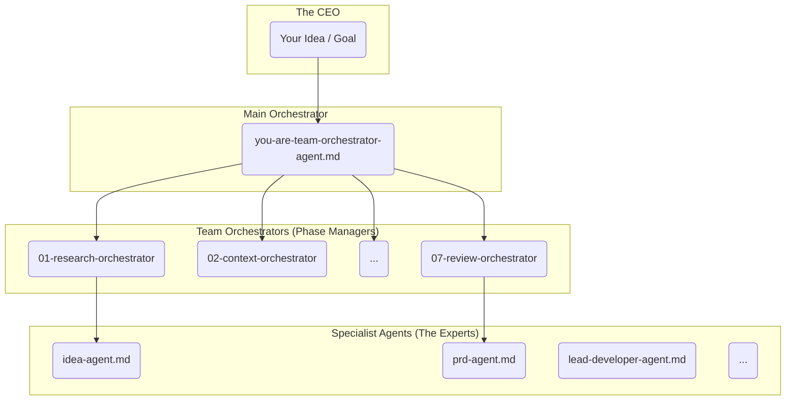
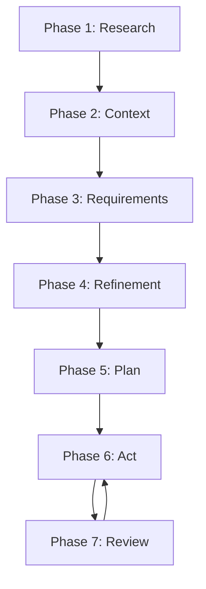

# ⚡ Calude Code Context Teams v0.1

[](https://brianwithai.com)
[](https://brianmetai.nl)


This repository is a framework of specialized AI agent teams designed to guide software projects from the earliest spark of an idea all the way through to execution, review, and completion. You are the CEO, and these teams are your expert collaborators.

## ✨ Core Philosophy: Agentic Workflows & Context Engineering

This framework is built on two principles designed to overcome the common pitfalls of AI-assisted development:

1.  **Agentic Specialization:** Instead of a single, generalist AI, this framework provides a hierarchy of specialists. Each agent and team has a specific role, from high-level orchestrators to granular experts like a `requirements-agent` or `lead-developer-agent`. This division of labor ensures the right expertise is applied at the right time.

2.  **Context is King:** The biggest challenge in working with AI is context loss. This framework is engineered to solve that by leveraging Claude's file-linking capabilities. By giving agents direct, persistent access to project files, requirements, and architectural documents, we ensure they always have the information they need to perform their tasks accurately and consistently.

## 🏛️ The Structure: A Virtual Organization

Think of this repository as the organizational chart for your AI company. It's built on a clear hierarchy that allows you to engage at any level, from high-level strategy to detailed implementation.

### The Orchestration Model

The framework is orchestrated by a hierarchy of agents, with you at the top.



*   **You (The CEO):** You provide the high-level goal.
*   **The Team Orchestrator (`you-are-team-orchestrator-agent.md`):** Your possible main point of contact. This agent understands the entire project lifecycle and routes your request to the correct Team Orchestrator.
*   **Team Orchestrators:** Each of the 7 teams has an orchestrator (e.g., `you-are-research-orchestrator-agent.md`). They manage the specialists within their team to complete a specific phase of the project.
*   **Specialist Agents:** These are the "doers" with specific skills (e.g., `you-are-idea-agent.md`, `you-are-prd-agent.md`). They execute granular tasks.

### Teams vs. Freelancers

*   **The Teams (`01-` to `07-`):** Seven specialized teams that guide a project through the development lifecycle, from research to review.
*   **The Freelancers (`00-freelancers`):** A collection of individual specialist agents (like Architect, Developer, Tester) that can be called upon for specific, ad-hoc tasks outside the main team workflow.

## 🌊 The Project Lifecycle: Meet the Teams

The framework guides a project through seven distinct phases, each managed by a dedicated team. This ensures a structured progression from concept to completion.



---

### 1. `01-research-team`
*   **Purpose:** To clarify initial ideas, brainstorm solutions, and conduct formal research. This team turns a vague concept into a well-defined problem statement.
*   **Agents:** `you-are-brainstorm-agent.md`, `you-are-idea-agent.md`, `you-are-research-agent.md`.

### 2. `02-context-team`
*   **Purpose:** To gather and document all necessary project context. This includes best practices, good and bad examples, personal preferences, and suggested approaches.
*   **Agents:** `you-are-bad-examples-agent.md`, `you-are-best-practices-agent.md`, `you-are-collection-agent.md`, `you-are-good-examples-agent.md`, `you-are-personal-preferences-agent.md`, `you-are-suggested-approach-agent.md`.

### 3. `03-requirements-team`
*   **Purpose:** To create detailed, granular, and testable requirements specifications. This team deconstructs an idea into its fundamental actors, activities, properties, and behaviors.
*   **Agents:** `you-are-activities-agent.md`, `you-are-actors-components-agent.md`, `you-are-behaviours-agent.md`, `you-are-properties-agent.md`, `you-are-scenarios-agent.md`.

### 4. `04-refinement-team`
*   **Purpose:** To formalize requirements into structured, industry-standard documents like a Product Requirements Document (PRD) and an Architecture Document.
*   **Agents:** `you-are-architecture-agent.md`, `you-are-prd-agent.md`.

### 5. `05-plan-team`
*   **Purpose:** To break down refined requirements into actionable plans. This team creates the project roadmap, epics, user stories, and detailed development tasks.
*   **Agents:** `you-are-development-plan-agent.md`, `you-are-epic-agent.md`, `you-are-roadmap-agent.md`, `you-are-story-agent.md`, `you-are-task-agent.md`.

### 6. `06-act-team`
*   **Purpose:** To execute the development plan. This team simulates the building of the feature and produces a detailed `result-report.md` documenting what was done.
*   **Agents:** `you-are-acceptance-test-agent.md`, `you-are-lead-developer-agent.md`, `you-are-result-report-agent.md`, `you-are-unit-tester-agent.md`.

### 7. `07-review-team`
*   **Purpose:** To review the completed work against all defined criteria to ensure quality. This team checks for adherence to acceptance criteria, quality standards, rules, and restrictions.
*   **Agents:** `you-are-acceptance-criteria-agent.md`, `you-are-code-review-agent.md`, `you-are-feedback-agent.md`, `you-are-quality-standards-agent.md`, `you-are-restrictions-agent.md`, `you-are-rules-agent.md`.

---

## 🚀 Getting Started

1.  **Clone the Project:**
    ```bash
    git clone https://github.com/your-repo/ultra-turbo-claude-code-context-teams.git
    ```
2.  **Install the Commands:**
    Copy the team folders (`00-freelancers`, `01-research-team`, etc.) and the root `you-are-team-orchestrator-agent.md` file into your `.claude/commands/` directory. This makes them available as commands in your IDE.

3.  **Configure Your Project Context:**
    This is the most important step. Go into each team's context file (e.g., `01-research-team/context/research-team-context.md`) and update the file links to point to the relevant files in *your* project.

4.  **Start a Conversation:**
    Start a chat with `@you-are-team-orchestrator-agent` in your IDE and describe what you want to do. It will guide you to the right team.

## 🧠 How to Use: The Power of Context

This framework is heavily optimized for Claude's ability to automatically read and incorporate file context. Understanding this is key to using the framework effectively.


### Automatic File Loading with `@` links
When you reference a file in a prompt using the syntax `@path/to/file.md` (without backticks), Claude automatically reads that file and includes its content in the context for the AI agents. This is a massive time-saver and the core mechanism for providing context.

### Dynamic vs. Static Context
*   **`@links` (Immediate Load):** Use the `@` prefix for files that provide essential, upfront context that the agent should *always* read at the start of a task.
*   **Regular Paths (On-Demand Load):** You can also include regular file paths in your instructions (e.g., "Please review `docs/old_spec.md`"). The agent is then instructed to read these files as needed, giving you more flexible control over the context.

### The `team-context.md` File
Each team has a `context/team-context.md` file. This is where you should link to your project's most important files (e.g., your architecture document, key source files, style guides). By updating this one file for a team, you provide all its agents with the necessary project knowledge.

Here is the template used for the context files:
```markdown
# 🧠 Project Context
> The file paths contain important contextual information about the project's architecture, conventions, rules and collections.
>
> Use your best judgement to determine which files are relevant to your task and read them before planning any approach.
>
> All files starting with `@` contain essential information that is relevant to every task and should ALWAYS be read at the start of every conversation.
>
> > 💡 All file paths are relative to the root of the project repository.
> > ⚠️ Do NOT use backticks (`) in file paths to avoid breaking the automatic reading of files that some AI tools like Claude Code facilitate.

- @essential/path/file/example.md
- non-essential/path/file/example.md
```

## 🛠️ Advanced Usage

### Using Freelancers
The `00-freelancers` directory contains a wide range of specialist agents you can call for ad-hoc tasks.
```
00-freelancers
├── architect
├── aso-expert
├── brainstormer
├── business-analyst
├── content-creator
├── developer
├── mvp-expert
├── project-manager
├── prompt-engineer
├── proposal-magician
├── researcher
├── tester
└── uiux-expert
```

### Creating Custom Agents for ChatGPT/Gemini
The `100-all-teams` directory contains single-file versions of each team's entire prompt library. You can copy the content of these files and paste it into the system prompt of a custom agent (like a ChatGPT GPT or a Gemini agent). This allows you to create powerful, specialized team agents on other platforms.

## 🔧 Maintenance & Contribution

Making changes to this framework across many files can be complex. To edit files in bulk while maintaining the relationships between them, we highly recommend using **[Repo Prompt](https://repoprompt.com/)**. It allows you to provide context from multiple files and apply changes across the entire repository in one go, which is ideal for maintaining a framework like this.


## 🙏 Acknowledgements

This repository and its concepts are heavily inspired by the pioneering work done in the **[BMAD-METHOD](https://github.com/bmadcode/BMAD-METHOD)** repository.

The BMAD-METHOD introduces a powerful two-phase approach for AI-assisted development that significantly reduces context loss. It consists of:
1.  **Agentic Planning:** Where dedicated agents collaborate to produce comprehensive and consistent planning documents (like PRDs and Architecture).
2.  **Context-Engineered Development:** Where a Scrum Master agent transforms those plans into hyper-detailed development stories, giving the development agent all the context it needs to build features correctly.

Our team-based framework builds on these ideas to create a structured, collaborative environment for AI agents. A big thank you to the creators for the inspiration!

## 📂 File Structure Overview

Here is a high-level overview of the repository structure:
```
.
├── 00-freelancers/       # Collection of individual specialist agents
├── 01-research-team/      # Team for idea clarification and research
│   ├── agents/
│   ├── context/
│   └── templates/
├── 02-context-team/       # Team for gathering project context
├── 03-requirements-team/  # Team for detailed requirements specification
├── 04-refinement-team/    # Team for creating PRDs and Architecture docs
├── 05-plan-team/          # Team for creating roadmaps, epics, and tasks
├── 06-act-team/           # Team for executing the plan
├── 07-review-team/        # Team for reviewing completed work
├── 100-all-teams/         # Single-file versions of teams for custom GPTs
├── README.md              # This file
└── you-are-team-orchestrator-agent.md # The main entry point agent
```

## 📄 License

This project is licensed under the MIT License - see the [LICENSE](LICENSE) file for details.
