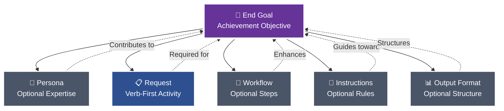
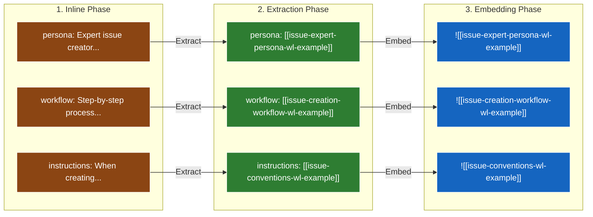
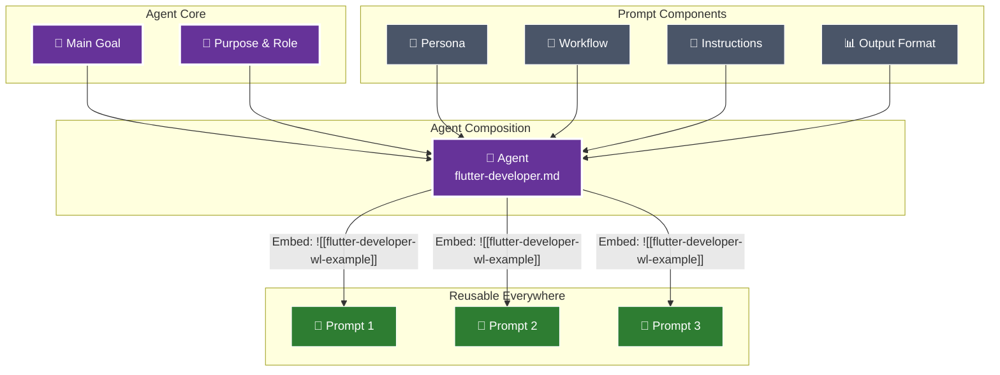
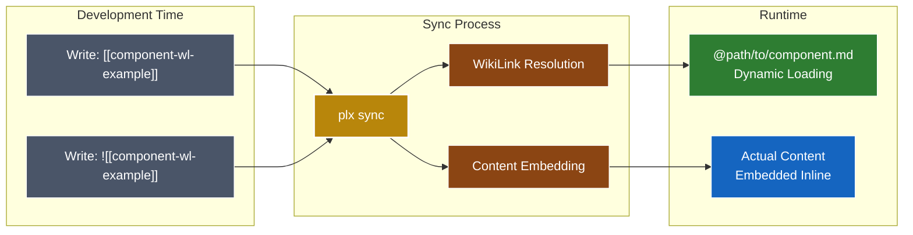
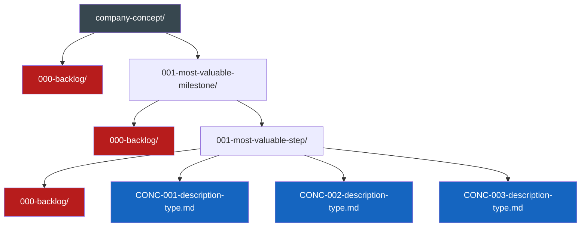
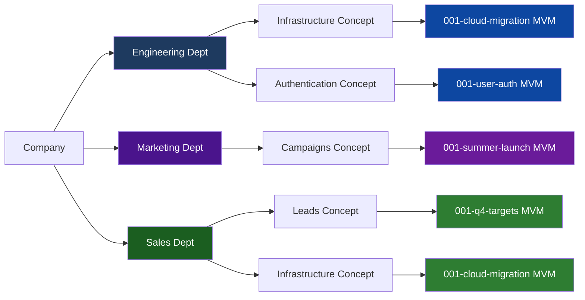
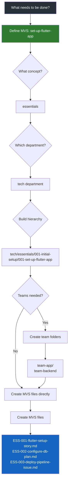
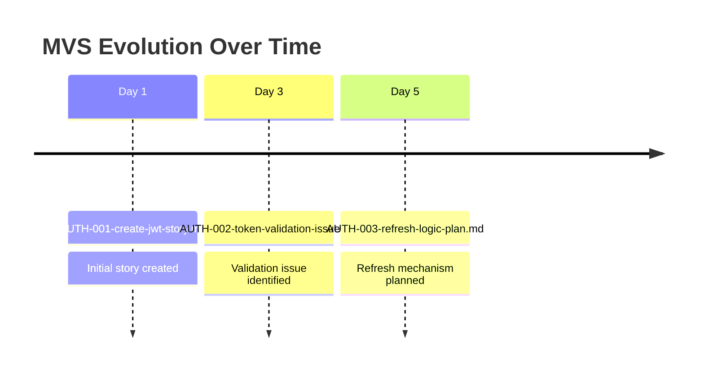

# ⚡ Pew Pew 🏗️ Workspace

[](https://github.com/its-brianwithai/pew-pew-workspace/releases/tag/v0.6.0)
[](https://opensource.org/licenses/MIT)
[](https://pewpewprompts.com)


> AI-powered project management framework based on an opinionated view on effective prompts and a highly modular approach to building effective agents, workflows, templates, prompts and context documents.


## 🚀 Quick Start

Add the latest files of the Pew Pew framework to any existing project with a single command:

```bash
curl -fsSL https://raw.githubusercontent.com/its-brianwithai/pew-pew-workspace/main/.pew/install.sh | bash
```

This will:
1. Download all framework components into `.pew/` subdirectories
2. Preserve your existing project files
3. Add the `.claude/` directory with all synced artifacts
4. Enable all `/plx:` commands in your project

### After Installation: Sync Anytime

Once installed, sync all docs from your project root with:

```bash
make -f .pew/Makefile sync claude
```

Or directly:
```bash
./.pew/scripts/claude-code/sync-claude-code.sh
```

### Configuration (.pew/plx.yaml)

The sync process uses `.pew/plx.yaml` as the main configuration:
- **`.pew/plx.yaml`**: Main configuration file (committed, uses `.pew/` subdirectories)
- **`.pew/plx.local.yaml`**: Optional local override (never committed, for personal customizations)

Customize sync behavior in `.pew/plx.yaml`:
- **sync_sources**: Which directories to sync from
- **sync_targets**: Where to sync files to
- **delete_before_sync_targets**: Directories to clean before syncing
- **delete_after_sync_targets**: Directories to clean after syncing

**Local Override:** Create `.pew/plx.local.yaml` to override settings without modifying the main config. This file is gitignored and perfect for personal customizations.

## ✨ What's New in v0.6.0

### 🚀 Enhanced Modular Architecture
- **Improved WikiLink System**: Better component referencing with cleaner template integration
- **Streamlined Template Organization**: Ghost CMS templates and business issue routing
- **Enhanced Sync Process**: Backticked path correction and improved error handling

### 📋 New Templates & Components
- **Business Issue Templates**: Smart routing for operations, marketing, sales, finance, and people issues
- **Ghost CMS Integration**: Author templates with `ghost_id` field support and tutorial formats
- **Meta Documentation**: Enhanced context documentation with proper template linking

### 🛠️ Developer Experience Improvements
- **Template-Linked Agents**: Meta context expert now uses WikiLink template references instead of inline duplication
- **Better Sync Commands**: Enhanced make commands with watch capabilities
- **Project Alignment**: Improved documentation and convention adherence

### 🔧 Architecture Enhancements
- **Collections & Concepts**: New component types for curated lists and core principles
- **Reference Commands**: New `/collect:` and `/understand:` command types
- **Improved Modularity**: Better separation of concerns with template-driven patterns

## 📝 A Good Prompt

The foundation of this framework is understanding what makes an effective prompt. Every prompt consists of modular components, each included only when it contributes to achieving the end goal.

**Claude Commands:** `/plx:create` (new), `/plx:update` (enhance), `/plx:make` (transform)



### Core Components

#### 🎯 **End Goal** (Prompts) / **Main Goal** (Agents & Workflows)
The measurable objective that determines whether any following section provides value. This is your north star - every component should improve your chances of achieving this goal exactly as intended.

- **Prompts** define **End Goal**: Achievement-focused objective
- **Agents** define **Main Goal**: Behavioral-focused objective  
- **Workflows** define **Main Goal**: Process-focused objective

**Required subsections:**
- **Deliverables**: What must be produced or accomplished
- **Acceptance Criteria**: How to verify the goal has been achieved

Every section and component must align with and contribute to these goals to ensure clear, measurable success.

#### 👤 **Persona** (Optional)
Specialized expertise attributes included when they enhance outcomes:
- Role, Expertise, Domain, Knowledge
- Experience, Skills, Abilities, Responsibilities
- Interests, Background, Preferences, Perspective
- Communication Style

**Claude Command:** `/act:<persona-name>` - Activate this persona directly
**In Files:** `[[persona-name-wl-example]]` to reference, `![[persona-name-wl-example]]` to embed content

#### 📋 **Request**
Verb-first activity specification with optional deliverables and acceptance criteria. Always starts with an action: Create, Update, Analyze, Transform, etc.

#### 🔄 **Workflow** (Optional)
Multi-phase processes with clear deliverables and acceptance criteria. Each workflow must define its main goal, and every phase must specify what it delivers and how to verify success.

**Key Elements:**
- Main Goal with success criteria
- Phases with deliverables and acceptance criteria
- Steps with purpose and instructions
- Quality gates and decision points

**Claude Command:** `/start:<workflow-name>` - Launch this workflow
**In Files:** `[[workflow-name-wl-example]]` to reference, `![[workflow-name-wl-example]]` to embed content

#### 📏 **Instructions** (Optional)
Event‑driven guidance following the pattern: "When {scenario} occurs, then {apply these instructions}".

Instruction categories and naming rules:
- Type → suffix → folder
    - Conventions → `-conventions.md` → `instructions/conventions/`
    - Best practices → `-best-practices.md` → `instructions/best-practices/`
    - Rules (always/never) → `-rules.md` → `instructions/rules/`
    - Tool-specific instructions (e.g., Maestro) → `-instructions.md` → `instructions/<tool>/` (e.g., `instructions/maestro/`)

4‑step rule for any new instruction:
1) Read existing docs to avoid duplication
2) Determine the type (convention | best‑practice | rule | tool‑instructions)
3) Rename file to match suffix exactly
4) Place in the correct folder under `instructions/`

**Claude Command:** `/apply:<instruction-name>` - Apply these instructions
**In Files:** `[[instruction-name-wl-example]]` to reference, `![[instruction-name-wl-example]]` to embed content

#### 📊 **Output Format** (Optional)
Specifications for how deliverables should be structured - templates, format types (JSON, YAML, Markdown), or specific structural requirements.

**Claude Command:** `/output:<format-name>` - Apply this output format
**In Files:** `[[format-name-wl-example]]` to reference, `![[format-name-wl-example]]` to embed content

### The Modular Approach

Each component can and should be extracted and referenced via wikilinks when it can be reused. During sync:
- `[[wikilinks-wl-example]]` are transformed to `@path/to/file.md` for dynamic loading by Claude
- `![[embedded-wikilinks-wl-example]]` are replaced with the actual file content inline

⚠️ **Important:** The `@path/to/file.md` references inside command files auto-load when you use slash commands (e.g., `/use:template-file` will automatically read all `@` references inside that template). However, if you just type `@template-file` directly in chat, Claude only sees the path - no automatic reading occurs.




### 🎩 A Good Agent

When certain prompt components naturally align around a common purpose and main goal, they can be composed into agents. Benefits:
- Use as **sub-agents** for specific tasks within larger workflows
- Activate directly via **`/act:<agent-name>`** commands
- **Reusable expertise** across all your prompts and projects



### Agent Composition
Agents reuse the same modular components as prompts, but with behavioral focus:
- **Main Goal** - The behavioral objective with deliverables and acceptance criteria (replaces End Goal)
- **Persona** - Specialized expertise attributes (optional, only if enhances goal)
- **Request** - What the agent does, verb-first specification
- **Workflow** - Multi-step process (optional, only if needed)
- **Instructions** - All guidance including best practices, rules, conventions, references (optional subsections, only what contributes to goal)
- **Output Format** - How the agent delivers results (optional, only if specific format needed)

## 📋 Templates and Blocks

Templates provide structured formats, while blocks offer reusable content sections:

### Templates
Complete document structures in `templates/`:
- Issue templates, story templates, epic templates
- Bug reports, pull requests, documentation
- Implementation plans, requirements, roadmaps

**Claude Command:** `/use:<template-name>` - Use this template
**In Files:** `[[template-name-wl-example]]` to reference, `![[template-name-wl-example]]` to embed content

### Blocks
Reusable content sections in `blocks/`:
- **Goal blocks** (main-goal-block with deliverables and acceptance criteria)
- **Workflow blocks** (deliverables, acceptance criteria, steps)
- **Context blocks** (capabilities, purpose, functions)
- **Instruction blocks** (best practices, rules, standards)
- 40+ specialized blocks for comprehensive documentation

**Claude Command:** `/add:<block-name>` - Insert this block
**In Files:** `[[block-name-wl-example]]` to reference, `![[block-name-wl-example]]` to embed content

### Modes
Operational contexts in `modes/`:
- Different working modes for various scenarios
- Context-specific behaviors and rules
- Switchable operational states

**Claude Command:** `/activate:<mode-name>` - Switch to this mode

## 🎨 Core Philosophy: From Monolithic to Modular

**Evolution Path:** Inline → Extract → Modularize → Reuse

1. **Start Complete** - Solve the problem with everything inline first
2. **Identify Patterns** - Notice what gets repeated across solutions  
3. **Extract Components** - Move patterns to reusable files with wikilinks
4. **Systematic Refinement** - Simplify, Clarify, Improve, Expand, Reduce


## 🔗 WikiLink Architecture: Component Reusability

The framework leverages a sophisticated component referencing system:



### Standard WikiLinks: Dynamic Loading
```markdown
# In your artifact:
Follow [[project-conventions-wl-example]] and use [[story-template-wl-example]]

# After sync transformation:
Follow @instructions/project-conventions.md and use @templates/story-template.md

# Result: Claude automatically loads referenced files at runtime
```

### Embedded WikiLinks: Content Insertion
```markdown
# Reference mode (loads on activation):
Use the workflow in [[issue-workflow-wl-example]]

# Embedding mode (content inserted during sync):
![[issue-workflow-wl-example]]

# Note: Embedded wikilinks must occupy their own line
```

### Component Evolution Lifecycle
```markdown
1. Inline definition → Components defined within the artifact
2. File extraction → [[component-name-wl-example]] references to external files
3. Agent composition → Combining persona, workflow, and instructions
4. Agent embedding → ![[agent-name-wl-example]] inclusion in prompts
```


## 🎮 Commands & Usage

### Core Setup & Sync
```bash
# The sync process uses plx.yaml configuration for all paths
./.pew/scripts/claude-code/sync-claude-code.sh       # Sync to Claude Code
./.pew/scripts/claude-code/test-sync.sh              # Test sync in isolated environment
./.pew/scripts/claude-code/watch-claude-code.sh      # Auto-sync during development
# OR using make from root:
make -f .pew/Makefile sync claude                    # Sync to Claude Code
make -f .pew/Makefile watch claude                   # Auto-sync during development

# Pull latest framework updates and sync:
make -f .pew/Makefile pull main                      # Pull latest framework updates
make -f .pew/Makefile sync claude                    # Then sync with Claude

# YAML configuration controls:
# - Source directories (sync_sources)
# - Target directories (sync_targets)
# - Pre-sync cleanup (delete_before_sync_targets)
# - Post-sync cleanup (delete_after_sync_targets)
```

### Claude Code Commands (After Sync)

| Command Type | Examples | Purpose |
|:------------|:---------|:--------|
| **Creation** | `/plx:create`, `/plx:create:issue` | Generate new artifacts from requirements |
| **Transformation** | `/plx:update`, `/plx:make`, `/plx:shard` | Modify and convert existing content |
| **Git & Release** | `/plx:commit`, `/plx:create-github-release` | Handle commits with documentation checks and create releases |
| **Sync & Framework** | `/plx:sync-claude`, `/plx:pull-sync-claude`, `/plx:pull-sync-claude-clean` | Sync with Claude Code, update framework, and clean sync with backup |
| **Agents** | `/act:flutter:developer`, `/act:story:agent` | Activate specialized AI personas |
| **Workflows** | `/start:feature-workflow`, `/start:bug-workflow` | Launch multi-phase processes |
| **Components** | `/add:`, `/output:`, `/apply:`, `/use:` | Insert blocks, formats, instructions, templates |
| **Collections** | `/collect:<collection-name>` | Access curated lists and compilations |
| **Concepts** | `/understand:<concept-name>` | Access core principles and ideas |
| **References** | `/refer:<reference-name>` | Access reference documentation |
| **Modes** | `/activate:<mode-name>` | Switch operational contexts |

### Sync Transformation

```mermaid
graph TD
    subgraph "Root Source"
        A1[agents/]
        P1[prompts/]
        T1[templates/]
        I1[instructions/]
        W1[workflows/]
        M1[modes/]
        B1[blocks/]
        O1[output-formats/]
        PE1[personas/]
        CO1[collections/]
        CN1[concepts/]
        R1[references/]
    end
    
    subgraph "plx.yaml sync"
        SYNC[Sync Process<br/>WikiLink Resolution<br/>Content Distribution<br/>YAML-Configured Paths]
    end
    
    subgraph ".claude/ Destination"
        A2[.claude/agents/<br/>+<br/>.claude/commands/act/]
        P2[.claude/commands/plx/]
        T2[.claude/commands/use/]
        I2[.claude/commands/apply/]
        W2[.claude/commands/start/]
        M2[.claude/commands/activate/]
        B2[.claude/commands/add/]
        O2[.claude/commands/output/]
        PE2[.claude/commands/act/]
        CO2[.claude/commands/collect/]
        CN2[.claude/commands/understand/]
        R2[.claude/commands/refer/]
    end
    
    A1 --> SYNC
    P1 --> SYNC
    T1 --> SYNC
    I1 --> SYNC
    W1 --> SYNC
    M1 --> SYNC
    B1 --> SYNC
    O1 --> SYNC
    PE1 --> SYNC
    CO1 --> SYNC
    CN1 --> SYNC
    R1 --> SYNC
    
    SYNC --> A2
    SYNC --> P2
    SYNC --> T2
    SYNC --> I2
    SYNC --> W2
    SYNC --> M2
    SYNC --> B2
    SYNC --> O2
    SYNC --> PE2
    SYNC --> CO2
    SYNC --> CN2
    SYNC --> R2
    
    style SYNC fill:#b8860b,stroke:#fff,stroke-width:3px,color:#fff
    style A1 fill:#4a5568,stroke:#fff,color:#fff
    style P1 fill:#4a5568,stroke:#fff,color:#fff
    style T1 fill:#4a5568,stroke:#fff,color:#fff
    style I1 fill:#4a5568,stroke:#fff,color:#fff
    style W1 fill:#4a5568,stroke:#fff,color:#fff
    style M1 fill:#4a5568,stroke:#fff,color:#fff
    style B1 fill:#4a5568,stroke:#fff,color:#fff
    style O1 fill:#4a5568,stroke:#fff,color:#fff
    style PE1 fill:#4a5568,stroke:#fff,color:#fff
    style A2 fill:#2e7d32,stroke:#fff,color:#fff
    style P2 fill:#2e7d32,stroke:#fff,color:#fff
    style T2 fill:#2e7d32,stroke:#fff,color:#fff
    style I2 fill:#2e7d32,stroke:#fff,color:#fff
    style W2 fill:#2e7d32,stroke:#fff,color:#fff
    style M2 fill:#2e7d32,stroke:#fff,color:#fff
    style B2 fill:#2e7d32,stroke:#fff,color:#fff
    style O2 fill:#2e7d32,stroke:#fff,color:#fff
    style PE2 fill:#2e7d32,stroke:#fff,color:#fff
```



## 💡 Key Principles

### 1. Goal as North Star
Artifacts define clear, measurable goals:
- **End Goal** (Prompts): Achievement-focused objective
- **Main Goal** (Agents/Workflows): Behavioral/process-focused objective

Each goal requires:
- **Deliverables**: Specific outputs to be produced
- **Acceptance Criteria**: Checkable conditions for success

All sections and components must align with and contribute to achieving these goals. Without clear deliverables and acceptance criteria, success cannot be measured.

### 2. Requirement-Driven Development
Begin with functional requirements rather than artifact types - understand the objective before selecting the implementation.

### 3. Component Modularity
Define components once and reference them throughout the system via wikilinks for consistency and maintainability.

### 4. Progressive Enhancement
Evolution path: inline implementation → extracted components → composed agents → universal reusability.

### 5. Systematic Validation
Apply structured questioning methodology to validate and refine each component and decision.

### 6. Natural Agent Emergence
When persona, workflow, and instructions align organically around a common purpose and main goal (behavioral focus), they naturally form a reusable agent.


## 🔧 Configuration: plx.yaml

The entire sync process is controlled by the `plx.yaml` configuration file:

```yaml
sync_sources:
  agents:
    - agents
  instructions:
    - instructions
  output-formats:
    - output-formats
  personas:
    - personas
  prompts:
    - prompts
  templates:
    - templates
  workflows:
    - workflows
  modes:
    - modes
  blocks:
    - blocks

delete_before_sync_targets:
  - .claude/agents
  - .claude/commands

delete_after_sync_targets: []

sync_targets:
  agents:
    - .claude/agents/
    - .claude/commands/act/
  personas:
    - .claude/commands/act/
  prompts:
    - .claude/commands/plx/
  templates:
    - .claude/commands/use/
  blocks:
    - .claude/commands/add/
  output-formats:
    - .claude/commands/output/
  instructions:
    - .claude/commands/apply/
  workflows:
    - .claude/commands/start/
  modes:
    - .claude/commands/activate/
```

### Sync Features

- **Automatic Cleanup**: Removes old `.claude/` directories before sync
- **WikiLink Resolution**: Converts `[[references-wl-example]]` to `@path/to/file.md`
- **Content Embedding**: Replaces `![[embeds-wl-example]]` with actual file content
- **Error Handling**: Comprehensive error handling with automatic cleanup
- **Temporary Directory Management**: Auto-removes empty tmp directories after sync

## 🎯 Most Valuable Project Management (MVPM)

**Most Valuable Project Management (MVPM)** is a flexible organizational system that:
- **Prioritizes work** by what delivers the most value first (MVM → MVS)
- **Enables parallel execution** through company concepts that can be worked on simultaneously
- **Scales naturally** from solo developers to enterprise teams
- **Integrates seamlessly** with existing tools (GitHub, Jira, Linear)
- **Provides context** for both humans and AI during development

The core principle: **Start with what's most valuable, structure only what enables parallel work.**

### Core Organization Structure

Flexible structure based on parallel work:
```
{company-concept}/{most-valuable-milestone}/{most-valuable-step}.md
```
Company concepts can be inserted anywhere to enable parallel work.

**Key Principle:** The same issue can have multiple document types with the SAME number:
```
AUTH-042-oauth-integration-story.md    # User story
AUTH-042-oauth-integration-plan.md     # Technical plan  
AUTH-042-oauth-integration-bug.md      # Bug report
AUTH-042-oauth-integration-pr.md       # Pull request
```
This maintains traceability - all work for issue #042 stays connected!

### Structure Flow Diagram



### Parallel Work Visualization



Note: Departments can work on the same milestone (e.g., Engineering and Sales both working on cloud-migration) or completely different milestones based on their priorities.

### When Overwhelmed: Start with MVS

If it feels overwhelming to define the whole structure, start with the next MVS (Most Valuable Step) to reduce cognitive overload.

### Workflow Decision Tree



### MVS Evolution Timeline



## 📂 File Structure Overview

The repository follows a clear modular structure:

```
pew-pew-workspace/
├── issues/               # MVPM-structured project issues
│   └── {company-concept}/
│       ├── 000-backlog/
│       └── {001-most-valuable-milestone}/
│           ├── 000-backlog/
│           └── {001-most-valuable-step}/
│               ├── 000-backlog/
│               ├── CONC-001-feature-story.md     # Same issue #001
│               ├── CONC-001-feature-plan.md      # Same issue #001
│               ├── CONC-001-feature-pr.md        # Same issue #001
│               └── CONC-002-bugfix-issue.md      # Different issue #002
├── agents/               # AI agent definitions
├── prompts/              # Reusable prompts
├── templates/            # Document templates
├── workflows/            # Multi-step processes
├── instructions/         # Rules and conventions
│   ├── conventions/
│   ├── best-practices/
│   ├── rules/
│   └── <tool-specific>/
├── modes/                # Operational modes
├── blocks/               # Reusable content blocks
├── output-formats/       # Output format specifications
├── personas/             # Role definitions
├── collections/          # Curated lists and compilations
├── concepts/             # Core ideas and principles
├── references/           # Reference documentation
├── .pew/                 # All framework files and configuration
│   ├── plx.yaml          # Sync configuration
│   ├── plx.local.yaml    # Optional local override (gitignored)
│   ├── Makefile          # Make commands for sync operations
│   ├── install.sh        # Installation script
│   ├── scripts/          # Sync and utility scripts
│   │   └── claude-code/
│   │       ├── plx-yaml-parser.sh      # YAML configuration parser
│   │       ├── sync-claude-code.sh     # Main sync script
│   │       ├── test-sync.sh            # Test runner
│   │       └── sync-claude-code-*.sh   # Component sync scripts
│   └── [component dirs]  # Copies of framework components
├── .claude/              # Synced Claude Code artifacts (auto-generated)
│   ├── agents/
│   └── commands/
│       ├── act/          # Agent & persona commands
│       ├── plx/          # Prompt commands
│       ├── use/          # Template commands
│       ├── add/          # Block commands
│       ├── output/       # Output format commands
│       ├── apply/        # Instruction commands
│       ├── start/        # Workflow commands
│       ├── activate/     # Mode commands
│       ├── collect/      # Collection commands
│       ├── understand/   # Concept commands
│       └── refer/        # Reference commands
├── README.md             # This file
│
├── 00-freelancers/       # [Legacy] Individual specialist agents
├── 01-discovery-team/    # [Legacy] Research & ideation team
├── 02-context-team/      # [Legacy] Context gathering team
├── 03-requirements-team/ # [Legacy] Requirements specification team
├── 04-refinement-team/   # [Legacy] PRD & architecture team
├── 05-plan-team/         # [Legacy] Planning & roadmap team
├── 06-act-team/          # [Legacy] Development execution team
├── 07-review-team/       # [Legacy] Quality review team
└── 100-all-teams/        # [Legacy] Single-file team compilations
```

## 🏛️ Legacy Teams Structure

The `00-freelancers/` through `07-review-team/` directories contain the previous 7-phase team model:
- **Discovery → Context → Requirements → Refinement → Plan → Act → Review**
- Being extracted into modular components in the current framework
- Provides proven patterns for comprehensive project lifecycle management

## 📄 License

This project is licensed under the MIT License - see the [LICENSE](LICENSE) file for details.
