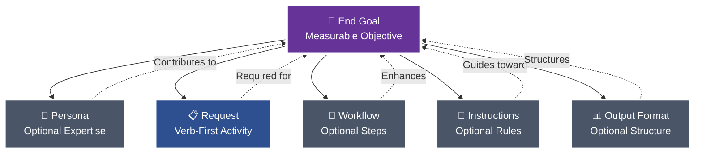
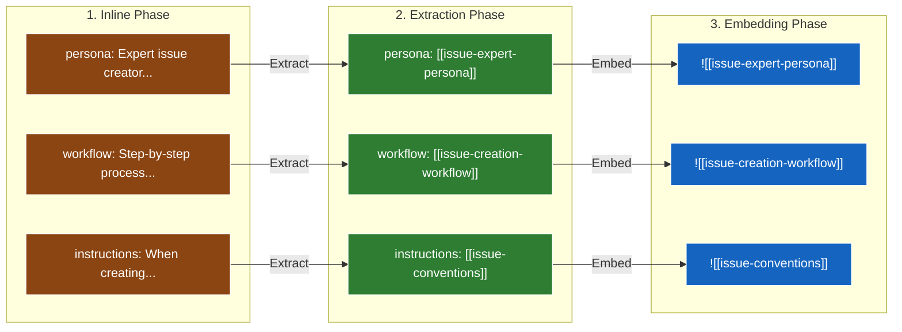
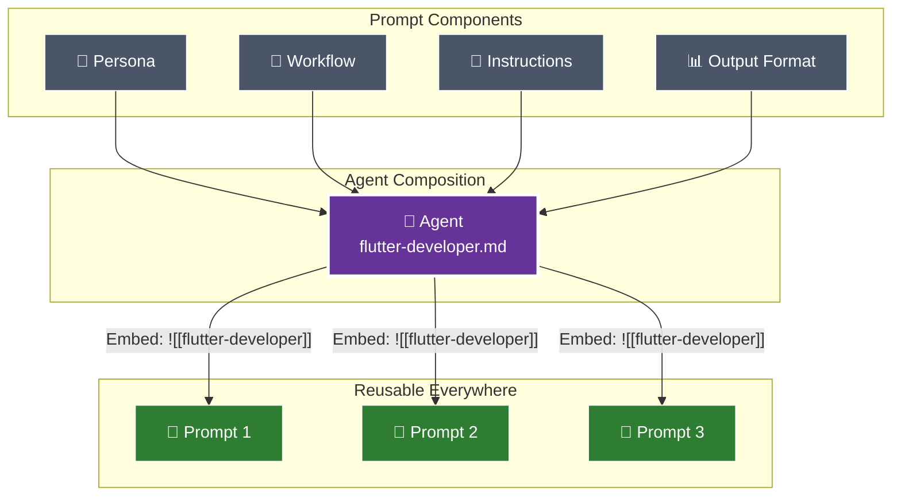
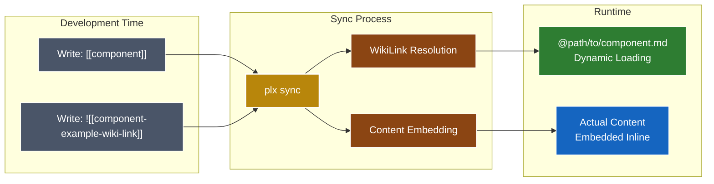

# ⚡ Pew Pew 🏗️ Workspace

[](https://github.com/its-brianwithai/pew-pew-workspace/releases/tag/v0.4.0)
[](https://opensource.org/licenses/MIT)
[](https://pewpewprompts.com)


> AI project management framework that systematically transforms requirements into production-ready artifacts through intelligent decomposition and component reuse.


## 🚀 Quick Start

Add the Pew Pew framework to any existing project with a single command:

```bash
rm -rf /tmp/pew-pew && git clone --depth 1 https://github.com/its-brianwithai/pew-pew-workspace.git /tmp/pew-pew && cd "$(pwd)" && for dir in agents prompts templates workflows instructions modes blocks output-formats personas scripts; do mkdir -p "$dir" && cp -r /tmp/pew-pew/"$dir"/* "$dir"/ 2>/dev/null || true; done && cp /tmp/pew-pew/plx.yaml . && ./scripts/claude-code/sync-claude-code.sh && rm -rf /tmp/pew-pew
```

This will:
1. Download all framework components into your current directory
2. Preserve your existing project files
3. Add the `.claude/` directory with all synced artifacts
4. Enable all `/plx:` commands in your project

## 📝 A Good Prompt

The foundation of this framework is understanding what makes an effective prompt. Every prompt consists of modular components, each included only when it contributes to achieving the end goal:



### Core Components

#### 🎯 **End Goal**
The measurable objective that determines whether any following section provides value. This is your north star - every component should improve your chances of achieving this goal exactly as intended.

#### 👤 **Persona** (Optional)
Specialized expertise attributes included when they enhance outcomes:
- Role, Expertise, Domain, Knowledge
- Experience, Skills, Abilities, Responsibilities
- Interests, Background, Preferences, Perspective
- Communication Style

#### 📋 **Request**
Verb-first activity specification with optional deliverables and acceptance criteria. Always starts with an action: Create, Update, Analyze, Transform, etc.

#### 🔄 **Workflow** (Optional)
Atomic steps with specific deliverables and acceptance criteria for each phase. Used when multi-step processes are required.

#### 📏 **Instructions** (Optional)
Event‑driven guidance following the pattern: "When {scenario} occurs, then {apply these instructions}".

Instruction categories and naming rules:
- Type → suffix → folder
    - Conventions → `-conventions.md` → `instructions/conventions/`
    - Best practices → `-best-practices.md` → `instructions/best-practices/`
    - Rules (always/never) → `-rules.md` → `instructions/rules/`
    - Tool-specific instructions (e.g., Maestro) → `-instructions.md` → `instructions/<tool>/` (e.g., `instructions/maestro/`)

4‑step rule for any new instruction:
1) Read existing docs to avoid duplication
2) Determine the type (convention | best‑practice | rule | tool‑instructions)
3) Rename file to match suffix exactly
4) Place in the correct folder under `instructions/`

#### 📊 **Output Format** (Optional)
Specifications for how deliverables should be structured - templates, format types (JSON, YAML, Markdown), or specific structural requirements.

### The Modular Approach

Each component can and should be extracted and referenced via wikilinks when it can be reused. During sync:
- `[[wikilinks]]` are transformed to `@path/to/file.md` for dynamic loading by Claude
- `![[embedded-wikilinks]]` are replaced with the actual file content inline




## 🤖 From Prompts to Agents

When certain prompt components naturally align around a common purpose, they can be composed into agents. Benefits:
- Use as **sub-agents** for specific tasks within larger workflows
- Activate directly via **`/act:<agent-name>`** commands
- **Reusable expertise** across all your prompts and projects



### Agent Composition
An agent combines:
- **Persona** - The expertise and characteristics
- **Workflow** - The systematic process
- **Instructions** - The rules and conventions
- **Output Format** - The delivery structure

## 📋 Templates and Blocks

Templates provide structured formats, while blocks offer reusable content sections:

### Templates
Complete document structures in `templates/`:
- Issue templates, story templates, epic templates
- Bug reports, pull requests, documentation
- Implementation plans, requirements, roadmaps

### Blocks
Reusable content sections in `blocks/`:
- Context blocks (capabilities, purpose, functions)
- Instruction blocks (best practices, rules, standards)
- Workflow blocks (steps, inputs, outputs)
- 40+ specialized blocks for comprehensive documentation

## 🎨 Core Philosophy: From Monolithic to Modular

**Evolution Path:** Inline → Extract → Modularize → Reuse

1. **Start Complete** - Solve the problem with everything inline first
2. **Identify Patterns** - Notice what gets repeated across solutions  
3. **Extract Components** - Move patterns to reusable files with wikilinks
4. **Systematic Refinement** - Simplify, Clarify, Improve, Expand, Reduce


## 🔗 WikiLink Architecture: Component Reusability

The framework leverages a sophisticated component referencing system:



### Standard WikiLinks: Dynamic Loading
```markdown
# In your artifact:
Follow [[project-conventions]] and use [[story-template]]

# After sync transformation:
Follow @instructions/project-conventions.md and use @templates/story-template.md

# Result: Claude automatically loads referenced files at runtime
```

### Embedded WikiLinks: Content Insertion
```markdown
# Reference mode (loads on activation):
Use the workflow in [[issue-workflow-example-wiki-link]]

# Embedding mode (content inserted during sync):
![[issue-workflow-example-wiki-link]]

# Note: Embedded wikilinks must occupy their own line
```

### Component Evolution Lifecycle
```markdown
1. Inline definition → Components defined within the artifact
2. File extraction → [[component-name-example-wiki-link]] references to external files
3. Agent composition → Combining persona, workflow, and instructions
4. Agent embedding → ![[agent-name-example-wiki-link]] inclusion in prompts
```


## 🎮 Commands & Usage

### Core Setup & Sync
```bash
# The sync process uses plx.yaml configuration for all paths
./scripts/claude-code/sync-claude-code.sh       # Sync to Claude Code
./scripts/claude-code/test-sync.sh              # Test sync in isolated environment
./scripts/claude-code/watch-claude-code.sh      # Auto-sync during development

# YAML configuration controls:
# - Source directories (sync_sources)
# - Target directories (sync_targets)
# - Pre-sync cleanup (delete_before_sync_targets)
# - Post-sync cleanup (delete_after_sync_targets)
```

### Claude Code Commands (After Sync)

| Command Type | Examples | Purpose |
|:------------|:---------|:--------|
| **Creation** | `/plx:create`, `/plx:create:issue` | Generate new artifacts from requirements |
| **Transformation** | `/plx:update`, `/plx:make`, `/plx:shard` | Modify and convert existing content |
| **Agents** | `/act:flutter:developer`, `/act:story:agent` | Activate specialized AI personas |
| **Workflows** | `/start:feature-workflow`, `/start:bug-workflow` | Launch multi-phase processes |
| **Components** | `/add:`, `/output:`, `/apply:`, `/use:` | Insert blocks, formats, instructions, templates |
| **Modes** | `/activate:<mode-name>` | Switch operational contexts |

### Sync Transformation

```mermaid
graph TD
    subgraph "Root Source"
        A1[agents/]
        P1[prompts/]
        T1[templates/]
        I1[instructions/]
        W1[workflows/]
        M1[modes/]
        B1[blocks/]
        O1[output-formats/]
        PE1[personas/]
    end
    
    subgraph "plx.yaml sync"
        SYNC[Sync Process<br/>WikiLink Resolution<br/>Content Distribution<br/>YAML-Configured Paths]
    end
    
    subgraph ".claude/ Destination"
        A2[.claude/agents/<br/>+<br/>.claude/commands/act/]
        P2[.claude/commands/plx/]
        T2[.claude/commands/use/]
        I2[.claude/commands/apply/]
        W2[.claude/commands/start/]
        M2[.claude/commands/activate/]
        B2[.claude/commands/add/]
        O2[.claude/commands/output/]
        PE2[.claude/commands/act/]
    end
    
    A1 --> SYNC
    P1 --> SYNC
    T1 --> SYNC
    I1 --> SYNC
    W1 --> SYNC
    M1 --> SYNC
    B1 --> SYNC
    O1 --> SYNC
    PE1 --> SYNC
    
    SYNC --> A2
    SYNC --> P2
    SYNC --> T2
    SYNC --> I2
    SYNC --> W2
    SYNC --> M2
    SYNC --> B2
    SYNC --> O2
    SYNC --> PE2
    
    style SYNC fill:#b8860b,stroke:#fff,stroke-width:3px,color:#fff
    style A1 fill:#4a5568,stroke:#fff,color:#fff
    style P1 fill:#4a5568,stroke:#fff,color:#fff
    style T1 fill:#4a5568,stroke:#fff,color:#fff
    style I1 fill:#4a5568,stroke:#fff,color:#fff
    style W1 fill:#4a5568,stroke:#fff,color:#fff
    style M1 fill:#4a5568,stroke:#fff,color:#fff
    style B1 fill:#4a5568,stroke:#fff,color:#fff
    style O1 fill:#4a5568,stroke:#fff,color:#fff
    style PE1 fill:#4a5568,stroke:#fff,color:#fff
    style A2 fill:#2e7d32,stroke:#fff,color:#fff
    style P2 fill:#2e7d32,stroke:#fff,color:#fff
    style T2 fill:#2e7d32,stroke:#fff,color:#fff
    style I2 fill:#2e7d32,stroke:#fff,color:#fff
    style W2 fill:#2e7d32,stroke:#fff,color:#fff
    style M2 fill:#2e7d32,stroke:#fff,color:#fff
    style B2 fill:#2e7d32,stroke:#fff,color:#fff
    style O2 fill:#2e7d32,stroke:#fff,color:#fff
    style PE2 fill:#2e7d32,stroke:#fff,color:#fff
```



## 💡 Key Principles

### 1. Requirement-Driven Development
Begin with functional requirements rather than artifact types - understand the objective before selecting the implementation.

### 2. Component Modularity
Define components once and reference them throughout the system via wikilinks for consistency and maintainability.

### 3. Progressive Enhancement
Evolution path: inline implementation → extracted components → composed agents → universal reusability.

### 4. Systematic Validation
Apply structured questioning methodology to validate and refine each component and decision.

### 5. Natural Agent Emergence
When persona, workflow, and instructions align organically around a common purpose, they naturally form a reusable agent.


## 🔧 Configuration: plx.yaml

The entire sync process is controlled by the `plx.yaml` configuration file:

```yaml
sync_sources:
  agents:
    - agents
  instructions:
    - instructions
  output-formats:
    - output-formats
  personas:
    - personas
  prompts:
    - prompts
  templates:
    - templates
  workflows:
    - workflows
  modes:
    - modes
  blocks:
    - blocks

delete_before_sync_targets:
  - .claude/agents
  - .claude/commands

delete_after_sync_targets: []

sync_targets:
  agents:
    - .claude/agents/
    - .claude/commands/act/
  personas:
    - .claude/commands/act/
  prompts:
    - .claude/commands/plx/
  templates:
    - .claude/commands/use/
  blocks:
    - .claude/commands/add/
  output-formats:
    - .claude/commands/output/
  instructions:
    - .claude/commands/apply/
  workflows:
    - .claude/commands/start/
  modes:
    - .claude/commands/activate/
```

### Sync Features

- **Automatic Cleanup**: Removes old `.claude/` directories before sync
- **WikiLink Resolution**: Converts `[[references]]` to `@path/to/file.md`
- **Content Embedding**: Replaces `![[embeds]]` with actual file content
- **Error Handling**: Comprehensive error handling with automatic cleanup
- **Temporary Directory Management**: Auto-removes empty tmp directories after sync

## 📂 File Structure Overview

The repository follows a clear modular structure:

```
pew-pew-workspace/
├── agents/               # AI agent definitions
├── prompts/              # Reusable prompts
├── templates/            # Document templates
├── workflows/            # Multi-step processes
├── instructions/         # Rules and conventions
│   ├── conventions/
│   ├── best-practices/
│   ├── rules/
│   └── <tool-specific>/
├── modes/                # Operational modes
├── blocks/               # Reusable content blocks
├── output-formats/       # Output format specifications
├── personas/             # Role definitions
├── scripts/              # Sync and utility scripts
│   └── claude-code/
│       ├── plx-yaml-parser.sh      # YAML configuration parser
│       ├── sync-claude-code.sh     # Main sync script
│       ├── test-sync.sh            # Test runner
│       └── sync-claude-code-*.sh   # Component sync scripts
├── .claude/              # Synced Claude Code artifacts
│   ├── agents/
│   └── commands/
│       ├── act/          # Agent & persona commands
│       ├── plx/          # Prompt commands
│       ├── use/          # Template commands
│       ├── add/          # Block commands
│       ├── output/       # Output format commands
│       ├── apply/        # Instruction commands
│       ├── start/        # Workflow commands
│       └── activate/     # Mode commands
├── plx.yaml              # Sync configuration
├── README.md             # This file
│
├── 00-freelancers/       # [Legacy] Individual specialist agents
├── 01-discovery-team/    # [Legacy] Research & ideation team
├── 02-context-team/      # [Legacy] Context gathering team
├── 03-requirements-team/ # [Legacy] Requirements specification team
├── 04-refinement-team/   # [Legacy] PRD & architecture team
├── 05-plan-team/         # [Legacy] Planning & roadmap team
├── 06-act-team/          # [Legacy] Development execution team
├── 07-review-team/       # [Legacy] Quality review team
└── 100-all-teams/        # [Legacy] Single-file team compilations
```

## 🏛️ Legacy Teams Structure

The `00-freelancers/` through `07-review-team/` directories contain the previous 7-phase team model:
- **Discovery → Context → Requirements → Refinement → Plan → Act → Review**
- Being extracted into modular components in the current framework
- Provides proven patterns for comprehensive project lifecycle management

## 📄 License

This project is licensed under the MIT License - see the [LICENSE](LICENSE) file for details.
