# ⚡ Pew Pew 🏗️ Workspace

[](https://opensource.org/licenses/MIT)
[](https://pewpewprompts.com)


> AI project management framework that systematically transforms requirements into production-ready artifacts through intelligent decomposition and component reuse.


## 📝 A Good Prompt

The foundation of this framework is understanding what makes an effective prompt. Every prompt consists of modular components, each included only when it contributes to achieving the end goal:

```mermaid
graph TD
    EG[🎯 End Goal<br/>Measurable Objective]
    
    P[👤 Persona<br/>Optional Expertise]
    R[📋 Request<br/>Verb-First Activity]
    W[🔄 Workflow<br/>Optional Steps]
    I[📏 Instructions<br/>Optional Rules]
    O[📊 Output Format<br/>Optional Structure]
    
    EG --> P
    EG --> R
    EG --> W
    EG --> I
    EG --> O
    
    P -.->|Contributes to| EG
    R -.->|Required for| EG
    W -.->|Enhances| EG
    I -.->|Guides toward| EG
    O -.->|Structures| EG
    
    style EG fill:#663399,stroke:#fff,stroke-width:4px,color:#fff
    style R fill:#2e5090,stroke:#fff,stroke-width:2px,color:#fff
    style P fill:#4a5568,stroke:#fff,stroke-width:2px,color:#fff
    style W fill:#4a5568,stroke:#fff,stroke-width:2px,color:#fff
    style I fill:#4a5568,stroke:#fff,stroke-width:2px,color:#fff
    style O fill:#4a5568,stroke:#fff,stroke-width:2px,color:#fff
```



### Core Components

#### 🎯 **End Goal**
The measurable objective that determines whether any following section provides value. This is your north star - every component should improve your chances of achieving this goal exactly as intended.

#### 👤 **Persona** (Optional)
Specialized expertise attributes included when they enhance outcomes:
- Role, Expertise, Domain, Knowledge
- Experience, Skills, Abilities, Responsibilities
- Interests, Background, Preferences, Perspective
- Communication Style

#### 📋 **Request**
Verb-first activity specification with optional deliverables and acceptance criteria. Always starts with an action: Create, Update, Analyze, Transform, etc.

#### 🔄 **Workflow** (Optional)
Atomic steps with specific deliverables and acceptance criteria for each phase. Used when multi-step processes are required.

#### 📏 **Instructions** (Optional)
Event‑driven guidance following the pattern: "When {scenario} occurs, then {apply these instructions}".

Instruction categories and naming rules:
- Type → suffix → folder
    - Conventions → `-conventions.md` → `instructions/conventions/`
    - Best practices → `-best-practices.md` → `instructions/best-practices/`
    - Rules (always/never) → `-rules.md` → `instructions/rules/`
    - Tool-specific instructions (e.g., Maestro) → `-instructions.md` → `instructions/<tool>/` (e.g., `instructions/maestro/`)

4‑step rule for any new instruction:
1) Read existing docs to avoid duplication
2) Determine the type (convention | best‑practice | rule | tool‑instructions)
3) Rename file to match suffix exactly
4) Place in the correct folder under `instructions/`

#### 📊 **Output Format** (Optional)
Specifications for how deliverables should be structured - templates, format types (JSON, YAML, Markdown), or specific structural requirements.

### The Modular Approach

Each component can and should be extracted and referenced via wikilinks when it can be reused:


During sync, the framework:
- Converts `[[references]]` to `@path/to/file.md` for dynamic loading
- Replaces `![[embeds]]` with actual file content
- Enables component reuse across all artifacts

## 🤖 From Prompts to Agents

When certain prompt components naturally align around a common purpose, they can be composed into agents:

```mermaid
graph TD
    subgraph "Prompt Components"
        P1[👤 Persona]
        W1[🔄 Workflow]
        I1[📏 Instructions]
        O1[📊 Output Format]
    end
    
    subgraph "Agent Composition"
        A[🤖 Agent<br/>flutter-developer.md]
    end
    
    subgraph "Reusable Everywhere"
        PR1[📝 Prompt 1]
        PR2[📝 Prompt 2]
        PR3[📝 Prompt 3]
    end
    
    P1 --> A
    W1 --> A
    I1 --> A
    O1 --> A
    
    A -->|"Embed: ![[flutter-developer]]"| PR1
    A -->|"Embed: ![[flutter-developer]]"| PR2
    A -->|"Embed: ![[flutter-developer]]"| PR3
    
    style A fill:#663399,stroke:#fff,stroke-width:3px,color:#fff
    style P1 fill:#4a5568,stroke:#fff,color:#fff
    style W1 fill:#4a5568,stroke:#fff,color:#fff
    style I1 fill:#4a5568,stroke:#fff,color:#fff
    style O1 fill:#4a5568,stroke:#fff,color:#fff
    style PR1 fill:#2e7d32,stroke:#fff,color:#fff
    style PR2 fill:#2e7d32,stroke:#fff,color:#fff
    style PR3 fill:#2e7d32,stroke:#fff,color:#fff
```



### Agent Composition
An agent combines:
- **Persona** - The expertise and characteristics
- **Workflow** - The systematic process
- **Instructions** - The rules and conventions
- **Output Format** - The delivery structure

## 📋 Templates and Blocks

Templates provide structured formats, while blocks offer reusable content sections:

### Templates
Complete document structures in `templates/outputs/`:
- Issue templates, story templates, epic templates
- Bug reports, pull requests, documentation
- Implementation plans, requirements, roadmaps

### Blocks
Reusable content sections in `templates/blocks/`:
- Context blocks (capabilities, purpose, functions)
- Instruction blocks (best practices, rules, standards)
- Workflow blocks (steps, inputs, outputs)
- 40+ specialized blocks for comprehensive documentation

## 🎨 Core Philosophy: From Monolithic to Modular

The framework's philosophy is based on natural evolution - we don't start by building components. We start by solving problems completely, then extract patterns:

### 1️⃣ **Start with Complete Solutions**
First, create a fully functional prompt with everything inline:
- Write the complete prompt with all components defined directly
- Focus on solving the immediate problem completely
- Don't worry about reusability initially
- Get it working first, optimize later

### 2️⃣ **Identify Reusable Patterns**
After creating several prompts, patterns emerge:
- Notice repeated personas across prompts
- Identify common workflows being duplicated
- Spot recurring instructions and conventions
- Recognize standard output formats

### 3️⃣ **Extract and Modularize**
Only after patterns prove their value:
- Extract repeated components to separate files
- Replace inline content with wikilink references
- Create agents when persona + workflow + instructions naturally align
- Build a library of reusable components from proven patterns

### 4️⃣ **Systematic Refinement**
Apply structured validation through targeted questioning:
- 🔄 **Simplify** - Can we reduce complexity?
- ❓ **Clarify** - Are requirements unambiguous?
- 🔧 **Improve** - What enhancements add value?
- ➕ **Expand** - What edge cases are missing?
- ➖ **Reduce** - What can be deferred to MVP?

## 🎮 Universal Creation Commands

The framework provides comprehensive artifact management through systematic commands:

### 🎨 `/plx:create`
Intelligently generates the appropriate artifact type based on requirements:
```markdown
Example: "Identify all actors in the project"
→ Generates: identify-actors.md prompt containing:
  - Actor identification workflow
  - Actor template output format
  - Systematic discovery methodology
```

### 🔄 `/plx:update`
Enhances existing artifacts to meet current standards:
- Analyzes current implementation against best practices
- Identifies improvement opportunities
- Applies modular enhancements
- Extracts reusable components

### 🔮 `/plx:make`
Transforms content between different formats:
- Raw text → Structured documentation
- Conceptual ideas → Actionable components
- Requirements → Implementation plans
- Conversations → Formal specifications

### 🧩 `/plx:shard`
Decomposes monolithic artifacts into modular components:
- Identifies reusable patterns
- Creates standalone component files
- Implements wikilink references
- Enables cross-artifact sharing

## 🔗 WikiLink Architecture: Component Reusability

The framework leverages a sophisticated component referencing system:

```mermaid
graph LR
    subgraph "Development Time"
        D1["Write: [[component]]"]
        D2["Write: ![[component-example-wiki-link]]"]
    end
    
    subgraph "Sync Process"
        S1[plx sync]
        S2[WikiLink Resolution]
        S3[Content Embedding]
    end
    
    subgraph "Runtime"
        R1[@path/to/component.md<br/>Dynamic Loading]
        R2[Actual Content<br/>Embedded Inline]
    end
    
    D1 --> S1
    D2 --> S1
    S1 --> S2
    S1 --> S3
    S2 --> R1
    S3 --> R2
    
    style D1 fill:#4a5568,stroke:#fff,color:#fff
    style D2 fill:#4a5568,stroke:#fff,color:#fff
    style S1 fill:#b8860b,stroke:#fff,stroke-width:2px,color:#fff
    style S2 fill:#8b4513,stroke:#fff,color:#fff
    style S3 fill:#8b4513,stroke:#fff,color:#fff
    style R1 fill:#2e7d32,stroke:#fff,color:#fff
    style R2 fill:#1565c0,stroke:#fff,color:#fff
```

### Standard WikiLinks: Dynamic Loading
```markdown
# In your artifact:
Follow [[project-conventions]] and use [[story-template]]

# After sync transformation:
Follow @instructions/project-conventions.md and use @templates/story-template.md

# Result: Claude automatically loads referenced files at runtime
```

### Embedded WikiLinks: Content Insertion
```markdown
# Reference mode (loads on activation):
Use the workflow in [[issue-workflow-example-wiki-link]]

# Embedding mode (content inserted during sync):
![[issue-workflow-example-wiki-link]]

# Note: Embedded wikilinks must occupy their own line
```

### Component Evolution Lifecycle
```markdown
1. Inline definition → Components defined within the artifact
2. File extraction → [[component-name-example-wiki-link]] references to external files
3. Agent composition → Combining persona, workflow, and instructions
4. Agent embedding → ![[agent-name-example-wiki-link]] inclusion in prompts
```


## 📋 Issue Management Philosophy

### Parallel AI Working Paths

Enable maximum productivity through strategic organization:

#### Team Structure
- **Tech** - Development and architecture
- **Marketing** - Content and engagement
- **Sales** - Customer relations and revenue

#### Subject-Based Parallel Work
Within each team, subjects advance independently:
- Each subject improves one at a time
- MVP must-have mindset for granular releases
- Global scale productivity across levels
- Non-interrupting workflows

### Question Mode Integration

Systematic refinement through YES/NO questions:
- **Simplify** - Reduce complexity suggestions
- **Clarify** - Validate understanding
- **Improve** - Enhancement opportunities
- **Expand** - Missing requirements
- **Reduce** - MVP analysis

## 🎮 Commands

### Core Framework Commands
```bash
make init              # Initialize framework
make sync claude       # Sync to Claude Code
make sync claude clean # Clean sync
make watch claude      # Auto-sync during development
make pull main         # Update framework
```

### Claude Code Commands (After Sync)

#### Creation Suite
- `/plx:create` - Transform desires into artifacts
- `/plx:create:issue` - Systematic issue documentation
- `/plx:create:story` - User stories with criteria
- `/plx:create:agent` - New AI agents
- `/plx:create:workflow` - Multi-step processes
- [...]

#### Transformation Suite
- `/plx:update` - Enhance existing artifacts
- `/plx:make` - Transform content types
- `/plx:shard` - Extract components
- `/plx:update:issue` - Refine existing issues
- `/plx:make:issue` - Convert content to issues
- [...]

#### Agent Commands
- `/act:flutter:developer` - Flutter expertise
- `/act:story:agent` - Story creation
- `/act:code:reviewer` - Code analysis
- [...]

#### Workflow Commands
- `/start:feature-workflow` - 6-phase feature development
- `/start:refinement-workflow` - 5-layer decomposition
- `/start:bug-workflow` - 4-phase bug resolution
- [...]

### Sync Transformation


## 💡 Key Principles

### 1. Requirement-Driven Development
Begin with functional requirements rather than artifact types - understand the objective before selecting the implementation.

### 2. Component Modularity
Define components once and reference them throughout the system via wikilinks for consistency and maintainability.

### 3. Progressive Enhancement
Evolution path: inline implementation → extracted components → composed agents → universal reusability.

### 4. Systematic Validation
Apply structured questioning methodology to validate and refine each component and decision.

### 5. Natural Agent Emergence
When persona, workflow, and instructions align organically around a common purpose, they naturally form a reusable agent.

## 🚦 Example: Creating an Issue

```bash
# Method 1: Direct creation
/plx:create:issue

# Method 2: Transform from notes
/plx:make:issue "Turn my meeting notes into an issue"

# Method 3: Update existing
/plx:update:issue "Enhance my draft issue"

# Method 4: From desire
/plx:create "I want to track a new feature"
```

Each method leverages the same modular components, demonstrating the framework's flexibility.

## 📚 Documentation

- **Prompts**: See `pew-pew-workspace/prompts/`
- **Agents**: See `pew-pew-workspace/agents/`
- **Templates**: See `pew-pew-workspace/templates/`
- **Workflows**: See `pew-pew-workspace/workflows/`
- **Output Formats**: See `pew-pew-workspace/output-formats/`
- **Instructions**: See `instructions/`
- **Modes**: See `modes/`
- **Teams**: See `pew-pew-teams/` for team-organized materials

# ⚡ Pew Pew Teams


## ✨ Core Philosophy: Agentic Teams & Context Engineering

This framework is built on two principles designed to overcome the common pitfalls of AI-assisted development:

1.  **Agentic Specialization:** Instead of a single, generalist AI, this framework provides a hierarchy of specialists. Each agent and team has a specific role, from high-level orchestrators to granular experts like a `requirements-agent` or `lead-developer-agent`. This division of labor ensures the right expertise is applied at the right time.

2.  **Context is King:** The biggest challenge in working with AI is context loss. This framework is engineered to solve that by leveraging Claude's file-linking capabilities. By giving agents direct, persistent access to project files, requirements, and architectural documents, we ensure they always have the information they need to perform their tasks accurately and consistently.

## 🏛️ The Structure: A Virtual Organization

Think of this repository as the organizational chart for your AI company. It's built on a clear hierarchy that allows you to engage at any level, from high-level strategy to detailed implementation.

### The Orchestration Model

The framework is orchestrated by a hierarchy of agents, with you at the top.


*   **You (The CEO):** You provide the high-level goal.
*   **The Team Orchestrator (`lead-orchestrator-agent.md`):** This agent understands the entire project lifecycle and routes your request to the correct Team Orchestrator.
*   **Team Orchestrators:** Each of the 7 teams has an orchestrator (e.g., `discovery-agent.md`). They manage the specialists within their team to complete a specific phase of the project.
*   **Specialist Agents:** These are the "doers" with specific skills (e.g., `idea-agent.md`, `prd-agent.md`). They execute granular tasks.

### Teams vs. Freelancers

*   **The Teams (`01-` to `07-`):** Seven specialized teams that guide a project through the development lifecycle, from research to review.
*   **The Freelancers (`00-freelancers`):** A collection of individual specialist agents (like Architect, Developer, Tester) that can be called upon for specific, ad-hoc tasks outside the main team workflow.

## 🌊 The Project Lifecycle: Meet the Teams

The framework guides a project through seven distinct phases, each managed by a dedicated team. This ensures a structured progression from concept to completion.


---

### 1. `01-research-team`
*   **Purpose:** To clarify initial ideas, brainstorm solutions, and conduct formal research. This team turns a vague concept into a well-defined problem statement.
*   **Agents:** `brainstorm-agent.md`, `idea-agent.md`, `prompt-engineer-agent.md`, `proposal-agent.md`, `research-agent.md`.

### 2. `02-context-team`
*   **Purpose:** To gather and document all necessary project context. This includes best practices, good and bad examples, personal preferences, and suggested approaches.
*   **Agents:** `bad-examples-agent.md`, `best-practices-agent.md`, `collection-agent.md`, `good-examples-agent.md`, `personal-preferences-agent.md`, `proposal-agent.md`, `prompt-engineer-agent.md`, `suggested-approach-agent.md`.

### 3. `03-requirements-team`
*   **Purpose:** To create detailed, granular, and testable requirements specifications. This team deconstructs an idea into its fundamental actors, activities, properties, and behaviors.
*   **Agents:** `activities-agent.md`, `actors-components-agent.md`, `behaviours-agent.md`, `properties-agent.md`, `proposal-agent.md`, `prompt-engineer-agent.md`, `scenarios-agent.md`.

### 4. `04-refinement-team`
*   **Purpose:** To formalize requirements into structured, industry-standard documents like a Product Requirements Document (PRD) and an Architecture Document.
*   **Agents:** `architecture-agent.md`, `prd-agent.md`, `prompt-engineer-agent.md`, `proposal-agent.md`, `ui-ux-design-agent.md`.

### 5. `05-plan-team`
*   **Purpose:** To break down refined requirements into actionable plans. This team creates the project roadmap, epics, user stories, and detailed development tasks.
*   **Agents:** `dev-plan-agent.md`, `epic-agent.md`, `proposal-agent.md`, `prompt-engineer-agent.md`, `roadmap-agent.md`, `story-agent.md`, `task-agent.md`.

### 6. `06-act-team`
*   **Purpose:** To execute the development plan. This team simulates the building of the feature and produces a detailed `result-report.md` documenting what was done.
*   **Agents:** `acceptance-test-agent.md`, `lead-developer-agent.md`, `proposal-agent.md`, `prompt-engineer-agent.md`, `result-report-agent.md`, `ui-ux-implementation-agent.md`, `unit-test-agent.md`.

### 7. `07-review-team`
*   **Purpose:** To review the completed work against all defined criteria to ensure quality. This team checks for adherence to acceptance criteria, quality standards, rules, and restrictions.
*   **Agents:** `acceptance-criteria-agent.md`, `code-review-agent.md`, `feedback-agent.md`, `proposal-agent.md`, `prompt-engineer-agent.md`, `quality-standards-agent.md`, `restrictions-agent.md`, `rules-agent.md`, `ui-ux-review-agent.md`.

---

## 🚀 Getting Started

1.  **Clone the Project:**
    ```bash
    git clone https://github.com/its-brianwithai/ultra-wide-turbo-workspace
    ```
2.  **Install the Commands:**
    Copy the team folders (`00-freelancers`, `01-research-team`, etc.) and the root `lead-orchestrator-agent.md` file into your `.claude/commands/` directory. This makes them available as commands in your IDE.

3.  **Configure Your Project Context:**
    Copy the `context.yaml` template to your project root and customize it with paths to your project's relevant files. Agents will automatically look for this file when working in your project.

4.  **Start a Conversation:**
    Start a chat with `@team-agent` in your IDE and describe what you want to do. It will guide you to the right team.

## 🧠 How to Use: The Power of Context

This framework is heavily optimized for Claude's ability to automatically read and incorporate file context. Understanding this is key to using the framework effectively.


### Automatic File Loading with `@` links
When you reference a file in a prompt using the syntax `@path/to/file.md` (without backticks), Claude automatically reads that file and includes its content in the context for the AI agents. This is a massive time-saver and the core mechanism for providing context.

### Dynamic vs. Static Context
*   **`@links` (Immediate Load):** Use the `@` prefix for files that provide essential, upfront context that the agent should *always* read at the start of a task.
*   **Regular Paths (On-Demand Load):** You can also include regular file paths in your instructions (e.g., "Please review `docs/old_spec.md`"). The agent is then instructed to read these files as needed, giving you more flexible control over the context.

### The `context.yaml` File
The framework uses a simplified context system. Place a `context.yaml` file in your project root to provide agents with relevant file paths. Each team can have its own list of files, and agents will automatically look for this file when working in your project.

Example structure:
```yaml
discovery_team:
  - src/docs/project-brief.md
  - requirements/initial-ideas.md

context_team:
  - docs/best-practices.md
  - examples/

# Add more teams and customize paths as needed
```

## 🛠️ Advanced Usage

### Using Freelancers
The `00-freelancers` directory contains a wide range of specialist agents you can call for ad-hoc tasks.
```
00-freelancers
├── architect
├── aso-expert
├── brainstormer
├── business-analyst
├── content-creator
├── developer
├── mvp-expert
├── project-manager
├── prompt-engineer
├── proposal-expert
├── researcher
├── tester
└── uiux-expert
```

### Creating Custom Agents for ChatGPT/Gemini
The `100-all-teams` directory contains single-file versions of each team's entire prompt library. You can copy the content of these files and paste it into the system prompt of a custom agent (like a ChatGPT GPT or a Gemini agent). This allows you to create powerful, specialized team agents on other platforms.

## 🔧 Maintenance & Contribution

Making changes to this framework across many files can be complex. To edit files in bulk while maintaining the relationships between them, we highly recommend using **[Repo Prompt](https://repoprompt.com/)**. It allows you to provide context from multiple files and apply changes across the entire repository in one go, which is ideal for maintaining a framework like this.


## 🙏 Acknowledgements

This repository and its concepts are heavily inspired by the pioneering work done in the **[BMAD-METHOD](https://github.com/bmadcode/BMAD-METHOD)** repository.

The BMAD-METHOD introduces a powerful two-phase approach for AI-assisted development that significantly reduces context loss. It consists of:
1.  **Agentic Planning:** Where dedicated agents collaborate to produce comprehensive and consistent planning documents (like PRDs and Architecture).
2.  **Context-Engineered Development:** Where a Scrum Master agent transforms those plans into hyper-detailed development stories, giving the development agent all the context it needs to build features correctly.

Our team-based framework builds on these ideas to create a structured, collaborative environment for AI agents. A big thank you to the creators for the inspiration!

## 📂 File Structure Overview

Here is a high-level overview of the repository structure:
```
.
├── 00-freelancers/       # Collection of individual specialist agents
├── 01-discovery-team/     # Team for idea clarification and research
│   ├── agents/
│   └── templates/
├── 02-context-team/       # Team for gathering project context
├── 03-requirements-team/  # Team for detailed requirements specification
├── 04-refinement-team/    # Team for creating PRDs and Architecture docs
├── 05-plan-team/          # Team for creating roadmaps, epics, and tasks
├── 06-act-team/           # Team for executing the plan
├── 07-review-team/        # Team for reviewing completed work
├── 100-all-teams/         # Single-file versions of teams for custom GPTs
├── README.md              # This file
└── lead-orchestrator-agent.md # The main entry point agent
```

## 📄 License

This project is licensed under the MIT License - see the [LICENSE](LICENSE) file for details.
