[](https://www.npmjs.com/package/pew-pew-plx)
[](https://opensource.org/licenses/MIT)
[](https://nodejs.org)
[](https://pewpewprompts.com)

# 🔫 Pew Pew 💨 Plx 🙏

> Advanced AI project management framework for Claude Code that systematically transforms requirements into production-ready artifacts through intelligent decomposition and component reuse.


## 🚀 Quick Start

```bash
# Install globally via npm
npm install -g pew-pew-plx

# From your project root (with plx.yaml discovered via ancestor or ~/plx/plx.yaml)
plx sync                 # Syncs using discovered config
# or pull then sync in one go
plx sync repo --repo https://github.com/user/repo.git --branch main --yes
```

That's it! You now have access to the complete artifact creation philosophy, specialized agents, smart templates, and intelligent workflows in Claude Code.

## 📝 A Good Prompt

The foundation of this framework is understanding what makes an effective prompt. Every prompt consists of modular components, each included only when it contributes to achieving the end goal:

```mermaid
graph TD
    EG[🎯 End Goal<br/>Measurable Objective]
    
    P[👤 Persona<br/>Optional Expertise]
    R[📋 Request<br/>Verb-First Activity]
    W[🔄 Workflow<br/>Optional Steps]
    I[📏 Instructions<br/>Optional Rules]
    O[📊 Output Format<br/>Optional Structure]
    
    EG --> P
    EG --> R
    EG --> W
    EG --> I
    EG --> O
    
    P -.->|Contributes to| EG
    R -.->|Required for| EG
    W -.->|Enhances| EG
    I -.->|Guides toward| EG
    O -.->|Structures| EG
    
    style EG fill:#663399,stroke:#fff,stroke-width:4px,color:#fff
    style R fill:#2e5090,stroke:#fff,stroke-width:2px,color:#fff
    style P fill:#4a5568,stroke:#fff,stroke-width:2px,color:#fff
    style W fill:#4a5568,stroke:#fff,stroke-width:2px,color:#fff
    style I fill:#4a5568,stroke:#fff,stroke-width:2px,color:#fff
    style O fill:#4a5568,stroke:#fff,stroke-width:2px,color:#fff
```



### Core Components

#### 🎯 **End Goal**
The measurable objective that determines whether any following section provides value. This is your north star - every component should improve your chances of achieving this goal exactly as intended.

#### 👤 **Persona** (Optional)
Specialized expertise attributes included when they enhance outcomes:
- Role, Expertise, Domain, Knowledge
- Experience, Skills, Abilities, Responsibilities
- Interests, Background, Preferences, Perspective
- Communication Style

#### 📋 **Request**
Verb-first activity specification with optional deliverables and acceptance criteria. Always starts with an action: Create, Update, Analyze, Transform, etc.

#### 🔄 **Workflow** (Optional)
Atomic steps with specific deliverables and acceptance criteria for each phase. Used when multi-step processes are required.

#### 📏 **Instructions** (Optional)
Event-driven guidance following the pattern: "When {scenario} occurs, then {apply these instructions}". Includes best practices, conventions, constraints, and rules.

#### 📊 **Output Format** (Optional)
Specifications for how deliverables should be structured - templates, format types (JSON, YAML, Markdown), or specific structural requirements.

### The Modular Approach

Each component can and should be extracted and referenced via wikilinks when it can be reused:


During sync, the framework:
- Converts `[[references]]` to `@path/to/file.md` for dynamic loading
- Replaces `![[embeds]]` with actual file content
- Enables component reuse across all artifacts

## 🤖 From Prompts to Agents

When certain prompt components naturally align around a common purpose, they can be composed into agents:

```mermaid
graph TD
    subgraph "Prompt Components"
        P1[👤 Persona]
        W1[🔄 Workflow]
        I1[📏 Instructions]
        O1[📊 Output Format]
    end
    
    subgraph "Agent Composition"
        A[🤖 Agent<br/>flutter-developer.md]
    end
    
    subgraph "Reusable Everywhere"
        PR1[📝 Prompt 1]
        PR2[📝 Prompt 2]
        PR3[📝 Prompt 3]
    end
    
    P1 --> A
    W1 --> A
    I1 --> A
    O1 --> A
    
    A -->|"Embed: ![[flutter-developer]]"| PR1
    A -->|"Embed: ![[flutter-developer]]"| PR2
    A -->|"Embed: ![[flutter-developer]]"| PR3
    
    style A fill:#663399,stroke:#fff,stroke-width:3px,color:#fff
    style P1 fill:#4a5568,stroke:#fff,color:#fff
    style W1 fill:#4a5568,stroke:#fff,color:#fff
    style I1 fill:#4a5568,stroke:#fff,color:#fff
    style O1 fill:#4a5568,stroke:#fff,color:#fff
    style PR1 fill:#2e7d32,stroke:#fff,color:#fff
    style PR2 fill:#2e7d32,stroke:#fff,color:#fff
    style PR3 fill:#2e7d32,stroke:#fff,color:#fff
```



### Agent Composition
An agent combines:
- **Persona** - The expertise and characteristics
- **Workflow** - The systematic process
- **Instructions** - The rules and conventions
- **Output Format** - The delivery structure

## 📋 Templates and Blocks

Templates provide structured formats, while blocks offer reusable content sections:

### Templates
Complete document structures in `templates/outputs/`:
- Issue templates, story templates, epic templates
- Bug reports, pull requests, documentation
- Implementation plans, requirements, roadmaps

### Blocks
Reusable content sections in `templates/blocks/`:
- Context blocks (capabilities, purpose, functions)
- Instruction blocks (best practices, rules, standards)
- Workflow blocks (steps, inputs, outputs)
- 40+ specialized blocks for comprehensive documentation

## 🎨 Core Philosophy: From Monolithic to Modular

The framework's philosophy is based on natural evolution - we don't start by building components. We start by solving problems completely, then extract patterns:

### 1️⃣ **Start with Complete Solutions**
First, create a fully functional prompt with everything inline:
- Write the complete prompt with all components defined directly
- Focus on solving the immediate problem completely
- Don't worry about reusability initially
- Get it working first, optimize later

### 2️⃣ **Identify Reusable Patterns**
After creating several prompts, patterns emerge:
- Notice repeated personas across prompts
- Identify common workflows being duplicated
- Spot recurring instructions and conventions
- Recognize standard output formats

### 3️⃣ **Extract and Modularize**
Only after patterns prove their value:
- Extract repeated components to separate files
- Replace inline content with wikilink references
- Create agents when persona + workflow + instructions naturally align
- Build a library of reusable components from proven patterns

### 4️⃣ **Systematic Refinement**
Apply structured validation through targeted questioning:
- 🔄 **Simplify** - Can we reduce complexity?
- ❓ **Clarify** - Are requirements unambiguous?
- 🔧 **Improve** - What enhancements add value?
- ➕ **Expand** - What edge cases are missing?
- ➖ **Reduce** - What can be deferred to MVP?

## 🎮 Universal Creation Commands

The framework provides comprehensive artifact management through systematic commands:

### 🎨 `/plx:create/anything`
Intelligently generates the appropriate artifact type based on requirements:
```markdown
Example: "Identify all actors in the project"
→ Generates: identify-actors.md prompt containing:
  - Actor identification workflow
  - Actor template output format
  - Systematic discovery methodology
```

### 🔄 `/plx:update/anything`
Enhances existing artifacts to meet current standards:
- Analyzes current implementation against best practices
- Identifies improvement opportunities
- Applies modular enhancements
- Extracts reusable components

### 🔮 `/plx:make/anything`
Transforms content between different formats:
- Raw text → Structured documentation
- Conceptual ideas → Actionable components
- Requirements → Implementation plans
- Conversations → Formal specifications

### 🧩 `/plx:shard/anything`
Decomposes monolithic artifacts into modular components:
- Identifies reusable patterns
- Creates standalone component files
- Implements wikilink references
- Enables cross-artifact sharing

## 🔗 WikiLink Architecture: Component Reusability

The framework leverages a sophisticated component referencing system:

```mermaid
graph LR
    subgraph "Development Time"
        D1["Write: [[component]]"]
        D2["Write: ![[component-example-wiki-link]]"]
    end
    
    subgraph "Sync Process"
        S1[plx sync]
        S2[WikiLink Resolution]
        S3[Content Embedding]
    end
    
    subgraph "Runtime"
        R1[@path/to/component.md<br/>Dynamic Loading]
        R2[Actual Content<br/>Embedded Inline]
    end
    
    D1 --> S1
    D2 --> S1
    S1 --> S2
    S1 --> S3
    S2 --> R1
    S3 --> R2
    
    style D1 fill:#4a5568,stroke:#fff,color:#fff
    style D2 fill:#4a5568,stroke:#fff,color:#fff
    style S1 fill:#b8860b,stroke:#fff,stroke-width:2px,color:#fff
    style S2 fill:#8b4513,stroke:#fff,color:#fff
    style S3 fill:#8b4513,stroke:#fff,color:#fff
    style R1 fill:#2e7d32,stroke:#fff,color:#fff
    style R2 fill:#1565c0,stroke:#fff,color:#fff
```

### Standard WikiLinks: Dynamic Loading
```markdown
# In your artifact:
Follow [[project-conventions]] and use [[story-template]]

# After sync transformation:
Follow @instructions/project-conventions.md and use @templates/story-template.md

# Result: Claude automatically loads referenced files at runtime
```

### Embedded WikiLinks: Content Insertion
```markdown
# Reference mode (loads on activation):
Use the workflow in [[issue-workflow-example-wiki-link]]

# Embedding mode (content inserted during sync):
![[issue-workflow-example-wiki-link]]

# Note: Embedded wikilinks must occupy their own line
```

### Component Evolution Lifecycle
```markdown
1. Inline definition → Components defined within the artifact
2. File extraction → [[component-name-example-wiki-link]] references to external files
3. Agent composition → Combining persona, workflow, and instructions
4. Agent embedding → ![[agent-name-example-wiki-link]] inclusion in prompts
```


## 📋 Issue Management Philosophy

### Parallel AI Working Paths

Enable maximum productivity through strategic organization:

#### Team Structure
- **Tech** - Development and architecture
- **Marketing** - Content and engagement
- **Sales** - Customer relations and revenue

#### Subject-Based Parallel Work
Within each team, subjects advance independently:
- Each subject improves one at a time
- MVP must-have mindset for granular releases
- Global scale productivity across levels
- Non-interrupting workflows

### Question Mode Integration

Systematic refinement through YES/NO questions:
- **Simplify** - Reduce complexity suggestions
- **Clarify** - Validate understanding
- **Improve** - Enhancement opportunities
- **Expand** - Missing requirements
- **Reduce** - MVP analysis

## 🎮 Commands

### Core Framework Commands (CLI)
```bash
plx pull repo --repo <url> --branch main [--yes]   # Pull files into CWD (asks to confirm unless --yes)
plx sync                                          # Sync using discovered config (alias of `plx sync repo`)
plx sync repo --repo <url> --branch main [--yes]  # Pull (optional) then sync
plx set tasks --field tasks.target.primary --value path/to/tasks.md [--global]
plx set tasks --field tasks.sources.next --value path/to/extra.md,another.md [--global]
plx set tasks --field tasks.target.paste --value path/to/tasks.md [--global]
plx paste tasks [--overwrite|--append|--insert] [--path <file>]
plx next task
plx reset tasks
```

### Tasks configuration (plx.yaml)
```yaml
tasks:
  target:
    primary: "path/to/tasks.md"   # REQUIRED: default checklist file
    paste: "path/to/tasks.md"     # OPTIONAL: default paste target (falls back to primary)
  sources:
    next:                          # when advancing, consider these files in order
      - path/to/extra.md
      - another.md
  marker: "👉"                      # current-task marker
updates:
  lastUpdateCheckTimestamp: 0       # epoch millis to throttle CLI self-update checks
```

### Claude Code Commands (After Sync)

#### Creation Suite
- `/plx:create/anything` - Transform desires into artifacts
- `/plx:create/issue` - Systematic issue documentation
- `/plx:create/story` - User stories with criteria
- `/plx:create/agent` - New AI agents
- `/plx:create/workflow` - Multi-step processes

#### Transformation Suite  
- `/plx:update/anything` - Enhance existing artifacts
- `/plx:make/anything` - Transform content types
- `/plx:shard/anything` - Extract components
- `/plx:update/issue` - Refine existing issues
- `/plx:make/issue` - Convert content to issues

#### Agent Commands
- `/act:flutter/developer` - Flutter expertise
- `/act:story/agent` - Story creation
- `/act:code/reviewer` - Code analysis

#### Workflow Commands
- `/start:feature-workflow` - 6-phase feature development
- `/start:refinement-workflow` - 5-layer decomposition
- `/start:bug-workflow` - 4-phase bug resolution

## 🏗️ Architecture

### Directory Structure
```
pew-pew-plx/
├── pew-pew-workspace/  # Primary source content for sync
│   ├── agents/         # Specialized AI agents organized by category
│   ├── prompts/        # Quick-action commands
│   ├── templates/      # Document templates (outputs + blocks)
│   ├── workflows/      # Multi-step processes
│   ├── output-formats/ # Response format specifications
│   └── scripts/        # Sync and utility scripts (claude-code/*)
├── pew-pew-teams/      # Upstream team content (00-…-07…, 100-all-teams)
├── instructions/       # Conventions and rules
│   ├── best-practices/
│   ├── conventions/
│   └── rules/
├── modes/              # Behavioral modifications
│   └── question-mode.md
├── issues/             # Issue management (not synced)
│   ├── configuration/
│   ├── tech/
│   └── workflows/
└── plx.yaml            # Sync/configuration root
```

### Sync Transformation


## 💡 Key Principles

### 1. Requirement-Driven Development
Begin with functional requirements rather than artifact types - understand the objective before selecting the implementation.

### 2. Component Modularity
Define components once and reference them throughout the system via wikilinks for consistency and maintainability.

### 3. Progressive Enhancement
Evolution path: inline implementation → extracted components → composed agents → universal reusability.

### 4. Systematic Validation
Apply structured questioning methodology to validate and refine each component and decision.

### 5. Natural Agent Emergence
When persona, workflow, and instructions align organically around a common purpose, they naturally form a reusable agent.

## 🚦 Example: Creating an Issue

```bash
# Method 1: Direct creation
/plx:create/issue

# Method 2: Transform from notes
/plx:make/issue "Turn my meeting notes into an issue"

# Method 3: Update existing
/plx:update/issue "Enhance my draft issue"

# Method 4: From desire
/plx:create/anything "I want to track a new feature"
```

Each method leverages the same modular components, demonstrating the framework's flexibility.

## 📚 Documentation

- **Prompts**: See `pew-pew-workspace/prompts/`
- **Agents**: See `pew-pew-workspace/agents/`
- **Templates**: See `pew-pew-workspace/templates/`
- **Workflows**: See `pew-pew-workspace/workflows/`
- **Output Formats**: See `pew-pew-workspace/output-formats/`
- **Instructions**: See `instructions/`
- **Modes**: See `modes/`
- **Teams**: See `pew-pew-teams/` for team-organized materials

## 🤝 Contributing

We welcome contributions! The framework itself follows its own philosophy:

1. Start with a desire (what do you want to DO?)
2. Create components following templates
3. Extract shareable pieces
4. Test with question-mode refinement
5. Submit PR with clear documentation

## 📄 License

MIT License - see [LICENSE](LICENSE) for details

## 🔗 Links

- **Website**: [pewpewprompts.com](https://pewpewprompts.com)
- **Repository**: [GitHub](https://github.com/its-brianwithai/pew-pew-plx)
- **npm Package**: [pew-pew-plx](https://www.npmjs.com/package/pew-pew-plx)
- **Issues**: [GitHub Issues](https://github.com/its-brianwithai/pew-pew-plx/issues)

---

<p align="center">Made with ❤️ by the Pew Pew team</p>
<p align="center">⭐ Star us on GitHub if this helps your workflow!</p>
