# ⚡ Pew Pew 🏗️ Workspace

[](https://opensource.org/licenses/MIT)
[](https://pewpewprompts.com)


> AI project management framework that systematically transforms requirements into production-ready artifacts through intelligent decomposition and component reuse.


## 🚀 Quick Start

Add the Pew Pew framework to any existing project with a single command:

```bash
curl -sL https://raw.githubusercontent.com/yourusername/pew-pew-workspace/main/install.sh | bash
```

Or manually download and set up:

```bash
# Download framework files to your current project
curl -L https://github.com/yourusername/pew-pew-workspace/archive/main.tar.gz | \
tar -xz --strip-components=1 pew-pew-workspace-main/{agents,prompts,templates,workflows,instructions,modes,blocks,output-formats,personas,scripts,plx.yaml} && \
./scripts/claude-code/sync-claude-code.sh
```

This will:
1. Download all framework components into your current directory
2. Preserve your existing project files
3. Add the `.claude/` directory with all synced artifacts
4. Enable all `/plx:` commands in your project

## 📝 A Good Prompt

The foundation of this framework is understanding what makes an effective prompt. Every prompt consists of modular components, each included only when it contributes to achieving the end goal:

```mermaid
graph TD
    EG[🎯 End Goal<br/>Measurable Objective]
    
    P[👤 Persona<br/>Optional Expertise]
    R[📋 Request<br/>Verb-First Activity]
    W[🔄 Workflow<br/>Optional Steps]
    I[📏 Instructions<br/>Optional Rules]
    O[📊 Output Format<br/>Optional Structure]
    
    EG --> P
    EG --> R
    EG --> W
    EG --> I
    EG --> O
    
    P -.->|Contributes to| EG
    R -.->|Required for| EG
    W -.->|Enhances| EG
    I -.->|Guides toward| EG
    O -.->|Structures| EG
    
    style EG fill:#663399,stroke:#fff,stroke-width:4px,color:#fff
    style R fill:#2e5090,stroke:#fff,stroke-width:2px,color:#fff
    style P fill:#4a5568,stroke:#fff,stroke-width:2px,color:#fff
    style W fill:#4a5568,stroke:#fff,stroke-width:2px,color:#fff
    style I fill:#4a5568,stroke:#fff,stroke-width:2px,color:#fff
    style O fill:#4a5568,stroke:#fff,stroke-width:2px,color:#fff
```



### Core Components

#### 🎯 **End Goal**
The measurable objective that determines whether any following section provides value. This is your north star - every component should improve your chances of achieving this goal exactly as intended.

#### 👤 **Persona** (Optional)
Specialized expertise attributes included when they enhance outcomes:
- Role, Expertise, Domain, Knowledge
- Experience, Skills, Abilities, Responsibilities
- Interests, Background, Preferences, Perspective
- Communication Style

#### 📋 **Request**
Verb-first activity specification with optional deliverables and acceptance criteria. Always starts with an action: Create, Update, Analyze, Transform, etc.

#### 🔄 **Workflow** (Optional)
Atomic steps with specific deliverables and acceptance criteria for each phase. Used when multi-step processes are required.

#### 📏 **Instructions** (Optional)
Event‑driven guidance following the pattern: "When {scenario} occurs, then {apply these instructions}".

Instruction categories and naming rules:
- Type → suffix → folder
    - Conventions → `-conventions.md` → `instructions/conventions/`
    - Best practices → `-best-practices.md` → `instructions/best-practices/`
    - Rules (always/never) → `-rules.md` → `instructions/rules/`
    - Tool-specific instructions (e.g., Maestro) → `-instructions.md` → `instructions/<tool>/` (e.g., `instructions/maestro/`)

4‑step rule for any new instruction:
1) Read existing docs to avoid duplication
2) Determine the type (convention | best‑practice | rule | tool‑instructions)
3) Rename file to match suffix exactly
4) Place in the correct folder under `instructions/`

#### 📊 **Output Format** (Optional)
Specifications for how deliverables should be structured - templates, format types (JSON, YAML, Markdown), or specific structural requirements.

### The Modular Approach

Each component can and should be extracted and referenced via wikilinks when it can be reused:


During sync, the framework:
- Converts `[[references]]` to `@path/to/file.md` for dynamic loading
- Replaces `![[embeds]]` with actual file content
- Enables component reuse across all artifacts

## 🤖 From Prompts to Agents

When certain prompt components naturally align around a common purpose, they can be composed into agents:

```mermaid
graph TD
    subgraph "Prompt Components"
        P1[👤 Persona]
        W1[🔄 Workflow]
        I1[📏 Instructions]
        O1[📊 Output Format]
    end
    
    subgraph "Agent Composition"
        A[🤖 Agent<br/>flutter-developer.md]
    end
    
    subgraph "Reusable Everywhere"
        PR1[📝 Prompt 1]
        PR2[📝 Prompt 2]
        PR3[📝 Prompt 3]
    end
    
    P1 --> A
    W1 --> A
    I1 --> A
    O1 --> A
    
    A -->|"Embed: ![[flutter-developer]]"| PR1
    A -->|"Embed: ![[flutter-developer]]"| PR2
    A -->|"Embed: ![[flutter-developer]]"| PR3
    
    style A fill:#663399,stroke:#fff,stroke-width:3px,color:#fff
    style P1 fill:#4a5568,stroke:#fff,color:#fff
    style W1 fill:#4a5568,stroke:#fff,color:#fff
    style I1 fill:#4a5568,stroke:#fff,color:#fff
    style O1 fill:#4a5568,stroke:#fff,color:#fff
    style PR1 fill:#2e7d32,stroke:#fff,color:#fff
    style PR2 fill:#2e7d32,stroke:#fff,color:#fff
    style PR3 fill:#2e7d32,stroke:#fff,color:#fff
```



### Agent Composition
An agent combines:
- **Persona** - The expertise and characteristics
- **Workflow** - The systematic process
- **Instructions** - The rules and conventions
- **Output Format** - The delivery structure

## 📋 Templates and Blocks

Templates provide structured formats, while blocks offer reusable content sections:

### Templates
Complete document structures in `templates/`:
- Issue templates, story templates, epic templates
- Bug reports, pull requests, documentation
- Implementation plans, requirements, roadmaps

### Blocks
Reusable content sections in `blocks/`:
- Context blocks (capabilities, purpose, functions)
- Instruction blocks (best practices, rules, standards)
- Workflow blocks (steps, inputs, outputs)
- 40+ specialized blocks for comprehensive documentation

## 🎨 Core Philosophy: From Monolithic to Modular

The framework's philosophy is based on natural evolution - we don't start by building components. We start by solving problems completely, then extract patterns:

### 1️⃣ **Start with Complete Solutions**
First, create a fully functional prompt with everything inline:
- Write the complete prompt with all components defined directly
- Focus on solving the immediate problem completely
- Don't worry about reusability initially
- Get it working first, optimize later

### 2️⃣ **Identify Reusable Patterns**
After creating several prompts, patterns emerge:
- Notice repeated personas across prompts
- Identify common workflows being duplicated
- Spot recurring instructions and conventions
- Recognize standard output formats

### 3️⃣ **Extract and Modularize**
Only after patterns prove their value:
- Extract repeated components to separate files
- Replace inline content with wikilink references
- Create agents when persona + workflow + instructions naturally align
- Build a library of reusable components from proven patterns

### 4️⃣ **Systematic Refinement**
Apply structured validation through targeted questioning:
- 🔄 **Simplify** - Can we reduce complexity?
- ❓ **Clarify** - Are requirements unambiguous?
- 🔧 **Improve** - What enhancements add value?
- ➕ **Expand** - What edge cases are missing?
- ➖ **Reduce** - What can be deferred to MVP?

## 🎮 Universal Creation Commands

The framework provides comprehensive artifact management through systematic commands:

### 🎨 `/plx:create`
Intelligently generates the appropriate artifact type based on requirements:
```markdown
Example: "Identify all actors in the project"
→ Generates: identify-actors.md prompt containing:
  - Actor identification workflow
  - Actor template output format
  - Systematic discovery methodology
```

### 🔄 `/plx:update`
Enhances existing artifacts to meet current standards:
- Analyzes current implementation against best practices
- Identifies improvement opportunities
- Applies modular enhancements
- Extracts reusable components

### 🔮 `/plx:make`
Transforms content between different formats:
- Raw text → Structured documentation
- Conceptual ideas → Actionable components
- Requirements → Implementation plans
- Conversations → Formal specifications

### 🧩 `/plx:shard`
Decomposes monolithic artifacts into modular components:
- Identifies reusable patterns
- Creates standalone component files
- Implements wikilink references
- Enables cross-artifact sharing

## 🔗 WikiLink Architecture: Component Reusability

The framework leverages a sophisticated component referencing system:


### Standard WikiLinks: Dynamic Loading
```markdown
# In your artifact:
Follow [[project-conventions]] and use [[story-template]]

# After sync transformation:
Follow @instructions/project-conventions.md and use @templates/story-template.md

# Result: Claude automatically loads referenced files at runtime
```

### Embedded WikiLinks: Content Insertion
```markdown
# Reference mode (loads on activation):
Use the workflow in [[issue-workflow-example-wiki-link]]

# Embedding mode (content inserted during sync):
![[issue-workflow-example-wiki-link]]

# Note: Embedded wikilinks must occupy their own line
```

### Component Evolution Lifecycle
```markdown
1. Inline definition → Components defined within the artifact
2. File extraction → [[component-name-example-wiki-link]] references to external files
3. Agent composition → Combining persona, workflow, and instructions
4. Agent embedding → ![[agent-name-example-wiki-link]] inclusion in prompts
```


## 📋 Issue Management Philosophy

### Parallel AI Working Paths

Enable maximum productivity through strategic organization:

#### Team Structure
- **Tech** - Development and architecture
- **Marketing** - Content and engagement
- **Sales** - Customer relations and revenue

#### Subject-Based Parallel Work
Within each team, subjects advance independently:
- Each subject improves one at a time
- MVP must-have mindset for granular releases
- Global scale productivity across levels
- Non-interrupting workflows

### Question Mode Integration

Systematic refinement through YES/NO questions:
- **Simplify** - Reduce complexity suggestions
- **Clarify** - Validate understanding
- **Improve** - Enhancement opportunities
- **Expand** - Missing requirements
- **Reduce** - MVP analysis

## 🎮 Commands

### Core Framework Commands
```bash
# The sync process uses plx.yaml configuration for all paths
./scripts/claude-code/sync-claude-code.sh       # Sync to Claude Code
./scripts/claude-code/test-sync.sh              # Test sync in isolated environment
./scripts/claude-code/watch-claude-code.sh      # Auto-sync during development

# YAML configuration controls:
# - Source directories (sync_sources)
# - Target directories (sync_targets)
# - Pre-sync cleanup (delete_before_sync_targets)
# - Post-sync cleanup (delete_after_sync_targets)
```

### Claude Code Commands (After Sync)

#### Creation Suite
- `/plx:create` - Transform desires into artifacts
- `/plx:create:issue` - Systematic issue documentation
- `/plx:create:story` - User stories with criteria
- `/plx:create:agent` - New AI agents
- `/plx:create:workflow` - Multi-step processes
- [...]

#### Transformation Suite
- `/plx:update` - Enhance existing artifacts
- `/plx:make` - Transform content types
- `/plx:shard` - Extract components
- `/plx:update:issue` - Refine existing issues
- `/plx:make:issue` - Convert content to issues
- [...]

#### Agent Commands
- `/act:flutter:developer` - Flutter expertise
- `/act:story:agent` - Story creation
- `/act:code:reviewer` - Code analysis
- [...]

#### Workflow Commands
- `/start:feature-workflow` - 6-phase feature development
- `/start:refinement-workflow` - 5-layer decomposition
- `/start:bug-workflow` - 4-phase bug resolution
- [...]

#### Additional Commands
- `/add:<block-name>` - Insert reusable blocks
- `/output:<format-name>` - Apply output formats
- `/activate:<mode-name>` - Activate operational modes
- `/apply:<instruction-name>` - Apply instructions
- `/use:<template-name>` - Use templates

### Sync Transformation


## 💡 Key Principles

### 1. Requirement-Driven Development
Begin with functional requirements rather than artifact types - understand the objective before selecting the implementation.

### 2. Component Modularity
Define components once and reference them throughout the system via wikilinks for consistency and maintainability.

### 3. Progressive Enhancement
Evolution path: inline implementation → extracted components → composed agents → universal reusability.

### 4. Systematic Validation
Apply structured questioning methodology to validate and refine each component and decision.

### 5. Natural Agent Emergence
When persona, workflow, and instructions align organically around a common purpose, they naturally form a reusable agent.

## 🚦 Example: Creating an Issue

```bash
# Method 1: Direct creation
/plx:create:issue

# Method 2: Transform from notes
/plx:make:issue "Turn my meeting notes into an issue"

# Method 3: Update existing
/plx:update:issue "Enhance my draft issue"

# Method 4: From desire
/plx:create "I want to track a new feature"
```

Each method leverages the same modular components, demonstrating the framework's flexibility.

## 📚 Documentation

- **Prompts**: See `prompts/`
- **Agents**: See `agents/`
- **Templates**: See `templates/`
- **Workflows**: See `workflows/`
- **Output Formats**: See `output-formats/`
- **Instructions**: See `instructions/`
- **Modes**: See `modes/`
- **Blocks**: See `blocks/`
- **Personas**: See `personas/`
- **Configuration**: See `plx.yaml` for sync configuration

## 🔧 Configuration: plx.yaml

The entire sync process is controlled by the `plx.yaml` configuration file:

```yaml
sync_sources:
  agents:
    - agents
  instructions:
    - instructions
  output-formats:
    - output-formats
  personas:
    - personas
  prompts:
    - prompts
  templates:
    - templates
  workflows:
    - workflows
  modes:
    - modes
  blocks:
    - blocks

delete_before_sync_targets:
  - .claude/agents
  - .claude/commands

delete_after_sync_targets: []

sync_targets:
  agents:
    - .claude/agents/
    - .claude/commands/act/
  personas:
    - .claude/commands/act/
  prompts:
    - .claude/commands/plx/
  templates:
    - .claude/commands/use/
  blocks:
    - .claude/commands/add/
  output-formats:
    - .claude/commands/output/
  instructions:
    - .claude/commands/apply/
  workflows:
    - .claude/commands/start/
  modes:
    - .claude/commands/activate/
```

### Sync Features

- **Automatic Cleanup**: Removes old `.claude/` directories before sync
- **WikiLink Resolution**: Converts `[[references]]` to `@path/to/file.md`
- **Content Embedding**: Replaces `![[embeds]]` with actual file content
- **Error Handling**: Comprehensive error handling with automatic cleanup
- **Temporary Directory Management**: Auto-removes empty tmp directories after sync

## 📂 File Structure Overview

The repository follows a clear modular structure:

```
pew-pew-workspace/
├── agents/               # AI agent definitions
├── prompts/              # Reusable prompts
├── templates/            # Document templates
├── workflows/            # Multi-step processes
├── instructions/         # Rules and conventions
│   ├── conventions/
│   ├── best-practices/
│   ├── rules/
│   └── <tool-specific>/
├── modes/                # Operational modes
├── blocks/               # Reusable content blocks
├── output-formats/       # Output format specifications
├── personas/             # Role definitions
├── scripts/              # Sync and utility scripts
│   └── claude-code/
│       ├── plx-yaml-parser.sh      # YAML configuration parser
│       ├── sync-claude-code.sh     # Main sync script
│       ├── test-sync.sh            # Test runner
│       └── sync-claude-code-*.sh   # Component sync scripts
├── .claude/              # Synced Claude Code artifacts
│   ├── agents/
│   └── commands/
│       ├── act/          # Agent & persona commands
│       ├── plx/          # Prompt commands
│       ├── use/          # Template commands
│       ├── add/          # Block commands
│       ├── output/       # Output format commands
│       ├── apply/        # Instruction commands
│       ├── start/        # Workflow commands
│       └── activate/     # Mode commands
├── plx.yaml              # Sync configuration
├── README.md             # This file
│
├── 00-freelancers/       # [Legacy] Individual specialist agents
├── 01-discovery-team/    # [Legacy] Research & ideation team
├── 02-context-team/      # [Legacy] Context gathering team
├── 03-requirements-team/ # [Legacy] Requirements specification team
├── 04-refinement-team/   # [Legacy] PRD & architecture team
├── 05-plan-team/         # [Legacy] Planning & roadmap team
├── 06-act-team/          # [Legacy] Development execution team
├── 07-review-team/       # [Legacy] Quality review team
└── 100-all-teams/        # [Legacy] Single-file team compilations
```

## 🏛️ Legacy Teams Structure (Being Refined)

The repository contains a comprehensive teams-based structure from the previous iteration, which serves as valuable input for refining the current modular approach. This structure demonstrates a complete project lifecycle management system:

### The 7-Phase Team Model

The legacy structure organized AI agents into seven specialized teams that guide projects through distinct phases:


#### Teams Overview:

1. **`01-discovery-team`** - Idea clarification, brainstorming, and research
   - Agents: brainstorm-agent, idea-agent, prompt-engineer-agent, proposal-agent, research-agent

2. **`02-context-team`** - Gathering project context and best practices
   - Agents: bad-examples-agent, best-practices-agent, collection-agent, good-examples-agent, personal-preferences-agent, suggested-approach-agent

3. **`03-requirements-team`** - Detailed requirements specification
   - Agents: activities-agent, actors-components-agent, behaviours-agent, properties-agent, scenarios-agent

4. **`04-refinement-team`** - Creating PRDs and architecture documents
   - Agents: architecture-agent, prd-agent, ui-ux-design-agent

5. **`05-plan-team`** - Breaking down requirements into actionable plans
   - Agents: dev-plan-agent, epic-agent, roadmap-agent, story-agent, task-agent

6. **`06-act-team`** - Executing the development plan
   - Agents: acceptance-test-agent, lead-developer-agent, result-report-agent, ui-ux-implementation-agent, unit-test-agent

7. **`07-review-team`** - Quality assurance and review
   - Agents: acceptance-criteria-agent, code-review-agent, feedback-agent, quality-standards-agent, restrictions-agent, rules-agent

### Freelancer Specialists

The **`00-freelancers`** directory contains individual specialist agents for ad-hoc tasks:
- architect, aso-expert, brainstormer, business-analyst
- content-creator, developer, mvp-expert, project-manager
- prompt-engineer, proposal-expert, researcher, tester, uiux-expert

### Integration with Current System

These team structures are being integrated into the current modular framework through:
- Extracting reusable agent definitions into `agents/`
- Converting team workflows into `workflows/`
- Extracting templates and output formats
- Creating modular, composable components from monolithic team definitions

The goal is to maintain the sophisticated orchestration capabilities while enabling greater flexibility through the component-based approach described in this document.

## 📄 License

This project is licensed under the MIT License - see the [LICENSE](LICENSE) file for details.
