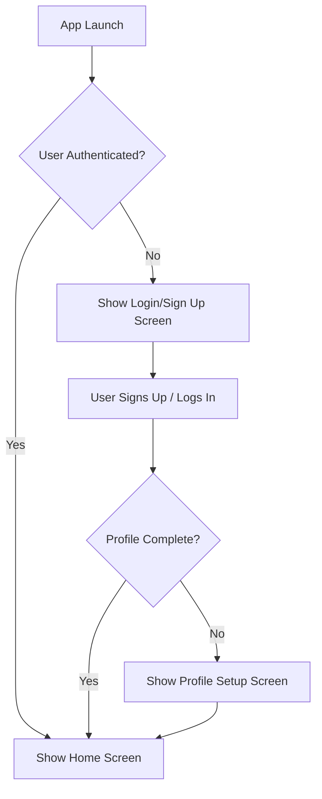

# **Product Requirements Document (PRD): <Project/Feature Name>**

*(Template Version: 2.0 - Adapted for Flutter with Firebase/Supabase)*

## 1. 📜 Introduction & Purpose

### 1.1. Document Overview

This document defines the requirements for the **<Project/Feature Name>**. It serves as the primary source of truth for *what* should be built and *why*, guiding design, development, testing, and stakeholder alignment.

This template is designed for versatility:

*   **Project Scope:** Define a new product, version, or Minimum Viable Product (MVP).
*   **Feature Scope:** Detail a specific feature or enhancement within an existing product.

*(Guidance: Delete the scope type that doesn't apply or adjust descriptions accordingly.)*

### 1.2. Purpose of This PRD

*(Guidance: Clearly state whether this PRD covers an entire project/release or a specific feature. Define the high-level objective.)*

**Example (Project Scope):** "This PRD outlines the requirements for the MVP release of the 'ConnectSphere' mobile application, a professional networking platform built using Flutter and Firebase, focusing on core user profile creation, connection requests, and a basic activity feed."

**Example (Feature Scope):** "This PRD details the requirements for implementing the 'Real-time Chat' feature within the existing 'TaskMaster' Flutter/Supabase application, enabling users to communicate directly within project workspaces."

`[Specify the purpose of this specific PRD here.]`

### 1.3. Intended Audience

*   Product Management
*   UI/UX Design
*   Flutter Development Team
*   Backend Development Team (Firebase/Supabase)
*   Quality Assurance (QA)
*   Project Management
*   Marketing & Sales (as applicable)
*   Key Stakeholders & Leadership

## 2. 🎯 Goals & Objectives

### 2.1. Product Vision & Strategic Fit

*(Guidance: Describe the overall product vision or how this feature aligns with it. Explain the strategic importance and connection to company goals/OKRs. Answer "Why are we building this?")*

`[Describe the vision and strategic fit here.]`

### 2.2. Business Objectives & Success Metrics

*(Guidance: List SMART goals. Define measurable KPIs to track success. How will we know if this is successful?)*

| Goal Description                       | Success Metric(s)                                                                 | Measurement Method                                  | Target                                           | Timeframe            |
| :------------------------------------- | :-------------------------------------------------------------------------------- | :-------------------------------------------------- | :----------------------------------------------- | :------------------- |
| `[e.g., Increase user engagement]`     | `[e.g., Daily Active Users (DAU), Session Duration, Feature Adoption Rate]`         | `[e.g., Analytics (Firebase/Supabase), Surveys]` | `[e.g., Increase DAU by 15%, Adoption > 60%]`    | `[e.g., 3 months]` |
| `[e.g., Improve conversion rate]`      | `[e.g., Sign-up Completion Rate, Purchase Conversion Rate]`                       | `[e.g., Analytics Funnel Tracking]`                 | `[e.g., Improve Sign-up Rate by 10%]`            | `[e.g., 1 month]`  |
| `[e.g., Reduce operational costs]`     | `[e.g., Support Ticket Volume Reduction, Backend Infrastructure Costs]`           | `[e.g., Help Desk Logs, Cloud Billing Reports]`     | `[e.g., Reduce related support tickets by 20%]`  | `[e.g., 6 months]` |
| `[e.g., Enhance feature performance]`  | `[e.g., Avg. API Response Time, Screen Load Time, Crash-Free Rate]`               | `[e.g., Performance Monitoring, Crashlytics]`       | `[e.g., Avg. Load Time < 500ms, Crash-Free 99.9%]` | `[Ongoing]`        |
| `[Add more goals as needed]`           | `[...]`                                                                           | `[...]`                                             | `[...]`                                          | `[...]`            |

## 3. 📄 Document Metadata

| Field                  | Details                             |
| :--------------------- | :---------------------------------- |
| Project/Feature Name   | `<Project/Feature Name>`            |
| Document Version       | `[e.g., 1.0]`                       |
| Status                 | `[Draft | Review | Approved]`       |
| Date Created           | `YYYY-MM-DD`                        |
| Last Updated           | `YYYY-MM-DD`                        |
| Owner / Author         | `[Name(s) and Role(s)]`             |
| Core Team (Key Roles)  | `[PM, Tech Lead, Design Lead, QA Lead]` |
| Key Stakeholders       | `[List names/roles]`                |
| Target Release/Version | `[e.g., v1.0 MVP, Q4 2024]`         |

### Version History

| Version | Date       | Author        | Summary of Changes                                    | Reason for Change                   |
| :------ | :--------- | :------------ | :---------------------------------------------------- | :---------------------------------- |
| `0.1`   | `YYYY-MM-DD` | `[Name]`      | `Initial Draft`                                       | `N/A`                               |
| `1.0`   | `YYYY-MM-DD` | `[Name]`      | `Incorporated feedback from [Team/Stakeholder] review` | `Alignment on scope & feasibility` |
| `...`   | `...`      | `...`         | `...`                                                 | `...`                               |

## 4. 🧑‍🤝‍🧑 User Personas

*(Guidance: Define primary and secondary target users. Link to detailed persona docs if available.)*

*   **Primary Persona(s):** `[Describe the main user(s), their key goals, needs, and context related to this product/feature.]`
    *   Example: *Freelance Designer:* Needs to easily showcase portfolio work, connect with potential clients, manage inquiries efficiently. Values intuitive UI/UX.
*   **Secondary Persona(s):** `[Describe other users who might interact, whose needs are secondary.]`
    *   Example: *Client/Recruiter:* Needs to quickly browse portfolios, assess skills, initiate contact. Values efficiency.

*   **Link to Detailed Personas:** `[Link if available]`

## 5. 🗺️ Scope Definition

*(Guidance: Clearly define what is included (prioritized) and explicitly excluded for this release/feature iteration.)*

### 5.1. In Scope (Prioritized Features/User Stories)

*(Guidance: List features/stories planned for this release. Use a clear prioritization method like MoSCoW. Link to Epics/Stories in your tracking tool if possible. Adapt detail based on Project vs. Feature scope.)*

| Feature/Story ID         | Description                                                                     | Priority (MoSCoW) | Rationale/Notes                                      |
| :----------------------- | :------------------------------------------------------------------------------ | :---------------- | :--------------------------------------------------- |
| **Must-have**            | *(Essential for the core purpose/viability of this release)*                    |                   |                                                      |
| `[e.g., US-AUTH-01]`     | `[As a user, I can create an account using email/password...]`                  | Must              | `Core functionality required for any user interaction.` |
| `[e.g., FEAT-FEED-MVP]`  | `[Display a basic, chronologically sorted activity feed...]`                    | Must              | `Minimum viable feed experience.`                    |
| `...`                    | `...`                                                                           | Must              | `...`                                                |
| **Should-have**          | *(Important, but not critical for launch; workarounds may exist)*               |                   |                                                      |
| `[e.g., US-AUTH-03]`     | `[As a user, I can reset my password via email link...]`                        | Should            | `Important recovery path.`                           |
| `[e.g., FEAT-PROFILE-EDIT]`| `[Allow users to edit their display name and avatar...]`                       | Should            | `Enhances personalization.`                          |
| `...`                    | `...`                                                                           | Should            | `...`                                                |
| **Could-have**           | *(Desirable, but less important; included if time/resources permit)*            |                   |                                                      |
| `[e.g., FEAT-FEED-REACT]`| `[Allow users to react to feed items with emojis...]`                           | Could             | `Nice-to-have engagement feature.`                   |
| `...`                    | `...`                                                                           | Could             | `...`                                                |
| **Won't-have**           | *(Explicitly excluded from this specific release; may be deferred)*             |                   |                                                      |
| `[e.g., FEAT-CHAT]`      | `[Real-time chat functionality]`                                                | Won't             | `Deferred to v1.1 release.`                          |
| `[e.g., FEAT-SEARCH-ADV]`| `[Advanced search filters for feed/profiles]`                                     | Won't             | `Considered for future enhancement.`                 |
| `...`                    | `...`                                                                           | Won't             | `...`                                                |

*   **Link to Backlog/Tracking Tool:** `[Link to Jira, Azure DevOps, etc.]`

### 5.2. Out of Scope

*(Guidance: Explicitly list features, functionalities, or user requests NOT included to manage expectations.)*

*   `[e.g., Integration with third-party calendar services.]`
*   `[e.g., User roles beyond 'Standard User' and 'Admin'.]`
*   `[e.g., Offline data access/editing capabilities.]`
*   `[e.g., Web or Desktop client application.]`
*   `[e.g., Specific feature X requested by Stakeholder Y (Deferred).]`

## 6. 📋 Requirements

*(Guidance: Detail the functional and non-functional requirements. For Feature Scope, focus on the specific feature and its integration points.)*

### 6.1. User Stories / Use Cases

*(Guidance: Use the standard "As a [Persona], I want [Action/Goal], so that [Benefit]" format. Each story must have clear, testable Acceptance Criteria (AC). Link to Epics if applicable.)*

---
**Epic:** `[Link to Epic, e.g., User Authentication]`

*   **ID:** `US-AUTH-01`
*   **Title:** Account Creation via Email/Password
*   **User Story:** As a *new user*, I want *to create an account using my email address and a password*, so that *I can log in and access the application's features*.
*   **Acceptance Criteria:**
    *   Given I am on the Sign-Up screen
    *   When I enter a valid email address (format check)
    *   And I enter a password meeting complexity requirements (`[Specify: e.g., min 8 chars, 1 number, 1 uppercase]`)
    *   And I confirm the password matches
    *   And I tap the "Sign Up" button
    *   Then an account creation request is sent to the backend (Firebase Auth / Supabase Auth).
    *   And a loading indicator is shown.
    *   And upon successful creation, I am automatically logged in.
    *   And a corresponding user profile record is created in the database (Firestore `users` / Supabase `profiles` table) via trigger/function (Ref: `[Link to Backend Spec]`).
    *   And I am redirected to the application's `[Specify: e.g., Onboarding/Home]` screen.
    *   And the sign-up process completes within `[Specify NFR]` seconds.
    *   *(Error AC):* Given I enter an invalid email format, then an inline error "Invalid email format" is shown.
    *   *(Error AC):* Given passwords do not match, then an inline error "Passwords do not match" is shown.
    *   *(Error AC):* Given password complexity is not met, then an inline error `[Specify message]` is shown.
    *   *(Error AC):* Given email already exists, then an error message "Account already exists. Please log in." is shown.
    *   *(Accessibility AC):* All input fields have clear labels and are accessible via screen reader. Error messages are announced. Tap targets meet minimum size requirements (`[Specify NFR]`).

---
*(Repeat for all in-scope user stories, grouped by Epic or Feature Area)*

### 6.2. Functional Requirements

*(Guidance: List system-level functions, business rules, data validation, or administrative capabilities not easily covered by a single user story.)*

*   **FR-01 (Data Validation):** All user-generated text content must be sanitized server-side (e.g., in Cloud/Edge Functions) before storage to prevent XSS.
*   **FR-02 (Business Rule):** Users must verify their email address within 24 hours of account creation before accessing certain features (`[List features]`).
*   **FR-03 (Admin Capability):** Admins must be able to view user activity logs via the backend console (`[Specify location]`).
*   **FR-04 (System Logic):** When a user profile is deleted, all associated user-generated content (`[List content types, e.g., posts, comments]`) must also be anonymized or deleted (handled by backend cascade/trigger/function - Ref: `[Link to Backend Spec]`).

### 6.3. Non-Functional Requirements (NFRs)

*(Guidance: Detail specific, measurable quality attributes. Tailor to Flutter & Firebase/Supabase context.)*

*   **Performance:**
    *   `NFR-PERF-01:` App Cold Start Time < `[e.g., 3 seconds]` on `[Specify baseline device, e.g., Pixel 6]`.
    *   `NFR-PERF-02:` Screen Transition Time (main flows) < `[e.g., 300ms]`.
    *   `NFR-PERF-03:` Backend Read Latency (e.g., profile load) < `[e.g., 500ms]` avg under `[Specify load]` concurrent users.
    *   `NFR-PERF-04:` Flutter UI Frame Rate: Maintain avg `[e.g., 55-60 FPS]` during key interactions, minimize jank.
    *   `NFR-PERF-05:` Background Sync Battery Impact: `[Specify target, if applicable]`.
    *   `NFR-PERF-06:` Foreground RAM Usage < `[e.g., 250MB]` during typical usage.
*   **Scalability:**
    *   `NFR-SCAL-01 (Firebase):` Firestore query patterns must support `[e.g., 1 Million]` users and `[e.g., 10 Million]` core data records efficiently. Define indexing strategy. Consider denormalization for read-heavy paths.
    *   `NFR-SCAL-01 (Supabase):` PostgreSQL schema & indexing must support `[e.g., 1 Million]` users and `[e.g., 10 Million]` core data records. Backend infrastructure must handle `[e.g., 1000]` concurrent sessions.
    *   `NFR-SCAL-02:` Backend infrastructure (e.g., Cloud Run via Firebase App Hosting, Supabase Compute) must auto-scale for peak loads (`[e.g., 5x average]`). Define `apphosting.yaml` `runConfig` if applicable.
*   **Reliability:**
    *   `NFR-REL-01:` Backend Uptime: `[e.g., 99.9%]`.
    *   `NFR-REL-02:` Critical Action Success Rate (e.g., login, purchase) > `[e.g., 99.95%]`.
    *   `NFR-REL-03:` Network Interruption Handling: App must handle temporary offline state gracefully, sync upon reconnection. Define user feedback for offline state.
    *   `NFR-REL-04:` Error Handling & Logging: Implement comprehensive client/server logging (`[e.g., Crashlytics, Sentry, Cloud Logging]`). User-facing errors must be clear and actionable.
*   **Usability & Accessibility (Flutter Specific):**
    *   `NFR-USE-01:` Adhere to platform UI conventions (Material/Cupertino). Maintain consistency with existing app patterns (if applicable).
    *   `NFR-ACC-01:` Minimum Touch Target Size: `[e.g., 48dp Android / 44pt iOS]`.
    *   `NFR-ACC-02:` Color Contrast Ratios: Meet WCAG AA (`4.5:1` normal, `3:1` large).
    *   `NFR-ACC-03:` Screen Reader Compatibility: All interactive elements & key content must have semantic labels (test with TalkBack/VoiceOver). Use `Semantics` widget appropriately.
    *   `NFR-ACC-04:` Text Scaling: UI must adapt correctly up to `[e.g., 200%]` system font scaling without breaking layout or truncating text.
    *   `NFR-ACC-05:` Keyboard Navigation: Logical focus order (especially for Web/Desktop).
    *   `NFR-ACC-06:` Reduced Motion: Respect `MediaQuery.reduceMotion` preference.
    *   `NFR-ACC-07:` Form Accessibility: Clear labels, instructions, accessible error feedback.
*   **Security (Firebase/Supabase Specific):**
    *   `NFR-SEC-01:` Authentication: Use secure methods (`[List providers]`). Enforce MFA if required. Use PKCE flow for OAuth.
    *   `NFR-SEC-02 (Firebase):` Implement least-privilege Firestore/Storage/RTDB Security Rules. Test rigorously.
    *   `NFR-SEC-02 (Supabase):` Implement least-privilege RLS policies on all relevant tables. Test rigorously.
    *   `NFR-SEC-03:` Data Transmission: Enforce HTTPS/TLS (handled by BaaS).
    *   `NFR-SEC-04:` Data at Rest: Encrypt sensitive PII (handled by BaaS where possible, consider field-level encryption if needed). Secrets Management: Use platform secrets management (Cloud Secret Manager via `apphosting.yaml`, Supabase Vault), NOT hardcoded keys.
    *   `NFR-SEC-05:` Input Validation: Implement on client and server-side (Cloud/Edge Functions).
    *   `NFR-SEC-06:` Dependency Management: Regularly scan & update dependencies for vulnerabilities.
    *   `NFR-SEC-07:` Platform Security: Adhere to iOS/Android security best practices.
*   **Maintainability & Testability:**
    *   `NFR-MAIN-01:` Code adheres to Effective Dart & project style guide (`[Link to style guide]`). Follow defined architecture (e.g., MVVM).
    *   `NFR-MAIN-02:` Maintain clear project structure (`[Link to Architecture Doc Section]`).
    *   `NFR-TEST-01:` Unit Test Coverage > `[e.g., 70%]` for domain/data logic.
    *   `NFR-TEST-02:` Implement Widget & Integration tests for key components & flows.
*   **Compatibility/Portability:**
    *   `NFR-COMP-01:` Target Platforms: iOS `[e.g., 14.0+]`, Android `[e.g., API 23+]`.
    *   `NFR-COMP-02:` Responsive UI: Adapt gracefully to various phone screen sizes & orientations. Tablet support required? `[Yes/No]`.
    *   `NFR-COMP-03 (If Web):` Browser Support: Latest Chrome, Firefox, Safari.

## 7. ✨ Design & User Experience (UX)

*(Guidance: Link to design artifacts. Briefly describe key workflows or UI principles. This bridges requirements and visual implementation.)*

*   **Links to Design Artifacts:**
    *   Wireframes: `[Link or N/A]`
    *   High-Fidelity Mockups (Figma, etc.): `[Link to specific frames/flows]`
    *   Interactive Prototypes: `[Link or N/A]`
    *   Design System / Style Guide: `[Link to documentation, e.g., Material 3 guidelines, custom system]`
*   **Key Workflow Descriptions/Diagrams:**
    *   *(Optional: Include flowcharts for complex interactions not easily described by stories/prototypes.)*
    *   Example: *Onboarding Flow:* `[Embed Mermaid diagram or link to visual flow]`

## 8. ⚙️ Backend Specifications (Firebase/Supabase)

*(Guidance: Select the relevant platform. Detail specific backend requirements crucial for supporting the features and NFRs.)*

---
**OPTION A: Firebase Backend**

*   **Data Model Overview (Firestore/Realtime Database):**
    *   Key Collections: `[List, e.g., users, posts, comments]`
    *   Document Structure Examples: `[Provide examples for key documents, outlining fields and data types]`
    *   Data Structuring Strategy: `[Nested subcollections | Flattened root collections with references]`. Justify choice based on query needs. Consider denormalization strategy if applicable.
    *   Realtime Database Usage: `[Specify if used, e.g., for presence, and describe structure]`
*   **Authentication Requirements (Firebase Auth):**
    *   Required Providers: `[List, e.g., Email/Password, Google, Apple]`
    *   User Data Storage: `[e.g., Profile data stored in 'users' collection keyed by Auth UID]`
*   **Cloud Function Needs:**
    *   `[Function Name 1]:` Trigger: `[e.g., onCreate(users/{userId})]`, Purpose: `[e.g., Initialize default profile settings]`.
    *   `[Function Name 2]:` Trigger: `[e.g., HTTPS callable]`, Purpose: `[e.g., Process payment via Stripe]`.
    *   `[Function Name 3]:` Trigger: `[e.g., Pub/Sub Schedule]`, Purpose: `[e.g., Daily data aggregation]`.
*   **Storage Requirements (Cloud Storage):**
    *   Bucket(s): `[e.g., Default bucket, dedicated 'user-uploads' bucket]`
    *   Usage: `[e.g., User profile images, PDF reports]`
    *   Access Control Strategy: `[Describe high-level Firebase Storage Security Rules approach]`
*   **Real-time Requirements:**
    *   `[Specify data needing real-time updates, e.g., Chat messages, Notifications]` using `[Firestore snapshot listeners | Realtime Database listeners]`.
*   **Security Rules (Firestore, Storage, RTDB):**
    *   `[Outline key access control principles, e.g., Users R/W own data, Admins have broader access. Reference NFR-SEC-02 Firebase.]`
*   **API / Integration Needs:**
    *   `[List integrations, e.g., Stripe API, SendGrid API. Specify secure key handling.]`
*   **Firebase App Hosting Configuration (`apphosting.yaml` - if used):**
    *   `runConfig`: `[Specify based on NFR-SCAL-02]`
    *   `env`: `[Define build/runtime environment variables]`
    *   `secrets`: `[Reference Cloud Secret Manager secrets needed]`

---
**OPTION B: Supabase Backend**

*   **Data Model Overview (PostgreSQL):**
    *   Key Tables: `[List, e.g., profiles, projects, tasks]`
    *   Schema & Relationships: `[Provide link to schema diagram or define key tables, columns, types, PKs, FKs, relationships here]`
    *   Indexing Strategy: `[Specify key indexes needed for performance]`
*   **Authentication Requirements (Supabase Auth):**
    *   Required Providers: `[List, e.g., Email/Password, Magic Link, GitHub]`
    *   User Data Storage: `[e.g., Profile data in 'profiles' table linked via FK to auth.users.id]`
*   **Edge Function Needs:**
    *   `[Function Name 1]:` Trigger: `[e.g., Database Webhook on insert(profiles)]`, Purpose: `[e.g., Send welcome email]`.
    *   `[Function Name 2]:` Trigger: `[e.g., HTTP Request]`, Purpose: `[e.g., Custom server-side validation]`.
*   **Storage Requirements (Supabase Storage):**
    *   Bucket(s): `[List, e.g., avatars, documents]`
    *   Usage: `[e.g., User profile pictures, project files]`
    *   Access Control Strategy: `[Describe high-level Storage RLS policy approach]`
*   **Real-time Requirements:**
    *   `[Specify tables needing real-time updates, e.g., messages, notifications]` using Supabase Realtime subscriptions.
*   **Security (Row Level Security - RLS):**
    *   `[Outline key RLS policy principles for relevant tables. Reference NFR-SEC-02 Supabase. Provide examples if necessary.]`
    *   Example: `profiles` table: `Users can SELECT/UPDATE own row (auth.uid() = id).`
*   **API / Integration Needs:**
    *   Leverage auto-generated `[REST | GraphQL]` APIs.
    *   `[List external integrations triggered via Edge Functions/Webhooks]`

---

## 9. ⚠️ Assumptions, Constraints & Dependencies

*(Guidance: List known assumptions (potential risks if wrong), constraints (limitations), and dependencies (required inputs/factors).)*

*   **Assumptions:**
    *   `[e.g., Users have reliable internet connectivity for core features.]`
    *   `[e.g., Target users are familiar with standard mobile app conventions.]`
    *   `[e.g., Firebase/Supabase free/pro tier limits are sufficient for projected initial load.]`
    *   `[e.g., Third-party APIs (list specifics) will maintain stable interfaces.]`
*   **Constraints:**
    *   Budget: `[Specify if applicable]`
    *   Timeline: `[Specify target release date or timeframe]`
    *   Resources: `[Team size/composition, specific skill availability]`
    *   Technology: Must use Flutter `[Version]`, Firebase/Supabase (`[Specify which]`), `[List mandated packages]`.
    *   Regulatory: `[e.g., Must comply with GDPR, HIPAA]`
*   **Dependencies:**
    *   Internal: `[e.g., Final UI Designs from Design Team by YYYY-MM-DD]`, `[e.g., Backend API endpoint X ready by YYYY-MM-DD]`
    *   External: `[e.g., Availability of Third-Party Service Y API]`, `[e.g., Requires specific Flutter package Z version]`

## 10. ✅ Release Criteria

*(Guidance: Define specific, measurable conditions for release readiness. This is the final quality gate.)*

*   **Functionality:**
    *   All 'Must-have' scope items (Section 5.1) are implemented and meet their Acceptance Criteria.
    *   Core user flows (`[List flows, e.g., Onboarding, Login, Core Feature X usage]`) are stable and functional without Blocker/Critical bugs.
*   **Quality & NFRs:**
    *   Key Performance NFRs (`[List specific NFR IDs, e.g., NFR-PERF-01, NFR-PERF-03]`) are met.
    *   Key Security NFRs (`[List specific NFR IDs, e.g., NFR-SEC-01, NFR-SEC-02]`) are verified. No known critical/high vulnerabilities.
    *   Key Accessibility NFRs (`[List specific NFR IDs, e.g., NFR-ACC-01 to 03]`) pass checks and screen reader testing.
    *   Application meets Reliability NFRs (`[List specific NFR IDs]`) during testing.
*   **Testing:**
    *   Unit, Widget, Integration test suites pass (`[Specify coverage target if applicable, e.g., >NFR-TEST-01]`).
    *   End-to-End tests for critical paths pass.
    *   User Acceptance Testing (UAT) completed with sign-off from `[Specify Stakeholders/Roles]`.
    *   No outstanding Blocker or Critical bugs related to in-scope functionality.
*   **Documentation & Readiness:**
    *   `[e.g., End-user documentation/FAQs ready, if applicable]`
    *   `[e.g., Support team trained/documentation provided]`
    *   `[e.g., Monitoring, logging, alerting configured and operational]`
    *   `[e.g., Deployment plan approved]`

## 11. ❓ Open Questions & Future Considerations

*(Guidance: Track unresolved issues and potential future enhancements.)*

### 11.1. Open Questions Tracker

| ID   | Question                                                                 | Raised By     | Date       | Assigned To   | Due Date   | Status   | Answer/Resolution (Link)        |
| :--- | :----------------------------------------------------------------------- | :------------ | :--------- | :------------ | :--------- | :------- | :------------------------------ |
| Q-01 | `[Specific question about requirement detail, constraint, or NFR]?`      | `[Name/Role]` | `YYYY-MM-DD` | `[Name/Role]` | `YYYY-MM-DD` | `[Open]`   | `[Pending discussion/decision]` |
| Q-02 | `[Question about technical feasibility or backend approach]?`            | `[Name/Role]` | `YYYY-MM-DD` | `[Tech Lead]` | `YYYY-MM-DD` | `[Open]`   | `[Requires investigation]`      |
| ...  | ...                                                                      | ...           | ...        | ...           | ...        | ...      | ...                             |

### 1.2. Potential Future Enhancements / Next Steps

*(Guidance: List ideas or features deferred from this release. Link back to Scope section.)*

*   `[Enhancement 1 (Ref: Scope - Won't-have Item X)]`
*   `[Enhancement 2]`
*   `[Consideration for vNext]`

## 12. 📚 (Optional) Appendix / Glossary

### 12.1. Related Resources

*   Market Requirements Document (MRD): `[Link or N/A]`
*   Competitive Analysis: `[Link or N/A]`
*   User Research Findings: `[Link or N/A]`
*   Technical Architecture Document: `[Link or N/A]`
*   API Documentation (External): `[Link or N/A]`
*   User Journey Maps: `[Link or N/A]`

### 12.2. Glossary

*(Guidance: Define key terms, acronyms, and project-specific jargon.)*

*   **AC:** Acceptance Criteria
*   **API:** Application Programming Interface
*   **BaaS:** Backend as a Service
*   **Firebase:** Google's BaaS platform.
*   **Firestore:** Firebase NoSQL Document Database.
*   **Flutter:** Google's UI toolkit.
*   **KPI:** Key Performance Indicator
*   **MoSCoW:** Prioritization method (Must, Should, Could, Won't).
*   **MVP:** Minimum Viable Product
*   **NFR:** Non-Functional Requirement
*   **OKR:** Objectives and Key Results
*   **PRD:** Product Requirements Document
*   **RLS:** Row Level Security (Supabase/PostgreSQL).
*   **Supabase:** Open-source Firebase alternative (Postgres BaaS).
*   **UAT:** User Acceptance Testing
*   **UI:** User Interface
*   **UX:** User Experience
*   **WCAG:** Web Content Accessibility Guidelines
*   `[Add other relevant terms]`
