# 🏗️ Architecture Document: `[Project/Feature Name]`

## 1. 📜 Introduction & Purpose

### 1.1. Document Purpose
> 💡 *Clearly state the purpose of this architecture document. What does it describe? What are its objectives? E.g., "This document outlines the proposed software architecture for the [Project/Feature Name], detailing its components, interactions, technologies, and design decisions to guide development and ensure alignment with project goals."*

`[Describe the purpose of this document]`

### 1.2. Scope
> 💡 *Define the boundaries of the architecture described. What systems, sub-systems, or features are covered? What is explicitly out of scope from an architectural perspective?*

*   **In Scope:** `[e.g., Backend services for Feature X, Mobile client interaction patterns, Data storage for user profiles]`
*   **Out of Scope:** `[e.g., Detailed UI design, Third-party vendor's internal architecture, Specific algorithm implementation details]`

### 1.3. Intended Audience
> 💡 *List the primary audience for this document (e.g., Development Team, Technical Leads, Product Managers, Security Team, Operations Team, other Architects).*

`[List intended audience]`

### 1.4. Related Documents
> 💡 *List links to other relevant documents like PRDs, technical specifications, design mockups, security policies, etc.*

*   Product Requirements Document (PRD): `[Link to PRD]`
*   Design Mockups (Figma, etc.): `[Link to Designs]`
*   API Specifications: `[Link to API Docs]`
*   `[Other relevant documents]`

## 2. 📄 Document Metadata

| Field                | Details                                      |
| :------------------- | :------------------------------------------- |
| Document Version     | `[e.g., 1.0, 1.1, 2.0]`                      |
| Status               | `[e.g., Draft, In Review, Approved, Obsolete]` |
| Date Created         | `[YYYY-MM-DD]`                               |
| Last Updated         | `[YYYY-MM-DD]`                               |
| Author(s)            | `[Name(s) / @username(s) & Role(s)]`         |
| Reviewer(s)          | `[Name(s) / @username(s) & Role(s)]`         |
| Key Stakeholders     | `[List key stakeholder names or groups]`     |
| Target System/Release| `[e.g., Project X v2.1, Q4 2024]`            |

### 2.1. Version History
> 💡 *Maintain a log of significant changes to this document.*

| Version | Date       | Author(s)             | Summary of Changes                                     |
| :------ | :--------- | :-------------------- | :----------------------------------------------------- |
| `0.1`   | `YYYY-MM-DD` | `[Name (Role)]`       | Initial Draft                                          |
| `1.0`   | `YYYY-MM-DD` | `[Name (Role)]`       | Incorporated feedback from review; Approved for use    |
| `...`   | `...`      | `...`                 | `...`                                                  |

## 3. 🎯 Goals & Architectural Drivers

### 3.1. Business Goals
> 💡 *List the key business goals that this architecture must support. How does the architecture enable the achievement of these goals? Reference PRD goals if applicable.*

*   `[Business Goal 1, e.g., Reduce time-to-market for new features by X%]`
*   `[Business Goal 2, e.g., Support Y concurrent users during peak load]`
*   `[Business Goal 3, e.g., Decrease operational costs by Z%]`

### 3.2. Technical Goals
> 💡 *List specific technical goals for the architecture (e.g., improve maintainability, adopt a specific technology, enhance testability).*

*   `[Technical Goal 1, e.g., Achieve high cohesion and low coupling between services]`
*   `[Technical Goal 2, e.g., Implement a fully automated CI/CD pipeline]`
*   `[Technical Goal 3, e.g., Ensure 99.99% uptime for critical services]`

### 3.3. Architectural Principles
> 💡 *List the guiding principles that shaped this architecture (e.g., Build for resilience, Design for scalability, Security by design, Simplicity, Use open standards where possible).*

*   `[Principle 1: e.g., Prefer managed services over self-hosted solutions to reduce operational overhead.]`
*   `[Principle 2: e.g., All inter-service communication must be asynchronous where possible.]`
*   `[Principle 3: e.g., Data privacy is paramount; apply least privilege access.]`

### 3.4. Key Constraints & Assumptions
> 💡 *List any constraints (budget, timeline, existing systems, mandated technologies, regulatory requirements) and critical assumptions made during the architectural design.*

*   **Constraints:**
    *   `[Constraint 1, e.g., Must integrate with legacy System X via its existing SOAP API.]`
    *   `[Constraint 2, e.g., Development budget for Phase 1 is $Y.]`
    *   `[Constraint 3, e.g., Must use AWS as the cloud provider.]`
*   **Assumptions:**
    *   `[Assumption 1, e.g., The anticipated user growth rate of X% per year is accurate.]`
    *   `[Assumption 2, e.g., Third-party API Z will maintain its current SLA.]`

## 4. 🏛️ Current Architecture (As-Is) - Optional
> 💡 *If this architecture is an evolution of an existing system, describe the current state briefly. Focus on aspects relevant to the proposed changes. Skip if this is a greenfield project.*

### 4.1. Overview
> 💡 *Provide a high-level diagram and description of the current system architecture.*

`[Description and/or diagram of the current architecture]`

### 4.2. Pain Points / Limitations
> 💡 *Identify key issues, bottlenecks, or limitations in the current architecture that the new architecture aims to address.*

*   `[Pain Point 1, e.g., Scalability issues with the current monolithic database.]`
*   `[Pain Point 2, e.g., Tight coupling between modules makes changes difficult and risky.]`

## 5. 🏗️ Current System Architecture

### 5.1. Overview & Guiding Principles
> 💡 *Provide a high-level narrative of the current architecture. Reiterate any specific principles that guide this particular design.*

`[High-level description of the current architecture and its core concepts.]`

### 5.2. Logical View / Conceptual Architecture
> 💡 *Describe the system at a high level of abstraction, focusing on major functional areas and their relationships. Use diagrams like C4 Context or Container diagrams.*

#### 5.2.1. Context Diagram (e.g., C4 Level 1)
> 💡 *Shows the system in its environment, interacting with users and external systems.*

```mermaid
graph TD
    User[👤 User] -->|Interacts with| System([🚀 System: Project/Feature Name]);
    System -->|Uses| ExternalSystemA([🌐 External System A]);
    System -->|Sends data to| ExternalSystemB([⚙️ External System B]);
```

`[Brief explanation of the context diagram.]`

#### 5.2.2. Container Diagram (e.g., C4 Level 2)
> 💡 *Zooms into the system boundary, showing high-level technology choices and responsibilities of major deployable units (applications, data stores, etc.).*

```mermaid
graph TD
    subgraph System Boundary
        WebApp[📱 Web Application e.g. Flutter/React/...]
        APIService[⚙️ API Service Node.js/Python/...]
        Database[💾 Database PostgreSQL/MongoDB/...]
        AuthService[🔐 Auth Service Firebase Auth/Keycloak/...]
    end
    User[👤 User] -->|Uses| WebApp;
    WebApp -->|API Calls| APIService;
    APIService -->|Reads/Writes| Database;
    APIService -->|Authenticates via| AuthService;
    APIService -->|Integrates with| ExternalSystemA([🌐 External System A]);
```

`[Brief explanation of the container diagram, technologies, and responsibilities.]`

### 5.3. Component View (e.g., C4 Level 3)
> 💡 *Zooms into individual containers, showing the key components/modules/services within them and their interactions.*

#### 5.3.1. Key Components & Responsibilities
> 💡 *For each major container (e.g., APIService), list its key internal components and their primary responsibilities.*

*   **Container: `[e.g., APIService]`**
    *   Component 1: `[e.g., User Management Controller]` - Responsibility: `[e.g., Handles user registration, login, profile updates.]`
    *   Component 2: `[e.g., Order Processing Service]` - Responsibility: `[e.g., Manages order creation, payment integration, status updates.]`
    *   `...`

#### 5.3.2. Interactions & Interfaces
> 💡 *Describe how key components interact. Use sequence diagrams for important flows if necessary. Define major interfaces (APIs).*

`[Explanation of key interactions and interface definitions.]`

### 5.4. Data View
#### 5.4.1. Data Models (High-Level)
> 💡 *Describe the key data entities, their attributes, and relationships. Link to detailed schema if available.*

*   Entity 1: `[e.g., User (UserID, Email, Name, CreatedAt)]`
*   Entity 2: `[e.g., Order (OrderID, UserID, ProductID, Amount, Status, Timestamp)]`
*   Relationship: `[e.g., A User can have multiple Orders.]`
*   Link to Detailed Schema: `[Link or N/A]`

#### 5.4.2. Data Flow & Storage Strategy
> 💡 *Describe how data flows through the system. What data is stored where, and why? (e.g., relational DB for transactional data, NoSQL for user profiles, cache for session data).*

`[Description of data flow and storage choices.]`

### 5.5. Technology Stack
> 💡 *List the specific technologies, frameworks, libraries, and platforms chosen for each part of the system.*

*   **Frontend (if applicable):** `[e.g., Flutter (vX.Y.Z) with Provider, GoRouter]`
*   **Backend:** `[e.g., Node.js (vX.Y) with Express.js, Python (vX.Y) with Django/Flask]`
*   **Databases:** `[e.g., PostgreSQL (vX.Y), MongoDB (vX.Y), Redis (vX.Y) for caching]`
*   **Key Libraries/Frameworks:** `[e.g., Kafka for messaging, gRPC for inter-service communication]`
*   **Platforms & Services (Cloud, etc.):** `[e.g., AWS (EC2, S3, RDS, Lambda), Firebase (Auth, Firestore, Functions), Docker, Kubernetes]`

### 5.6. Deployment View
#### 5.6.1. Environments
> 💡 *Describe the different deployment environments (e.g., Development, Staging/QA, Production).*

*   Development: `[Description]`
*   Staging/QA: `[Description]`
*   Production: `[Description]`

#### 5.6.2. Infrastructure Overview
> 💡 *High-level diagram or description of the production infrastructure. How are components hosted and connected?*

`[Infrastructure diagram/description, e.g., Load Balancers, App Servers, DB Servers, VPCs.]`

#### 5.6.3. CI/CD Pipeline
> 💡 *Outline the continuous integration and continuous deployment/delivery process.*

`[Description of CI/CD tools (e.g., Jenkins, GitLab CI, GitHub Actions) and pipeline stages.]`

### 5.7. Integration View
#### 5.7.1. Internal System Integrations
> 💡 *How does this system integrate with other internal systems within the organization?*

*   System A: `[Integration method, e.g., REST API, Message Queue, Shared Database (discouraged)]` - Purpose: `[...]`
*   System B: `[...]`

#### 5.7.2. External System Integrations (Third-Party APIs)
> 💡 *How does this system integrate with external third-party services or APIs?*

*   Service X (e.g., Stripe): `[Integration method, e.g., Client-side SDK, Server-side API calls]` - Purpose: `[e.g., Payment processing]`
*   Service Y (e.g., SendGrid): `[...]`

## 6. ⭐ Key Architectural Decisions & Rationale
> 💡 *Document significant architectural decisions made, the reasons behind them, and any alternatives considered. This is crucial for understanding the "why" of the architecture.*

| Decision ID | Decision Made                                       | Rationale                                                                 | Alternatives Considered                     | Status     | Date       |
| :---------- | :-------------------------------------------------- | :------------------------------------------------------------------------ | :------------------------------------------ | :--------- | :--------- |
| `ADR-001`   | `[e.g., Adopt a microservices architecture]`        | `[e.g., To improve scalability, team autonomy, and technology diversity.]`  | `[e.g., Monolith, Service-Oriented Architecture]` | `Approved` | `YYYY-MM-DD` |
| `ADR-002`   | `[e.g., Use Kafka for asynchronous event streaming]`  | `[e.g., For decoupling services and handling high throughput of events.]` | `[e.g., RabbitMQ, Direct API calls]`        | `Approved` | `YYYY-MM-DD` |
| `...`       | `...`                                               | `...`                                                                     | `...`                                       | `...`      | `...`      |

*   Link to ADR Repository (if separate): `[Link]`

## 7. 🛡️ Non-Functional Requirements (NFRs) - Architectural Impact
> 💡 *Summarize key NFRs (Quality Attributes) from the PRD that significantly influence the architecture. Describe how the architecture addresses them.*

*   **Performance:** `[e.g., Target response times for key APIs. How architecture (caching, async processing, DB choice) supports this.]`
*   **Scalability:** `[e.g., Expected user load, data volume growth. How architecture (horizontal/vertical scaling, stateless services, load balancing) supports this.]`
*   **Reliability/Availability:** `[e.g., Uptime requirements (e.g., 99.9%). How architecture (redundancy, failover, health checks) supports this.]`
*   **Security:** `[e.g., Compliance needs, data protection. How architecture (auth mechanisms, encryption, network segmentation) supports this. More detail in Section 8.]`
*   **Maintainability:** `[e.g., Ease of updates, debugging. How architecture (modularity, clear interfaces, chosen tech stack) supports this.]`
*   **Extensibility:** `[e.g., Ability to add new features. How architecture (loose coupling, defined extension points) supports this.]`
*   **Testability:** `[e.g., How architecture (separation of concerns, mockable interfaces) facilitates testing.]`
*   **Cost-Effectiveness:** `[e.g., How technology choices and design impact operational and development costs.]`

## 8. 🔐 Security Architecture

### 8.1. Authentication & Authorization
> 💡 *Describe the mechanisms for verifying user identity (authentication) and controlling access to resources (authorization).*

*   Authentication: `[e.g., OAuth 2.0 with OpenID Connect, JWTs, Firebase Authentication, SAML for SSO]`
*   Authorization: `[e.g., Role-Based Access Control (RBAC), Attribute-Based Access Control (ABAC), API Keys, Supabase RLS]`

### 8.2. Data Security
> 💡 *How is data protected at rest and in transit?*

*   Data at Rest: `[e.g., Database encryption (TDE), Filesystem encryption, Application-level encryption for sensitive fields]`
*   Data in Transit: `[e.g., TLS/SSL for all communications, mTLS for inter-service communication]`

### 8.3. Network Security
> 💡 *Describe network segmentation, firewalls, intrusion detection/prevention, etc.*

`[e.g., Use of VPCs, subnets, security groups/firewall rules, WAF, IDS/IPS]`

### 8.4. Threat Model (High-Level)
> 💡 *Identify key threats and how the architecture mitigates them (e.g., STRIDE model). Link to detailed threat model if available.*

*   Threat 1: `[e.g., Unauthorized data access]` - Mitigation: `[e.g., Strong authentication, RBAC, encryption]`
*   Threat 2: `[e.g., Denial of Service (DoS)]` - Mitigation: `[e.g., Rate limiting, WAF, auto-scaling]`

### 8.5. Compliance Considerations
> 💡 *List any relevant compliance standards (e.g., GDPR, HIPAA, PCI-DSS) and how the architecture supports adherence.*

`[Compliance details]`

## 9. 📈 Scalability, Performance & Reliability

### 9.1. Scalability Strategy
> 💡 *How will the system scale to meet increasing demand (users, data, traffic)?*

`[e.g., Horizontal scaling of stateless services, database read replicas, sharding, use of auto-scaling groups, serverless functions.]`

### 9.2. Performance Targets & Bottlenecks
> 💡 *Reiterate key performance targets. Identify potential bottlenecks and how they are addressed or monitored.*

`[Performance targets, potential bottlenecks (e.g., database, external API calls), and mitigation strategies (e.g., caching, query optimization, connection pooling).]`

### 9.3. Reliability & Availability Strategy
> 💡 *How does the architecture ensure the system remains operational and recovers from failures?*

`[e.g., Redundancy across availability zones, automated failover mechanisms, health checks, circuit breakers, idempotent operations.]`

## 10. 🛠️ Operational Considerations

### 10.1. Monitoring & Alerting
> 💡 *What will be monitored? What tools will be used? How will alerts be handled?*

`[e.g., Key metrics (CPU, memory, error rates, latency), logging aggregation (ELK stack, CloudWatch Logs), monitoring tools (Prometheus, Grafana, Datadog), alerting rules and notification channels.]`

### 10.2. Logging Strategy
> 💡 *What information will be logged, where, and in what format? How will logs be accessed and analyzed?*

`[e.g., Structured logging (JSON), log levels, correlation IDs, centralized log management.]`

### 10.3. Backup & Recovery
> 💡 *Describe the backup strategy for data stores and the recovery procedures (RPO/RTO targets).*

`[e.g., Automated database backups (daily/hourly), point-in-time recovery, disaster recovery plan.]`

### 10.4. Maintenance & Upgrades
> 💡 *How will system components be maintained and upgraded with minimal downtime?*

`[e.g., Blue/green deployments, canary releases, rolling updates, database migration strategy.]`

## 11. ⚠️ Risks & Mitigation Strategies
> 💡 *Identify potential architectural risks (technical, operational, etc.) and proposed mitigation strategies.*

| Risk ID | Description                                       | Likelihood (H/M/L) | Impact (H/M/L) | Mitigation Strategy                                       | Owner         |
| :------ | :------------------------------------------------ | :----------------- | :------------- | :-------------------------------------------------------- | :------------ |
| `AR-001`| `[e.g., Vendor lock-in with Cloud Provider X]`      | `M`                | `H`            | `[e.g., Use standard interfaces, design for portability]` | `[Tech Lead]` |
| `AR-002`| `[e.g., Performance degradation under extreme load]`| `M`                | `M`            | `[e.g., Thorough load testing, proactive scaling plan]`   | `[Dev Team]`  |
| `...`   | `...`                                             | `...`              | `...`          | `...`                                                     | `...`         |

## 12. 🔄 Alternatives Considered
> 💡 *Briefly describe significant architectural alternatives that were evaluated and the reasons they were not chosen. This complements Section 6 (Key Decisions).*

*   **Alternative 1:** `[e.g., Using a monolithic architecture instead of microservices]`
    *   Pros: `[e.g., Simpler initial development, easier local testing]`
    *   Cons: `[e.g., Scalability challenges, tight coupling, slower deployment cycles for large teams]`
    *   Reason Not Chosen: `[e.g., Long-term scalability and team autonomy were prioritized.]`
*   **Alternative 2:** `[e.g., Choosing Database Y instead of Database X]`
    *   Pros: `[...]`
    *   Cons: `[...]`
    *   Reason Not Chosen: `[...]`

## 13. 📖 Glossary
> 💡 *Define key architectural terms, acronyms, patterns, and project-specific jargon used in this document.*

*   **ADR:** Architecture Decision Record
*   **API:** Application Programming Interface
*   **C4 Model:** A model for visualizing software architecture (Context, Containers, Components, Code).
*   **CI/CD:** Continuous Integration / Continuous Deployment (or Delivery)
*   **Microservices:** An architectural style that structures an application as a collection of small, autonomous services.
*   `[Add other relevant terms]`

## 14. ❓ Open Questions

### 14.1. Open Questions
> 💡 *List any unresolved architectural questions or items needing further investigation regarding the current architecture.*

| Question ID | Question                                                               | Assigned To     | Due Date     | Status     |
|:------------|:-----------------------------------------------------------------------|:----------------|:-------------|:-----------|
| `AQ-001`    | `[e.g., What is the optimal sharding strategy for the events table?`   | `[DBA Team]`    | `YYYY-MM-DD` | `Open`     |
| `AQ-002`    | `[e.g., How will we handle data synchronization with offline clients?` | `[Mobile Team]` | `YYYY-MM-DD` | `Research` |
