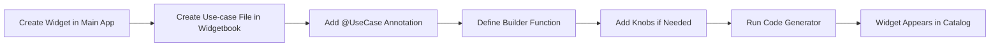

# 📒 Story: Install and Configure Widgetbook for Flutter Widget Development

# 🔖 Description
> 💡 *A short and descriptive introduction of the problem we are going to solve.*
---

Flutter developers need a way to develop, test, and showcase UI components in isolation without running the entire application. This allows for faster development, better testing of edge cases, and easier collaboration with design teams. Widgetbook provides a catalog system where widgets can be viewed in different states, configurations, and device sizes.

# 🗣 User Story
> 💡 ***As a*** *ROLE* ***I want*** *BEHAVIOUR* ***so that*** *REASON.*
---

**As a** Flutter Developer
**I want** to install and configure Widgetbook in my Flutter project
**So that** I can develop and test UI components in isolation, showcase different widget states, and improve collaboration with my team

# 🤖 AI Agent Context
> 💡 *Essential information for the AI agent to understand and execute this ticket effectively. Review all linked resources thoroughly before proceeding.*
---

## 📚 Relevant Project Files & Code
> 💡 *List all project files, code snippets, or directories that the AI agent **must read and understand** to effectively complete the tasks. Include paths relative to the project root and a brief note on their relevance.*
---
*   `pubspec.yaml` - (Relevance: Main project dependencies file where app dependencies are defined)
*   `lib/` - (Relevance: Main application source code directory where widgets are located)
*   `widgetbook/pubspec.yaml` - (Relevance: Widgetbook project dependencies - will be created)
*   `widgetbook/lib/main.dart` - (Relevance: Widgetbook app entry point - will be created)
*   `widgetbook/lib/` - (Relevance: Directory for widget use-cases - will be created)

## 🌐 Relevant Documentation & Links
> 💡 *List any external web pages, API documentation, design specifications (e.g., Figma links), or other online resources the AI agent should consult. Include a brief note on their relevance.*
---
*   [`https://docs.widgetbook.io/`](https://docs.widgetbook.io/) - (Relevance: Official Widgetbook documentation)
*   [`https://pub.dev/packages/widgetbook`](https://pub.dev/packages/widgetbook) - (Relevance: Main Widgetbook package)
*   [`https://pub.dev/packages/widgetbook_annotation`](https://pub.dev/packages/widgetbook_annotation) - (Relevance: Annotations for code generation)
*   [`https://pub.dev/packages/widgetbook_generator`](https://pub.dev/packages/widgetbook_generator) - (Relevance: Code generator package)
*   [`https://github.com/widgetbook/widgetbook`](https://github.com/widgetbook/widgetbook) - (Relevance: Source repository with examples)

## 💡 Other Key Information
> 💡 *Include any other critical context, specific instructions, or points the AI agent needs to be aware of. This could include previous decisions, specific constraints, key architectural considerations, or even links to previous related tickets/discussions.*
---
*   Widgetbook should be created as a separate Flutter app within the main project directory
*   The Widgetbook app name in pubspec.yaml must be changed to `widgetbook_workspace` to avoid naming conflicts
*   Use the annotation-based approach with code generation for scalability
*   Widgetbook supports both Material and Cupertino design languages
*   Consider using addons for enhanced functionality (device frames, themes, localization, etc.)
*   For monorepo projects, special configuration may be needed (see monorepo guide)
---

# ⚙️ Requirements
> 💡 *What are the requirements for this story? What should be in scope and what should be out of scope?*
---

**In Scope:**
*   Create a new Flutter app for Widgetbook within the project
*   Configure dependencies (widgetbook, widgetbook_annotation, widgetbook_generator, build_runner)
*   Set up the main app as a path dependency
*   Create the main Widgetbook entry point with @App annotation
*   Create at least one example use-case to verify setup
*   Configure code generation with build_runner
*   Document the process for adding new widgets

**Out of Scope:**
*   Widgetbook Cloud setup (separate feature)
*   CI/CD integration
*   Golden testing setup
*   Complex mocking strategies
*   Custom addon development

# ✅ Acceptance Criteria
> 💡 *Specific conditions that must be met for the story to be considered complete. Each criterion should be testable and unambiguous.*
---

* [ ] Criterion 1: A separate `widgetbook` Flutter app is created within the main project directory
* [ ] Criterion 2: All required dependencies are properly configured in `widgetbook/pubspec.yaml`
* [ ] Criterion 3: The main app is added as a path dependency to the Widgetbook project
* [ ] Criterion 4: Code generation runs successfully with `dart run build_runner build`
* [ ] Criterion 5: The Widgetbook app launches and displays the widget catalog
* [ ] Criterion 6: At least one widget use-case is visible and interactive in Widgetbook
* [ ] Criterion 7: Documentation is created explaining how to add new widgets to Widgetbook

# 💾 Data Model
> 💡 *Old and new data models that will be created and/or altered when this feature is added.*
---

No changes to data model - Widgetbook is a development tool that doesn't affect production data models.

# 🔒 Security Rules / Row Level Security
> 💡 *Old and new security rules with roles and access that should be created and/or altered. Include create, read, update and delete.*
---

No changes to security rules - Widgetbook is a development-only tool.

# 🐒 API
> 💡 *Old and new API calls that should be created and/or altered.*
---

No API changes - Widgetbook operates locally as a development tool.

# 📊 Analytics
> 💡 *Old and new analytics that should be created and/or altered when this feature is added. Include a name, when it's fired and optional properties.*
---

No new analytics events - Widgetbook is a development tool.

# ☎️ Impact Communication
> 💡 *Who / which teams should we inform about the impact of releasing this ticket? Sales, marketing, data, CS, other?*
---

*   **Development Team:** All Flutter developers should be trained on using Widgetbook
*   **Design Team:** Designers can now review implemented components in isolation
*   **QA Team:** QA can use Widgetbook to test component states and edge cases

# 🧪 Tests
> 💡 *Components/flows/code that would benefit from tests and which scenario's should be tested.*
---

*   **Build Tests:** Verify that code generation completes successfully
*   **Launch Tests:** Verify that the Widgetbook app launches without errors
*   **Use-case Tests:** Verify that use-cases render correctly

# 🤝 Acceptance Test
> 💡 *Which scenario's should we test in the acceptance test? So that we can make sure that this ticket does what it is supposed to do without any unexpected errors.*
---

1.  **Scenario 1: Initial Setup**
    *   Given: A Flutter project without Widgetbook
    *   When: Following the installation steps
    *   Then: Widgetbook is successfully installed and configured
2.  **Scenario 2: Adding a Widget**
    *   Given: Widgetbook is installed
    *   When: Adding a new widget with @UseCase annotation
    *   Then: The widget appears in the Widgetbook catalog after regeneration
3.  **Scenario 3: Using Knobs**
    *   Given: A widget with configurable properties
    *   When: Using knobs to change values
    *   Then: The widget updates in real-time with new values

# 🎨 UI/UX Behaviour
> 💡 *Anything to take note of regarding the behaviour of UI/UX elements (if applicable). Think of position, behaviour when elements do not fit the screen, feedback on elements and properties of animations.*
---

*   Widgetbook provides a sidebar navigation for browsing components
*   The main canvas area displays the selected widget
*   Knobs panel appears on the right side for configurable properties
*   Addons (device frames, themes, etc.) are controlled from the top toolbar
*   Responsive design adapts to different screen sizes

# ⏱️ Effort Breakdown & Estimates
> 💡 *Detailed breakdown of estimated effort required for each aspect of the user story implementation.*
---

*   **Design:** 0 hours
    *   _Reasoning: No design work needed - using existing Widgetbook UI_
*   **Refinement:** 1 hour
    *   _Reasoning: Review requirements and plan implementation approach_
*   **Front-end:** 3 hours
    *   _Reasoning: Create Widgetbook app, configure dependencies, create initial use-cases, test setup_
*   **Backend:** 0 hours
    *   _Reasoning: No backend work required_
*   **General Work:** 1 hour
    *   _Reasoning: Documentation creation and team knowledge sharing_

# 🧪 QA, Testing & Delay Margin
> 💡 *Estimates for quality assurance, testing efforts, and buffer time for potential delays.*
---

*   **QA:** 1 hour (20%)
    *   _Reasoning: Verify installation process and test widget catalog functionality_
*   **Testing:** 0.5 hours (10%)
    *   _Reasoning: Basic smoke tests to ensure Widgetbook launches and displays widgets_
*   **Delay Margin:** 1 hour (20%)
    *   _Reasoning: Potential issues with dependency conflicts or code generation_

# 📝 Suggested High Level Approach
> 💡 *With knowledge of the current codebase, try to define a best suggested approach. Think of current components used, flow of data and UI elements. Include mermaid diagrams to illustrate flows and connections.*
---

## Installation Steps:

1. **Create Widgetbook Flutter App**
   ```bash
   flutter create widgetbook --empty --platforms=web,macos,windows,linux
   ```

2. **Configure Dependencies**
    - Rename project in pubspec.yaml to `widgetbook_workspace`
    - Add Widgetbook packages and main app as dependency

3. **Create Main Entry Point**
    - Create `widgetbook/lib/main.dart` with @App annotation
    - Configure Widgetbook with desired addons

4. **Create Use-cases**
    - Create files for each widget with @UseCase annotations
    - Use knobs for dynamic properties

5. **Generate Code**
   ```bash
   dart run build_runner build -d
   ```

## Architecture Overview:

```mermaid
graph TD
    A[Main Flutter App] -->|Path Dependency| B[Widgetbook App]
    B --> C[main.dart with @App]
    B --> D[Use-case Files]
    D --> E[@UseCase Annotations]
    E --> F[Code Generator]
    F --> G[main.directories.g.dart]
    C --> G
    B --> H[Run Widgetbook]
    H --> I[Widget Catalog UI]
    I --> J[Navigation Sidebar]
    I --> K[Canvas Area]
    I --> L[Knobs Panel]
    I --> M[Addons Toolbar]
```

## Adding New Widgets Flow:



# 🎯 Roles & Todo's
> *Backend Dev · Front-end Dev · Ui/Ux Designer · DevOps Engineer*
---

```
* 📌 **Project Manager**:
    - [ ] Schedule Widgetbook training session for the team
    - [ ] Create guidelines for when widgets should be added to Widgetbook
* 🖥️ **Front-end Developer**:
    - [ ] Create widgetbook Flutter app within project
    - [ ] Configure all dependencies in widgetbook/pubspec.yaml
    - [ ] Create main.dart with @App annotation
    - [ ] Create first use-case as example
    - [ ] Run code generation and verify it works
    - [ ] Test Widgetbook app launches correctly
    - [ ] Document the process for adding new widgets
    - [ ] Create example use-cases for existing key widgets
* 🎨 **UI/UX Designer**:
    - [ ] Review Widgetbook setup and provide feedback on organization
    - [ ] Help identify which widgets should be cataloged first
* 🚀 **DevOps Engineer**:
    - [ ] (Future) Plan CI/CD integration for Widgetbook builds
```

# 👉️ Final Remarks
> 💡 *Anything to take note off that is not properly defined yet. Think of out of scope notes, dependencies, anything to be extra cautious about and/or information about related issues.*
---

*   **Dependencies:** Requires Flutter SDK 3.8.0+
*   **Platform Support:** Widgetbook can run on all platforms Flutter supports
*   **Performance:** Widgetbook is a development tool - should not be included in production builds
*   **Code Generation:** Remember to run `dart run build_runner build` after adding new use-cases
*   **Best Practices:**
    - Keep use-cases simple and focused
    - Use knobs for all configurable properties
    - Organize widgets logically using folders/categories
    - Consider creating use-cases for different states (loading, error, empty, etc.)
*   **Future Enhancements:**
    - Widgetbook Cloud integration for design reviews
    - Golden testing integration
    - CI/CD pipeline for automatic Widgetbook builds
    - Custom addons for project-specific needs
---

# 📚 Widgetbook Usage Guide

## What is Widgetbook?

Widgetbook is a developer tool for Flutter that allows you to:
- Develop UI components in isolation
- Test widgets in different states and configurations
- Preview widgets on different devices and themes
- Collaborate with designers and other developers
- Document your component library

## How Widgetbook Works

1. **Separate App**: Widgetbook runs as a separate Flutter application that imports your main app as a dependency
2. **Use-cases**: Each widget variant is defined as a "use-case" using annotations or manual configuration
3. **Code Generation**: The `widgetbook_generator` package scans for @UseCase annotations and generates navigation
4. **Interactive UI**: Widgetbook provides a UI with:
    - Navigation sidebar to browse components
    - Canvas area to display widgets
    - Knobs panel to adjust widget properties dynamically
    - Addons toolbar for device frames, themes, etc.

## Adding Widgets to Widgetbook

### Method 1: Using Annotations (Recommended)

```dart
import 'package:flutter/material.dart';
import 'package:widgetbook_annotation/widgetbook_annotation.dart' as widgetbook;
import 'package:your_app/widgets/awesome_button.dart';

@widgetbook.UseCase(name: 'Primary', type: AwesomeButton)
Widget buildPrimaryButton(BuildContext context) {
  return AwesomeButton(
    text: context.knobs.string(
      label: 'Button Text',
      initialValue: 'Click Me',
    ),
    onPressed: () {},
    style: ButtonStyle.primary,
  );
}

@widgetbook.UseCase(name: 'Secondary', type: AwesomeButton)
Widget buildSecondaryButton(BuildContext context) {
  return AwesomeButton(
    text: context.knobs.string(
      label: 'Button Text',
      initialValue: 'Click Me',
    ),
    onPressed: () {},
    style: ButtonStyle.secondary,
  );
}
```

### Method 2: Manual Configuration

```dart
WidgetbookComponent(
  name: 'AwesomeButton',
  useCases: [
    WidgetbookUseCase(
      name: 'Primary',
      builder: (context) => AwesomeButton(
        text: 'Click Me',
        onPressed: () {},
        style: ButtonStyle.primary,
      ),
    ),
  ],
)
```

## Using Knobs

Knobs allow you to dynamically change widget properties:

```dart
@widgetbook.UseCase(name: 'Configurable', type: MyWidget)
Widget buildConfigurableWidget(BuildContext context) {
  return MyWidget(
    // Text input
    title: context.knobs.string(
      label: 'Title',
      initialValue: 'Hello World',
    ),
    // Boolean toggle
    isEnabled: context.knobs.boolean(
      label: 'Enabled',
      initialValue: true,
    ),
    // Dropdown selection
    size: context.knobs.list(
      label: 'Size',
      options: ButtonSize.values,
      initialOption: ButtonSize.medium,
    ),
    // Number slider
    opacity: context.knobs.double.slider(
      label: 'Opacity',
      min: 0.0,
      max: 1.0,
      initialValue: 1.0,
    ),
    // Color picker
    color: context.knobs.color(
      label: 'Color',
      initialValue: Colors.blue,
    ),
  );
}
```

## Using Addons

Configure addons in your main Widgetbook app:

```dart
@widgetbook.App()
class WidgetbookApp extends StatelessWidget {
  @override
  Widget build(BuildContext context) {
    return Widgetbook.material(
      directories: directories,
      addons: [
        // Device frames
        DeviceFrameAddon(devices: [
          Devices.ios.iPhone13,
          Devices.android.pixel4,
        ]),
        // Theme switching
        ThemeAddon(
          themes: [
            WidgetbookTheme(name: 'Light', data: ThemeData.light()),
            WidgetbookTheme(name: 'Dark', data: ThemeData.dark()),
          ],
          themeBuilder: (context, theme, child) => Theme(
            data: theme,
            child: child,
          ),
        ),
        // Text scaling
        TextScaleAddon(scales: [0.5, 1.0, 1.5, 2.0]),
        // Alignment
        AlignmentAddon(),
        // Grid overlay
        GridAddon(),
      ],
    );
  }
}
```

## Running Widgetbook

1. Navigate to your widgetbook directory:
   ```bash
   cd widgetbook
   ```

2. Run the app:
   ```bash
   flutter run -d chrome  # For web
   flutter run -d macos   # For macOS
   flutter run            # For default device
   ```

## Best Practices

1. **Organization**: Group related widgets using folders and proper naming
2. **States**: Create use-cases for different widget states (loading, error, empty, success)
3. **Edge Cases**: Test with extreme values (very long text, empty data, etc.)
4. **Documentation**: Use descriptive names and add descriptions to knobs
5. **Responsive**: Test widgets at different screen sizes using device frames
6. **Themes**: Always test with light and dark themes
7. **Accessibility**: Use the accessibility addon to verify screen reader support

---
