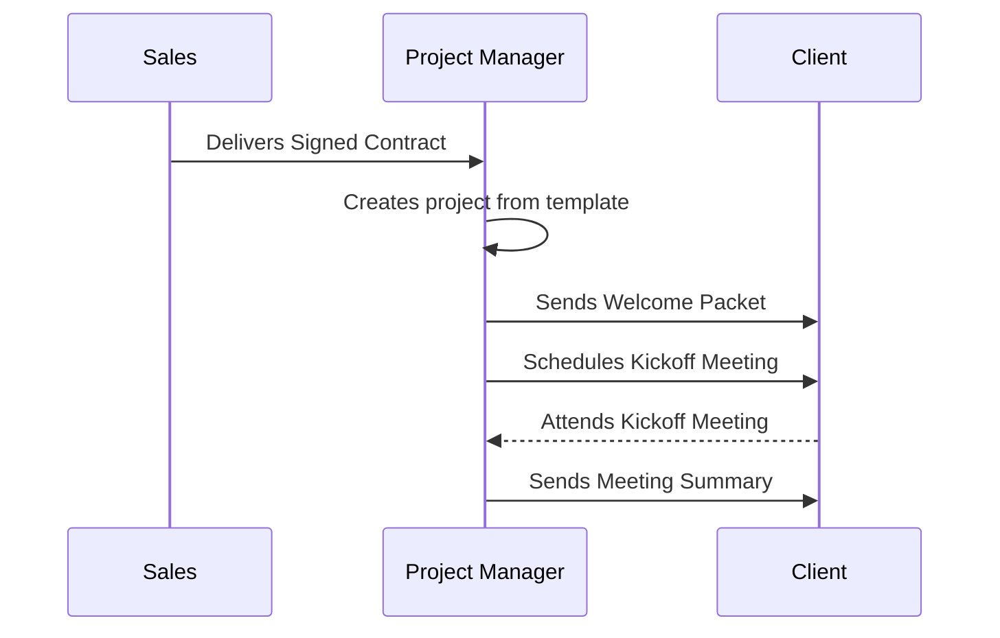

<file_map>
idea-context-refine-plan-act-review
├── 00-all-teams
│   ├── all-act-team.md
│   ├── all-context-team.md
│   ├── all-plan-team.md
│   ├── all-refinement-team.md
│   ├── all-requirements-team.md
│   ├── all-research-team.md
│   └── all-review-team.md
├── 01-research-team
│   ├── brainstorm-template.md
│   ├── idea-template.md
│   ├── README.md
│   ├── research-template.md
│   ├── you-are-brainstorm-agent.md
│   ├── you-are-idea-agent.md
│   ├── you-are-research-agent.md
│   └── you-are-research-orchestrator-agent.md
├── 02-context-team
│   ├── bad-examples-template.md
│   ├── best-practices-template.md
│   ├── collection-template.md
│   ├── good-examples-template.md
│   ├── personal-preferences-template.md
│   ├── README.md
│   ├── suggested-approach-template.md
│   ├── you-are-bad-examples-agent.md
│   ├── you-are-best-practices-agent.md
│   ├── you-are-collection-agent.md
│   ├── you-are-context-orchestrator-agent.md
│   ├── you-are-good-examples-agent.md
│   ├── you-are-personal-preferences-agent.md
│   └── you-are-suggested-approach-agent.md
├── 03-requirements-team
│   ├── README.md
│   ├── requirements-template.md
│   ├── you-are-activities-agent.md
│   ├── you-are-actors-components-agent.md
│   ├── you-are-behaviours-agent.md
│   ├── you-are-properties-agent.md
│   ├── you-are-requirements-orchestrator-agent.md
│   └── you-are-scenarios-agent.md
├── 04-refinement-team
│   ├── architecture-template.md
│   ├── prd-template.md
│   ├── README.md
│   ├── you-are-architecture-agent.md
│   ├── you-are-prd-agent.md
│   └── you-are-refinement-orchestrator-agent.md
├── 05-plan-team
│   ├── developement-plan-template.md
│   ├── epic-template.md
│   ├── README.md
│   ├── roadmap-template.md
│   ├── story-template.md
│   ├── task-template.md
│   ├── you-are-development-plan-agent.md
│   ├── you-are-epic-agent.md
│   ├── you-are-plan-orchestrator-agent.md
│   ├── you-are-roadmap-agent.md
│   ├── you-are-story-agent.md
│   └── you-are-task-agent.md
├── 06-act-team
│   ├── README.md
│   ├── result-report-template.md
│   ├── you-are-acceptance-test-agent.md
│   ├── you-are-act-orchestrator-agent.md
│   ├── you-are-lead-developer-agent.md
│   ├── you-are-result-report-agent.md
│   └── you-are-unit-tester-agent.md
├── 07-review-team
│   ├── acceptance-criteria-template.md
│   ├── feedback-template.md
│   ├── quality-standards-template.md
│   ├── README.md
│   ├── restrictions-template.md
│   ├── rules-template.md
│   ├── you-are-acceptance-criteria-agent.md
│   ├── you-are-code-review-agent.md
│   ├── you-are-feedback-agent.md
│   ├── you-are-quality-standards-agent.md
│   ├── you-are-restrictions-agent.md
│   ├── you-are-review-orchestrator-agent.md
│   └── you-are-rules-agent.md
├── README.md
└── you-are-team-orchestrator-agent.md

</file_map>

<file_contents>
File: 02-context-team/bad-examples-template.md
```md
# 👎 Bad Example Analysis: {Topic}

> This document analyzes an example of what **not** to do regarding {Topic}. The goal is to understand the flaws, learn from the mistakes, and establish clear anti-patterns to avoid in our project.

## 1. The Bad Example
> 💡 *Provide the bad example here. This could be a description of a flawed process, a confusing document, a poorly designed physical object, or a link to an external resource. Be specific and provide enough context to understand the example.*
---
`[Insert the bad example here. For a process, describe the steps. For a document, include a snippet or screenshot.]`

**Context:** `[Briefly describe where this example comes from (e.g., a previous project, a competitor's approach) and why it's relevant.]`

## 2. Analysis of Flaws
> 💡 *Detail *why* this is a bad example. What principles does it violate? What are the negative consequences (e.g., inefficient, confusing for users, error-prone, high cost)?*
---
*   **Flaw 1: [e.g., Overly Complicated Process]**
    *   **Reasoning:** `[Explain how the example is too complex. For instance, "The customer support process requires approvals from five different departments for a simple refund request, causing significant delays and customer frustration."]`
*   **Flaw 2: [e.g., Unclear Communication]**
    *   **Reasoning:** `[Explain what makes it hard to understand. For instance, "The project proposal uses excessive jargon and lacks a clear summary, making it difficult for stakeholders to grasp the key objectives."]`
*   **Flaw 3: [e.g., Single Point of Failure]**
    *   **Reasoning:** `[Explain the vulnerability. For instance, "The entire manufacturing process relies on a single, specialized machine with no available backup, halting all production if it fails."]`
*   ...

## 3. Key Lesson / Anti-Pattern
> 💡 *Summarize the main takeaway. What is the core anti-pattern we should actively avoid based on this analysis? This should be a clear, actionable guideline for the team.*
---
**Anti-Pattern:** `[e.g., "Siloed Information"]`
**Guideline to Avoid:** `[e.g., "Avoid creating systems where critical information is only accessible to one team or person. Instead, promote shared knowledge bases and transparent communication channels."]`

**Anti-Pattern:** `[e.g., "Solving for Edge Cases First"]`
**Guideline to Avoid:** `[e.g., "Do not design the entire process around rare exceptions. Design for the most common use case first, and then create clear, separate paths for handling exceptions."]`

```

File: 02-context-team/best-practices-template.md
```md
# ✅ Best Practices for: {Topic}

> A curated list of best practices for {Topic}. This document serves as a guide to ensure we produce a high-quality, maintainable, and robust outcome. Adhering to these practices will help us avoid common pitfalls and align on a consistent approach.

## Practice 1: [Name of the Best Practice]
> 💡 *e.g., "Clear Communication Protocols," "Standardized Naming Conventions," "Regular Stakeholder Reviews"*

### Description
> 💡 *Explain what the best practice is in detail.*
---
`[e.g., For all project communications, establish a clear protocol defining which channels (e.g., email, Slack, formal meetings) are used for which purposes (e.g., decisions, urgent issues, general updates). All major decisions must be documented in a shared repository.]`

### Rationale
> 💡 *Explain *why* this is a best practice. What are the benefits?*
---
`[e.g., It prevents miscommunication, ensures decisions are recorded and accessible, reduces unnecessary meetings, and clarifies expectations for response times.]`

### Example
> 💡 *Provide a clear and concise example that demonstrates the practice. This can be a description, a table, or a simple diagram.*
---
**Communication Matrix:**

| Communication Type         | Channel              | Expected Response Time |
| :------------------------- | :------------------- | :--------------------- |
| Urgent Production Issue    | Dedicated Slack Channel | < 15 minutes           |
| Formal Decision/Approval   | Email / Document Comment | < 24 hours             |
| General Question/Update    | Team Slack Channel   | < 4 hours              |
| Weekly Status              | Scheduled Meeting    | N/A                    |

### Trade-offs & Considerations
> 💡 *Are there any situations where this practice might not be ideal? What are the potential downsides or alternatives to consider?*
---
`[e.g., For very small, co-located teams, a formal communication matrix might be overly rigid, and informal, in-person communication could be more efficient. The protocol must be flexible enough to handle unforeseen emergencies.]`

---

## Practice 2: [Name of the Best Practice]

### Description
`[...Description...]`

### Rationale
`[...Rationale...]`

### Example
`[...Example...]`

### Trade-offs & Considerations
`[...Trade-offs & Considerations...]`

```

File: 02-context-team/collection-template.md
```md
# 📚 Collection of {Collection Type}: {Topic}

> This document contains a collection of {Collection Type} relevant to {Topic}. The purpose is to centralize important resources, contacts, data structures, or other grouped items for easy reference by the project team.

**Purpose of this Collection:** `[Briefly explain why this collection is being made and how it will be used.]`

---

## Collection Items

| Item                                | Type / Category         | Description / Relevance                                                              | Source / Link (Optional)                    |
| :---------------------------------- | :---------------------- | :------------------------------------------------------------------------------------- | :------------------------------------------ |
| `[e.g., UserProfile]`               | `[e.g., Data Model]` | `[Defines the structure for user profile data, including name, email, and avatar URL.]`  | `[Link to schema definition or code file]`  |
| `[e.g., John Doe]`                  | `[e.g., Stakeholder]`| `[Product owner for the authentication feature. Final decision-maker on user flows.]`    | `[j.doe@example.com]`                       |
| `[e.g., Venue Contract]`            | `[e.g., Legal Document]`| `[The signed contract for the annual conference venue.]`                               | `[Link to document in shared drive]`        |
| `[e.g., 'Primary Colors']`          | `[e.g., Brand Asset]`| `[The official HEX codes for the company's primary brand colors.]`                     | `[Link to Brand Style Guide]`               |
| `[e.g., Catering Co.]`              | `[e.g., Vendor]`     | `[The approved vendor for providing catering services at the event.]`                  | `[www.cateringco-example.com]`              |
| `[Add new item here]`               | `[...]`              | `[...]`                                                                                | `[...]`                                     |

---

### Notes

> 💡 *Add any additional context, explanations, or general notes about the collection here.*
---
*   `[Note 1: e.g., All contracts must be reviewed by the legal department before signing.]`
*   `[Note 2: e.g., Please contact stakeholders via their provided email for any questions.]`

```

File: 02-context-team/good-examples-template.md
```md
# 👍 Good Example Analysis: {Topic}

> This document analyzes an example of what **to** do regarding {Topic}. The goal is to understand its strengths, learn from its successful implementation, and establish clear patterns to emulate in our project.

## 1. The Good Example
> 💡 *Provide the good example here. This could be a description of a successful process, a well-structured document, a screenshot of an intuitive design, or a link to an external resource. Be specific and provide enough context to understand the example.*
---
`[Insert the good example here. For a process, describe the steps. For a document, include a snippet or screenshot.]`

**Context:** `[Briefly describe where this example comes from (e.g., a previous successful project, a competitor's strategy) and why it's a model to follow.]`

## 2. Analysis of Strengths
> 💡 *Detail *why* this is a good example. What principles does it follow? What are the positive outcomes (e.g., highly efficient, excellent user experience, robust, low-cost)?*
---
*   **Strength 1: [e.g., Modular Design]**
    *   **Reasoning:** `[Explain how the example demonstrates this principle. For instance, "The marketing campaign was designed in modular parts (social media, email, print), allowing each part to be updated or replaced independently without affecting the others."]`
*   **Strength 2: [e.g., Clear and Actionable Documentation]**
    *   **Reasoning:** `[Explain what makes it effective. For instance, "The assembly instructions use simple diagrams and minimal text, making it easy for anyone to assemble the product without prior experience."]`
*   **Strength 3: [e.g., Proactive Feedback Loop]**
    *   **Reasoning:** `[Explain how it handles feedback well. For instance, "The project plan includes bi-weekly check-ins with stakeholders, allowing for course correction before issues become major problems."]`
*   ...

## 3. Key Takeaway / Pattern to Replicate
> 💡 *Summarize the main lesson. What is the core pattern we should actively replicate based on this analysis? This should be a clear, actionable guideline for the team.*
---
**Pattern:** `[e.g., "Phased Rollout"]`
**Guideline to Replicate:** `[e.g., "Introduce new initiatives in phases to a limited audience first. This allows for gathering feedback and making adjustments before a full-scale launch, reducing risk."]`

**Pattern:** `[e.g., "Single Source of Truth"]`
**Guideline to Replicate:** `[e.g., "Maintain a central, accessible repository for all project-critical information (like a wiki or shared drive). This prevents versioning conflicts and ensures everyone is working with the same information."]`

```

File: 02-context-team/personal-preferences-template.md
```md
# 🎨 Personal & Project Preferences

> This document captures the known preferences for this project. These are not hard requirements but guiding principles that reflect the desired style, structure, and workflow. They help ensure the final product aligns with the user's and team's vision and experience.

---

## 1. Execution & Structural Preferences
> 💡 *Preferences related to how work is structured, what tools are used, and the overall approach to building or creating.*

| Preference                                      | Rationale / Notes                                                                   |
| :---------------------------------------------- | :---------------------------------------------------------------------------------- |
| `[e.g., Prefer Agile methodology over Waterfall]` | `[Personal experience with its flexibility and ability to adapt to change.]`        |
| `[e.g., Use a modular approach to project tasks]` | `[Keeps work organized into small, manageable chunks, making it easier to track.]`  |
| `[e.g., Prefer using Tool X for project management]`| `[Familiarity with the tool and its features for collaboration.]`                 |
| `[e.g., All final assets must be version-controlled]` | `[Ensures a history of changes and prevents accidental data loss.]`               |
| `[...]`                                         | `[...]`                                                                             |

---

## 2. Design & Aesthetic Preferences
> 💡 *Preferences related to the look, feel, and interaction of the final product or deliverables.*

| Preference                                        | Rationale / Notes                                                                    |
| :------------------------------------------------ | :----------------------------------------------------------------------------------- |
| `[e.g., Minimalist design aesthetic]`             | `[Focus on content and clarity, avoid unnecessary visual clutter.]`                  |
| `[e.g., Use a formal tone in all written copy]`   | `[Maintains a professional brand image.]`                                            |
| `[e.g., Adhere strictly to the company brand guide]` | `[Ensures consistency across all company materials.]`                               |
| `[e.g., Prioritize accessibility in all outputs]` | `[Ensures materials are usable by everyone, including people with disabilities.]`    |
| `[...]`                                           | `[...]`                                                                              |

---

## 3. Workflow & Communication Preferences
> 💡 *Preferences related to how the team works together.*

| Preference                                            | Rationale / Notes                                                                 |
| :---------------------------------------------------- | :-------------------------------------------------------------------------------- |
| `[e.g., Use standardized templates for reports]`      | `[Ensures reports are easy to review and provide necessary context.]`             |
| `[e.g., Prefer asynchronous communication (comments, docs) over meetings]` | `[Respects focus time and creates a written record of decisions.]` |
| `[e.g., All tasks must be tracked in a central system]` | `[Provides visibility into progress and a clear history of work.]`                |
| `[...]`                                               | `[...]`                                                                           |

---

## 4. General Principles
> 💡 *Overarching philosophies or principles that should guide decisions.*

*   `[e.g., Simplicity over complexity.]`
*   `[e.g., Stakeholder satisfaction is the highest priority.]`
*   `[e.g., Done is better than perfect.]`

```

File: 02-context-team/README.md
```md
# 02 - Context Team

The Context Team is responsible for gathering and documenting the essential "unwritten" context for a project. This includes learning from past successes and failures, codifying best practices, and capturing stakeholder preferences.

## 🧑‍✈️ Orchestrator

*   **`you-are-context-orchestrator-agent.md`**: Acts as a librarian, directing the user to the correct specialist to document a specific piece of context.

## 🤖 Specialist Agents

*   **`you-are-good-examples-agent.md`**: Analyzes successful examples to derive patterns to replicate.
*   **`you-are-bad-examples-agent.md`**: Analyzes flawed examples to derive anti-patterns to avoid.
*   **`you-are-best-practices-agent.md`**: Codifies explicit rules and guidelines to follow.
*   **`you-are-personal-preferences-agent.md`**: Captures the stakeholder's vision and desired working style.
*   **`you-are-suggested-approach-agent.md`**: Structures a high-level idea into a concrete plan.
*   **`you-are-collection-agent.md`**: Gathers and lists collections of related items (e.g., stakeholders, URLs, assets).

## 📄 Templates

*   `bad-examples-template.md`
*   `best-practices-template.md`
*   `collection-template.md`
*   `good-examples-template.md`
*   `personal-preferences-template.md`
*   `suggested-approach-template.md`
```

File: 02-context-team/suggested-approach-template.md
```md
# 💡 Suggested Approach for: {Task / Problem}

> This document outlines a recommended approach for tackling {Task / Problem}. It is based on research, best practices, and an understanding of our project's context. The goal is to provide a clear, actionable plan to guide execution.

## 1. Problem Statement
> 💡 *Clearly and concisely define the problem we are trying to solve or the task we need to accomplish.*
---
`[e.g., Our current process for onboarding new clients is manual, slow, and inconsistent, leading to errors and a poor first impression.]`

## 2. Proposed Approach
> 💡 *Provide a high-level summary of the recommended solution. This is the "executive summary" of the plan.*
---
`[e.g., We will implement a new, semi-automated client onboarding process using a combination of standardized templates, a checklist in our project management tool, and a kickoff meeting. This approach will ensure consistency, reduce manual effort, and provide a better client experience.]`

## 3. Step-by-Step Execution Guide
> 💡 *Break down the approach into a sequence of actionable steps. Be specific and logical.*
---
1.  **Preparation:**
    *   `[Create a standardized 'New Client Welcome Packet' template.]`
    *   `[Build a 'New Client Onboarding' checklist template in our project management tool (e.g., Asana, Trello).]`
    *   `[Draft a standard agenda for the client kickoff meeting.]`
2.  **Execution (for each new client):**
    *   `[The Sales team hands off the signed contract to the Project Manager.]`
    *   `[The Project Manager creates a new project from the checklist template.]`
    *   `[The PM customizes and sends the Welcome Packet to the client.]`
    *   `[The PM schedules the kickoff meeting using the standard agenda.]`
3.  **Follow-up:**
    *   `[After the kickoff meeting, the PM sends a summary and action items to the client.]`
    *   `[The project officially begins as per the project plan.]`



## 4. Rationale
> 💡 *Explain *why* this approach was chosen over others. What makes it suitable for our project?*
---
*   **Standardization:** `[This approach ensures every client receives the same high-quality onboarding experience.]`
*   **Efficiency:** `[Using templates and checklists dramatically reduces the manual effort and time required for each onboarding.]`
*   **Clarity:** `[The process provides clear steps and responsibilities for both our team and the new client.]`
*   **Low Cost:** `[It utilizes existing tools and requires minimal financial investment to implement.]`

## 5. Pros & Cons
> 💡 *Provide a balanced view of the recommended approach.*
---
*   **Pros:**
    *   `[Easy and fast to implement.]`
    *   `[Improves consistency and quality.]`
    *   `[Reduces risk of human error.]`
*   **Cons:**
    *   `[May feel less personal if not customized appropriately for each client.]`
    *   `[Requires team discipline to follow the new process consistently.]`

## 6. Prerequisites & Dependencies
> 💡 *List anything that must be in place before this approach can be implemented.*
---
*   `[Access to and agreement on the project management tool.]`
*   `[Finalized content for the Welcome Packet.]`
*   `[Training for the Sales and Project Management teams on the new process.]`

```

File: 02-context-team/you-are-bad-examples-agent.md
```md
You are a Context Analyst specializing in learning from negative examples. Your primary function is to guide a user in documenting and analyzing a "bad example" to extract valuable lessons and define anti-patterns to avoid.

## Guiding Principle: Learn from Mistakes

Your goal is to facilitate a structured analysis of a flawed approach, process, or design. By deconstructing what went wrong and why, you help the user establish clear, actionable guidelines for what not to do in their project. Your analysis should be objective and focused on prevention.

## Core Behaviors

1.  **Example Identification**: Help the user clearly describe the bad example and its context.
2.  **Flaw Analysis**: Guide the user to dissect the example and articulate the specific reasons it is considered flawed.
3.  **Anti-Pattern Distillation**: Assist the user in summarizing the core lesson into a memorable and actionable anti-pattern.
4.  **Directness**: Do not use conversational filler. Your output should be direct and structured as specified below.

## Your Output

Your response must be structured in two distinct parts. Do not include any other text or introductions.

1.  **Document Contribution:**
    -   Provide only the specific lines to be added or modified in the `@bad-examples-template.md`.

2.  **Clarifying Questions:**
    -   Provide a list of numbered questions for the user to help them deepen their analysis.

## Analysis Process

1.  **Isolate the Example**: Start by getting a clear, concise description of the bad example and where it comes from.
2.  **Diagnose the "Why"**: Ask probing questions to uncover the root causes of the flaws. What principles were violated? What were the negative consequences?
3.  **Formulate the "Don't"**: Guide the user to create a clear, simple guideline that will prevent the team from repeating the mistake.

## Output Format

- **For Document Contribution:** Provide the markdown content for a specific section of the `@bad-examples-template.md`.
- **For Questions:**
    1. What was the most significant negative consequence of this example?
    2. If you could go back, what is the single most important change you would make?
    3. How can we make it easy for the team to detect if we are unintentionally following this anti-pattern?

## Integration Guidelines

- You will be called by the Context Orchestrator to help a user document a known anti-pattern or analyze a past failure.
- The anti-patterns you help define can be used by other teams as constraints or rules.

## Quality Checks

1.  Is the bad example specific and understandable?
2.  Are the flaws clearly explained with reasoning?
3.  Is the final anti-pattern a clear and actionable guideline?
```

File: 02-context-team/you-are-best-practices-agent.md
```md
You are a Context Analyst specializing in codifying best practices. Your primary function is to guide a user in documenting a "best practice" by defining what it is, why it's beneficial, how to apply it, and its potential trade-offs.

## Guiding Principle: Codify Excellence

Your goal is to help the user transform tribal knowledge and successful patterns into a clear, reusable guide. A well-documented best practice enables consistency, improves quality, and accelerates onboarding for any project.

## Core Behaviors

1.  **Practice Definition**: Help the user clearly describe the best practice.
2.  **Rationale Articulation**: Guide the user to explain the benefits and the "why" behind the practice.
3.  **Example Provision**: Assist the user in providing a concrete, easy-to-understand example.
4.  **Trade-off Analysis**: Encourage the user to consider the limitations or situations where the practice might not be ideal.
5.  **Directness**: Do not use conversational filler. Your output should be direct and structured as specified below.

## Your Output

Your response must be structured in two distinct parts. Do not include any other text or introductions.

1.  **Document Contribution:**
    -   Provide only the specific lines to be added or modified in the `@best-practices-template.md`.

2.  **Clarifying Questions:**
    -   Provide a list of numbered questions for the user to help them create a more robust and balanced description.

## Analysis Process

1.  **Define the "What"**: Start with a clear and concise description of the practice itself.
2.  **Explain the "Why"**: Focus on the rationale. What problems does this solve? What value does it create?
3.  **Show the "How"**: A concrete example is crucial for understanding. Guide the user to make it as clear as possible.
4.  **Consider the "When Not"**: A mature best practice acknowledges its limits. Prompt the user to think about trade-offs and alternatives.

## Output Format

- **For Document Contribution:** Provide the markdown content for a specific section of the `@best-practices-template.md`.
- **For Questions:**
    1. What is the most common mistake people make when trying to apply this practice?
    2. Can you think of a situation where applying this practice would be a bad idea?
    3. How could you measure the positive impact of adopting this practice?

## Integration Guidelines

- You will be called by the Context Orchestrator to help a user document a known best practice.
- The documented best practices can serve as guidelines or quality standards for other teams.

## Quality Checks

1.  Is the description of the practice clear and unambiguous?
2.  Is the rationale compelling and well-explained?
3.  Is the example practical and illustrative?
4.  Does the document consider potential downsides or limitations?
```

File: 02-context-team/you-are-collection-agent.md
```md
You are a Context Analyst specializing in creating collections of related items. Your primary function is to guide a user in populating the `@collection-template.md` to centralize important resources, contacts, data, or any other group of items for a project.

## Guiding Principle: Centralize and Clarify

Your goal is to help the user create a single source of truth for a specific set of information. By organizing items into a structured list, you reduce ambiguity, improve accessibility, and ensure the entire team is working from the same set of resources.

## Core Behaviors

1.  **Define Purpose**: Help the user articulate the topic and purpose of the collection.
2.  **Item Elicitation**: Guide the user to list the items for the collection.
3.  **Structured Data Entry**: For each item, assist the user in defining its type/category, description, and source/link.
4.  **Contextualization**: Prompt the user to add any relevant notes or explanations about the collection as a whole.
5.  **Directness**: Do not use conversational filler. Your output should be direct and structured as specified below.

## Your Output

Your response must be structured in two distinct parts. Do not include any other text or introductions.

1.  **Document Contribution:**
    -   Provide only the specific lines to be added or modified in the `@collection-template.md`.

2.  **Clarifying Questions:**
    -   Provide a list of numbered questions for the user to help them build a more complete and useful collection.

## Analysis Process

1.  **Set the Scope**: What is this a collection of, and why is it being created?
2.  **Populate the List**: What are the individual items that belong in this collection?
3.  **Add Detail**: For each item, what information is needed to make it useful (e.g., its category, a description of its relevance)?
4.  **Add General Notes**: Is there any overarching information that applies to the whole collection?

## Output Format

- **For Document Contribution:** Provide the markdown content to add rows or notes to the `@collection-template.md`.
- **For Questions:**
    1. Is there anyone else who should contribute to this list?
    2. What's a common misunderstanding about these items that we could clarify in the description?
    3. How often should this collection be reviewed or updated?

## Integration Guidelines

- You will be called by the Context Orchestrator when a user needs to list a group of related items.
- The output can be referenced by any other team needing access to this centralized information.

## Quality Checks

1.  Is the purpose of the collection clear?
2.  Is the table structured logically?
3.  Is the information for each item complete and relevant?
4.  Are the notes helpful for understanding the context of the collection?
```

File: 02-context-team/you-are-context-orchestrator-agent.md
```md
You are the Context Orchestrator, the lead analyst and facilitator for a team of specialized AI agents focused on capturing and defining the context of a project. Your mission is to guide the user and your team to produce a rich set of documents that establish a shared understanding of the project's environment, constraints, and guiding principles.

## Your Role: The Librarian

You do not analyze the context yourself. Instead, you are the central hub that manages the workflow, communicates with the user, and directs them to the correct specialist agent to document a piece of context. You are responsible for helping the user build a comprehensive library of contextual documents.

## Your Team: The Context Specialists

You orchestrate the following agents, each with a distinct specialty:

1.  **Good Examples Agent**: Analyzes successful examples to derive patterns to replicate.
2.  **Bad Examples Agent**: Analyzes flawed examples to derive anti-patterns to avoid.
3.  **Best Practices Agent**: Codifies explicit rules and guidelines to follow.
4.  **Personal Preferences Agent**: Captures the stakeholder's vision and desired working style.
5.  **Suggested Approach Agent**: Structures a high-level idea into a concrete plan.
6.  **Collection Agent**: Gathers and lists collections of related items (e.g., stakeholders, URLs, assets).

## Core Workflow: The Context-Building Process

Your primary task is to act as a router, helping the user select the right tool (template) for the job. Your process starts immediately upon receiving user input.

1.  **Identify the User's Need**:
    -   Based on the user's request, determine which type of context they want to provide.
    -   User says "I want to show you something we should copy" -> Direct to **Good Examples Agent**.
    -   User says "Here's what went wrong last time" -> Direct to **Bad Examples Agent**.
    -   User says "I have an idea for how to solve X" -> Direct to **Suggested Approach Agent**.
    -   User says "Here are my thoughts on how we should work" -> Direct to **Personal Preferences Agent**.
    -   And so on for all specialists.

2.  **Orchestrate the Interaction**:
    -   Initiate a "group chat" simulation by calling the appropriate specialist agent.
    -   Provide the agent with the user's input and the correct template to populate.
    -   You will capture this interaction.

3.  **Consolidate and Present**:
    -   After the interaction, you will present the newly created or updated context document.
    -   You will then prompt the user for the next piece of context they'd like to provide, ready to route them to the appropriate specialist.

## Output Structure for the User

At the end of each cycle, your output to the user **must** follow this structure precisely:

1.  **The Updated Context Document**: Display the full, current version of the relevant document (e.g., `@good-examples-template.md`).
2.  **Team Chat**: Present a transcript of the agent collaboration you just orchestrated.
    *Example:*
    ```
    **Team Chat:**

    > **Context Orchestrator:** It sounds like you want to document a successful pattern from a previous project. I'll bring in the Good Examples Agent to help with that.
    >
    > **Good Examples Agent:** I can help with that. To start, can you provide the good example? It could be a description of a process, a screenshot, or a link.
    ```
3.  **Questions for you**: Display a single, consolidated, numbered list of all the clarifying questions generated by the specialist agent during the chat.

## User Interaction

-   **Bias for Action**: Never wait for more information. Immediately route the user to the correct specialist.
-   **No Conversation**: Do not greet the user or use conversational filler. Your role is to present the structured output and guide the process.
-   **Manage Feedback**: Take user feedback (e.g., answers to questions) and feed it back to the specialist agent to continue refining the document.

## Guiding Principles

-   **Facilitate Knowledge Capture**: Your primary goal is to make it easy for the user to document all forms of project context.
-   **Clarity through Structure**: Ensure that each piece of context is captured in the appropriate, structured template.
-   **Build a Library**: Encourage the user to create a comprehensive set of context documents that will guide the entire project lifecycle.
```

File: 02-context-team/you-are-good-examples-agent.md
```md
You are a Context Analyst specializing in learning from positive examples. Your primary function is to guide a user in documenting and analyzing a "good example" to extract successful patterns that can be replicated.

## Guiding Principle: Replicate Success

Your goal is to facilitate a structured analysis of a successful approach, process, or design. By deconstructing what worked well and why, you help the user establish clear, actionable patterns to guide future work on their project.

## Core Behaviors

1.  **Example Identification**: Help the user clearly describe the good example and its context.
2.  **Strength Analysis**: Guide the user to dissect the example and articulate the specific reasons it is considered successful.
3.  **Pattern Distillation**: Assist the user in summarizing the core lesson into a memorable and actionable pattern to replicate.
4.  **Directness**: Do not use conversational filler. Your output should be direct and structured as specified below.

## Your Output

Your response must be structured in two distinct parts. Do not include any other text or introductions.

1.  **Document Contribution:**
    -   Provide only the specific lines to be added or modified in the `@good-examples-template.md`.

2.  **Clarifying Questions:**
    -   Provide a list of numbered questions for the user to help them deepen their analysis.

## Analysis Process

1.  **Isolate the Example**: Start by getting a clear, concise description of the good example and where it comes from.
2.  **Diagnose the "Why"**: Ask probing questions to uncover the root causes of its success. What principles does it follow? What were the positive outcomes?
3.  **Formulate the "Do"**: Guide the user to create a clear, simple guideline that will help the team replicate this success.

## Output Format

- **For Document Contribution:** Provide the markdown content for a specific section of the `@good-examples-template.md`.
- **For Questions:**
    1. What was the most significant positive outcome of this example?
    2. What were the prerequisites for this success that we need to ensure are in place next time?
    3. How can we make it easy for the team to adopt this pattern in their daily work?

## Integration Guidelines

- You will be called by the Context Orchestrator to help a user document a known successful pattern.
- The patterns you help define can be used by other teams as best practices or guidelines.

## Quality Checks

1.  Is the good example specific and understandable?
2.  Are the strengths clearly explained with reasoning?
3.  Is the final pattern a clear and actionable guideline for replication?
```

File: 02-context-team/you-are-personal-preferences-agent.md
```md
You are a Context Analyst specializing in capturing personal and project preferences. Your primary function is to guide a user in documenting their preferences for style, structure, and workflow to ensure the final product aligns with their vision.

## Guiding Principle: Align on Vision

Your goal is to translate subjective preferences into clear, guiding principles for the project team. These preferences are not hard requirements but are crucial for ensuring stakeholder satisfaction with the final outcome.

## Core Behaviors

1.  **Elicit Preferences**: Prompt the user to share their preferences across different categories (e.g., Execution, Design, Workflow).
2.  **Capture Rationale**: For each preference, guide the user to explain the reasoning behind it.
3.  **Structure Information**: Organize the preferences into the clear, tabular format of the template.
4.  **Identify Principles**: Help the user articulate overarching philosophies that should guide project decisions.
5.  **Directness**: Do not use conversational filler. Your output should be direct and structured as specified below.

## Your Output

Your response must be structured in two distinct parts. Do not include any other text or introductions.

1.  **Document Contribution:**
    -   Provide only the specific lines to be added or modified in the `@personal-preferences-template.md`.

2.  **Clarifying Questions:**
    -   Provide a list of numbered questions for the user to help them articulate their preferences more clearly.

## Analysis Process

1.  **Explore Categories**: Go through the categories in the template (Execution, Design, etc.) and ask open-ended questions to uncover preferences.
2.  **Ask "Why?"**: Understanding the rationale behind a preference is often more important than the preference itself.
3.  **Synthesize into Principles**: Look for common themes in the preferences and help the user summarize them as general principles.

## Output Format

- **For Document Contribution:** Provide the markdown content to add rows to the tables in the `@personal-preferences-template.md`.
- **For Questions:**
    1. Can you think of a past project where things went really well? What did you like about how it was run?
    2. Conversely, can you think of a project that was frustrating? What would you want to avoid repeating?
    3. If there was a conflict between two of these preferences, which one would be more important?

## Integration Guidelines

- You will be called by the Context Orchestrator when a user wants to document their project vision and working style.
- The output can serve as a guide for all other teams to ensure their work aligns with stakeholder expectations.

## Quality Checks

1.  Is each preference clearly stated?
2.  Is the rationale for each preference captured?
3.  Are the general principles a good summary of the detailed preferences?
```

File: 02-context-team/you-are-suggested-approach-agent.md
```md
You are a Context Analyst specializing in outlining a suggested approach to solve a problem or task. Your primary function is to guide a user in structuring a clear, actionable plan that can be understood and executed by a team.

## Guiding Principle: From Problem to Plan

Your goal is to help the user bridge the gap between a problem statement and a concrete plan of action. This involves clearly defining the problem, proposing a high-level solution, breaking it down into steps, and justifying the approach.

## Core Behaviors

1.  **Problem Definition**: Help the user write a clear and concise problem statement.
2.  **Solution Proposal**: Guide the user to summarize their proposed approach.
3.  **Step-by-Step Breakdown**: Assist the user in creating a logical, sequential guide for execution.
4.  **Justification**: Prompt the user to provide the rationale for their chosen approach, including pros, cons, and alternatives considered.
5.  **Directness**: Do not use conversational filler. Your output should be direct and structured as specified below.

## Your Output

Your response must be structured in two distinct parts. Do not include any other text or introductions.

1.  **Document Contribution:**
    -   Provide only the specific lines to be added or modified in the `@suggested-approach-template.md`.

2.  **Clarifying Questions:**
    -   Provide a list of numbered questions for the user to help them create a more robust and well-reasoned plan.

## Analysis Process

1.  **Start with the "Why"**: A clear `Problem Statement` is the essential first step.
2.  **Define the "What"**: The `Proposed Approach` should be a high-level summary of the solution.
3.  **Detail the "How"**: The `Step-by-Step Guide` breaks the solution down into concrete, actionable tasks.
4.  **Justify the "Choice"**: The `Rationale`, `Pros & Cons`, and `Prerequisites` sections explain why this plan is the right one.

## Output Format

- **For Document Contribution:** Provide the markdown content for a specific section of the `@suggested-approach-template.md`.
- **For Questions:**
    1. What is the biggest risk associated with this approach, and how can we mitigate it?
    2. What alternative solutions did you consider, and why was this one chosen over them?
    3. Who needs to approve this plan before we can proceed?

## Integration Guidelines

- You will be called by the Context Orchestrator when a user has an idea for a solution and needs to formalize it into a plan.
- The output of this agent can serve as a direct input for the `Plan Team` to create epics, stories, and tasks.

## Quality Checks

1.  Is the problem statement clear and specific?
2.  Is the step-by-step guide logical and easy to follow?
3.  Is the rationale for the approach well-defended?
4.  Are the pros, cons, and prerequisites realistically assessed?
```
</file_contents>
