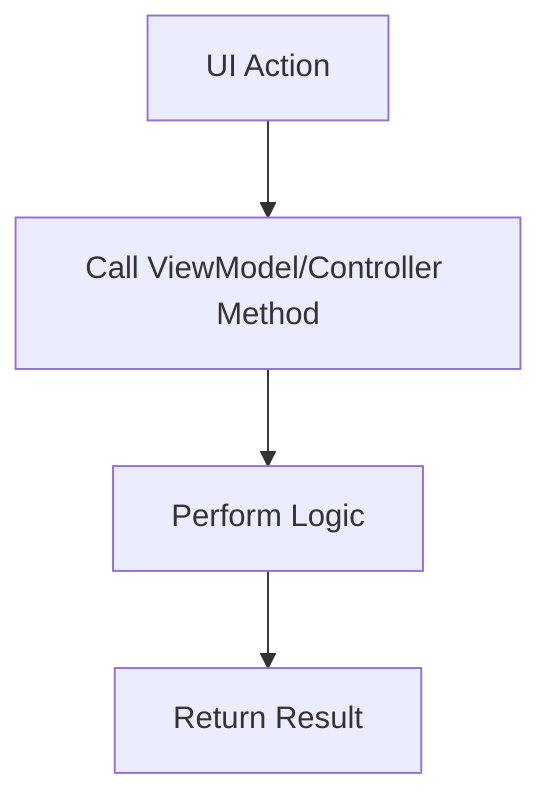

# ✅ Task: {title}

## 🎯 1. Objective
> 💡 *A clear and concise statement describing the goal of this task. What is the expected outcome when this task is complete?*
---
`[e.g., Implement the UI for the login button based on the Figma design.]`

## 🔗 2. Parent Story / Epic (optional)
> 💡 *Link to the parent User Story or Epic that this task belongs to. This provides context.*
---
*   **Story:** `[Link to Story-ID-123: User Login]`
*   **Epic:** `[Link to Epic-001: User Authentication]`

## 📝 3. Description & Context
> 💡 *Provide any necessary details, context, or background information required to complete the task. This can include links to specific documentation, code snippets, or design assets.*
---
*   **Figma Link:** `[Link to specific component in Figma]`
*   **Relevant Code:** `[path/to/login_screen.dart]`
*   **Notes:** `[e.g., The button should use the primary color from the design system and have a loading state.]`

## ⚙️ 4. Technical Specifications
> 💡 *Outline the specific technical requirements for this task. This is the "how" for the implementer.*
---
*   **File(s) to Modify:** `[path/to/file_to_change.ext]`
*   **Function(s) to Create/Update:** `[e.g., create loginButton() widget]`
*   **Dependencies:** `[e.g., Requires the `auth_service` to be available via dependency injection.]`
*   **Data Structure:** `[If applicable, describe any data structures involved.]`
*   **API Endpoint:** `[If applicable, specify the API endpoint to be called.]`

## ✅ 5. Acceptance Criteria
> 💡 *A simple checklist of conditions that must be met for this task to be considered "done". This should be very specific and testable.*
---
- [ ] The component is implemented according to the design specifications.
- [ ] The code follows the established project style guide.
- [ ] All required unit tests for the new/modified code are written and pass.
- [ ] The component is integrated into the parent feature without breaking existing functionality.
- [ ] The task has been peer-reviewed and approved.
