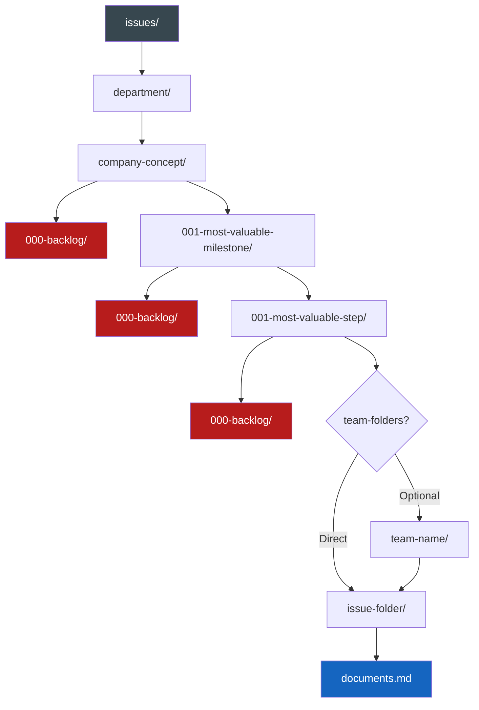
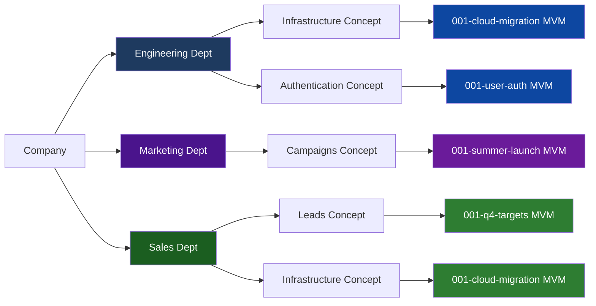
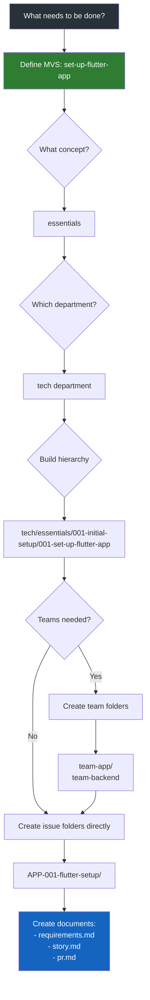
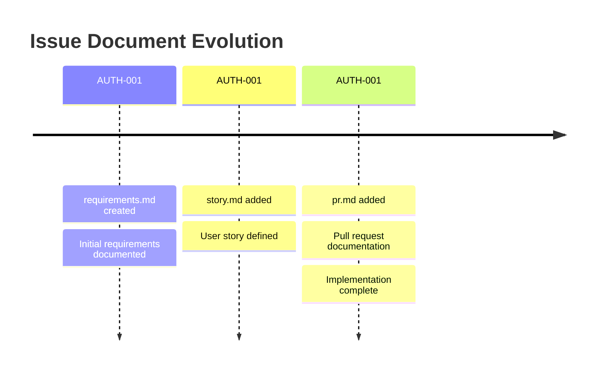

# 📋 Issue Creation Instructions

> 💡 *Standard guidelines for creating and organizing issues across all workflows*

## 📁 Issue Organization

Issues follow the MVPM structure:
```
issues/{department}/{company-concept}/{most-valuable-milestone}/{most-valuable-step}/{team-folders(optional)}/{issue-folder}/{documents}.md
```

### Structure Flow Diagram



## 📝 Naming Components

- `{department}` - Top-level organizational unit (e.g., tech, marketing, sales, operations)
- `{company-concept}` - Core business concept or domain area
- `{most-valuable-milestone}` - MVM - Format: `{number}-{description}` (e.g., 001-user-auth, 002-payment-system)
    - Numbered in priority order (001 is most important)
    - Each MVM folder should contain a `000-backlog` folder for future items
- `{most-valuable-step}` - MVS - Format: `{number}-{description}` (e.g., 001-jwt-implementation, 002-session-management)
    - Numbered in priority order within the milestone
    - Each MVS folder should contain a `000-backlog` folder for future items
- `{team-folders}` - Optional team folders for parallel work (only when teams need clear separation)
- `{issue-folder}` - Folder named: `{company-concept-code}-{number}-{description}`
    - `{company-concept-code}` - Uppercase 3-letter abbreviation for the company concept (e.g., AUTH for authentication, PAY for payments)
    - `{number}` - Zero-padded three-digit GitHub issue number (001, 002, 003)
    - `{description}` - Kebab-case description of the issue
- `{documents}` - Document files within the issue folder: `{company-concept-code}-{number}-{description}-{type}.md`
    - `{type}` - Local document type (requirements, story, epic, pr, bug, enhancement, etc.)
    - Note: Each document uses the same GitHub issue number, allowing chronological tracking within the folder

## 🎯 Most Valuable Project Management (MVPM)

We determine directories by their ability to be worked on in parallel - this enables both humans and AI agents to work simultaneously on different parts of the project without conflicts. Each directory represents an independent work stream that can progress without blocking others.

### Directory Structure Philosophy
App essentials - usually a department should be at top level. Given departments usually work in parallel as a given. Team folders are optional and should only be created when multiple teams need to work on clearly separated tickets within the same MVS. If tickets can be worked on by any team member or don't require strict team separation, avoid team folders to reduce overhead.

### Parallel Work Visualization



Note: Departments can work on the same milestone (e.g., Engineering and Sales both working on cloud-migration) or completely different milestones based on their priorities.

### When Overwhelmed: Start with MVS
If it feels overwhelming to define the whole structure, start with the next MVS (Most Valuable Step) to reduce cognitive overload.

### Example Workflow:
1. **What needs to be done?** → set-up-flutter-app
2. **What subject/concept?** → Parent folder → essentials/set-up-flutter-app
3. **Which department?** → Add above or below → tech/essentials/set-up-flutter-app OR essentials/tech/set-up-flutter-app
4. **Build the hierarchy** → Work backwards to establish MVM and company concept
5. **Any teams needed?** → Inside the closest categorizer combo (essentials & tech) → team-app/team-backend
6. **What should they do?** → Create issue folders
7. **Create documents** → Add evolving documents within issue folders

### Workflow Decision Tree



### Hierarchy Pattern:
```
{department} / {company-concept} / {most-valuable-milestone} / {most-valuable-step} / {team-folders(optional)} / {issue-folder} / {documents}
```

**Tree representation:**
```
issues/
└── {department}/
    └── {company-concept}/
        ├── 000-backlog/                    # Backlog for future milestones
        └── {001-most-valuable-milestone}/
            ├── 000-backlog/                # Backlog for future steps in this milestone
            └── {001-most-valuable-step}/
                ├── 000-backlog/            # Backlog for future issues in this step
                └── {team-folders}/         # Optional
                    └── {issue-folder}/     # e.g., AUTH-001-jwt-service/
                        ├── {document-1}    # e.g., AUTH-001-jwt-service-requirements.md
                        ├── {document-2}    # e.g., AUTH-001-jwt-service-story.md
                        └── {document-3}    # e.g., AUTH-001-jwt-service-pr.md
```

Examples:

### Issue Evolution Timeline



**Full hierarchy tree:**
```
issues/
└── engineering/
    └── authentication/                   # Company concept
        ├── 000-backlog/                  # Future milestones
        └── 001-user-auth/                # MVM (highest priority)
            ├── 000-backlog/              # Future steps
            └── 001-jwt-implementation/   # MVS (highest priority)
                ├── 000-backlog/          # Future issues
                └── backend/              # Team (optional)
                    ├── AUTH-001-create-jwt-service/
                    │   ├── AUTH-001-create-jwt-service-requirements.md
                    │   ├── AUTH-001-create-jwt-service-story.md
                    │   └── AUTH-001-create-jwt-service-pr.md
                    ├── AUTH-002-token-validation/
                    │   └── AUTH-002-token-validation-issue.md
                    └── AUTH-003-refresh-logic/
                        ├── AUTH-003-refresh-logic-story.md
                        └── AUTH-003-refresh-logic-pr.md
```

**Department-level parallelization tree:**
```
issues/
├── engineering/
│   └── infrastructure/                   # Company concept
│       └── 001-cloud-migration/          # MVM
│           ├── 000-backlog/
│           └── 001-aws-setup/            # MVS (engineering working on AWS)
├── finance/
│   └── infrastructure/                   # Company concept
│       └── 001-cloud-migration/          # MVM
│           ├── 000-backlog/
│           └── 001-cost-analysis/        # MVS (finance working on costs)
└── security/
    └── infrastructure/                   # Company concept
        └── 001-cloud-migration/          # MVM
            ├── 000-backlog/
            └── 001-compliance-check/     # MVS (security working on compliance)
```

**Team-level parallelization tree:**
```
issues/
└── engineering/
    └── payments/                         # Company concept
        ├── 000-backlog/
        └── 001-checkout-flow/            # MVM
            ├── 000-backlog/
            └── 001-payment-processing/   # MVS
                ├── 000-backlog/
                ├── frontend/              # Teams working in parallel
                │   ├── PAY-001-cart-component/
                │   │   └── PAY-001-cart-component-story.md
                │   └── PAY-002-payment-form/
                │       ├── PAY-002-payment-form-requirements.md
                │       └── PAY-002-payment-form-issue.md
                ├── backend/
                │   ├── PAY-003-stripe-integration/
                │   │   ├── PAY-003-stripe-integration-story.md
                │   │   └── PAY-003-stripe-integration-pr.md
                │   └── PAY-004-webhook-handler/
                │       └── PAY-004-webhook-handler-bug.md
                └── qa/
                    ├── PAY-005-e2e-tests/
                    │   └── PAY-005-e2e-tests-chore.md
                    └── PAY-006-load-testing/
                        └── PAY-006-load-testing-enhancement.md
```
