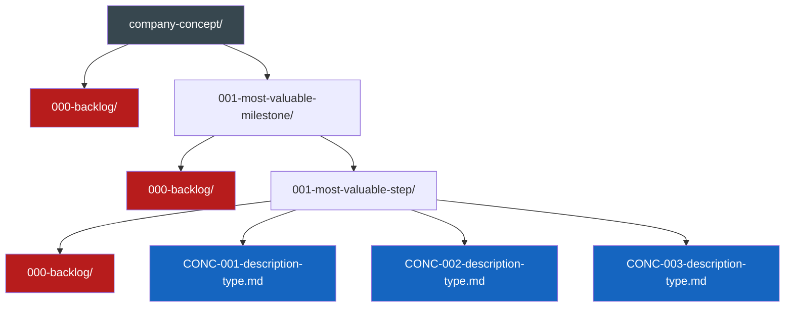
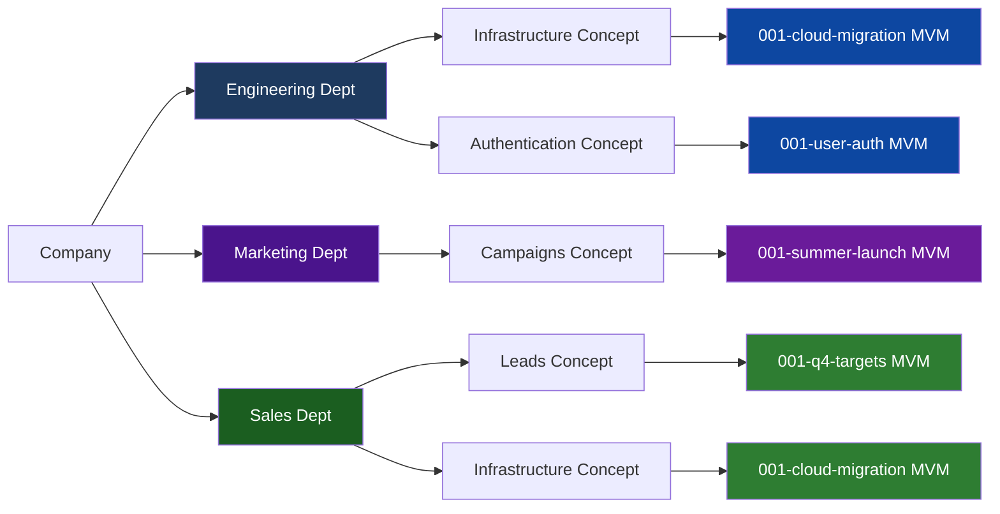
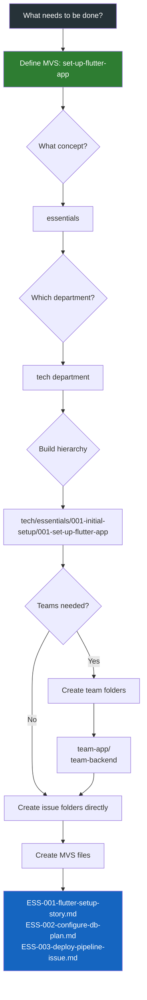
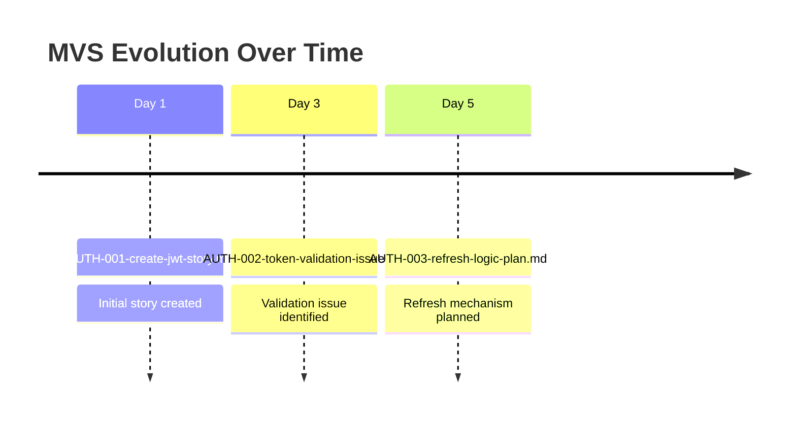

# 📋 Issue Creation Instructions

> 💡 *Standard guidelines for creating and organizing issues across all workflows*

## 📁 Issue Organization

Flexible structure based on parallel work:
```
{company-concept}/{most-valuable-milestone}/{most-valuable-step}.md
```
Company concepts can be inserted anywhere to enable parallel work.

### Structure Flow Diagram



## 📝 Naming Components

- `{company-concept}` - Any concept that can be worked on in parallel (can be inserted anywhere in hierarchy)
- `{most-valuable-milestone}` - MVM - Format: `{3-digit-number}-{description}` (e.g., 001-user-auth, 002-payment-system)
    - Chronologically ordered (earlier numbers must be considered first)
    - Zero-padded to 3 digits total
    - Each MVM folder may contain a `000-backlog` folder
- `{most-valuable-step}` - MVS - Format: `{CONCEPT}-{3-digit-number}-{description}-{type}.md`
    - `{CONCEPT}` - Max 4 character identifier (e.g., ESS for essentials, AUTH for authentication)
    - `{3-digit-number}` - Chronologically ordered by importance
    - `{description}` - Kebab-case descriptive name  
    - `{type}` - Document type (issue, story, plan, etc.)
    - Each MVS folder may contain a `000-backlog` folder

## 🎯 Most Valuable Project Management (MVPM)

We determine directories by their ability to be worked on in parallel - this enables both humans and AI agents to work simultaneously on different parts of the project without conflicts. Each directory represents an independent work stream that can progress without blocking others.

### Directory Structure Philosophy
App essentials - usually a department should be at top level. Given departments usually work in parallel as a given. Team folders are optional and should only be created when multiple teams need to work on clearly separated tickets within the same MVS. If tickets can be worked on by any team member or don't require strict team separation, avoid team folders to reduce overhead.

### Parallel Work Visualization



Note: Departments can work on the same milestone (e.g., Engineering and Sales both working on cloud-migration) or completely different milestones based on their priorities.

### When Overwhelmed: Start with MVS
If it feels overwhelming to define the whole structure, start with the next MVS (Most Valuable Step) to reduce cognitive overload.

### Example Workflow:
1. **What needs to be done?** → set-up-flutter-app
2. **What subject/concept?** → Parent folder → essentials/set-up-flutter-app
3. **Which department?** → Add above or below → tech/essentials/set-up-flutter-app OR essentials/tech/set-up-flutter-app
4. **Build the hierarchy** → Work backwards to establish MVM and company concept
5. **Any teams needed?** → Inside the closest categorizer combo (essentials & tech) → team-app/team-backend
6. **What should they do?** → Create issue folders
7. **Create documents** → Add evolving documents within issue folders

### Workflow Decision Tree



### Hierarchy Pattern:
```
{company-concept} / {most-valuable-milestone} / {most-valuable-step}
```
Note: Company concepts can be nested or arranged in any order that enables parallel work.

**Tree representation:**
```
{company-concept}/
├── 000-backlog/                    # Backlog for future milestones
└── {001-most-valuable-milestone}/
    ├── 000-backlog/                # Backlog for future steps in this milestone
    └── {001-most-valuable-step}/
        ├── 000-backlog/            # Backlog for future MVS files
        ├── CONC-001-description-type.md
        ├── CONC-002-description-type.md
        └── CONC-003-description-type.md
```

Examples:

### Issue Evolution Timeline



**Full hierarchy tree:**
```
issues/
└── engineering/
    └── authentication/                   # Company concept
        ├── 000-backlog/                  # Future milestones
        └── 001-user-auth/                # MVM (highest priority)
            ├── 000-backlog/              # Future steps
            └── 001-jwt-implementation/   # MVS (highest priority)
                ├── 000-backlog/          # Future issues
                ├── AUTH-001-create-jwt-service-story.md
                ├── AUTH-002-token-validation-issue.md
                └── AUTH-003-refresh-logic-plan.md
```

**Department-level parallelization tree:**
```
issues/
├── engineering/
│   └── infrastructure/                   # Company concept
│       └── 001-cloud-migration/          # MVM
│           ├── 000-backlog/
│           └── 001-aws-setup/            # MVS (engineering working on AWS)
│               ├── INF-001-vpc-configuration-story.md
│               └── INF-002-security-groups-plan.md
├── finance/
│   └── infrastructure/                   # Company concept
│       └── 001-cloud-migration/          # MVM
│           ├── 000-backlog/
│           └── 001-cost-analysis/        # MVS (finance working on costs)
│               └── FIN-001-budget-forecast-story.md
└── security/
    └── infrastructure/                   # Company concept
        └── 001-cloud-migration/          # MVM
            ├── 000-backlog/
            └── 001-compliance-check/     # MVS (security working on compliance)
                └── SEC-001-gdpr-audit-plan.md
```

**Team-level parallelization tree:**
```
issues/
└── engineering/
    └── payments/                         # Company concept
        ├── 000-backlog/
        └── 001-checkout-flow/            # MVM
            ├── 000-backlog/
            └── 001-payment-processing/   # MVS
                ├── 000-backlog/
                ├── PAY-001-cart-component-story.md
                ├── PAY-002-payment-form-issue.md
                ├── PAY-003-stripe-integration-story.md
                ├── PAY-004-webhook-handler-bug.md
                ├── PAY-005-e2e-tests-chore.md
                └── PAY-006-load-testing-enhancement.md
```
