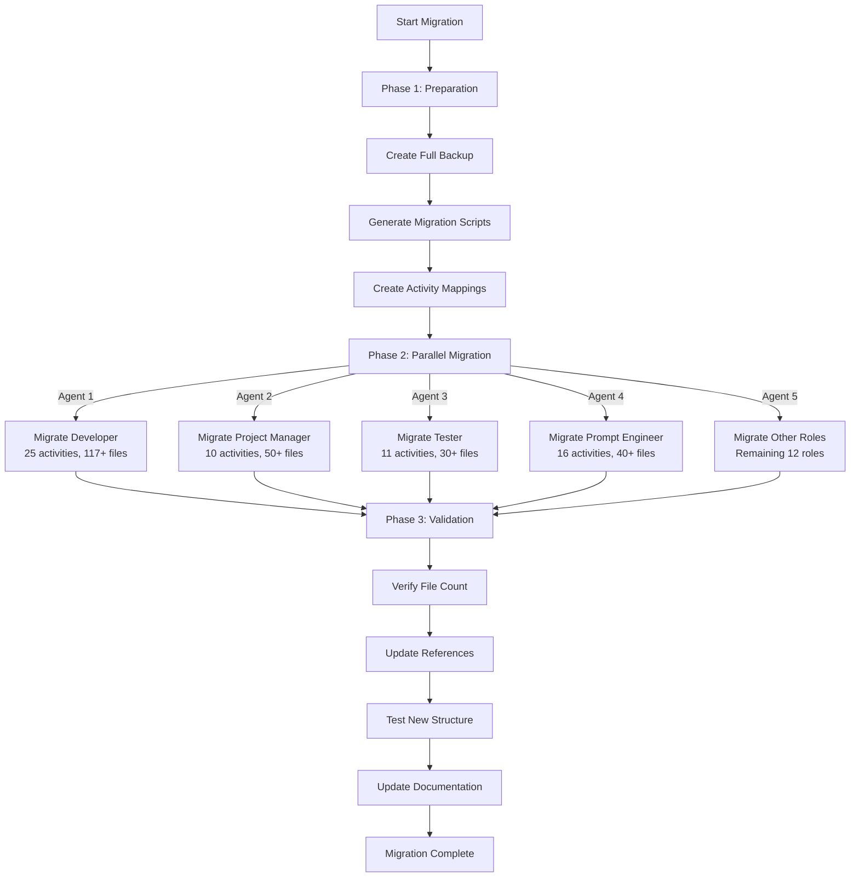

# 🔖 Description
> 💡 *A short and descriptive introduction of the problem we are going to solve.*
---

The Ultra Wide Turbo Workspace currently uses a role/concepts structure (e.g., `developer/prompts/`, `developer/templates/`) which doesn't clearly communicate the actionable workflows available. We need to restructure to a role/activities/concepts pattern (e.g., `developer/create-feature/prompts/`, `developer/fix-bug/templates/`) where activities are verb-noun combinations that explicitly describe what can be done. This will make the workspace more intuitive and task-oriented for AI-assisted workflows.

# 🗣 User Story
> 💡 ***As a*** *ROLE* ***I want*** *BEHAVIOUR* ***so that*** *REASON.*
---

**As a** Ultra Wide Turbo Workspace User
**I want** the repository restructured from role/concepts to role/activities/concepts pattern
**So that** I can quickly find and use task-specific workflows, templates, and prompts for my current activity

# 🤖 AI Agent Context
> 💡 *Essential information for the AI agent to understand and execute this ticket effectively. Review all linked resources thoroughly before proceeding.*
---

## 📚 Relevant Project Files & Code
> 💡 *List all project files, code snippets, or directories that the AI agent **must read and understand** to effectively complete the tasks. Include paths relative to the project root and a brief note on their relevance.*
---
*   `README.md` - (Relevance: Project overview and current structure documentation)
*   `CHANGELOG.md` - (Relevance: Version history shows project evolution and philosophy)
*   `developer/` - (Relevance: Most complex role with 117+ files across 10 subdirectories)
*   `project-manager/` - (Relevance: Second most content-rich role with diverse activities)
*   `content-creator/` - (Relevance: Example of role with systems and resources)
*   `tester/` - (Relevance: Role with clear activity groupings)
*   `developer/scripts/` - (Relevance: May contain scripts that need path updates)
*   `progress/repository-restructuring.md` - (Relevance: Current progress tracking)

## 🌐 Relevant Documentation & Links
> 💡 *List any external web pages, API documentation, design specifications (e.g., Figma links), or other online resources the AI agent should consult. Include a brief note on their relevance.*
---
*   Activity-based design patterns and task-oriented architecture best practices
*   Git history preservation techniques for large-scale refactoring

## 💡 Other Key Information
> 💡 *Include any other critical context, specific instructions, or points the AI agent needs to be aware of. This could include previous decisions, specific constraints, key architectural considerations, or even links to previous related tickets/discussions.*
---
*   **Project Philosophy**: Virtual organization with user as CEO, each role has an "office"
*   **Naming Convention**: Activities use `plx-` prefix (please execute), agents use `you-are-` prefix, rules use `-rule` suffix, checklists use `-checklist` suffix
*   **Activity Pattern**: Activities should be descriptive and actionable - can be verb-noun, verb-sentence, or descriptive phrases (e.g., create-feature, fix-bug, manage-app-stores, development-workflow)
*   **File Duplication Strategy**: When files apply to multiple activities, duplicate them - having complete toolsets per activity is more important than avoiding duplication
*   **New Categories**: Recently added `prompts/rules/` for workflow rules and `checklists/` for process checklists
*   **File Count**: 243+ markdown files across 16 roles
*   **Parallel Execution**: Multiple agents should work on different roles simultaneously
*   **Git History**: Use git cp for duplicated files to preserve history
*   **Progress Tracking**: Maintain progress/repository-restructuring.md throughout
---

# ⚙️ Requirements
> 💡 *What are the requirements for this story? What should be in scope and what should be out of scope?*
---

**In Scope:**
*   Restructure all 16 roles from role/concepts to role/activities/concepts
*   Create activity folders based on existing plx-*.md files in prompts/activities/
*   Move all related agents, templates, wows, systems, rules, and checklists to appropriate activity folders
*   Duplicate shared files across activities to ensure complete toolsets
*   Maintain all existing content without modification
*   Create migration scripts for automated execution (using git cp for duplicates)
*   Update all internal references and imports
*   Update README to reflect new structure
*   Create comprehensive mapping documentation
*   Execute migration in parallel by role

**Out of Scope:**
*   Modifying content of any files (only reorganizing)
*   Creating new activities or content
*   Renaming existing files (except folder restructuring)
*   Merging or splitting existing files
*   Changing the role-based top-level structure

# ✅ Acceptance Criteria
> 💡 *Specific conditions that must be met for the story to be considered complete. Each criterion should be testable and unambiguous.*
---

* [ ] All 16 roles have been restructured to role/activities/concepts pattern
* [ ] Every plx-*.md file has a corresponding activity folder
* [ ] All agents, templates, and resources are correctly mapped to their activities
* [ ] Each activity folder contains a complete toolset (duplicates where necessary)
* [ ] No files are lost during migration
* [ ] All internal path references are updated to new structure
* [ ] Migration can be rolled back if needed
* [ ] README and documentation reflect new structure
* [ ] Git history is preserved using git mv and git cp commands
* [ ] Progress tracking file is complete with all steps documented

# 💾 Data Model
> 💡 *Old and new data models that will be created and/or altered when this feature is added.*
---

**Current Structure:**
```
workspace/
├── role/
│   ├── prompts/
│   │   ├── activities/
│   │   │   └── plx-*.md
│   │   ├── agents/
│   │   │   └── you-are-*.md
│   │   └── rules/
│   │       └── *-rule.md
│   ├── templates/
│   │   └── *-template.md
│   ├── wows/
│   │   └── wow-*.md
│   ├── systems/
│   │   └── *-system.md
│   ├── checklists/
│   │   └── *-checklist.md
│   └── [other-concepts]/
```

**New Structure:**
```
workspace/
├── role/
│   ├── verb-noun/ (e.g., create-feature, fix-bug, development-workflow)
│   │   ├── prompts/
│   │   │   ├── activities/
│   │   │   │   └── plx-*.md (related activities)
│   │   │   ├── agents/
│   │   │   │   └── you-are-*.md (related agents)
│   │   │   └── rules/
│   │   │       └── *-rule.md (related rules)
│   │   ├── templates/
│   │   │   └── *-template.md (related templates)
│   │   ├── wows/
│   │   │   └── wow-*.md (related best practices)
│   │   ├── systems/
│   │   │   └── *-system.md (related systems)
│   │   └── checklists/
│   │       └── *-checklist.md (related checklists)
│   └── [other-activities]/
```

**Example Developer Migration:**
```
developer/prompts/activities/plx-fix-bug.md → developer/fix-bug/prompts/activities/plx-fix-bug.md
developer/prompts/agents/you-are-fast-developer.md → developer/fix-bug/prompts/agents/you-are-fast-developer.md
developer/prompts/rules/always-create-issue-rule.md → developer/fix-bug/prompts/rules/always-create-issue-rule.md
developer/templates/previous-request-template.md → developer/fix-bug/templates/previous-request-template.md
developer/checklists/bug-fix-checklist.md → developer/fix-bug/checklists/bug-fix-checklist.md
```

# 🔒 Security Rules / Row Level Security
> 💡 *Old and new security rules with roles and access that should be created and/or altered. Include create, read, update and delete.*
---

No changes to security rules - this is a structural reorganization only.

# 🐒 API
> 💡 *Old and new API calls that should be created and/or altered.*
---

No API changes - repository structure change only. However, any tools or scripts that reference file paths will need updating.

# 📊 Analytics
> 💡 *Old and new analytics that should be created and/or altered when this feature is added. Include a name, when it's fired and optional properties.*
---

*   **Migration Start**: Track when migration begins for each role
*   **Migration Complete**: Track successful completion per role
*   **File Count Validation**: Ensure no files lost (before/after counts)

# ☎️ Impact Communication
> 💡 *Who / which teams should we inform about the impact of releasing this ticket? Sales, marketing, data, CS, other?*
---

*   All repository users and contributors
*   Any external tools or integrations using the workspace
*   CI/CD pipeline maintainers
*   Documentation team

# 🧪 Tests
> 💡 *Components/flows/code that would benefit from tests and which scenario's should be tested.*
---

*   **Migration Script Tests**: 
    - Verify correct file movement for each role
    - Ensure no files are lost or duplicated
    - Validate new folder structure follows conventions
*   **Reference Update Tests**:
    - Check all internal path references are updated
    - Verify no broken links remain
*   **Rollback Tests**:
    - Ensure migration can be reversed if needed

# 🤝 Acceptance Test
> 💡 *Which scenario's should we test in the acceptance test? So that we can make sure that this ticket does what it is supposed to do without any unexpected errors.*
---

1.  **Scenario 1: Complete Migration for Single Role**
    *   Given: Developer role with current structure
    *   When: Migration script is run for developer role
    *   Then: All files are correctly organized into activity folders
    
2.  **Scenario 2: Parallel Migration for Multiple Roles**
    *   Given: Multiple roles ready for migration
    *   When: Parallel migration is executed
    *   Then: All roles are migrated without conflicts

3.  **Scenario 3: Reference Integrity Check**
    *   Given: Files with internal cross-references
    *   When: Migration is complete
    *   Then: All references point to correct new paths

4.  **Scenario 4: Activity Mapping Validation**
    *   Given: Each plx-*.md activity file
    *   When: Checking new structure
    *   Then: Each has a corresponding activity folder with related resources

# 🎨 UI/UX Behaviour
> 💡 *Anything to take note of regarding the behaviour of UI/UX elements (if applicable). Think of position, behaviour when elements do not fit the screen, feedback on elements and properties of animations.*
---

N/A - Repository structure change only. However, consider creating a visual map or diagram of the new structure for documentation.

# ⏱️ Effort Breakdown & Estimates
> 💡 *Detailed breakdown of estimated effort required for each aspect of the user story implementation.*
---

*   **Design:** 8 hours
    *   _Reasoning: Detailed analysis of all 16 roles and mapping of 243+ files to new activity-based structure_
*   **Refinement:** 4 hours
    *   _Reasoning: Review migration plan with stakeholders, finalize activity groupings, resolve edge cases_
*   **Front-end:** 0 hours
    *   _Reasoning: No front-end work required_
*   **Backend:** 0 hours
    *   _Reasoning: No backend work required_
*   **General Work:** 24 hours
    *   _Reasoning: Create migration scripts (8h), execute parallel migration (8h), update references (4h), documentation (4h)_

# 🧪 QA, Testing & Delay Margin
> 💡 *Estimates for quality assurance, testing efforts, and buffer time for potential delays.*
---

*   **QA:** 6 hours (15%)
    *   _Reasoning: Validate all files migrated correctly, check references, verify structure compliance_
*   **Testing:** 4 hours (10%)
    *   _Reasoning: Test migration scripts, validate rollback procedures, check edge cases_
*   **Delay Margin:** 8 hours (20%)
    *   _Reasoning: Complex migration with 243+ files may encounter unexpected issues, path conflicts, or require additional activity categorization_

# 📝 Suggested High Level Approach
> 💡 *With knowledge of the current codebase, try to define a best suggested approach. Think of current components used, flow of data and UI elements. Include mermaid diagrams to illustrate flows and connections.*
---

## Migration Strategy: Parallel Execution by Role

### Phase 1: Preparation & Analysis (Sequential)
1. Create comprehensive activity mapping for all roles
2. Design folder structure templates
3. Create migration scripts with rollback capability
4. Set up progress tracking
5. Backup current structure

### Phase 2: Role Migration (Parallel)
Execute migrations for different roles simultaneously using multiple agents:



### Detailed Activity Mapping Examples

#### Developer Role (10 main activities):
```
developer/
├── create-feature/
│   ├── prompts/
│   │   ├── activities/
│   │   │   ├── plx-create-feature-flow.md
│   │   │   └── plx-convert-to-flutter-feature.md
│   │   ├── agents/
│   │   │   ├── you-are-feature-flow-expert.md
│   │   │   ├── you-are-plan-act-mvvm-developer.md
│   │   │   ├── you-are-expert-developer.md (duplicated - also in other activities)
│   │   │   └── you-are-lead-developer.md (duplicated - shared resource)
│   │   └── rules/
│   │       └── always-create-issue-rule.md (duplicated - applies to all development)
│   ├── templates/
│   │   ├── feature-flow-template.yaml
│   │   ├── activity-flow-template.md
│   │   └── dev-plan-template.md (duplicated - useful for planning features)
│   └── wows/
│       ├── flutter/ (complete copy)
│       └── next-js/ (complete copy)
├── fix-bug/
│   ├── prompts/
│   │   ├── activities/
│   │   │   ├── plx-fix-bug.md
│   │   │   └── plx-fix-tests.md
│   │   ├── agents/
│   │   │   ├── you-are-fast-developer.md
│   │   │   ├── you-are-pew-pew-dev.md
│   │   │   ├── you-are-expert-developer.md (duplicated - also useful here)
│   │   │   └── you-are-lead-developer.md (duplicated - for complex bugs)
│   │   └── rules/
│   │       └── always-create-issue-rule.md (duplicated - important for bug tracking)
│   └── templates/
│       └── previous-request-template.md
├── update-documentation/
├── code-review/
├── mcp-development/
├── create-tutorial/
├── development-workflow/
├── project-setup/
├── utilities/
└── learning/
```

#### Project Manager Role (6 main activities):
```
project-manager/
├── planning/
├── requirements-management/
├── user-stories/
├── issue-tracking/
├── release-management/
└── test-planning/
```

### Migration Script Structure
```bash
#!/bin/bash
# migrate-role.sh - Migrates a single role to activity-based structure

ROLE=$1
WORKSPACE_ROOT="/path/to/workspace"

# 1. Read activity mapping for role
# 2. Create new folder structure
# 3. Use git mv for unique files, git cp for shared files
# 4. Duplicate common resources (agents, templates, wows) as needed
# 5. Update internal references
# 6. Validate each activity has complete toolset
# 7. Update progress file
```

### Edge Cases & Special Handling

1. **Shared Resources**: Some agents/templates may be used across multiple activities
   - Solution: Duplicate files to ensure each activity has a complete toolset
   - Use `git cp` to preserve history for duplicated files
   
2. **Generic Resources**: Resources not specific to any activity
   - Solution: Keep in role-level folders (e.g., `developer/resources/`)
   
3. **Cross-Role Dependencies**: Some activities may reference other roles
   - Solution: Update paths after all migrations complete

4. **New Activities**: Some files may not fit existing activities
   - Solution: Create descriptive activity folders that match the intent

5. **Activity Naming**: Not all activities need to start with a verb
   - Examples: `development-workflow`, `project-setup`, `mcp-development`
   - Focus on clear, descriptive names that communicate the purpose

# 🎯 Roles & Todo's
> *Backend Dev · Front-end Dev · Ui/Ux Designer · DevOps Engineer*
---

```
* 📌 **Project Manager**:
    - [ ] Review and approve activity mappings for all roles
    - [ ] Coordinate parallel execution strategy
    - [ ] Ensure all stakeholders are informed
    - [ ] Monitor progress and handle conflicts
* 🔧 **Backend Developer**:
    - [ ] Create migration scripts with git mv preservation
    - [ ] Implement path reference update logic
    - [ ] Create rollback procedures
    - [ ] Set up validation scripts
* 🖥️ **Front-end Developer**:
    - [ ] N/A - Repository structure only
* 🎨 **UI/UX Designer**:
    - [ ] Review new structure for usability
    - [ ] Create visual documentation of new structure
    - [ ] Validate activity naming is intuitive
* 🚀 **DevOps Engineer**:
    - [ ] Update CI/CD pipelines for new paths
    - [ ] Create backup procedures
    - [ ] Monitor repository during migration
    - [ ] Update any automated tools using old paths
* 📊 **Data Engineer**:
    - [ ] Track migration metrics
    - [ ] Validate no data loss
    - [ ] Create before/after analysis
* 📣 **Marketeer**:
    - [ ] Prepare communication about changes
    - [ ] Update any published documentation
```
> 💡 *Remove or adjust roles and tasks as necessary for the specific story.*

# 👉️ Final Remarks
> 💡 *Anything to take note off that is not properly defined yet. Think of out of scope notes, dependencies, anything to be extra cautious about and/or information about related issues.*
---

*   **Dependencies**: 
    - All active PRs should be merged before migration
    - Progress tracking file must be maintained throughout
    - Backup must be verified before starting
    
*   **Risks**:
    - Path conflicts during parallel execution
    - Some activities may need further subdivision
    - External tools may break due to path changes
    
*   **Notes**:
    - Consider pilot migration with smallest role first (e.g., brainstormer)
    - Keep detailed logs of all git mv commands for rollback
    - Some roles may need new activities discovered during migration
    - Update progress/repository-restructuring.md after each phase
    
*   **Future Considerations**:
    - May need to create new roles for orphaned activities
    - Consider creating activity templates for consistency
    - Plan for ongoing maintenance of activity-based structure