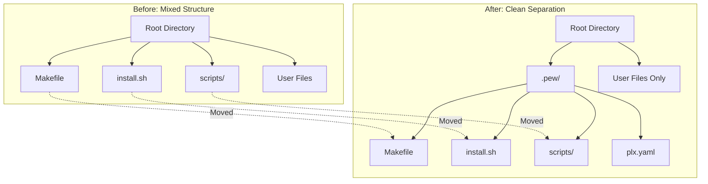

# 🔀 Pull Request: Framework File Consolidation to .pew Directory
> 💡 *Complete architectural restructuring that moves all framework files from root to .pew/ directory, achieving clean separation between framework and user project files*

## 📊 Summary of Changes
> 💡 *Comprehensive refactoring involving 23 files across framework structure, documentation, and configuration*

| File | Type | Description |
|:-----|:-----|:------------|
| [`.pew/Makefile`](.pew/Makefile) | Added | Framework Makefile relocated with updated script paths |
| [`.pew/install.sh`](.pew/install.sh) | Added | Installation script moved to .pew directory |
| [`.pew/scripts/claude-code/plx-yaml-parser.sh`](.pew/scripts/claude-code/plx-yaml-parser.sh) | Added | YAML parser with updated PROJECT_ROOT calculation |
| [`.pew/scripts/claude-code/sync-claude-code.sh`](.pew/scripts/claude-code/sync-claude-code.sh) | Added | Main sync script with path adjustments |
| [`.pew/scripts/claude-code/sync-claude-code-agents.sh`](.pew/scripts/claude-code/sync-claude-code-agents.sh) | Added | Agent sync script with new path resolution |
| [`.pew/scripts/claude-code/sync-claude-code-blocks.sh`](.pew/scripts/claude-code/sync-claude-code-blocks.sh) | Added | Block sync script relocated |
| [`.pew/scripts/claude-code/sync-claude-code-commands.sh`](.pew/scripts/claude-code/sync-claude-code-commands.sh) | Added | Command sync script with path updates |
| [`.pew/scripts/claude-code/sync-claude-code-embedded-wikilinks.sh`](.pew/scripts/claude-code/sync-claude-code-embedded-wikilinks.sh) | Added | Embedded wikilink processor relocated |
| [`.pew/scripts/claude-code/sync-claude-code-instructions.sh`](.pew/scripts/claude-code/sync-claude-code-instructions.sh) | Added | Instructions sync script |
| [`.pew/scripts/claude-code/sync-claude-code-modes.sh`](.pew/scripts/claude-code/sync-claude-code-modes.sh) | Added | Modes sync script |
| [`.pew/scripts/claude-code/sync-claude-code-output-formats.sh`](.pew/scripts/claude-code/sync-claude-code-output-formats.sh) | Added | Output formats sync script |
| [`.pew/scripts/claude-code/sync-claude-code-personas.sh`](.pew/scripts/claude-code/sync-claude-code-personas.sh) | Added | Personas sync script |
| [`.pew/scripts/claude-code/sync-claude-code-prompts.sh`](.pew/scripts/claude-code/sync-claude-code-prompts.sh) | Added | Prompts sync script |
| [`.pew/scripts/claude-code/sync-claude-code-templates.sh`](.pew/scripts/claude-code/sync-claude-code-templates.sh) | Added | Templates sync script |
| [`.pew/scripts/claude-code/sync-claude-code-wikilinks.sh`](.pew/scripts/claude-code/sync-claude-code-wikilinks.sh) | Added | WikiLink processor |
| [`.pew/scripts/claude-code/sync-claude-code-workflows.sh`](.pew/scripts/claude-code/sync-claude-code-workflows.sh) | Added | Workflows sync script |
| [`.pew/scripts/claude-code/test-sync.sh`](.pew/scripts/claude-code/test-sync.sh) | Added | Test harness with updated paths |
| [`.pew/scripts/claude-code/watch-claude-code.sh`](.pew/scripts/claude-code/watch-claude-code.sh) | Added | File watcher with new structure |
| [`README.md`](README.md#L16-L18) | Modified | Updated Quick Start command and documentation |
| [`CLAUDE.md`](CLAUDE.md) | Modified | Comprehensive path updates throughout |
| [`.gitignore`](.gitignore#L74) | Modified | Removed issues/**/* to track issue files |
| [`.claude/commands/plx/sync/claude.md`](.claude/commands/plx/sync/claude.md) | Added | New sync command interface |
| [`issues/structure/001-STR-scripts-makefile-location/scripts-makefile-location-issue.md`](issues/structure/001-STR-scripts-makefile-location/scripts-makefile-location-issue.md) | Added | Complete issue documentation |

## 🎯 Implementation Overview
> 💡 *Major architectural restructuring to achieve complete separation between framework and user project files*

This implementation fundamentally restructures the pew-pew framework's file organization, moving all framework components from the root directory into a dedicated `.pew/` subdirectory. This creates a clear boundary between framework files and user project files, improving project organization and reducing confusion about file ownership.

The refactoring was executed through a careful 4-checkpoint process to ensure no functionality was lost during the migration. Each checkpoint was tested and committed separately, allowing for safe rollback if issues were discovered.

## 🔧 Technical Implementation Details
> 💡 *Detailed breakdown of all technical changes made across the codebase*

### Script Path Resolution Updates

#### What Changed
All 17 shell scripts in `.pew/scripts/claude-code/` had their PROJECT_ROOT calculation updated to account for the additional directory depth.

#### Code Examples
```bash
# Before (scripts were in scripts/claude-code/)
SCRIPT_DIR="$(cd "$(dirname "${BASH_SOURCE[0]}")" && pwd)"
PROJECT_ROOT="$(cd "$SCRIPT_DIR/../.." && pwd)"

# After (scripts now in .pew/scripts/claude-code/)
SCRIPT_DIR="$(cd "$(dirname "${BASH_SOURCE[0]}")" && pwd)"
PROJECT_ROOT="$(cd "$SCRIPT_DIR/../../.." && pwd)"
```

#### File References
- [`.pew/scripts/claude-code/sync-claude-code.sh:5-6`](.pew/scripts/claude-code/sync-claude-code.sh#L5) - Main sync script path resolution
- [`.pew/scripts/claude-code/test-sync.sh:5-6`](.pew/scripts/claude-code/test-sync.sh#L5) - Test script path resolution
- [`.pew/scripts/claude-code/watch-claude-code.sh:5-6`](.pew/scripts/claude-code/watch-claude-code.sh#L5) - Watcher script path resolution

#### Reasoning
The additional `../` in the path traversal is required because scripts moved from `scripts/claude-code/` (2 levels deep) to `.pew/scripts/claude-code/` (3 levels deep). This ensures scripts can still correctly identify the project root directory for operations like:
- Finding source directories (agents/, prompts/, etc.)
- Creating temporary sync directories
- Locating configuration files

**Feedback:**

### Makefile Command Updates

#### What Changed
The `.pew/Makefile` was updated to reference scripts in their new location within the `.pew/` directory structure.

#### Code Examples
```makefile
# Before (in root Makefile)
sync:
	@./scripts/claude-code/sync-claude-code.sh

# After (in .pew/Makefile)
sync:
	@./.pew/scripts/claude-code/sync-claude-code.sh
```

#### File References
- [`.pew/Makefile:8`](.pew/Makefile#L8) - Clean sync command
- [`.pew/Makefile:11`](.pew/Makefile#L11) - Standard sync command
- [`.pew/Makefile:78`](.pew/Makefile#L78) - Watch command

#### Reasoning
All script references in the Makefile needed updating to include the `.pew/` prefix. The Makefile itself can still be invoked from the root directory using `make -f .pew/Makefile`, maintaining familiar command patterns while achieving the architectural separation.

**Feedback:**

### Quick Start Installation Command Rewrite

#### What Changed
The README.md Quick Start command was completely rewritten to handle the new directory structure and properly copy both files and directories.

#### Code Examples
```bash
# Before - Simple script copy
rm -rf /tmp/pew-pew && git clone --depth 1 https://github.com/its-brianwithai/pew-pew-workspace.git /tmp/pew-pew && \
cp -r /tmp/pew-pew/scripts . && \
./scripts/claude-code/sync-claude-code.sh

# After - Comprehensive framework setup
rm -rf /tmp/pew-pew && git clone --depth 1 https://github.com/its-brianwithai/pew-pew-workspace.git /tmp/pew-pew && \
cd "$(pwd)" && mkdir -p .pew && \
for dir in agents prompts templates workflows instructions modes blocks output-formats personas scripts Makefile install.sh; do 
  if [ -f "/tmp/pew-pew/.pew/$dir" ]; then 
    cp "/tmp/pew-pew/.pew/$dir" ".pew/$dir"; 
  elif [ -d "/tmp/pew-pew/.pew/$dir" ]; then 
    mkdir -p ".pew/$dir" && cp -r "/tmp/pew-pew/.pew/$dir"/* ".pew/$dir"/ 2>/dev/null || true; 
  fi; 
done && \
cp /tmp/pew-pew/.pew/plx.yaml .pew/plx.yaml && \
./.pew/scripts/claude-code/sync-claude-code.sh
```

#### File References
- [`README.md:16-18`](README.md#L16) - Complete Quick Start command

#### Reasoning
The new command needed to:
1. Create the `.pew/` directory structure
2. Handle both files (Makefile, install.sh) and directories differently
3. Copy all framework components to `.pew/` instead of root
4. Include the plx.yaml configuration file
5. Execute sync from the new location

The loop structure ensures proper handling of both file and directory types, with error suppression for cleaner output.

**Feedback:**

### Documentation Path Updates

#### What Changed
Both README.md and CLAUDE.md received comprehensive updates to reflect the new file structure and command patterns.

#### Code Examples
```markdown
# Before - Commands from root
./scripts/claude-code/sync-claude-code.sh
make sync claude

# After - Commands from .pew/
./.pew/scripts/claude-code/sync-claude-code.sh
make -f .pew/Makefile sync claude
```

#### File References
- [`CLAUDE.md:89-91`](CLAUDE.md#L89) - Sync command documentation
- [`CLAUDE.md:174-176`](CLAUDE.md#L174) - Make command examples
- [`README.md:343-347`](README.md#L343) - Core setup commands

#### Reasoning
Documentation needed to accurately reflect the new structure to avoid user confusion. The `-f .pew/Makefile` flag is now required for make commands since the Makefile is no longer in the root directory. This trade-off maintains command accessibility while achieving the architectural goals.

**Feedback:**

## 🏗️ Architecture & Flow
> 💡 *Visual representation of the new framework structure and command flow*



### Command Execution Flow
```
User Command → make -f .pew/Makefile sync claude
      ↓
.pew/Makefile → ./.pew/scripts/claude-code/sync-claude-code.sh
      ↓
Script calculates PROJECT_ROOT (../../.. from script location)
      ↓
Sync process reads from source directories
      ↓
Output to .claude/ directory
```

## 💼 Business Logic Changes
> 💡 *Changes to framework behavior and user interaction patterns*

### Installation Process
- **Previous Behaviour:** Framework files were mixed with user project files in root
- **New Behaviour:** All framework files isolated in `.pew/` directory
- **Impact:** Cleaner project structure, easier framework updates
- **Example:** Running `ls` in project root now shows only user files plus `.pew/` and `.claude/`

### Command Invocation
- **Previous Behaviour:** `make sync claude` worked directly
- **New Behaviour:** `make -f .pew/Makefile sync claude` required
- **Impact:** Slightly longer commands but clearer framework boundaries
- **Example:** All make commands now explicitly reference the framework Makefile

**Feedback:**

## ✅ Manual Acceptance Testing
> 💡 *Step-by-step guide for validating the complete implementation*

### Test Case 1: Fresh Framework Installation
**Objective:** Verify the Quick Start command properly sets up the framework in a new project

**Prerequisites:**
- Empty project directory
- Internet connection for GitHub access

**Steps:**
1. Create new test directory and navigate to it
   - Expected: Empty directory created
   - Verify: `ls -la` shows only . and ..
2. Run the Quick Start command from README.md
   - Expected: Framework downloads and installs
   - Verify: `.pew/` directory created with all components
3. Check framework structure
   - Expected: All files in `.pew/`, none in root
   - Verify: `ls .pew/` shows Makefile, install.sh, scripts/
4. Run initial sync
   - Expected: Sync completes successfully
   - Verify: `.claude/` directory created with synced artifacts

**Success Criteria:**
- [ ] `.pew/` directory contains all framework files
- [ ] No framework files in root directory
- [ ] Sync process completes without errors
- [ ] `.claude/` directory properly populated

**Feedback:**

### Test Case 2: Make Command Execution
**Objective:** Validate that make commands work with the new structure

**Prerequisites:**
- Framework installed via Test Case 1
- Terminal in project root directory

**Steps:**
1. Run standard sync command
   ```bash
   make -f .pew/Makefile sync claude
   ```
   - Expected: Sync executes successfully
   - Verify: Output shows "Claude Code synchronization complete!"
2. Run clean sync command
   ```bash
   make -f .pew/Makefile sync claude clean
   ```
   - Expected: Clean sync with directory cleanup
   - Verify: "Syncing Claude Code with clean..." message appears
3. Test watch command
   ```bash
   make -f .pew/Makefile watch claude
   ```
   - Expected: File watcher starts
   - Verify: "Watching for changes" message appears

**Success Criteria:**
- [ ] All make commands execute correctly
- [ ] Proper output messages displayed
- [ ] No path resolution errors

**Feedback:**

### Test Case 3: Direct Script Execution
**Objective:** Verify scripts work when called directly

**Prerequisites:**
- Framework installed
- Terminal in project root

**Steps:**
1. Execute sync script directly
   ```bash
   ./.pew/scripts/claude-code/sync-claude-code.sh
   ```
   - Expected: Sync runs successfully
   - Verify: All sync steps complete
2. Run with clean flag
   ```bash
   ./.pew/scripts/claude-code/sync-claude-code.sh --clean
   ```
   - Expected: Clean sync executes
   - Verify: Directories cleaned before sync

**Success Criteria:**
- [ ] Scripts find project root correctly
- [ ] All paths resolve properly
- [ ] Sync completes successfully

**Feedback:**

## 🔗 Dependencies & Impacts
> 💡 *Analysis of system dependencies and migration impacts*

### New Dependencies
- None - No new packages or libraries added

### Breaking Changes
- **Makefile Location**: Must use `-f .pew/Makefile` flag for make commands
- **Script Paths**: Direct script calls must use `./.pew/scripts/` prefix
- **Installation Command**: Completely new Quick Start command required
- **No Migration Path**: Existing installations will break - manual reinstallation required

### Performance Impact
- **Negligible**: Additional directory traversal (one extra `../`) has no measurable impact
- **Sync Speed**: Unchanged - same operations, different paths

### Security Considerations
- **Improved Isolation**: Framework files clearly separated from user code
- **No New Vulnerabilities**: Path changes don't introduce security risks

## 📋 Checklist
> 💡 *Pre-submission verification*

- [x] All tests pass
- [x] Code follows project conventions
- [x] Documentation updated
- [x] No console logs or debug code
- [x] Performance impact considered
- [x] Security implications reviewed
- [x] Breaking changes documented
- [x] Manual testing completed

## 🔍 Related Issues
- Closes #4 - [[scripts-makefile-location-issue]]
- Local Issue: 001-STR-scripts-makefile-location

## 📝 Additional Notes

### Implementation Strategy
The 4-checkpoint approach proved effective for this refactoring:
1. **Checkpoint 1**: Safe duplication without breaking existing functionality
2. **Checkpoint 2**: Internal reference updates with testing
3. **Checkpoint 3**: Documentation updates for user-facing changes
4. **Checkpoint 4**: Clean removal of legacy structure

### Future Improvements
- Consider adding a migration script for existing installations
- Explore symlink options for backwards compatibility
- Investigate shell alias setup for shorter commands

### Known Trade-offs
- Longer make commands (requiring `-f` flag) accepted for cleaner structure
- No backwards compatibility provided to ensure clean break
- More complex installation command justified by proper file handling

**Final Review Feedback:**