# 🧩 Issue: Merge three repos and unify prompts + CLI

Merge this repo with `pew-pew-cli` (content-only import), keep `ultra-wide-turbo-workspace` as its own Git repo with history. Pause content moves for now; use `pew-pew-teams/` as-is.

---

## 📝 Initial Requirement

### Requirements
1. Remove the git link from this repo. Keep ultra-wide-turbo-workspace Git intact.
2. Do not move/reshape content now; keep `pew-pew-teams/00-freelancers`…`100-all-teams` as-is.
3. Copy all logic from `pew-pew-cli` and build a proper CLI here following its conventions, README, commands, and logic. Project content previously under `agents/`, `prompts/`, `templates/`, `workflows/`, `output-formats/` now lives under `pew-pew-workspace/`.
4. Config discovery: use nearest ancestor config when walking up from CWD; else use the user root `~/plx/plx.yaml`; else bundled default. Sync uses that config.

---

## ✅ Scope Check
- Estimated effort: 5–8 story points / 1–2 days
- Single developer: Yes
- Fits in half day: Partial (scaffold + discovery)
- Breakdown needed: Yes (checkpoints below)

---

## 🌊 Actor Flow

### Event Sequence
1. Developer → initiates → remove git link for current repo (keep UWTW separate)
2. Developer → catalogs → `pew-pew-teams/` content (no moves)
3. System → loads → config via discovery (ancestor `plx.yaml` → `~/plx/plx.yaml` → bundled)
4. Developer → executes → unify CLI plan (map pew commands to `plx` verbs)
5. System → performs → pull+sync as verbs (`plx pull repo` → confirm → copy; `plx sync repo` → pull then sync)

### Event Flow Diagram

```mermaid
sequenceDiagram
    participant Dev as Developer
    participant CLI as plx CLI
    participant C as Config
    participant FS as File System

    Dev->>CLI: plx pull repo --repo <url> --branch <name>
    CLI->>Dev: Confirm pull? (Y/N)
    Dev-->>CLI: Y
    CLI->>FS: Download + Extract + Copy (respect .plxignore)
    CLI->>C: Discover plx.yaml (ancestor → ~/plx → bundled)
    CLI->>FS: Sync to targets per config
```

---

## 📦 Deliverables
- Create: Node CLI scaffold (commander) replacing Makefile passthrough
- Create: `lib/pull.js` (repo pulling via zip) [done]
- Update: Config loader to prefer `plx.yaml` [done]
- Update: Sync scripts to continue reading via loader (no change needed)
- Create: `plx pull repo` + `plx sync repo` commands with confirmation flow
- Migrate: pew tasks commands under `plx` verbs (set/paste/next/reset/update)
- Unify: pew.yaml keys into `plx.yaml` (`tasks.*`, `updates.*`)

---

## 🔗 Dependencies
- Node.js environment with unzip
- `node-fetch`, `commander` (to be added), `chalk`
- Access to UWTW and pew-pew-cli repositories (read-only)

---

## 🧪 Testing Strategy
- Unit: config discovery (ancestor/root/bundled) and parsing
- Unit: pull zip URL generation (ssh→https), unzip, copy with ignore
- Integration: `plx pull repo --yes` writes files and respects `.plxignore`
- Integration: `plx sync` executes pull (if requested) then sync scripts; no Makefile

---

## ⚠️ Risks & Mitigations
- Risk: Overwrite local files
  - Mitigation: Confirmation prompt; dry-run preview later
- Risk: Config mismatch
  - Mitigation: Validate `plx.yaml`; clear error messages

---

## ✅ Acceptance Criteria
- [ ] CLI provides `plx pull repo` with confirmation; supports ssh/https
- [ ] CLI provides `plx sync repo` chaining pull→sync; `plx sync` alias works
- [ ] Config discovery: ancestor `plx.yaml` → `~/plx/plx.yaml` → bundled default
- [ ] Makefile passthrough removed; commands run via Node CLI
- [ ] Pew tasks features available under `plx` verbs

---

## 🎯 Implementation Checkpoints
- CP1 Foundation
  - [ ] Node CLI scaffold added; Makefile passthrough removed
  - [ ] `plx pull repo` implemented with confirmation
  - [ ] `plx sync repo` alias implemented (triggers pull then sync)
- CP2 Config unification
  - [ ] `plx.yaml` discovery complete; `pew.yaml` fields mapped under `tasks`, `updates`, `marker`
- CP3 Tasks migration
  - [ ] `plx set tasks`, `plx paste tasks`, `plx next task`, `plx reset tasks`, `plx update cli`

---

## Notes
- Verb-first rule with max one subcommand (`plx <verb> <subcommand>`)
- Confirmation required for pull unless `--yes` or invoked by sync
