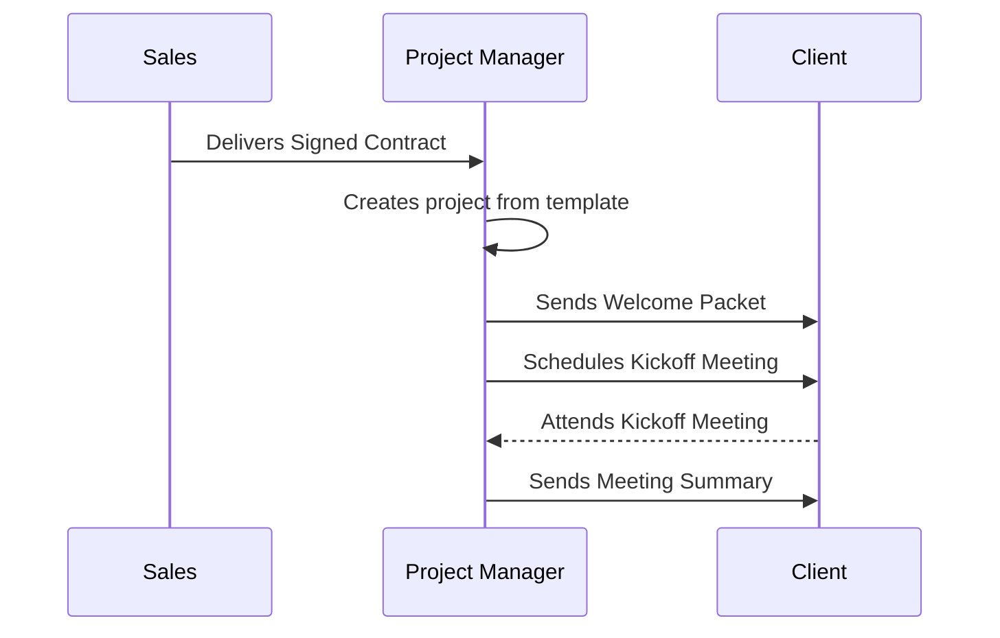

# 💡 Suggested Approach for: {Task / Problem}

> This document outlines a recommended approach for tackling {Task / Problem}. It is based on research, best practices, and an understanding of our project's context. The goal is to provide a clear, actionable plan to guide execution.

## 1. Problem Statement
> 💡 *Clearly and concisely define the problem we are trying to solve or the task we need to accomplish.*
---
`[e.g., Our current process for onboarding new clients is manual, slow, and inconsistent, leading to errors and a poor first impression.]`

## 2. Proposed Approach
> 💡 *Provide a high-level summary of the recommended solution. This is the "executive summary" of the plan.*
---
`[e.g., We will implement a new, semi-automated client onboarding process using a combination of standardized templates, a checklist in our project management tool, and a kickoff meeting. This approach will ensure consistency, reduce manual effort, and provide a better client experience.]`

## 3. Step-by-Step Execution Guide
> 💡 *Break down the approach into a sequence of actionable steps. Be specific and logical.*
---
1.  **Preparation:**
    *   `[Create a standardized 'New Client Welcome Packet' template.]`
    *   `[Build a 'New Client Onboarding' checklist template in our project management tool (e.g., Asana, Trello).]`
    *   `[Draft a standard agenda for the client kickoff meeting.]`
2.  **Execution (for each new client):**
    *   `[The Sales team hands off the signed contract to the Project Manager.]`
    *   `[The Project Manager creates a new project from the checklist template.]`
    *   `[The PM customizes and sends the Welcome Packet to the client.]`
    *   `[The PM schedules the kickoff meeting using the standard agenda.]`
3.  **Follow-up:**
    *   `[After the kickoff meeting, the PM sends a summary and action items to the client.]`
    *   `[The project officially begins as per the project plan.]`

## 4. Rationale
> 💡 *Explain *why* this approach was chosen over others. What makes it suitable for our project?*
---
*   **Standardization:** `[This approach ensures every client receives the same high-quality onboarding experience.]`
*   **Efficiency:** `[Using templates and checklists dramatically reduces the manual effort and time required for each onboarding.]`
*   **Clarity:** `[The process provides clear steps and responsibilities for both our team and the new client.]`
*   **Low Cost:** `[It utilizes existing tools and requires minimal financial investment to implement.]`

## 5. Pros & Cons
> 💡 *Provide a balanced view of the recommended approach.*
---
*   **Pros:**
    *   `[Easy and fast to implement.]`
    *   `[Improves consistency and quality.]`
    *   `[Reduces risk of human error.]`
*   **Cons:**
    *   `[May feel less personal if not customized appropriately for each client.]`
    *   `[Requires team discipline to follow the new process consistently.]`

## 6. Prerequisites & Dependencies
> 💡 *List anything that must be in place before this approach can be implemented.*
---
*   `[Access to and agreement on the project management tool.]`
*   `[Finalized content for the Welcome Packet.]`
*   `[Training for the Sales and Project Management teams on the new process.]`
