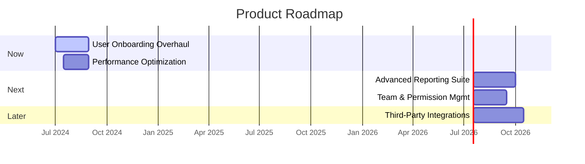

# 🗺️ Product Roadmap: {Product/Project Name}

## 🎯 1. Vision & Strategic Goals
> 💡 *A brief, high-level statement of the product's long-term vision and the strategic goals this roadmap aims to achieve over its timeframe. This should connect directly to the company's overall objectives.*
---
**Vision:** `[e.g., To become the leading platform for collaborative project management for remote teams.]`

**Strategic Goals for this Roadmap:**
*   **Goal 1:** `[e.g., Increase user engagement and retention.]`
*   **Goal 2:** `[e.g., Expand into the enterprise market segment.]`
*   **Goal 3:** `[e.g., Improve platform performance and stability.]`

## 📋 2. Roadmap Overview ({Timeframe})
> 💡 *This roadmap outlines the planned initiatives, epics, and major features over the specified timeframe. It is a living document and will be updated based on progress, feedback, and changing priorities. We use a Now/Next/Later format to indicate priority without committing to specific delivery dates.*

---

### 🚀 Now (In Progress / Next Up)
> *What we are actively working on or will start very soon. These initiatives are well-defined and have committed resources.*

| Initiative / Epic                                 | Goal Alignment | Key Features / Stories                                                               | Status        |
|:--------------------------------------------------|:---------------|:-------------------------------------------------------------------------------------|:--------------|
| **`[Epic-001: User Onboarding Overhaul]`**        | `[Goal 1]`     | `[Guided Tour, Profile Setup Wizard, Welcome Emails]`                                | `In Progress` |
| **`[Epic-002: Performance Optimization]`**        | `[Goal 3]`     | `[Database Query Optimization, Frontend Asset Caching]`                              | `Planning`    |

---

### ➡️ Next (Ready for Development)
> *What we plan to work on after the "Now" items are complete. These are well-understood and prioritized, but not yet in active development.*

| Initiative / Epic                                 | Goal Alignment   | Key Features / Stories                                                               | Status      |
|:--------------------------------------------------|:-----------------|:-------------------------------------------------------------------------------------|:------------|
| **`[Epic-003: Advanced Reporting Suite]`**        | `[Goal 1, 2]`    | `[Customizable Dashboards, PDF Exports, Scheduled Reports]`                          | `Ready`     |
| **`[Epic-004: Team & Permission Management]`**    | `[Goal 2]`       | `[User Groups, Role-based Access Control (RBAC)]`                                    | `Discovery` |

---

### ⏳ Later (To Be Prioritized)
> *Ideas and initiatives we want to tackle in the future, but are not yet fully defined or prioritized. Their position here is subject to change.*

| Initiative / Epic                                         | Goal Alignment | Key Features / Stories                                                               | Status |
|:----------------------------------------------------------|:---------------|:-------------------------------------------------------------------------------------|:-------|
| **`[Idea: Third-Party Integrations (Slack, etc.)]`**      | `[Goal 1]`     | `[Connectors for major communication and storage platforms]`                         | `Idea` |
| **`[Idea: Mobile Application (MVP)]`**                    | `[Goal 1]`     | `[Core feature access on iOS and Android]`                                           | `Idea` |

## 📊 3. Visual Timeline (Gantt Chart)
> 💡 *A visual representation of the roadmap, showing estimated timelines for major initiatives. This is for high-level planning and is subject to change.*

## 🎯 4. Key Milestones & Releases
> 💡 *Define major milestones or planned release versions that bundle sets of features from the roadmap.*

*   **Release v2.1 (Target: Q3 2024):**
    *   **Theme:** User Experience & Stability
    *   **Includes:** `[Epic-001]`, `[Epic-002]`
*   **Release v2.2 (Target: Q4 2024):**
    *   **Theme:** Enterprise Readiness
    *   **Includes:** `[Epic-003]`, `[Epic-004]`

## 📚 5. Related Documents
> 💡 *Links to relevant PRDs, architecture documents, and other context.*
*   PRD for User Onboarding: `[Link]`
*   Architecture for Reporting Suite: `[Link]`
